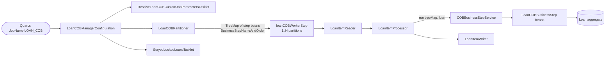

The `LOAN_COB` job is the daily-cycle workhorse for the loan portfolio in Apache Fineract. It walks every non-closed loan, runs the configured chain of `LoanCOBBusinessStep` beans against it, and advances each loan's `last_closed_business_date` by one day. The job lives in `fineract-provider/.../cob/loan/`; its business steps are the concrete components in the same package; the configurable order of those steps lives in the `m_batch_business_steps` table. This page enumerates the steps shipped with Apache Fineract, explains what each does, and shows where to look when wiring a new one in.

## Job identity

```java
// LoanCOBConstant
public static final String JOB_NAME                  = "LOAN_COB";
public static final String JOB_HUMAN_READABLE_NAME   = "Loan COB";
public static final String LOAN_COB_JOB_NAME         = "LOAN_CLOSE_OF_BUSINESS";
public static final String LOAN_COB_WORKER_STEP      = "loanCOBWorkerStep";
public static final String INLINE_LOAN_COB_JOB_NAME  = "INLINE_LOAN_COB";
public static final String LOAN_COB_PARTITIONER_STEP = "Loan COB partition - Step";
```

| Constant | Where it appears |
|----------|------------------|
| `LOAN_COB` (`JOB_NAME`) | `JobName` enum, Quartz scheduling, `PropertyService` keys (`chunk-size.LOAN_COB`, etc.). |
| `LOAN_CLOSE_OF_BUSINESS` (`LOAN_COB_JOB_NAME`) | `m_batch_business_steps.job_name` rows — the resolver join key for ordering. |
| `INLINE_LOAN_COB` (`INLINE_LOAN_COB_JOB_NAME`) | Separate row set for the inline variant; lets ops disable steps inline without affecting the daily run. |

The job is configured by `LoanCOBManagerConfiguration` (manager side) and `LoanCOBWorkerConfiguration` (worker side). Both classes are gated behind `LoanCOBEnabledCondition`, so when COB is disabled none of these beans exist.

## Wiring



The partitioner asks the engine for the ordered set of `LoanCOBBusinessStep` bean names for `LOAN_CLOSE_OF_BUSINESS`:

```java
@Override
public Map<String, ExecutionContext> partition(int gridSize) {
    int partitionSize = propertyService.getPartitionSize(LoanCOBConstant.JOB_NAME);
    Set<BusinessStepNameAndOrder> cobBusinessSteps =
        cobBusinessStepService.getCOBBusinessSteps(
            LoanCOBBusinessStep.class, LoanCOBConstant.LOAN_COB_JOB_NAME);
    return getPartitions(partitionSize, cobBusinessSteps);
}
```

`getPartitions` flattens the set into a `TreeMap<Long, String>` keyed by `step_order` and stuffs one copy into every partition's `ExecutionContext`. The worker then reads it back from the context inside `LoanItemProcessor` and hands it to `COBBusinessStepService.run`.

## Shipped `LoanCOBBusinessStep` implementations

All concrete steps live in `fineract-provider/src/main/java/org/apache/fineract/cob/loan/`. They are ordinary `@Component` beans; their enum-styled name (the join key) is shown alongside.

| Bean (class) | `getEnumStyledName()` | What it does |
|--------------|------------------------|--------------|
| `SetLoanDelinquencyTagsBusinessStep` | `LOAN_DELINQUENCY_CLASSIFICATION` | Recomputes delinquency range and writes the active tag; fires `LoanDelinquencyRangeChangeBusinessEvent` when the range changes. |
| `AddPeriodicAccrualEntriesBusinessStep` | `ADD_PERIODIC_ACCRUAL_ENTRIES` | Adds accrual transactions up to the COB business date for periodic-accrual products. |
| `AccrualActivityPostingBusinessStep` | `ACCRUAL_ACTIVITY_POSTING` | Posts cumulative installment accrual transactions on installment due dates. |
| `CheckLoanRepaymentDueBusinessStep` | `CHECK_LOAN_REPAYMENT_DUE` | Raises `LoanRepaymentDueBusinessEvent` for installments due today. |
| `CheckLoanRepaymentOverdueBusinessStep` | `CHECK_LOAN_REPAYMENT_OVERDUE` | Raises `LoanRepaymentOverdueBusinessEvent` for installments past their grace period. |
| `CheckDueInstallmentsBusinessStep` | `CHECK_DUE_INSTALLMENTS` | Walks the installment list and marks newly-due ones. |
| `ApplyChargeToOverdueLoansBusinessStep` | `APPLY_CHARGE_TO_OVERDUE_LOANS` | Applies any overdue-installment-fee products configured on the loan. |
| `UpdateLoanArrearsAgingBusinessStep` | `UPDATE_LOAN_ARREARS_AGING` | Refreshes `m_loan_arrears_aging` so reports see the current bucket. |
| `LoanInterestRecalculationCOBBusinessStep` | `LOAN_INTEREST_RECALCULATION` | Re-runs interest recalculation for loans with re-amortisation enabled. |
| `BuyDownFeeAmortizationBusinessStep` | `BUY_DOWN_FEE_AMORTIZATION` | Amortises buy-down fee balances across the schedule. |
| `CapitalizedIncomeAmortizationBusinessStep` | `CAPITALIZED_INCOME_AMORTIZATION` | Amortises capitalized-income balances across the schedule. |

Two more steps come from sibling modules:

| Source module | Bean | `getEnumStyledName()` |
|---------------|------|------------------------|
| `fineract-investor` | `LoanAccountOwnerTransferBusinessStep` | (transfer between investor positions) |
| `custom/acme/loan/cob` | `AcmeNoopBusinessStep` | `ACME_LOAN_NOOP` (example custom step) |

### Anatomy of one step: `SetLoanDelinquencyTagsBusinessStep`

This is the most-commonly-cited example because it shows the action-context dance and the bulk-event pattern.

```java
@Component
@RequiredArgsConstructor
public class SetLoanDelinquencyTagsBusinessStep implements LoanCOBBusinessStep {

    private final LoanAccountDomainService loanAccountDomainService;
    private final DelinquencyEffectivePauseHelper delinquencyEffectivePauseHelper;
    private final DelinquencyReadPlatformService delinquencyReadPlatformService;
    private final BusinessEventNotifierService businessEventNotifierService;

    @Override
    public Loan execute(Loan loan) {
        if (loan == null) return null;
        measure(() -> {
            // Switch to DEFAULT action context so comparisons are against
            // the *system* date, not the COB date.
            ThreadLocalContextUtil.setActionContext(ActionContext.DEFAULT);

            List<LoanDelinquencyAction> saved =
                delinquencyReadPlatformService.retrieveLoanDelinquencyActions(loan.getId());
            List<LoanDelinquencyActionData> effective =
                delinquencyEffectivePauseHelper.calculateEffectiveDelinquencyList(saved);
            // ... recompute delinquency range and write the tag ...
        }, /* label */ "delinquency-tag");
        return loan;
    }

    @Override public String getEnumStyledName()    { return "LOAN_DELINQUENCY_CLASSIFICATION"; }
    @Override public String getHumanReadableName() { return "Loan Delinquency Classification"; }
}
```

Notable details that recur in other steps:

- **Action-context switch**. Delinquency comparisons must use the system date, so the step temporarily sets `ActionContext.DEFAULT`. The runner reset it back to `COB` after each `execute` returns.
- **Mutation-in-place + return**. The step mutates loan-side state and returns the same `Loan` instance; the engine then passes it to the next step.
- **`measure(...)`** is `MeasuringUtil` — every business step logs its wall-clock duration so a slow step can be spotted in the COB log.

## Configured order

The shipped order — committed via the core Liquibase changesets — is the order in the table above. A tenant can:

- Reorder steps by updating `step_order`.
- Suspend a step by deleting its row (the bean still exists; the engine just skips it).
- Add steps by inserting rows that reference custom beans.

Two simultaneous job names are honoured for the same family:

- `LOAN_CLOSE_OF_BUSINESS` — the daily Spring Batch run.
- `INLINE_LOAN_COB` — the synchronous, single-loan run reached through `POST /v1/jobs/INLINE_LOAN_COB/inline` (see [Inline COB](/cob/inline-cob)).

You can configure a different subset of steps for inline runs (for example, omit `LOAN_INTEREST_RECALCULATION` to keep inline catch-up fast).

## Worker chunk shape

`LoanCOBWorkerConfiguration` is where chunk sizing happens:

```java
@Bean(name = LoanCOBConstant.LOAN_COB_WORKER_STEP)
public Step loanCOBWorkerStep() {
    SimpleStepBuilder<Loan, Loan> b = stepBuilderFactory
        .get("Loan COB worker - Step").inputChannel(inboundRequests)
        .<Loan, Loan>chunk(propertyService.getChunkSize(JobName.LOAN_COB.name()),
                           transactionManager)
        .reader(cobWorkerItemReader())
        .processor(cobWorkerItemProcessor())
        .writer(cobWorkerItemWriter())
        .faultTolerant()
        .retry(Exception.class)
        .retryLimit(propertyService.getRetryLimit(LoanCOBConstant.JOB_NAME))
        .skip(Exception.class)
        .skipLimit(propertyService.getChunkSize(LoanCOBConstant.JOB_NAME) + 1)
        .listener(loanItemListener())
        .listener(cobWorkerStepListener())
        .transactionManager(transactionManager);

    if (propertyService.getThreadPoolMaxPoolSize(LoanCOBConstant.JOB_NAME) > 1) {
        b.taskExecutor(cobTaskExecutor());
    }
    return b.build();
}
```

The reader emits `Loan` instances one at a time; the processor sends each through `COBBusinessStepService.run`; the writer flushes a chunk and releases the per-loan lock. See [Tasklets & wiring](/cob/cob-tasklets) for chunk listener details.

## Adding a step end-to-end

<Steps>
  <Step title="Implement LoanCOBBusinessStep">
    Create an `@Component` class that implements `LoanCOBBusinessStep`.
    Inject only services you actually need — `LoanAccountDomainService`,
    `BusinessEventNotifierService`, read services. Avoid starting your
    own transactions; the chunk processor already owns one.
  </Step>
  <Step title="Return a stable enum-styled name">
    `getEnumStyledName()` must be unique among loan steps. Convention is
    `UPPER_SNAKE_CASE` matching the human-readable name.
  </Step>
  <Step title="Insert m_batch_business_steps rows">
    One row for `LOAN_CLOSE_OF_BUSINESS`, optionally one for
    `INLINE_LOAN_COB`. Pick `step_order` values that fit between
    existing steps.
  </Step>
  <Step title="Test in isolation">
    Each shipped step has a `*Test` next to it in
    `fineract-provider/src/test/java/org/apache/fineract/cob/loan/`. The
    pattern is: build a `Loan`, stub the read services, call `execute`,
    assert side effects and any business events raised.
  </Step>
  <Step title="Integration-test through inline COB">
    `integration-tests/.../inlinecob/InlineLoanCOBTest` runs the full
    chain against a real loan via the inline endpoint — the cheapest way
    to exercise the step end-to-end.
  </Step>
</Steps>

## Failure handling

```mermaid
sequenceDiagram
    participant W as Worker chunk
    participant P as LoanItemProcessor
    participant E as COBBusinessStepService
    participant S as Step bean
    participant L as ChunkProcessingLoanItemListener
    participant Lk as LoanAccountLock

    W->>P: process(loan)
    P->>E: run(stepMap, loan)
    E->>S: execute(loan)
    S--xE: RuntimeException
    E--xP: BusinessStepException (wrap)
    P--xW: exception
    W->>L: onProcessError(loan, ex)
    L->>Lk: write error + stacktrace
    Note over W: chunk retries; on skip,<br/>loan remains locked
    W->>W: StayedLockedLoansTasklet picks it up
```

The chunk's retry/skip policy lets a transient error self-heal; a non-transient one leaves the lock in place with `error` populated, and the stayed-locked tasklet raises an event for ops.

## Observability

Each business step's wall-clock duration is logged through `MeasuringUtil.measure`. The chunk listener (`ChunkProcessingLoanItemListener`) writes any thrown exception into the per-loan lock row (`error` + `stacktrace`). At the end of the job the `StayedLockedLoansTasklet` raises a `LoanAccountsStayedLockedBusinessEvent` summarising loans that did not finish.

| Signal | Source | Where to look |
|--------|--------|---------------|
| Per-step duration | `MeasuringUtil` in each step | Application log lines tagged with the step's `getEnumStyledName()`. |
| Per-loan failure | `ChunkProcessingLoanItemListener.onProcessError` | `m_loan_account_locks.error` for the offending loan id. |
| Stayed-locked summary | `StayedLockedLoansTasklet` | `LoanAccountsStayedLockedBusinessEvent` on the external event bus. |
| Catch-up flag | `CatchUpFlagResolver` | `BATCH_JOB_EXECUTION_PARAMS` row with `IS_CATCH_UP=true`. |

A typical operational dashboard for `LOAN_COB` graphs:

- The job's `BatchStatus` over time (`COMPLETED` / `FAILED` rate).
- Number of loans surfaced by the stayed-locked event per run.
- Mean duration per step over time, to spot a step that has slowed down.
- Lock-table population at end of job, to spot orphan accumulation.

## Related pages

- [Business step engine](/cob/business-step-engine) — the SPI shared by
  every step.
- [Tasklets & Spring Batch wiring](/cob/cob-tasklets) — partitioner,
  reader/processor/writer, locking tasklets.
- [Inline COB](/cob/inline-cob) — running this chain synchronously for
  one loan.
- [Loan account lock](/cob/loan-account-lock) — the lock surface that
  makes the chunk's retry/skip policy safe.
