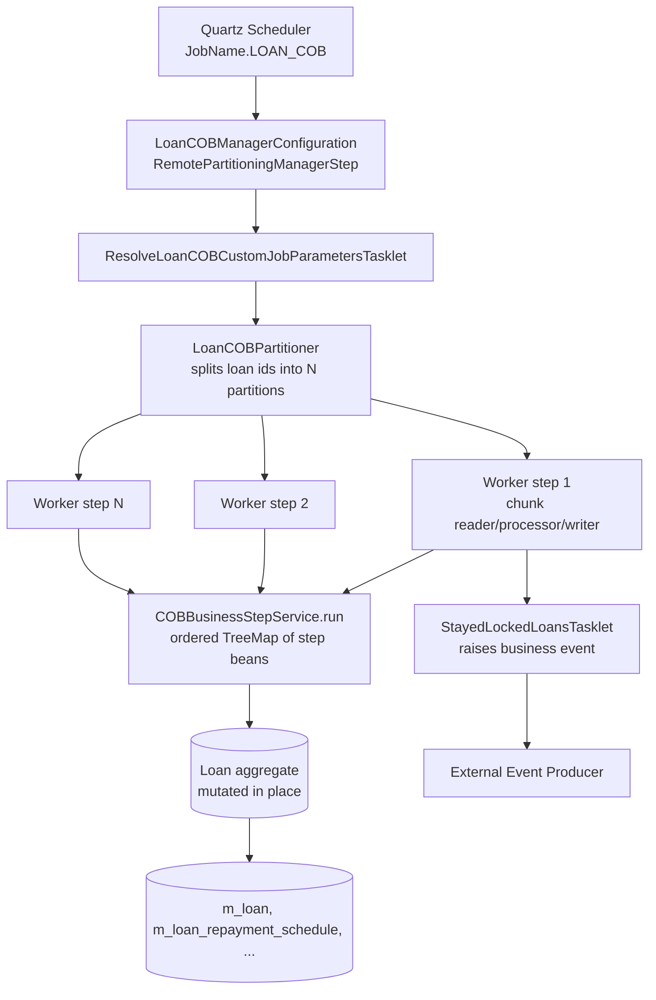
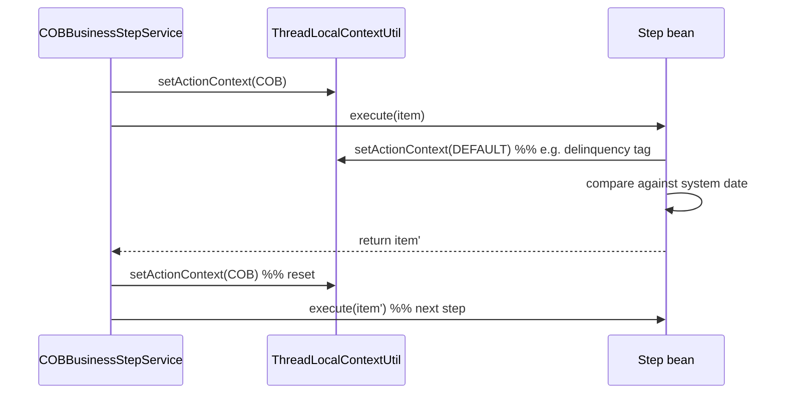

Apache Fineract runs an end-of-day "Close of Business" (COB) cycle that advances every open portfolio account by one business day: accruals are posted, schedules are checked for missed installments, delinquency tags are recomputed, and downstream side effects (events, journal entries, working-capital limits) are produced. The implementation lives in the `fineract-cob` module plus a thin per-portfolio extension (`fineract-loan`, `fineract-savings`, `fineract-working-capital-loan`) and a set of REST controllers in `fineract-provider`. The whole pipeline is a Spring Batch job whose individual *business steps* are pluggable Spring beans — the same execution engine drives the scheduled `LOAN_COB` job, the synchronous `INLINE_LOAN_COB` flow, the catch-up replayer, and the working-capital variant.

This page is the entry point to the sub-wiki: it covers the moving parts at a high level and links out to a page per concept.

## What COB does

For each tenant, on a daily cadence, COB:

1. Acquires the COB business date from `FineractBusinessDateConfiguration` (one day behind the system date by default — see `COBConstant.NUMBER_OF_DAYS_BEHIND`).
2. Reads the ordered list of *business steps* configured for the job from the `m_batch_business_steps` table.
3. Partitions the list of eligible account ids across worker steps (Spring Batch remote partitioning).
4. For each partition, locks the account, reloads it, then runs each business step against the entity in order — passing the same aggregate from step to step.
5. Persists, releases the lock, fires any deferred external events, and moves on.
6. Surfaces accounts that "stayed locked" through the day in a dedicated terminal step.

## Module layout

The `fineract-cob` module hosts the *engine* and the lock model. Portfolio-specific business steps live next to the aggregates they mutate.

```
fineract-cob/src/main/java/org/apache/fineract/cob/
├── COBBusinessStep.java           ← SPI implementations register against
├── COBBusinessStepService.java    ← resolves and runs ordered step chains
├── COBBusinessStepServiceImpl.java
├── COBConstant.java               ← BusinessDate / Partition / CatchUp keys
├── api/                           ← LockRequest DTO
├── common/                        ← CommonPartitioner, CustomJobParameterResolver
├── conditions/                    ← @Conditional flags for batch manager/worker
├── converter/                     ← COBParameterConverter
├── data/                          ← BusinessStepNameAndOrder, COBParameter
├── domain/                        ← AccountLock, BatchBusinessStep, LockingService
├── exceptions/                    ← BusinessStepException, LockCannotBeApplied…
├── listener/                      ← Fineract(Before/After)JobListener, chunk listener
├── processor/                     ← shared chunk processor helpers
├── resolver/                      ← BusinessDateResolver, CatchUpFlagResolver
├── service/                       ← BeforeStepLockingItemReaderHelper, mappers, …
└── tasklet/                       ← ApplyCommonLockTasklet, UnlockProcessedAccountsTasklet
```

Three portfolio modules contribute concrete pieces:

| Module | What it contributes |
|--------|---------------------|
| `fineract-loan` | `LoanCOBBusinessStep` SPI marker + `RetrieveLoanIdService` |
| `fineract-savings` | `SavingsCOBBusinessStep` SPI marker + `SavingsAccountLock` + `SavingsLockingService` |
| `fineract-working-capital-loan` | Full `WC_LOAN_COB` job: partitioner, reader, writer, worker config, business steps |
| `fineract-provider` | Concrete `LoanCOBBusinessStep` implementations, `LoanCOBPartitioner`, `LoanCOBApiFilter`, REST resources |

## Anatomy of a COB run



The same shape is reused by the savings and working-capital variants — only the SPI marker type, the partitioner, and the lock entity change.

## Where each concept is documented

<CardGroup cols={2}>
  <Card title="Business step engine" icon="puzzle-piece" href="/cob/business-step-engine">
    `COBBusinessStep<T>` SPI, registration via `m_batch_business_steps`, the
    `COBBusinessStepService` resolver.
  </Card>
  <Card title="Tasklets & Spring Batch wiring" icon="layer-group" href="/cob/cob-tasklets">
    `ApplyCommonLockTasklet`, `UnlockProcessedAccountsTasklet`, item
    readers/processors/writers, chunk listener.
  </Card>
  <Card title="Loan COB job" icon="hand-holding-dollar" href="/cob/loan-cob-job">
    The `LOAN_COB` Spring Batch job and the concrete `LoanCOBBusinessStep`
    chain that runs against every active loan.
  </Card>
  <Card title="Inline COB" icon="bolt" href="/cob/inline-cob">
    `POST /v1/jobs/{jobName}/inline` for synchronous catch-up on a single
    loan after a lifecycle change.
  </Card>
  <Card title="Loan account lock" icon="lock" href="/cob/loan-account-lock">
    `LoanAccountLock` entity, `LockOwner` enum, and the `LoanCOBApiFilter`
    that rejects mutations during processing.
  </Card>
  <Card title="Savings COB" icon="piggy-bank" href="/cob/savings-cob">
    Savings-side scaffolding — `SavingsCOBBusinessStep`, `SavingsAccountLock`,
    and the locations where concrete steps plug in.
  </Card>
  <Card title="Catch-up" icon="rotate-right" href="/cob/cob-catch-up">
    `LoanCOBCatchUpApiResource` and its working-capital twin —
    replaying COB days that were skipped due to outage or backlog.
  </Card>
  <Card title="Working-capital COB" icon="briefcase" href="/cob/working-capital-cob">
    The dedicated `WORKING_CAPITAL_LOAN_COB` job, its worker configuration,
    and the WC-specific business steps.
  </Card>
</CardGroup>

## Key configuration tables and properties

<AccordionGroup>
  <Accordion title="m_batch_business_steps">
    Per-job ordered list of step bean names. Two columns matter at runtime:
    `step_name` (Spring bean name, e.g. `applyChargeToOverdueLoansBusinessStep`)
    and `step_order` (long). Rows are keyed by `job_name`
    — `LOAN_CLOSE_OF_BUSINESS`, `WORKING_CAPITAL_LOAN_CLOSE_OF_BUSINESS`, or
    a downstream tenant value. The entity is `BatchBusinessStep` in
    `fineract-cob/.../cob/domain/`.
  </Accordion>
  <Accordion title="FineractProperties.partitionSize / pollInterval">
    `PropertyService.getPartitionSize(JOB_NAME)` is read by every partitioner
    (loan, savings, working-capital). It controls how many account ids are
    placed into each remote-partitioning slice. `getPollInterval` is the
    Spring Integration outbound channel poll interval; both are configurable
    per job via `application.properties`.
  </Accordion>
  <Accordion title="m_loan_account_locks / m_savings_account_locks">
    Tables backing the lock entities. Each row carries `loan_id` (or
    `savings_id`), `lock_owner` (`LOAN_COB_CHUNK_PROCESSING`, `LOAN_INLINE_COB_PROCESSING`),
    `lock_placed_on`, `lock_placed_on_cob_business_date`, optional
    `error` + `stacktrace` from the last failure, and a JPA `@Version` for
    optimistic locking.
  </Accordion>
  <Accordion title="LoanCOBEnabledCondition">
    Gates every COB bean behind a single property — when COB is disabled
    the Spring beans (services, filters, API resources) are simply not
    created. The condition is referenced by `@Conditional` on
    `InlineLoanCOBExecutorServiceImpl`, `LoanCOBApiFilter`,
    `LoanCOBCatchUpApiResource`, and more.
  </Accordion>
</AccordionGroup>

## Three jobs, one engine

The same `COBBusinessStepService` is reused across three Spring Batch jobs that ship with Apache Fineract:

| Job constant | Quartz job name | `m_batch_business_steps.job_name` | Aggregate | Lock table |
|--------------|-----------------|------------------------------------|-----------|------------|
| `LoanCOBConstant.JOB_NAME` | `LOAN_COB` | `LOAN_CLOSE_OF_BUSINESS` | `Loan` | `m_loan_account_locks` |
| `SavingsCOBConstant.JOB_NAME` | `SAVINGS_COB` | `SAVINGS_CLOSE_OF_BUSINESS` | `SavingsAccount` | `m_savings_account_locks` |
| `WorkingCapitalLoanCOBConstant.WORKING_CAPITAL_JOB_NAME` | `WC_LOAN_COB` | `WORKING_CAPITAL_LOAN_CLOSE_OF_BUSINESS` | `WorkingCapitalLoan` | `m_wc_loan_account_locks` |

Plus their inline twins (`INLINE_LOAN_COB`, `INLINE_SAVINGS_COB`, `INLINE_WORKING_CAPITAL_LOAN_COB`) that share most of the same plumbing but have their own row sets in `m_batch_business_steps`.

The job constants extend a shared `COBConstant` base that carries cross-job key names — `BUSINESS_DATE_PARAMETER_NAME` (`"BusinessDate"`), `IS_CATCH_UP_PARAMETER_NAME` (`"IS_CATCH_UP"`), `PARTITION_KEY`, `NUMBER_OF_DAYS_BEHIND` — so portfolio-specific tasklets and partitioners reach into the execution context with the same key strings.

## How the engine is gated on/off

COB is an optional subsystem. Three Spring `@Conditional` guards decide which beans exist in any given JVM:

| Condition | What it gates |
|-----------|---------------|
| `LoanCOBEnabledCondition` | Every loan-side COB bean — the manager configuration, the worker configuration, the catch-up service, the inline executor, the API filter. With COB disabled the application starts cleanly with none of those beans present. |
| `BatchManagerCondition` | The manager-side beans only — the partitioner, the resolve-parameters tasklet, the Spring Integration outbound channel. A node that only runs as a worker leaves manager beans absent. |
| `BatchWorkerCondition` | The worker-side beans only — the worker step, the chunk reader/processor/writer, the chunk listener. A manager-only node leaves worker beans absent. |

The manager/worker split lets a deployment scale horizontally: a dedicated manager node fans out partitions over Spring Integration to a fleet of worker nodes. The two conditions are mutually compatible — a single-node deployment turns both on and runs the whole pipeline in-process.

## Manager / worker partitioning

COB is built on Spring Batch's *remote partitioning* model. A manager step asks the partitioner for a `Map<String, ExecutionContext>` — one entry per partition — and a `RemotePartitioningManagerStepBuilderFactory` fans them out over a Spring Integration `DirectChannel`. Worker nodes pick the partition descriptors off a `QueueChannel`, run their chunk-oriented step against the assigned id range, and report back.

This is why the manager and worker configurations live in separate classes (`LoanCOBManagerConfiguration` + `LoanCOBWorkerConfiguration`, and the same pair for working-capital). Each is gated by its own `@Conditional` — `BatchManagerCondition` for the manager beans, `BatchWorkerCondition` for the worker beans — so a horizontally-scaled deployment can pick exactly the role each JVM plays.

The partitioner itself is small: it asks the engine for the ordered chain of business-step bean names, asks `RetrieveIdService` for the eligible aggregate ids, slices them into partitions of `propertyService.getPartitionSize(JOB_NAME)`, and stuffs `(min, max)` ranges plus the step-name map into each partition's `ExecutionContext`. Worker reader/processor/writer beans pull both back out via `@BeforeStep` callbacks.

## Action context during COB

Every business step inherits `ActionContext.COB` via `ThreadLocalContextUtil` for the duration of `execute(...)`. The action context is read by lower-level services to suppress UI-only validation, to choose between "business date" and "system date" for comparisons, and to switch event recording into bulk mode. The runner resets it back to `COB` after each step in a `finally` block so a step that flips to `ActionContext.DEFAULT` mid-execution does not leak the switch into the next step.



## Reading order for new contributors

<Steps>
  <Step title="Understand the SPI">
    Start with the [business step engine](/cob/business-step-engine) — the
    `COBBusinessStep<T>` interface is the only abstraction you need to
    implement to plug a new daily action into the chain.
  </Step>
  <Step title="Trace a single LOAN_COB run">
    Read [the Loan COB job](/cob/loan-cob-job) which walks through the
    concrete `LoanCOBBusinessStep` chain — accrual, delinquency, overdue
    charges, schedule check.
  </Step>
  <Step title="Look at the lock model">
    [Account lock](/cob/loan-account-lock) explains why API mutations are
    forbidden while a loan is being processed, and how the
    `LoanCOBApiFilter` enforces it.
  </Step>
  <Step title="Know your operational tools">
    [Inline COB](/cob/inline-cob) and [Catch-up](/cob/cob-catch-up) are the
    two endpoints SREs reach for when a loan was missed or the daily job
    skipped a day.
  </Step>
  <Step title="Look at the working-capital pipeline">
    [Working-capital COB](/cob/working-capital-cob) is a parallel job with
    its own steps for utilisation and breach detection.
  </Step>
</Steps>

## Glossary

| Term | Meaning |
|------|---------|
| COB business date | The date COB is processing — typically yesterday relative to the system date (`NUMBER_OF_DAYS_BEHIND = 1`). |
| Business step | A `COBBusinessStep<T>` bean. Unit of daily work against an aggregate. |
| Chain | The ordered list of business-step beans resolved for a given job from `m_batch_business_steps`. |
| Catch-up | A multi-day replay of COB launched via the catch-up REST endpoints, used when a tenant has fallen multiple days behind. |
| Inline COB | A synchronous run of the chain against a small loan-id list, dispatched through `POST /v1/jobs/{jobName}/inline`. |
| Stayed-locked | A loan whose lock row was not released by end of job — usually because a business step threw. |

## Related wiki pages

- [Quartz scheduler & ScheduledJobRunner](/jobs/scheduler-service) — what actually
  fires `LOAN_COB` once a day.
- [External Event Producer](/events/external-events-pipeline) — destination of the
  events COB raises (delinquency change, accrual posted, …).
- [Working capital loan COB pipeline](/working-capital/cob-pipeline) — a
  portfolio-side view of the same dedicated job described here.

<Note>
COB is intentionally read-only from the outside: there is no direct way to
mutate the configured chain at runtime besides editing
`m_batch_business_steps` (typically done via Liquibase changesets in
tenant-specific custom modules). Order is determined by `step_order`
ascending; gaps are allowed.
</Note>
