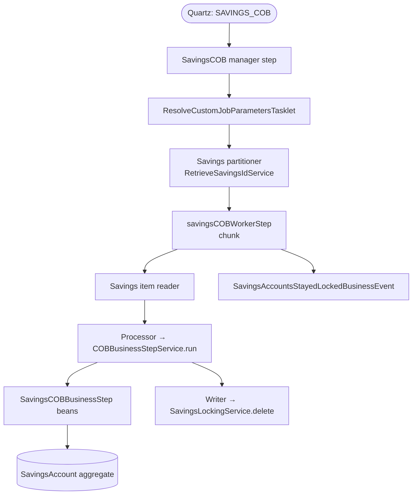

Apache Fineract's savings portfolio runs through the same Close-of-Business engine as the loan portfolio: a Spring Batch job, a chain of business-step beans configured in `m_batch_business_steps`, partitioned execution, an account-lock model. The scaffolding lives in the `fineract-savings` module under `org.apache.fineract.cob.savings`. This page maps that scaffolding out: the SPI marker, the `SavingsAccountLock` entity and its owner enum, the `SavingsLockingService`, the savings-specific data carriers — and identifies the slots where concrete steps (dormancy detection, periodic-accrual posting, scheduled-charge application) are intended to plug in.

## Module layout

```
fineract-savings/src/main/java/org/apache/fineract/cob/savings/
├── SavingsCOBBusinessStep.java                  ← SPI marker
├── SavingsCOBConstant.java                      ← job/parameter constants
├── SavingsAccountLock.java                      ← lock entity
├── SavingsLockOwner.java                        ← enum
├── SavingsLockingService.java                   ← lock verbs
├── SavingsAccountsStayedLockedBusinessEvent.java
├── SavingsAccountsStayedLockedData.java
├── SavingsLockCannotBeAppliedException.java
├── SavingsReadException.java
├── RetrieveSavingsIdService.java                ← id source for the partitioner
└── domain/
    └── SavingsAccountLockRepository.java
```

A second module — `fineract-provider` — contributes the implementation of `RetrieveSavingsIdService` (`RetrieveSavingsIdServiceImpl`).

## The SPI marker

```java
package org.apache.fineract.cob.savings;

import org.apache.fineract.cob.COBBusinessStep;
import org.apache.fineract.portfolio.savings.domain.SavingsAccount;

public interface SavingsCOBBusinessStep extends COBBusinessStep<SavingsAccount> { }
```

This is the savings twin of `LoanCOBBusinessStep`. Implementations:

- Are ordinary `@Component` beans.
- Receive a `SavingsAccount` aggregate from the engine and return a possibly-mutated one.
- Are picked up by `COBBusinessStepService.getCOBBusinessSteps(SavingsCOBBusinessStep.class, "SAVINGS_CLOSE_OF_BUSINESS")` — exactly the same resolver the loan side uses (see [Business step engine](/cob/business-step-engine)).

The engine is type-safe by virtue of the generic on `COBBusinessStep<T>` — a `LoanCOBBusinessStep` cannot be wired into the savings chain because the type bound is `SavingsAccount`.

## Job identity

```java
public final class SavingsCOBConstant extends COBConstant {

    public static final String JOB_NAME                  = "SAVINGS_COB";
    public static final String JOB_HUMAN_READABLE_NAME   = "Savings COB";
    public static final String SAVINGS_COB_JOB_NAME      = "SAVINGS_CLOSE_OF_BUSINESS";
    public static final String SAVINGS_COB_PARAMETER     = "savingsCobParameter";
    public static final String SAVINGS_COB_WORKER_STEP   = "savingsCOBWorkerStep";

    public static final String INLINE_SAVINGS_COB_JOB_NAME = "INLINE_SAVINGS_COB";
    public static final String SAVINGS_IDS_PARAMETER_NAME  = "SavingsIds";

    public static final String SAVINGS_COB_PARTITIONER_STEP = "Savings COB partition - Step";
    public static final String PARTITION_KEY                = "partition";
}
```

| Constant | Role |
|----------|------|
| `SAVINGS_COB` | The Quartz / `JobName` enum value. |
| `SAVINGS_CLOSE_OF_BUSINESS` | The `m_batch_business_steps.job_name` key. |
| `INLINE_SAVINGS_COB` | The inline-execution job name. |
| `SAVINGS_IDS_PARAMETER_NAME` | The execution-context key holding the per-partition id list. |
| `savingsCobParameter` | The execution-context key for the `COBParameter` (min/max id range). |

The constants extend `COBConstant` so the engine-level `BUSINESS_DATE_PARAMETER_NAME` and `IS_CATCH_UP_PARAMETER_NAME` keys are reused unchanged.

## The lock entity

`SavingsAccountLock` mirrors `LoanAccountLock` but is a standalone `@Entity` rather than extending the shared `AccountLock` superclass — savings locks predate the shared base.

```java
@Entity
@Table(name = "m_savings_account_locks")
@NoArgsConstructor
@Getter
public class SavingsAccountLock {

    @Id
    @Column(name = "savings_id", nullable = false)
    private Long savingsId;

    @Version
    @Column(name = "version")
    private Long version;

    @Enumerated(EnumType.STRING)
    @Column(name = "lock_owner", nullable = false)
    private SavingsLockOwner lockOwner;

    @Column(name = "lock_placed_on", nullable = false)
    private OffsetDateTime lockPlacedOn;

    @Column(name = "error")
    private String error;

    @Column(name = "stacktrace")
    private String stacktrace;

    @Column(name = "lock_placed_on_cob_business_date")
    private LocalDate lockPlacedOnCobBusinessDate;

    public SavingsAccountLock(Long savingsId,
                              SavingsLockOwner lockOwner,
                              LocalDate lockPlacedOnCobBusinessDate) {
        this.savingsId = savingsId;
        this.lockOwner = lockOwner;
        this.lockPlacedOn = DateUtils.getAuditOffsetDateTime();
        this.lockPlacedOnCobBusinessDate = lockPlacedOnCobBusinessDate;
    }

    public void setError(String errorMessage, String stacktrace) {
        this.error = errorMessage;
        this.stacktrace = stacktrace;
    }

    public void setNewLockOwner(SavingsLockOwner newLockOwner) {
        this.lockOwner = newLockOwner;
        this.lockPlacedOn = DateUtils.getAuditOffsetDateTime();
    }
}
```

The schema is identical in shape to `m_loan_account_locks`, only renamed (`savings_id` instead of `loan_id`, `lock_owner` of type `SavingsLockOwner`).

## The lock-owner taxonomy

```java
public enum SavingsLockOwner {
    SAVINGS_COB_CHUNK_PROCESSING,
    SAVINGS_INLINE_COB_PROCESSING;
}
```

Same two-value pattern as the loan side: a *chunk* owner for the scheduled `SAVINGS_COB` job, and an *inline* owner for synchronous catch-up. The same separation drives a savings-side API filter (when wired) to know which owner indicates "transient — retry" versus "behind — auto-catch-up".

## The locking service

```java
public interface SavingsLockingService {

    void upgradeLock(List<Long> accountsToLock, SavingsLockOwner lockOwner);

    void deleteBySavingsIdInAndLockOwner(List<Long> savingsIds,
                                         SavingsLockOwner lockOwner);

    List<SavingsAccountLock> findAllBySavingsIdIn(List<Long> savingsIds);

    SavingsAccountLock findBySavingsIdAndLockOwner(Long savingsId,
                                                    SavingsLockOwner lockOwner);

    List<SavingsAccountLock> findAllBySavingsIdInAndLockOwner(
            List<Long> savingsIds, SavingsLockOwner lockOwner);

    void applyLock(List<Long> savingsIds, SavingsLockOwner lockOwner);
}
```

Verb-for-verb mirror of `LockingService` on the loan side, with `savingsId` standing in for `loanId`. The implementation backs onto `SavingsAccountLockRepository` (in the `domain` subpackage), which uses Spring Data finders identical in shape to `LoanAccountLockRepository`.

## Stayed-locked event

```java
public class SavingsAccountsStayedLockedBusinessEvent extends ... {
    // emitted by the savings-side equivalent of StayedLockedLoansTasklet
    // payload: SavingsAccountsStayedLockedData
}
```

The data carrier records the savings ids whose locks were not cleared at the end of the run — same alerting pattern as the loan side.

## Anatomy of a `SAVINGS_COB` run



The shape matches `LOAN_COB` 1:1; only the partitioner uses `RetrieveSavingsIdService` instead of `RetrieveLoanIdService`, and the lock entity, owner, and event types are savings-flavoured.

## What steps live here

The Apache Fineract codebase ships the savings *scaffolding* (SPI, lock model, locking service, constants, stayed-locked event) so that tenants and downstream distributions can plug steps in. The natural slots are:

| Intended step | Mutates | Trigger |
|---------------|---------|---------|
| **Dormancy detection** | Recomputes `dormancy_tracking_active`, transitions `SAVINGS_STATUS_ENUM` between `Active`, `InactiveDormancyPending`, `Dormant`, and `Escheat` based on configured cut-offs. | Each COB day; consults last-transaction date. |
| **Periodic accrual posting** | Posts cumulative interest accrual transactions on the account up to the COB business date. | Each COB day, gated by product accounting type. |
| **Scheduled charge application** | Applies recurring savings charges (monthly fee, annual fee) when their `due_date` is hit. | When `due_date <= COB business date`. |
| **Overdraft / minimum-balance interest** | Posts overdraft interest if the account is in overdraft or below minimum balance. | Each COB day. |

Concrete implementations of these may ship in downstream Apache Fineract derivatives or be added by tenants. The contract is unchanged: implement `SavingsCOBBusinessStep`, register the `@Component`, and insert an `m_batch_business_steps` row with `job_name = 'SAVINGS_CLOSE_OF_BUSINESS'`.

## How a step plugs in

<Steps>
  <Step title="Create the @Component">
    ```java
    @Component
    public class SavingsDormancyTrackingBusinessStep
            implements SavingsCOBBusinessStep {

        private final SavingsAccountDomainService domainService;

        @Override
        public SavingsAccount execute(SavingsAccount account) {
            // recompute dormancy state, mutate aggregate, return
            return account;
        }

        @Override public String getEnumStyledName()    { return "SAVINGS_DORMANCY_TRACKING"; }
        @Override public String getHumanReadableName() { return "Savings Dormancy Tracking"; }
    }
    ```
  </Step>
  <Step title="Add a Liquibase row">
    ```xml
    <insert tableName="m_batch_business_steps">
        <column name="job_name"   value="SAVINGS_CLOSE_OF_BUSINESS"/>
        <column name="step_name"  value="SAVINGS_DORMANCY_TRACKING"/>
        <column name="step_order" value="10"/>
    </insert>
    ```
  </Step>
  <Step title="Test via the engine">
    The engine reads `m_batch_business_steps` once per run. The step
    appears in the chain on the next launch with no application restart
    required (the resolver re-queries on each
    `getCOBBusinessSteps` call).
  </Step>
</Steps>

## Locking pitfalls specific to savings

<AccordionGroup>
  <Accordion title="Savings aggregate fetch is not the same as Loan">
    Savings has a richer `SavingsAccountTransaction` history. The reader
    must hydrate transactions for the period actually being processed,
    not the full history — beware large accounts.
  </Accordion>
  <Accordion title="Dormancy and DEFAULT action context">
    Like the delinquency step on the loan side, dormancy detection
    compares against the *system* date. Steps that need this comparison
    must explicitly `ThreadLocalContextUtil.setActionContext(ActionContext.DEFAULT)`
    inside `execute` (the engine resets it back to COB after).
  </Accordion>
  <Accordion title="No shared AccountLock superclass">
    `SavingsAccountLock` is a standalone `@Entity`. Treat it as a sibling
    of `LoanAccountLock` rather than a subclass — repository code that
    works generically across both portfolios needs to handle the two
    types separately.
  </Accordion>
</AccordionGroup>

## Related pages

- [Business step engine](/cob/business-step-engine) — the
  `COBBusinessStep<T>` SPI and `COBBusinessStepService` resolver shared
  with savings.
- [Loan account lock](/cob/loan-account-lock) — sibling lock model in
  more depth; concepts transfer 1:1.
- [Overview](/cob/overview) — where the savings job sits in the broader
  COB family.
