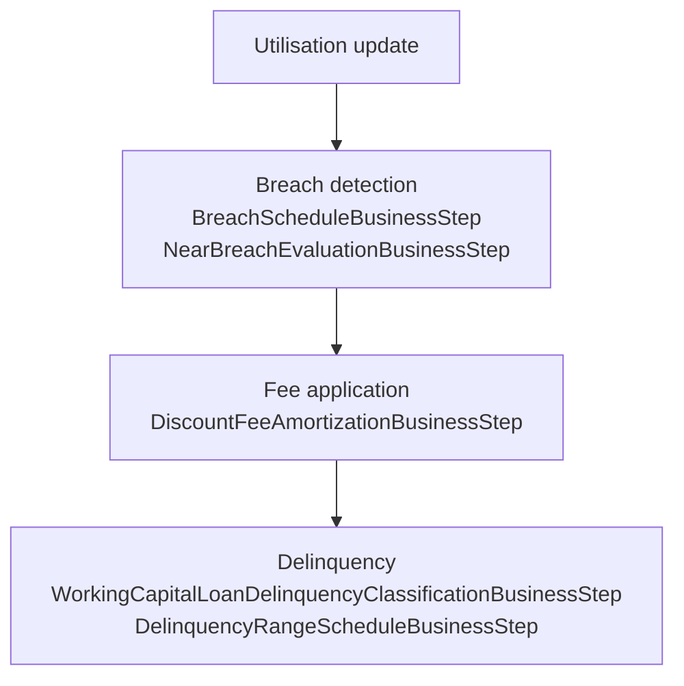

Apache Fineract's working-capital loan product (revolving credit facilities for SME borrowers) runs through a separate Close-of-Business pipeline from the regular loan portfolio. The two share the same engine (`COBBusinessStepService`), the same SPI shape (`COBBusinessStep<T>`), the same tasklet bases (`ApplyCommonLockTasklet`, `UnlockProcessedAccountsTasklet`), and the same catch-up REST surface — but a working-capital loan has its own aggregate (`WorkingCapitalLoan`), its own lock table (`m_wc_loan_account_locks`), its own job name (`WC_LOAN_COB` / `WORKING_CAPITAL_LOAN_CLOSE_OF_BUSINESS`), and its own set of business steps focussed on facility utilisation, near-breach evaluation, and breach scheduling. This page maps that dedicated pipeline.

## Module layout

```
fineract-working-capital-loan/src/main/java/org/apache/fineract/cob/
├── api/
│   ├── InternalWorkingCapitalAccountLockApiResource.java
│   └── InternalWorkingCapitalLoanCOBApiResource.java
├── domain/
│   ├── WorkingCapitalLoanAccountLock.java
│   ├── WorkingCapitalAccountLockRepository.java
│   └── CustomWorkingCapitalLoanAccountLockRepositoryImpl.java
├── internal/                                          ← test helpers
└── workingcapitalloan/
    ├── WorkingCapitalLoanCOBConstant.java
    ├── WorkingCapitalLoanCOBManagerConfiguration.java
    ├── WorkingCapitalLoanCOBWorkerConfiguration.java
    ├── WorkingCapitalLoanCOBPartitioner.java
    ├── WorkingCapitalLoanCOBWorkerItemReader.java
    ├── AbstractWorkingCapitalLoanCOBWorkerItemProcessor.java
    ├── WorkingCapitalLoanCOBWorkerItemProcessor.java
    ├── WorkingCapitalLoanCOBWorkerItemWriter.java
    ├── ApplyWorkingCapitalLoanLockTasklet.java
    ├── UnlockProcessedWorkingCapitalLoansTasklet.java
    ├── WorkingCapitalLoanCOBCustomJobParametersResolverTasklet.java
    ├── WorkingCapitalLoanLockingServiceImpl.java
    ├── WorkingCapitalAccountLockServiceImpl.java
    ├── WorkingCapitalLoanRetrieveIdServiceImpl.java
    ├── InlineWorkingCapitalLoanCOBWorkerItemListener.java
    ├── InlineWorkingCapitalLoanCOBWorkerItemWriter.java
    ├── WorkingCapitalLoanInlineCOBWorkerItemProcessor.java
    ├── WorkingCapitalLoanRetrieveIdConfiguration.java
    ├── WorkingCapitalLoanLockingConfiguration.java
    └── businessstep/
        ├── WorkingCapitalLoanCOBBusinessStep.java     ← abstract base
        ├── BreachScheduleBusinessStep.java
        ├── DelinquencyRangeScheduleBusinessStep.java
        ├── DiscountFeeAmortizationBusinessStep.java
        ├── DummyBusinessStep.java
        ├── NearBreachEvaluationBusinessStep.java
        └── WorkingCapitalLoanDelinquencyClassificationBusinessStep.java
```

## Job identity

```java
public final class WorkingCapitalLoanCOBConstant extends COBConstant {

    public static final String WORKING_CAPITAL_JOB_NAME                 = "WC_LOAN_COB";
    public static final String WORKING_CAPITAL_JOB_HUMAN_READABLE_NAME  = "Working Capital Loan COB";
    public static final String WORKING_CAPITAL_LOAN_COB_JOB_NAME        =
        "WORKING_CAPITAL_LOAN_CLOSE_OF_BUSINESS";

    public static final String WORKING_CAPITAL_LOAN_COB_STEP            = "workingCapitalLoanCOBStep";
    public static final String WORKING_CAPITAL_LOAN_COB_BUSINESS_STEP   = "workingCapitalLoanCOBBusinessStep";
    public static final String WORKING_CAPITAL_LOAN_COB_PARTITIONER     = "workingCapitalLoanCOBPartitioner";
    public static final String WORKING_CAPITAL_LOAN_COB_WORKER_STEP     = "workingCapitalLoanCOBWorkerStep";
    public static final String WORKING_CAPITAL_LOAN_COB_FLOW            = "workingCapitalLoanCOBFlow";

    public static final String INLINE_WORKING_CAPITAL_LOAN_COB_JOB_NAME = "INLINE_WORKING_CAPITAL_LOAN_COB";
    public static final String WORKING_CAPITAL_LOAN_IDS_PARAMETER_NAME  = "LoanIds";
    public static final String WORKING_CAPITAL_LOAN_COB_PARTITIONER_STEP =
        "Working Capital Loan COB partition - Step";
}
```

| Constant | Role |
|----------|------|
| `WC_LOAN_COB` | Quartz / `JobName` enum value. |
| `WORKING_CAPITAL_LOAN_CLOSE_OF_BUSINESS` | The `m_batch_business_steps.job_name` join key. |
| `INLINE_WORKING_CAPITAL_LOAN_COB` | Inline-execution job name; parallels `INLINE_LOAN_COB`. |

`WorkingCapitalLoanCOBConstant` extends `COBConstant`, so the shared `BUSINESS_DATE_PARAMETER_NAME` and `IS_CATCH_UP_PARAMETER_NAME` keys are reused unchanged.

## Job topology

`WorkingCapitalLoanCOBManagerConfiguration` assembles the same shape as `LoanCOBManagerConfiguration`:

```java
@Bean(WORKING_CAPITAL_JOB_HUMAN_READABLE_NAME)
public Job workingCapitalLoanCOBJob(
        final WorkingCapitalLoanCOBPartitioner workingCapitalLoanCOBPartitioner,
        final ApplicationContext applicationContext) {
    return new JobBuilder(WORKING_CAPITAL_LOAN_COB_JOB.name(), jobRepository)
            .listener(new COBExecutionListenerRunner(applicationContext,
                       WORKING_CAPITAL_LOAN_COB_JOB.name()))
            .start(resolveCustomJobParametersForWorkingCapitalStep())
            .next(workingCapitalLoanCOBStep(workingCapitalLoanCOBPartitioner))
            .next(unlockProcessedWorkingCapitalLoansStep())
            .incrementer(new RunIdIncrementer())
            .build();
}
```



```mermaid
flowchart LR
    Q([Quartz: WC_LOAN_COB]) --> Mgr[WorkingCapitalLoanCOBManagerConfiguration]
    Mgr --> R[WC custom parameters<br/>resolver step]
    R --> P[workingCapitalLoanCOBPartitioner<br/>RetrieveId + step set]
    P --> W[workingCapitalLoanCOBWorkerStep<br/>chunk reader/processor/writer]
    W --> Apply[ApplyWorkingCapitalLoanLockTasklet]
    W --> Reader[WorkingCapitalLoanCOBWorkerItemReader]
    Reader --> Proc[WorkingCapitalLoanCOBWorkerItemProcessor]
    Proc -->|run treeMap, wcLoan| Engine[COBBusinessStepService]
    Engine --> Steps[WorkingCapitalLoanCOBBusinessStep beans]
    Steps --> Loan[(WorkingCapitalLoan aggregate)]
    Proc --> Writer[WorkingCapitalLoanCOBWorkerItemWriter]
    Mgr --> U[unlockProcessedWorkingCapitalLoansStep<br/>UnlockProcessedWorkingCapitalLoansTasklet]
```

The partitioner uses the same `CommonPartitioner` base as `LoanCOBPartitioner`:

```java
@Override
public Map<String, ExecutionContext> partition(int gridSize) {
    int partitionSize = propertyService.getPartitionSize(WORKING_CAPITAL_JOB_NAME);
    Set<BusinessStepNameAndOrder> cobBusinessSteps =
        cobBusinessStepService.getCOBBusinessSteps(
            WorkingCapitalLoanCOBBusinessStep.class,
            WORKING_CAPITAL_LOAN_COB_JOB_NAME);
    return getPartitions(partitionSize, cobBusinessSteps);
}
```

Note the resolver narrows by `WorkingCapitalLoanCOBBusinessStep.class` so loan-side beans cannot leak into the working-capital chain even if a misconfigured row referenced one.

## The SPI

`WorkingCapitalLoanCOBBusinessStep` is an **abstract class**, not an interface — so concrete steps inherit shared helpers without re-implementing them.

```java
package org.apache.fineract.cob.workingcapitalloan.businessstep;

import org.apache.fineract.cob.COBBusinessStep;
import org.apache.fineract.portfolio.workingcapital.loan.domain.WorkingCapitalLoan;

public abstract class WorkingCapitalLoanCOBBusinessStep
        implements COBBusinessStep<WorkingCapitalLoan> { }
```

Concrete steps are `@Component`-annotated and extend this base.

## Shipped business steps

| Bean | `getEnumStyledName()` | `getHumanReadableName()` | Role |
|------|------------------------|---------------------------|------|
| `WorkingCapitalLoanDelinquencyClassificationBusinessStep` | `WC_LOAN_DELINQUENCY_CLASSIFICATION` | Working Capital Loan Delinquency Classification Business Step | Recompute delinquency for working-capital loans; mirror of the loan-side step. |
| `DelinquencyRangeScheduleBusinessStep` | `WC_DELINQUENCY_RANGE_SCHEDULE` | WC Delinquency Range Schedule | Schedule a delinquency-range change at the configured date. |
| `BreachScheduleBusinessStep` | `WC_BREACH_SCHEDULE` | WC Breach Schedule | Materialise the configured breach schedule for the facility (limit breach, utilisation breach). |
| `NearBreachEvaluationBusinessStep` | `WC_NEAR_BREACH_EVALUATION` | WC Near Breach Evaluation | Evaluate near-breach thresholds against the current facility state; emit warnings. |
| `DiscountFeeAmortizationBusinessStep` | `WC_DISCOUNT_FEE_AMORTIZATION` | WC Discount Fee Amortization | Amortise discount fees across the facility tenure. |
| `DummyBusinessStep` | `DUMMY_BUSINESS_STEP` | Dummy Business Step | Placeholder step used in tests; safe to leave unwired in production. |

Conceptually they fall into three groups:



The exact chain runs in whatever order `m_batch_business_steps.step_order` dictates for `WORKING_CAPITAL_LOAN_CLOSE_OF_BUSINESS`.

## The lock model

`WorkingCapitalLoanAccountLock` extends the shared `AccountLock` base and binds to its own table:

```java
@Entity
@Table(name = "m_wc_loan_account_locks")
@Getter
@NoArgsConstructor
public class WorkingCapitalLoanAccountLock extends AccountLock {
    public WorkingCapitalLoanAccountLock(Long loanId, LockOwner lockOwner,
                                          LocalDate lockPlacedOnCobBusinessDate) {
        super(loanId, lockOwner, lockPlacedOnCobBusinessDate);
    }
}
```

It reuses the same `LockOwner` enum as the loan side — `LOAN_COB_CHUNK_PROCESSING` and `LOAN_INLINE_COB_PROCESSING`. The owners are not WC-specific; what's WC-specific is the *table* and the *aggregate*. The two locks coexist in different schemas, so a working-capital loan and a regular loan can share an id without colliding.

`ApplyWorkingCapitalLoanLockTasklet` is the worker-side concrete subclass of `ApplyCommonLockTasklet`:

```java
public class ApplyWorkingCapitalLoanLockTasklet extends ApplyCommonLockTasklet {

    public ApplyWorkingCapitalLoanLockTasklet(FineractProperties fineractProperties,
            LockingService loanLockingService,
            RetrieveIdService retrieveIdService,
            TransactionTemplate batchJdbcTransactionTemplate) {
        super(fineractProperties, loanLockingService, retrieveIdService,
              batchJdbcTransactionTemplate);
    }

    @Override
    public String getCOBParameter() {
        return WorkingCapitalLoanCOBConstant.COB_PARAMETER;
    }

    @Override
    public LockOwner getLockOwner() {
        return LockOwner.LOAN_COB_CHUNK_PROCESSING;
    }
}
```

`UnlockProcessedWorkingCapitalLoansTasklet` is the working-capital twin of the orphan reaper.

## Inline and catch-up surface

Both inline and catch-up entrypoints exist for the working-capital pipeline.

- **Inline**: `POST /v1/jobs/INLINE_WORKING_CAPITAL_LOAN_COB/inline` with `{ "loanIds": [...] }`. Handled by the same `InlineJobApiResource` shown in [Inline COB](/cob/inline-cob), dispatched by job name to the working-capital executor service.
- **Catch-up**: a dedicated resource at `/v1/working-capital-loans/...` with the same three operations as the loan catch-up resource (see [COB catch-up](/cob/cob-catch-up)):

```java
@Path("/v1/working-capital-loans")
@Component
@Tag(name = "Working Capital Loan COB Catch Up", description = "")
public class WorkingCapitalLoanCOBCatchUpApiResource {

    @GET  @Path("oldest-cob-closed")
    public OldestCOBProcessedLoanDTO getOldestCOBProcessedLoan() { ... }

    @POST @Path("catch-up")
    public Response executeLoanCOBCatchUp() { ... }

    @GET  @Path("is-catch-up-running")
    public IsCatchUpRunningDTO isCatchUpRunning() { ... }
}
```

Same DTOs, same status-code semantics, separate state — a tenant's regular loans and working-capital loans have independent catch-up state.

## Internal lock-management surface

The `api/` subpackage exposes operator endpoints:

- `InternalWorkingCapitalAccountLockApiResource` — list and forcibly delete locks; gated by the internal-API flag.
- `InternalWorkingCapitalLoanCOBApiResource` — operator endpoints to inspect WC COB state.

Both are intended for SRE use and are not enabled in production by default; their loan-side equivalents are documented in [Loan account lock](/cob/loan-account-lock).

## How a tenant wires WC COB

<Steps>
  <Step title="Enable the module">
    `fineract-working-capital-loan` must be on the classpath and the
    feature flag for the WC product must be on. Without the module the
    job beans simply do not exist.
  </Step>
  <Step title="Configure the chain">
    Insert `m_batch_business_steps` rows for
    `WORKING_CAPITAL_LOAN_CLOSE_OF_BUSINESS` referencing the shipped
    beans by their enum-styled names (`WC_BREACH_SCHEDULE`,
    `WC_NEAR_BREACH_EVALUATION`, `WC_DISCOUNT_FEE_AMORTIZATION`, etc.).
  </Step>
  <Step title="Schedule the job">
    `WC_LOAN_COB` is added to the Quartz scheduler the same way other
    COB jobs are — through the `m_scheduled_jobs` table seeded by core
    Liquibase changesets.
  </Step>
  <Step title="Wire catch-up into runbooks">
    Operator runbooks should call `/v1/working-capital-loans/catch-up`
    independently of `/v1/loans/catch-up` — the two run-states are
    separate.
  </Step>
</Steps>

## Differences from `LOAN_COB` at a glance

| Aspect | `LOAN_COB` | `WC_LOAN_COB` |
|--------|------------|-----------------|
| Aggregate | `Loan` | `WorkingCapitalLoan` |
| SPI | `LoanCOBBusinessStep` (interface) | `WorkingCapitalLoanCOBBusinessStep` (abstract class) |
| Lock entity | `LoanAccountLock` (`m_loan_account_locks`) | `WorkingCapitalLoanAccountLock` (`m_wc_loan_account_locks`) |
| Lock owners | `LOAN_COB_CHUNK_PROCESSING`, `LOAN_INLINE_COB_PROCESSING` | Same enum, different table |
| Apply lock tasklet | `ApplyLoanLockTasklet` | `ApplyWorkingCapitalLoanLockTasklet` |
| Inline job | `INLINE_LOAN_COB` | `INLINE_WORKING_CAPITAL_LOAN_COB` |
| Catch-up base | `/v1/loans` | `/v1/working-capital-loans` |
| Steps shipped | Delinquency, accrual, overdue charges, schedule check, arrears aging, interest recalc, etc. | Delinquency, breach schedule, near-breach evaluation, discount-fee amortisation |

## Related pages

- [Overview](/cob/overview) — the COB family from the top, with this
  pipeline as a sibling of `LOAN_COB`.
- [Business step engine](/cob/business-step-engine) — the shared SPI
  every WC step extends.
- [Tasklets](/cob/cob-tasklets) — the shared `ApplyCommonLockTasklet`
  and `UnlockProcessedAccountsTasklet` that WC tasklets extend.
- [COB catch-up](/cob/cob-catch-up) — the API contract reused by the
  working-capital catch-up resource.
- [Working-capital loan COB pipeline](/working-capital/cob-pipeline) —
  the portfolio-side view of the same job from the working-capital
  module wiki.
