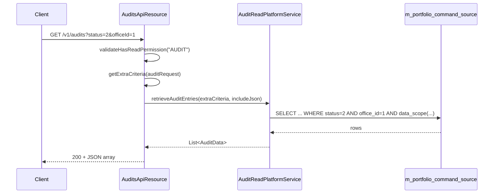

Every non-read API request in Fineract is audited. The row in `m_portfolio_command_source` carries who issued the command, what it was, when it ran, the checker (if any), the status, and optionally the original request body. The `/v1/audits` API is the read-only window onto that table. Where `/v1/makercheckers` only surfaces rows in `AWAITING_APPROVAL`, `/v1/audits` lets you search the full history across every status, every entity, and every action.

This page documents the resource, the supported query parameters, the JSON shape returned by `AuditData`, and the SQL query construction.

<Info>
  A fully processed audit row is immutable — you cannot change or delete it
  through this API. The maker-checker API is the only way to mutate a row, and
  only while it is in `AWAITING_APPROVAL`. See `commands/makercheckers` for that
  side.
</Info>

## Resource shape

`AuditsApiResource` lives in `fineract-provider/src/main/java/org/apache/fineract/commands/api/AuditsApiResource.java`:

```java
@Path("/v1/audits")
@Component
@Tag(name = "Audits", description = "Every non-read Mifos API request is audited. ...")
@RequiredArgsConstructor
public class AuditsApiResource {

    private static final String RESOURCE_NAME_FOR_PERMISSIONS = "AUDIT";

    private final PlatformSecurityContext context;
    private final AuditReadPlatformService auditReadPlatformService;
    private final ApiRequestParameterHelper apiRequestParameterHelper;
    private final ToApiJsonSerializer<String> toApiJsonSerializer;
}
```

Three things stand out:

- **`RESOURCE_NAME_FOR_PERMISSIONS = "AUDIT"`**. Every endpoint calls `context.authenticatedUser().validateHasReadPermission("AUDIT")`. The caller therefore needs one of `READ_AUDIT`, `ALL_FUNCTIONS_READ`, or `ALL_FUNCTIONS`.
- **`ToApiJsonSerializer<String>`**. The list endpoint returns a hand-serialised JSON string rather than a typed DTO. That is because it can switch between paginated and non-paginated payload shapes at runtime.
- **No write platform service is injected.** Audits are read-only.

## Endpoints

| Method | Path | Operation |
| --- | --- | --- |
| `GET` | `/v1/audits` | List/search audit entries with optional pagination. |
| `GET` | `/v1/audits/{auditId}` | Retrieve a single audit entry by id. |
| `GET` | `/v1/audits/searchtemplate` | Lookup data for the audit search UI. |

All three require `READ_AUDIT` (or a broader permission).

## Listing entries

The list endpoint accepts a `@BeanParam AuditRequest` plus the standard pagination/sort parameters and the global `fields` / `includeJson` query parameters:

```java
@GET
@Produces({ MediaType.APPLICATION_JSON })
public String retrieveAuditEntries(@Context final UriInfo uriInfo, @BeanParam AuditRequest auditRequest,
        @QueryParam("offset") final Integer offset,
        @QueryParam("limit") final Integer limit,
        @QueryParam("orderBy") final String orderBy,
        @QueryParam("sortOrder") final String sortOrder,
        @QueryParam("paged") final Boolean paged) {

    context.authenticatedUser().validateHasReadPermission(RESOURCE_NAME_FOR_PERMISSIONS);
    final PaginationParameters parameters = PaginationParameters.builder()
            .paged(Boolean.TRUE.equals(paged)).limit(limit).offset(offset)
            .orderBy(orderBy).sortOrder(sortOrder).build();
    final SQLBuilder extraCriteria = getExtraCriteria(auditRequest);
    final ApiRequestJsonSerializationSettings settings = this.apiRequestParameterHelper.process(uriInfo.getQueryParameters());

    return toApiJsonSerializer.serialize(parameters.isPaged()
            ? auditReadPlatformService.retrievePaginatedAuditEntries(extraCriteria, settings.isIncludeJson(), parameters)
            : auditReadPlatformService.retrieveAuditEntries(extraCriteria, settings.isIncludeJson()));
}
```

The list method does five things in order: enforce read permission, build pagination parameters, translate the filter beans into an SQL `WHERE` clause, read the standard `fields`/`includeJson` parameters, and finally dispatch to one of two read service methods depending on whether the caller asked for pagination.

### Pagination

Pagination is **opt-in**. By default the endpoint returns `List<AuditData>` (a JSON array). If the caller passes `paged=true`, the response shape switches to a `Page<AuditData>` with `totalFilteredRecords` and `pageItems`:

```json
{
    "totalFilteredRecords": 1234,
    "pageItems": [ { "id": 9921, ... }, ... ]
}
```

The default `orderBy` is the audit id descending — newest first.

### `includeJson`

By default `commandAsJson` is omitted from each `AuditData` instance to keep responses small. Setting `includeJson=true` fills it in. Combine with `fields=commandAsJson` to fetch only the body.

### Example requests

The Swagger description lists representative URLs:

```
GET /v1/audits
GET /v1/audits?fields=madeOnDate,maker,processingResult
GET /v1/audits?makerDateTimeFrom=2013-03-25 08:00:00&makerDateTimeTo=2013-04-04 18:00:00
GET /v1/audits?officeId=1
GET /v1/audits?officeId=1&includeJson=true
GET /v1/audits/20
GET /v1/audits/20?fields=madeOnDate,maker,processingResult
```

## Single-entry endpoint

`GET /v1/audits/{auditId}` returns a single `AuditData`:

```java
@GET
@Path("{auditId}")
public AuditData retrieveAuditEntry(@PathParam("auditId") final Long auditId) {
    context.authenticatedUser().validateHasReadPermission(RESOURCE_NAME_FOR_PERMISSIONS);
    return auditReadPlatformService.retrieveAuditEntry(auditId);
}
```

The single-entry call always fetches `commandAsJson` regardless of `includeJson`. Data scoping still applies: an audit row outside the caller's data scope returns the standard "not found" response.

## The search template

`GET /v1/audits/searchtemplate` returns an `AuditSearchData` instance suitable for populating a search UI:

```java
@GET
@Path("/searchtemplate")
public AuditSearchData retrieveAuditSearchTemplate() {
    this.context.authenticatedUser().validateHasReadPermission(RESOURCE_NAME_FOR_PERMISSIONS);
    return this.auditReadPlatformService.retrieveSearchTemplate("audit");
}
```

The `"audit"` flavour returns the broader set of `appUsers`, `actionNames`, and `entityNames` visible to the caller. (The `"makerchecker"` flavour is narrower — see `commands/makercheckers`.)

## Query parameters

The list and search endpoints both build their `WHERE` clause from the `AuditRequest` `@BeanParam`. The full mapping is in `AuditsApiResource#getExtraCriteria`:

| Query parameter | Column | Match |
| --- | --- | --- |
| `actionName` | `aud.action_name` | exact (`=`) |
| `entityName` | `aud.entity_name` | prefix (`like ENTITYNAME%`) |
| `resourceId` | `aud.resource_id` | exact |
| `makerId` | `aud.maker_id` | exact |
| `checkerId` | `aud.checker_id` | exact |
| `makerDateTimeFrom` | `aud.made_on_date` or `aud.made_on_date_utc` | `>=` (OR'd across the two columns) |
| `makerDateTimeTo` | `aud.made_on_date` or `aud.made_on_date_utc` | `<=` (OR'd across the two columns) |
| `checkerDateTimeFrom` | `aud.checked_on_date` or `aud.checked_on_date_utc` | `>=` (OR'd) |
| `checkerDateTimeTo` | `aud.checked_on_date` or `aud.checked_on_date_utc` | `<=` (OR'd) |
| `status` | `aud.status` | exact (integer of `CommandProcessingResultType`) |
| `officeId` | `aud.office_id` | exact |
| `groupId` | `aud.group_id` | exact |
| `clientId` | `aud.client_id` | exact |
| `loanId` | `aud.loan_id` | exact |
| `savingsAccountId` | `aud.savings_account_id` | exact |

Two details to flag:

- **`entityName` is a prefix match.** Passing `entityName=LOAN` matches any row whose entity name starts with `LOAN` — including `LOANPRODUCT` and `LOANTRANSACTION`. That is occasionally what you want; when you need an exact match, also restrict on the action.
- **The maker/checker date filters are OR'd across two columns.** The old `made_on_date` / `checked_on_date` columns are kept for backwards compatibility, and the new `_utc` columns are what current code writes. The audit query checks both so rows from either era are returned.

### Status filter

`status` accepts the integer form of `CommandProcessingResultType`:

| Value | Status |
| --- | --- |
| `0` | `INVALID` (defensive fallback) |
| `1` | `PROCESSED` |
| `2` | `AWAITING_APPROVAL` |
| `3` | `REJECTED` |
| `4` | `UNDER_PROCESSING` |
| `5` | `ERROR` |

So `/v1/audits?status=2` returns the same logical set as `/v1/makercheckers` (subject to permission differences), and `/v1/audits?status=5` is the easy way to surface failures.

### SQLBuilder construction

The criteria are accumulated into a `SQLBuilder` from `infrastructure.security.utils`. Each `addNonNullCriteria(...)` call appends a fragment only if the argument is non-null, so missing query parameters drop out of the WHERE clause entirely. For the date pairs the code uses `addSubOperation(...)` to group the two-column OR inside its own parenthesis:

```java
if (auditRequest.getMakerDateTimeFrom() != null) {
    extraCriteria.addSubOperation((SQLBuilder criteria) -> {
        criteria.addNonNullCriteria("aud.made_on_date >= ", auditRequest.getMakerDateTimeFrom(),
                SQLBuilder.WhereLogicalOperator.NONE);
        criteria.addNonNullCriteria("aud.made_on_date_utc >= ", auditRequest.getMakerDateTimeFrom(),
                SQLBuilder.WhereLogicalOperator.OR);
    });
}
```

This emits a fragment like `(aud.made_on_date >= ? OR aud.made_on_date_utc >= ?)`.

## The AuditData output shape

`AuditData` is a `Serializable` DTO in `org.apache.fineract.commands.data`. The first half of the class:

```java
@AllArgsConstructor
@Getter
public final class AuditData implements Serializable {

    private final Long id;
    private final String actionName;
    private final String entityName;
    private final Long resourceId;
    private final Long subresourceId;
    private final String maker;
    private final ZonedDateTime madeOnDate;
    private final String checker;
    private final ZonedDateTime checkedOnDate;
    private final String processingResult;
    @Setter
    private String commandAsJson;
    private final String officeName;
    // ...
}
```

A typical entry serialises to roughly:

```json
{
    "id": 9921,
    "actionName": "DISBURSE",
    "entityName": "LOAN",
    "resourceId": 123,
    "subresourceId": null,
    "maker": "branch.officer",
    "madeOnDate": "2024-05-21T08:14:02Z",
    "checker": "branch.manager",
    "checkedOnDate": "2024-05-21T08:17:36Z",
    "processingResult": "processed",
    "commandAsJson": "{\"transactionAmount\": 5000, ...}",
    "officeName": "Head Office"
}
```

A few things to know about the shape:

- **`maker` and `checker` are usernames**, not numeric ids. The read service joins through `m_appuser` so the UI never has to do a second lookup.
- **`madeOnDate` and `checkedOnDate` are `ZonedDateTime`.** They are projected from the `_utc` columns and serialised as ISO-8601.
- **`processingResult` is the localisation code** of `CommandProcessingResultType` — for example `processed`, `awaiting.approval`, `rejected`, `underProcessing`, `error`.
- **`commandAsJson` is opt-in.** It is the only field with a setter, because the read service hydrates it from a second column only when `includeJson=true`. Without that flag the field stays `null` and the response shrinks accordingly.
- **`officeName` is the maker's office,** joined through the user. It is what the UI shows in the "branch" column.

`AuditData` is also the return type of `MakercheckersApiResource#retrieveCommands`, so the two APIs return the same payload shape — only the underlying filter differs.

## Permissions

Every endpoint in `AuditsApiResource` starts with:

```java
context.authenticatedUser().validateHasReadPermission(RESOURCE_NAME_FOR_PERMISSIONS);
```

The resource name is `"AUDIT"`. A user satisfies the check if they have any of:

| Permission | Grants |
| --- | --- |
| `READ_AUDIT` | Permission to read audit entries. |
| `ALL_FUNCTIONS_READ` | All read permissions. |
| `ALL_FUNCTIONS` | All read and write permissions. |

Data scoping then applies on top of permission checks: a branch-scoped user sees only audits within their office hierarchy, while a head-office user sees the whole system — including non-office-scoped audits like loan-product changes.

## Flow



## Operational notes

- **Use `status=5` to find failures.** Combined with a date range, this is a good first port of call when investigating intermittent errors.
- **`includeJson` doubles or triples the payload size** on large lists. Reach for `fields=` to project down to the columns you actually need.
- **Pagination is recommended on production volumes.** Without `paged=true` the entire result set is materialised in memory before serialisation.
- **Audit rows are append-only via the API.** Even with `ALL_FUNCTIONS` you cannot `PUT` or `DELETE` against `/v1/audits/{id}`. The only way to remove a row is `DELETE /v1/makercheckers/{id}`, and only while it is in `AWAITING_APPROVAL`.

## Related pages

- `commands/command-source` — the row layout being queried.
- `commands/makercheckers` — the write half, restricted to `AWAITING_APPROVAL`.
- `commands/idempotency` — how replays influence the `result` column of an audit row.
- `commands/overview` — how an HTTP request becomes one row in this table.
