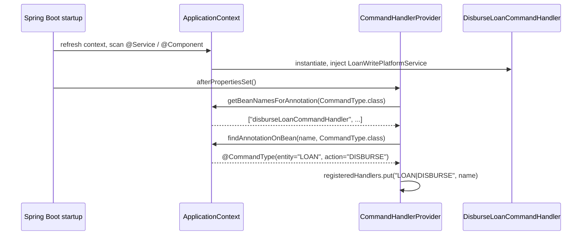

A Fineract handler is a tiny, single-purpose Spring bean: it implements `NewCommandSourceHandler`, declares the entity and action it serves with `@CommandType`, and delegates to a write platform service. There are well over a thousand of them spread across loans, savings, accounting, clients, products, codes, jobs, and every other module — and yet the command framework only knows how to find them because of two small files in `fineract-core`. This page documents that contract: the marker interface, the annotation, and the patterns each module follows.

<Info>
  Handlers live next to the module they serve, never in `fineract-core`. Look for
  packages ending in `.handler` (loans, savings, clients, journal entries) or in
  `.commands` (some infrastructure modules).
</Info>

## The marker interface

`NewCommandSourceHandler` is the simplest interface in the framework. Its entire definition is:

```java
package org.apache.fineract.commands.handler;

import org.apache.fineract.infrastructure.core.api.JsonCommand;
import org.apache.fineract.infrastructure.core.data.CommandProcessingResult;

public interface NewCommandSourceHandler {

    CommandProcessingResult processCommand(JsonCommand command);
}
```

A handler receives a parsed `JsonCommand` (which exposes both the raw JSON and pre-extracted ids like `clientId()`, `loanId()`, and `subentityId()`) and returns a `CommandProcessingResult`. The returned result tells the framework which resource id to populate on the audit row and what JSON to ship back to the caller. The interface deliberately does not take a transaction or a security context — those concerns are handled by `SynchronousCommandProcessingService` before the handler is invoked.

## The annotation

`@CommandType` is the type-level marker that pairs a handler bean with a `(entity, action)` key:

```java
package org.apache.fineract.commands.annotation;

import java.lang.annotation.Documented;
import java.lang.annotation.ElementType;
import java.lang.annotation.Retention;
import java.lang.annotation.RetentionPolicy;
import java.lang.annotation.Target;

@Retention(RetentionPolicy.RUNTIME)
@Target(ElementType.TYPE)
@Documented
public @interface CommandType {

    /** Returns the name of the entity for this {@link CommandType}. */
    String entity();

    /** Return the name of the action for this {@link CommandType}. */
    String action();
}
```

Two design decisions are worth flagging:

- **`RetentionPolicy.RUNTIME`**. Spring needs to read the annotation through reflection at startup. Without runtime retention, `applicationContext.findAnnotationOnBean(name, CommandType.class)` would return `null`.
- **`ElementType.TYPE`**. The annotation is on the class, not on the `processCommand` method. There is exactly one entity/action per handler class.

The Javadoc on the annotation matches the convention used across the codebase: `entity` is the noun in upper-case (`LOAN`, `CLIENT`, `SAVINGSACCOUNT`, `LOANPRODUCT`), and `action` is the verb in upper-case (`CREATE`, `DELETE`, `DISBURSE`, `APPROVE`, `WITHDRAW`). Underscores are allowed (`UNDO_REAGE`, `BLOCKCREDIT`, `INTERESTPAYMENTWAIVER`). The combined string `actionName + "_" + entityName` is also the permission code, which is why both halves are upper-case.

## The canonical shape of a handler

A handler is typically three lines of meaningful code:

```java
@Service
@RequiredArgsConstructor
@CommandType(entity = "LOAN", action = "DISBURSE")
public class DisburseLoanCommandHandler implements NewCommandSourceHandler {

    private final LoanWritePlatformService writePlatformService;

    @Override
    @Transactional
    public CommandProcessingResult processCommand(JsonCommand command) {
        return writePlatformService.disburseLoan(command.entityId(), command, false);
    }
}
```

Every handler in the repository follows this template:

- `@Service` (or `@Component`) so Spring registers it as a bean.
- `@CommandType(entity = ..., action = ...)` with the upper-case strings.
- A single dependency injected via constructor — a *write platform service* that owns the domain logic.
- A one-line `processCommand` that translates `JsonCommand` ids and JSON into a call on the write service and returns its `CommandProcessingResult`.
- An optional `@Transactional` on the method when the handler runs without a surrounding transaction (the wrapping `SynchronousCommandProcessingService` already opens one in the synchronous path).

The handler is intentionally thin. All validation, persistence, business rules, and event publication live in the write platform service. That makes handlers trivially testable and keeps the registry homogeneous.

## How handlers are discovered

When Spring finishes constructing the context, `CommandHandlerProvider#afterPropertiesSet` runs (because it implements `InitializingBean`). The provider asks the context for **every bean carrying `@CommandType`**:

```java
final String[] commandHandlerBeans = applicationContext.getBeanNamesForAnnotation(CommandType.class);
```

For each bean name it reads the annotation back with `applicationContext.findAnnotationOnBean(name, CommandType.class)`, then registers the bean under the key `entity + "|" + action`. There is no `@ComponentScan` magic specific to the command framework — handlers are picked up by the normal `@Service`/`@Component` scan, and the provider locates them by annotation in a second pass.

Two consequences:

1. **No package layout is enforced.** A handler can live anywhere on the classpath as long as it is a Spring bean.
2. **A duplicate `(entity, action)` is a silent overwrite.** The provider stores entries in a plain `HashMap`. Two beans annotated with the same entity/action will leave whichever was processed last in the map. The convention in Fineract is therefore one handler per `(entity, action)` pair.

## Example handlers across the codebase

The table below samples twenty handlers from across the Fineract modules to show the breadth of the registry. Every row maps a Java class to its `@CommandType` annotation. All entries come from `fineract-provider/src/main/java`.

| Module | Handler class | `entity` | `action` |
| --- | --- | --- | --- |
| `portfolio.client.handler` | `CreateClientCommandHandler` | `CLIENT` | `CREATE` |
| `portfolio.client.handler` | `ActivateClientCommandHandler` | `CLIENT` | `ACTIVATE` |
| `portfolio.client.handler` | `CloseClientCommandHandler` | `CLIENT` | `CLOSE` |
| `portfolio.client.handler` | `AssignClientStaffCommandHandler` | `CLIENT` | `ASSIGNSTAFF` |
| `portfolio.client.handler` | `DeleteClientCommandHandler` | `CLIENT` | `DELETE` |
| `portfolio.loanaccount.handler` | `LoanReAgeCommandHandler` | `LOAN` | `REAGE` |
| `portfolio.loanaccount.handler` | `LoanUndoReAgeCommandHandler` | `LOAN` | `UNDO_REAGE` |
| `portfolio.loanaccount.handler` | `LoanReAmortizeCommandHandler` | `LOAN` | `REAMORTIZE` |
| `portfolio.loanaccount.handler` | `LoanContractTerminationCommandHandler` | `LOAN` | `CONTRACT_TERMINATION` |
| `portfolio.loanaccount.handler` | `LoanInterestPaymentWaiverCommandHandler` | `LOAN` | `INTERESTPAYMENTWAIVER` |
| `portfolio.savings.handler` | `ActivateSavingsAccountCommandHandler` | `SAVINGSACCOUNT` | `ACTIVATE` |
| `portfolio.savings.handler` | `BlockSavingsAccountCommandHandler` | `SAVINGSACCOUNT` | `BLOCK` |
| `portfolio.savings.handler` | `BlockCreditSavingsAccountCommandHandler` | `SAVINGSACCOUNT` | `BLOCKCREDIT` |
| `portfolio.savings.handler` | `BlockDebitSavingsAccountCommandHandler` | `SAVINGSACCOUNT` | `BLOCKDEBIT` |
| `portfolio.savings.handler` | `ActivateFixedDepositAccountCommandHandler` | `FIXEDDEPOSITACCOUNT` | `ACTIVATE` |
| `portfolio.savings.handler` | `CalculateInterestRecurringDepositAccountCommandHandler` | `RECURRINGDEPOSITACCOUNT` | `CALCULATEINTEREST` |
| `accounting.journalentry.handler` | `CreateJournalEntryCommandHandler` | `JOURNALENTRY` | `CREATE` |
| `accounting.journalentry.handler` | `ReverseJournalEntryCommandHandler` | `JOURNALENTRY` | `REVERSE` |
| `accounting.journalentry.handler` | `UpdateRunningBalanceCommandHandler` | `JOURNALENTRY` | `UPDATERUNNINGBALANCE` |
| `infrastructure.codes.handler` | `CreateCodeCommandHandler` | `CODE` | `CREATE` |

A few patterns repeat across the codebase:

- **`CRUD` per entity** — `CREATE`, `UPDATE`, `DELETE` triplets. Look at clients, codes, code values, account number formats, and email/SMS campaigns.
- **Lifecycle verbs** — `ACTIVATE`, `CLOSE`, `BLOCK`, `UNBLOCK`, `WITHDRAW`, `APPROVE`, `REJECT`. Loans and savings both expose long lists of these.
- **`UNDO_*` symmetry** — every business event that can be reversed gets a paired `UNDO_*` action: `REAGE` / `UNDO_REAGE`, `REAMORTIZE` / `UNDO_REAMORTIZE`, `CONTRACT_TERMINATION` / `CONTRACT_TERMINATION_UNDO`.
- **Constants instead of literals** — some handlers use `ClientApiConstants.CLIENT_CHARGES_RESOURCE_NAME` and `CLIENT_CHARGE_ACTION_CREATE` rather than raw strings. The annotation is compile-time-constant, so any `static final String` works.

## A complete walkthrough

For `POST /loans/123?command=disburse` the handler dispatch looks like this:

<Steps>
  <Step title="Resource builds the wrapper">
    `LoansApiResource` produces a `CommandWrapper` with `entityName = "LOAN"` and
    `actionName = "DISBURSE"`.
  </Step>
  <Step title="Provider looks up the bean">
    `CommandHandlerProvider.getHandler("LOAN", "DISBURSE")` returns the bean
    `disburseLoanCommandHandler` from the registry. The lookup key is the string
    `"LOAN|DISBURSE"`.
  </Step>
  <Step title="Handler delegates to the platform service">
    `DisburseLoanCommandHandler.processCommand(jsonCommand)` calls
    `loanWritePlatformService.disburseLoan(...)`. All domain logic — interest
    recomputation, accounting entries, business event publication — lives in
    that service.
  </Step>
  <Step title="Result flows back">
    The returned `CommandProcessingResult` is handed back to
    `SynchronousCommandProcessingService`, which writes it onto the
    `CommandSource` row and serialises it to the HTTP response.
  </Step>
</Steps>

## Registration sequence



The registration happens exactly once, at startup. From that point on `getHandler(entity, action)` is an in-memory `HashMap` lookup followed by an `applicationContext.getBean(name)` call.

## Writing a new handler

Adding support for a new `(entity, action)` pair is mechanical:

1. **Pick the entity/action names.** Match the JAX-RS resource and the permission you want to enforce. The combined `actionName + "_" + entityName` will be the permission code.
2. **Implement `NewCommandSourceHandler`.** Inject the write platform service that owns the domain logic.
3. **Annotate the class with `@CommandType`** plus `@Service` / `@Component`.
4. **Wire it into the resource** by having the JAX-RS layer build a `CommandWrapper` with the same entity and action.
5. **Add the permission row** (`<actionName>_<entityName>`) and any maker-checker permission (`CHECKER_<actionName>_<entityName>`) through the standard Liquibase mechanism.

No registration code is needed. The provider will pick up the new bean on the next startup.

## Anti-patterns to avoid

- **Don't put business logic in the handler.** Handlers should only translate ids and JSON into a call on a write service. Anything more belongs in the platform service so it can be reused, tested in isolation, and called from batch jobs.
- **Don't read mutable state from `@CommandType`.** The annotation is constant. If you find yourself wanting a dynamic entity or action, build a second handler instead.
- **Don't share a handler bean between two `(entity, action)` pairs.** The provider only stores the latest registration. Use two beans or move the shared logic into a base class.

## How handlers compose with other framework concerns

A handler is the last link in a chain that has already addressed the cross-cutting concerns:

- **Authentication and permissions** are checked before the provider is asked for the bean. By the time `processCommand(jsonCommand)` runs, the caller has already passed `validateHasPermissionTo(taskPermissionName)`.
- **Idempotency** is resolved upstream. The audit row exists and is in `UNDER_PROCESSING`. The handler does not see the `Idempotency-Key` header — it is already on the row.
- **Maker-checker** is enforced before and after. A first-run handler that throws `RollbackTransactionNotApprovedException` makes the row `AWAITING_APPROVAL`; an approved second run carries an `isApprovedByChecker = true` flag the handler never sees.
- **Transactions** are bound by `SynchronousCommandProcessingService` or by `@Transactional` on the write platform service. Handlers do not open transactions of their own.

Because all of these are handled upstream, handler code stays uniform: read ids and JSON from the `JsonCommand`, call the write service, return its result.

## A larger sample of CommandType strings

The registry contains far more than the twenty entries above. A representative cross-section of `entity` strings across the codebase:

| Domain | Common entity strings |
| --- | --- |
| Lending | `LOAN`, `LOANPRODUCT`, `LOANCHARGE`, `LOANTRANSACTION`, `LOANRESCHEDULE` |
| Savings | `SAVINGSACCOUNT`, `SAVINGSPRODUCT`, `SAVINGSACCOUNTCHARGE`, `FIXEDDEPOSITACCOUNT`, `RECURRINGDEPOSITACCOUNT` |
| Clients | `CLIENT`, `CLIENTIDENTIFIER`, `ADDRESS`, `FAMILYMEMBERS` |
| Accounting | `JOURNALENTRY`, `GLACCOUNT`, `GLCLOSURE`, `ACCOUNTINGRULE`, `PROVISIONINGCATEGORY` |
| Infrastructure | `CODE`, `CODEVALUE`, `OFFICE`, `STAFF`, `ROLE`, `PERMISSION`, `USER`, `HOLIDAY` |
| Configuration | `CONFIGURATION`, `EXTERNALSERVICE`, `S3`, `SMTP`, `NOTIFICATION` |
| Campaigns | `SMSCAMPAIGN`, `EMAILCAMPAIGN`, `EMAIL` |

`action` strings span a similarly wide vocabulary, but cluster around the verbs documented above (`CREATE`, `UPDATE`, `DELETE`, `ACTIVATE`, `CLOSE`, `APPROVE`, `WITHDRAW`, `UNDO_*`, …). The full set is whatever the JAX-RS resources happen to ship; the registry simply mirrors that surface.

## Testing handlers

Handlers are easy to unit test because they have a single dependency. A typical test stubs the write platform service and asserts that `processCommand(jsonCommand)` translated the inputs as expected:

```java
@Test
void disburse_calls_write_service_with_loan_id() {
    var writeService = mock(LoanWritePlatformService.class);
    var handler = new DisburseLoanCommandHandler(writeService);
    var json = JsonCommand.fromExisting(...)
        .withEntityId(123L)
        .build();

    handler.processCommand(json);

    verify(writeService).disburseLoan(eq(123L), same(json), eq(false));
}
```

For integration tests, the handler is wired into a real Spring context and the test exercises the JAX-RS resource end-to-end. The handler itself rarely needs its own context — its responsibilities are too small.

A common Mockito trap to avoid: do not stub `JsonCommand.entityId()` returning `null` and expect the handler to fall back gracefully. Handlers assume the wrapper-builder set the ids correctly; the place to validate is the resource, not the handler.

## Related pages

- `commands/command-provider` — how `CommandHandlerProvider` builds the registry.
- `commands/command-source` — the audit row produced for every handler call.
- `core/commands-framework` — the higher-level tour of the framework.
