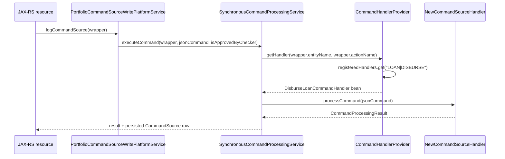

`CommandHandlerProvider` is the small Spring bean that turns a pair of strings — `(entity, action)` — into the concrete `NewCommandSourceHandler` that will execute the request. It is the only place where the dispatcher half of the command framework meets Spring's bean container. Everything upstream (resource → wrapper → processing service) knows only `"LOAN"` and `"DISBURSE"`; everything downstream (handler → write service) knows only the `JsonCommand`. The provider is what bridges the gap, and it does so with a `HashMap` populated once at startup.

This page walks the class line by line: how the registry is built, how lookups work, and what happens when the key is wrong.

<Info>
  The provider lives in `fineract-core` at
  `org.apache.fineract.commands.provider.CommandHandlerProvider`. It is a regular
  `@Component`, so it is auto-registered when `fineract-core` is on the
  classpath. The modular `fineract-command-*` starters use a different
  registration model (see `core/commands-framework`).
</Info>

## Class declaration

```java
@Component
@NoArgsConstructor
@Slf4j
public class CommandHandlerProvider implements ApplicationContextAware, InitializingBean {

    private final HashMap<String, String> registeredHandlers = new HashMap<>();
    private ApplicationContext applicationContext;
    // ...
}
```

A few choices to highlight:

- **`@Component`** — Spring instantiates a single instance per application context. There is one registry per Fineract instance.
- **`ApplicationContextAware`** — Spring injects the context via the `setApplicationContext` setter. The provider needs the context because it asks for beans by annotation in a separate phase from constructor injection.
- **`InitializingBean`** — the provider hooks `afterPropertiesSet()` to run its discovery logic after all `@Service` / `@Component` beans have been created but before any of them are used.
- **`HashMap<String, String>`** — the value stored is the **bean name**, not the bean itself. The provider re-resolves the bean from the context on every lookup. That keeps the registry tiny and side-steps any concerns about scoped beans.
- **`@NoArgsConstructor`** — Lombok provides the zero-arg constructor. There is no constructor-based DI: the only dependency, the application context, comes in through the `Aware` callback.

## Building the registry

The provider's startup work is one method:

```java
@Override
public void afterPropertiesSet() throws Exception {
    initializeHandlerRegistry();
}

private void initializeHandlerRegistry() {
    final String[] commandHandlerBeans = applicationContext.getBeanNamesForAnnotation(CommandType.class);
    if (ArrayUtils.isNotEmpty(commandHandlerBeans)) {
        for (final String commandHandlerName : commandHandlerBeans) {
            log.debug("Register command handler '{}' ...", commandHandlerName);
            final CommandType commandType = applicationContext.findAnnotationOnBean(commandHandlerName, CommandType.class);
            try {
                if (commandType != null) {
                    registeredHandlers.put(commandType.entity() + "|" + commandType.action(), commandHandlerName);
                } else {
                    log.error("Unable to register command handler '{}'!", commandHandlerName);
                }
            } catch (final Throwable th) {
                log.error("Unable to register command handler '{}'!", commandHandlerName, th);
            }
        }
    }
}
```

What this does, step by step:

<Steps>
  <Step title="Ask Spring for every bean carrying @CommandType">
    `applicationContext.getBeanNamesForAnnotation(CommandType.class)` returns the
    names of every bean whose class (or any annotation on its class) is meta-
    annotated with `@CommandType`. The lookup is against the bean factory's
    annotation index, so it is fast and runs once.
  </Step>
  <Step title="Read the annotation back">
    For each name, `findAnnotationOnBean(name, CommandType.class)` walks the
    bean's class hierarchy and returns the annotation instance. This is the
    safe API for proxied beans — `@Transactional` handlers are CGLIB-proxied, and
    reading the annotation directly off the proxy class would fail.
  </Step>
  <Step title="Register under the composite key">
    `registeredHandlers.put(entity + "|" + action, beanName)` stores the bean
    name. The separator is a hard-coded `"|"` — anything that does not appear
    in entity or action names would work, but this character is the one the
    code chose.
  </Step>
  <Step title="Swallow per-bean failures">
    Every iteration is wrapped in a `try { ... } catch (Throwable th)`. A broken
    handler logs an error and the loop continues. Boot does not abort because
    one module misbehaved.
  </Step>
</Steps>

The empty `if (ArrayUtils.isNotEmpty(commandHandlerBeans))` guard is defensive: if no beans declare `@CommandType` (an `fineract-core`-only deployment, for example), the provider still wires cleanly and `getHandler(...)` will throw on first use.

## Looking up a handler

The hot path is `getHandler(entity, action)`:

```java
public NewCommandSourceHandler getHandler(final String entity, final String action) {
    Preconditions.checkArgument(StringUtils.isNoneEmpty(entity), "An entity must be given!");
    Preconditions.checkArgument(StringUtils.isNoneEmpty(action), "An action must be given!");

    final String key = entity + "|" + action;
    if (!registeredHandlers.containsKey(key)) {
        throw new UnsupportedCommandException(key);
    }
    return (NewCommandSourceHandler) applicationContext.getBean(registeredHandlers.get(key));
}
```

Five lines of meaningful work:

1. **Validate inputs.** Guava `Preconditions` rejects null or empty entity/action strings with `IllegalArgumentException`. The processing service treats those as programmer errors, not user errors.
2. **Build the lookup key.** Same `entity + "|" + action` shape used at registration time.
3. **Miss the registry?** Throw `UnsupportedCommandException(key)`. The exception carries the full `ENTITY|ACTION` string in its message, which is what surfaces to the API caller.
4. **Hit the registry?** Pull the bean name out of the map and resolve it via `applicationContext.getBean(name)`.
5. **Cast and return.** The cast is unchecked, but it is safe because only `NewCommandSourceHandler`-implementing beans should ever carry `@CommandType`.

Because the bean is resolved on every call rather than cached, prototype-scoped handlers would get a fresh instance per request. In practice all handlers are singleton-scoped, so the lookup is constant-time.

### Why store the name and not the bean?

Storing the bean name keeps the provider independent of Spring's proxying behaviour. If a handler is later wrapped in a `@Transactional` proxy after `@PostConstruct` ordering, the cached reference would point at the unproxied target. Resolving by name on every call always returns the up-to-date public bean.

It also makes the registry trivially serialisable for debugging — the `registeredHandlers` map is just strings.

## The composite key shape

The registry is keyed by the string `entity + "|" + action`. A few worked examples:

| Wrapper input | Registry key | Resolved bean |
| --- | --- | --- |
| `entity = "LOAN", action = "DISBURSE"` | `LOAN|DISBURSE` | `disburseLoanCommandHandler` |
| `entity = "CLIENT", action = "CREATE"` | `CLIENT|CREATE` | `createClientCommandHandler` |
| `entity = "SAVINGSACCOUNT", action = "ACTIVATE"` | `SAVINGSACCOUNT|ACTIVATE` | `activateSavingsAccountCommandHandler` |
| `entity = "JOURNALENTRY", action = "REVERSE"` | `JOURNALENTRY|REVERSE` | `reverseJournalEntryCommandHandler` |
| `entity = "LOAN", action = "UNDO_REAGE"` | `LOAN|UNDO_REAGE` | `loanUndoReAgeCommandHandler` |

Two operational notes:

- **Case sensitivity.** Both halves of the key are case-sensitive `String` equality. The convention everywhere in Fineract is upper-case `ENTITY` and upper-case `ACTION`. A wrapper produced with the wrong case will trip `UnsupportedCommandException`.
- **Duplicate registration.** Two beans with the same `(entity, action)` will both attempt to `put` into the same key. The second wins silently — there is no warning logged. The Fineract convention is therefore exactly one handler per pair.

## UnsupportedCommandException

When the lookup misses, the provider throws:

```java
throw new UnsupportedCommandException(key);
```

`UnsupportedCommandException` lives at `org.apache.fineract.commands.exception.UnsupportedCommandException` and is one of the platform's standard `AbstractPlatformException`s. The framework's exception mapper turns it into an HTTP **403** response shaped like:

```json
{
    "developerMessage": "The command 'LOAN|FOO' is not supported.",
    "userMessage": "...",
    "httpStatusCode": "403",
    "defaultUserMessage": "The command 'LOAN|FOO' is not supported."
}
```

There is a single argument constructor that takes the key, so the caller never has to format the message manually. The provider chooses to send the composite key (`entity + "|" + action`) so an operator can grep for it in logs.

The same exception type is also thrown by `PortfolioCommandSourceWritePlatformServiceImpl#validateMakerCheckerTransaction` for two specific maker-checker mistakes — a missing maker user, and a same-user check — but the provider's use case is the simple "no handler registered" path.

## How the processing service uses it

The provider is injected wherever a `NewCommandSourceHandler` needs to be dispatched. The most common consumer is `SynchronousCommandProcessingService`:



The provider is consulted exactly once per command. The result of the lookup is not cached by the caller — the assumption is that the map lookup is cheap enough not to warrant another layer.

## Behaviour under load

A few things to know if you are profiling the dispatcher:

- **Map reads are unsynchronised.** The provider uses a plain `HashMap`, not a `ConcurrentHashMap`. This is safe because the map is only mutated during `afterPropertiesSet()`, which Spring runs serially during context refresh. Once startup completes the map is effectively immutable and concurrent reads are race-free.
- **Bean resolution is concurrent-safe.** `ApplicationContext#getBean(name)` is thread-safe by contract; for singleton-scoped beans (which all handlers are) it returns the cached instance from the bean factory.
- **No reflection on the hot path.** All reflection (`findAnnotationOnBean`) is paid once at startup. Runtime dispatch is a string concatenation, a hash lookup, and a singleton resolve.

## Testing patterns

Two patterns recur in the test suite:

- **Spring-context tests** use the real `CommandHandlerProvider` and add stub handlers as beans. They check that the registry resolves the expected bean and that an unknown key throws `UnsupportedCommandException`.
- **Unit tests** stub the provider directly. Most callers depend on the interface-free `CommandHandlerProvider` class, but the surface area used is small (`getHandler(entity, action)`), so a Mockito stub returning a handcrafted `NewCommandSourceHandler` is enough.

There is no public `register(entity, action, handler)` API. Tests that need a custom handler add it as a `@Bean` in their test configuration and let the provider's normal discovery wire it in.

## Common failure modes

| Symptom | Likely cause |
| --- | --- |
| `UnsupportedCommandException: ENTITY|ACTION` on a brand-new command | Handler class is missing `@CommandType`, the annotation values do not match the wrapper, or the class is not a Spring bean. |
| Handler resolves to the wrong bean | Two handlers declare the same `(entity, action)`. The last one wins. Rename one and update the wrapper. |
| `IllegalArgumentException: "An entity must be given!"` | Upstream code constructed a `CommandWrapper` with a null or empty entity name. Inspect the JAX-RS resource that built the wrapper. |
| Registry is empty in tests | `fineract-core` is on the classpath but the handler module is not. Add the dependency or register a test handler bean. |
| Annotation present but not picked up | Bean is not declared `@Service` / `@Component`, so Spring never instantiates it. `getBeanNamesForAnnotation` only sees beans the context already knows about. |

## A worked diagnostic

Suppose a deployment starts throwing `UnsupportedCommandException: LOAN|FOREIGNTRANSFER` after a release. The triage steps are:

<Steps>
  <Step title="Confirm the wrapper">
    Find the JAX-RS resource that built the wrapper. Look for
    `CommandWrapperBuilder...withActionName("FOREIGNTRANSFER")` and confirm the
    case and spelling match what the registry expects.
  </Step>
  <Step title="Look for the handler bean">
    Search the codebase for `@CommandType(entity = "LOAN", action = "FOREIGNTRANSFER")`.
    If nothing matches, the handler is missing — add a class implementing
    `NewCommandSourceHandler` and annotated correctly.
  </Step>
  <Step title="Confirm it is on the classpath">
    Spring only discovers beans whose package is component-scanned. Make sure
    the new module is a dependency of `fineract-provider` and that its base
    package is scanned (typically `org.apache.fineract`).
  </Step>
  <Step title="Confirm the annotation is retained">
    Defensive check: the annotation has `RetentionPolicy.RUNTIME`. Confirm no
    annotation processor or build step is stripping it.
  </Step>
  <Step title="Restart and look for the registration log">
    On startup, the provider logs at `DEBUG`:
    `Register command handler 'foreignTransferLoanCommandHandler' ...`.
    Enable that logger to confirm the bean is being seen.
  </Step>
</Steps>

If the log message appears but the lookup still misses, double-check the case — the registry is case-sensitive.

## Companion services

The provider is one of three services that together implement classical dispatch. The others are:

| Bean | Role |
| --- | --- |
| `SynchronousCommandProcessingService` | Owns the audit-row lifecycle, manages idempotency, calls the provider. |
| `CommandHandlerProvider` | Resolves `(entity, action)` to a handler bean. |
| `CommandSourceService` | Persists and updates the `CommandSource` row in its own transaction. |

The provider is the most boring of the three, intentionally. Every line of code beyond the small registry adds complexity to the dispatch hot path; keeping the provider mechanical makes the dispatch story easy to reason about.

## Related pages

- `commands/command-handlers` — what a `NewCommandSourceHandler` looks like and how `@CommandType` is applied.
- `commands/command-source` — the audit row written before the provider is invoked.
- `core/commands-framework` — the higher-level tour of the dispatch pipeline.
- `commands/overview` — end-to-end pipeline view, with the provider in context.
