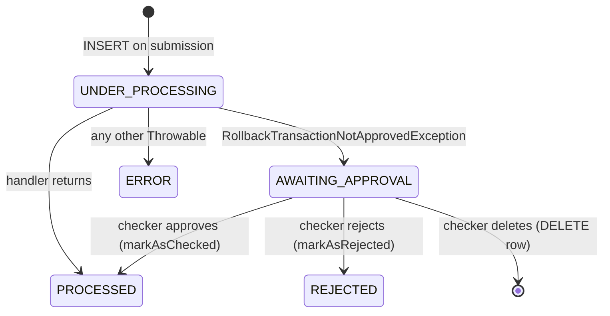

Every non-read API call in Apache Fineract leaves exactly one row in `m_portfolio_command_source`. That row — the **command source** — is the single source of truth for who asked for what, when it ran, whether a checker has approved it, and what the platform returned. Audit search, the maker-checker inbox, idempotent replays, and the rollback path that surfaces `RollbackTransactionNotApprovedException` all read and write the same row.

The JPA entity is `org.apache.fineract.commands.domain.CommandSource`, defined in `fineract-core/src/main/java/org/apache/fineract/commands/domain/CommandSource.java`. It extends `AbstractPersistableCustom<Long>` and is annotated `@Table(name = "m_portfolio_command_source")`. Lombok generates the no-args/all-args constructors, a builder, and getters/setters. This page walks the columns, the status enum, the helper methods used by the maker-checker flow, and the indexes that keep audit queries fast.

<Info>
  The wire-level row produced by a synchronous request is written by
  `SynchronousCommandProcessingService` through `CommandSourceService`. Most of
  the columns documented below are populated up-front from a `CommandWrapper`
  and a `JsonCommand`; the resource-id columns are filled in after the handler
  returns, via `updateForAudit(CommandProcessingResult)`.
</Info>

## Class shape

```java
@Entity
@Getter
@Setter
@Builder
@NoArgsConstructor
@AllArgsConstructor
@Table(name = "m_portfolio_command_source")
public class CommandSource extends AbstractPersistableCustom<Long> {
    // ... columns ...
}
```

`AbstractPersistableCustom<Long>` supplies the auto-generated `id` primary key. Everything else is declared as a `@Column` on the entity. The class is mutable so that the processing service can update status, result, and resource ids inside the same transaction.

## Column reference

The columns split into five groups: classification, scope, payload, audit, and result.

### Classification (what was asked)

| Column | Java field | Type | Purpose |
| --- | --- | --- | --- |
| `action_name` | `actionName` | `VARCHAR(100)` | Verb half of the command, e.g. `DISBURSE`, `CREATE`, `APPROVE`. |
| `entity_name` | `entityName` | `VARCHAR(100)` | Noun half, e.g. `LOAN`, `CLIENT`, `SAVINGSACCOUNT`. |
| `api_get_url` | `resourceGetUrl` | `VARCHAR(100)` | The canonical GET URL that would re-read the resource, e.g. `loans`. |
| `job_name` | `jobName` | `VARCHAR` | Set when the command was issued from a Spring Batch job. |

The pair `(entity_name, action_name)` is what `CommandHandlerProvider` keys its in-memory registry by, and it is also the basis for the permission code returned by `CommandSource#getPermissionCode()`:

```java
public String getPermissionCode() {
    return this.actionName + "_" + this.entityName;
}
```

So an audit row with `actionName = "DISBURSE"`, `entityName = "LOAN"` corresponds to permission `DISBURSE_LOAN` (and to checker permission `CHECKER_DISBURSE_LOAN`).

### Scope (where the change lands)

| Column | Java field | Notes |
| --- | --- | --- |
| `office_id` | `officeId` | Used for data scoping in audit queries. |
| `group_id` | `groupId` | Populated for group-level commands. |
| `client_id` | `clientId` | Populated for client-level commands. |
| `loan_id` | `loanId` | Populated for loan-level commands. |
| `savings_account_id` | `savingsId` | Populated for savings-account commands. |
| `product_id` | `productId` | Populated for product configuration. |
| `creditbureau_id` | `creditBureauId` | Optional credit bureau context. |
| `organisation_creditbureau_id` | `organisationCreditBureauId` | Optional. |

These columns are how the maker-checker and audit APIs perform data-scope filtering — for example a branch manager only sees audit rows whose `office_id` is in their data scope. They are also why `MakercheckersApiResource#getExtraCriteria` accepts `officeId`, `groupId`, `clientId`, `loanId`, and `savingsAccountId` as filters.

### Payload (what to do)

| Column | Java field | Notes |
| --- | --- | --- |
| `command_as_json` | `commandAsJson` | The original request body, truncated to 1000 chars by the column length. |
| `resource_id` | `resourceId` | The id of the affected resource (often filled in after handler return). |
| `subresource_id` | `subResourceId` | Used for nested resources (e.g. a charge under a loan). |
| `resource_external_id` | `resourceExternalId` | `ExternalId` value-object form of the same id. |
| `subresource_external_id` | `subResourceExternalId` | `ExternalId` for the sub-resource. |
| `loan_external_id` | `loanExternalId` | External id of the parent loan, when applicable. |
| `transaction_id` | `transactionId` | Set for transaction-level operations. |

### Audit (who, when, by whom)

| Column | Java field | Notes |
| --- | --- | --- |
| `maker_id` | `maker` (`AppUser`, `@ManyToOne`) | The user who submitted the command. **Not null.** |
| `made_on_date_utc` | `madeOnDate` (`OffsetDateTime`) | Submission timestamp, UTC. **Not null.** |
| `checker_id` | `checker` (`AppUser`, `@ManyToOne`) | Set when a checker approves or rejects. |
| `checked_on_date_utc` | `checkedOnDate` (`OffsetDateTime`) | Checker action timestamp. |
| `client_ip` | `clientIp` | Captured at submission via `IpAddressUtils.getClientIp()`. |
| `is_sanitized` | `sanitized` | True when sensitive fields in `command_as_json` were redacted. |

The legacy `made_on_date` / `checked_on_date` (no zone) columns are intentionally kept by the entity comment but no longer mapped — they exist only so old data continues to be readable. The `made_on_date_utc` / `checked_on_date_utc` columns are what current code writes.

### Result and idempotency

| Column | Java field | Notes |
| --- | --- | --- |
| `status` | `status` (`Integer`) | Integer form of `CommandProcessingResultType` — see below. |
| `result` | `result` | The serialised `CommandProcessingResult` JSON. |
| `result_status_code` | `resultStatusCode` | The HTTP status code returned to the caller. |
| `idempotency_key` | `idempotencyKey` (`VARCHAR(50)`) | Header value or a generated UUID. |

The `result` + `result_status_code` columns are populated by `IdempotencyStoreFilter` through `IdempotencyStoreHelper.storeCommandResult(...)` once the response body has been captured.

## The status enum

`CommandSource.status` is a plain `Integer` column, but reads always go through:

```java
public CommandProcessingResultType getStatusEnum() {
    return CommandProcessingResultType.fromInt(status);
}

public void setStatus(@NotNull CommandProcessingResultType status) {
    this.status = status.getValue();
}
```

`CommandProcessingResultType` (in `org.apache.fineract.commands.domain`) is a six-valued enum:

| Ordinal value | Constant | Localisation code | Meaning |
| --- | --- | --- | --- |
| `0` | `INVALID` | `commandProcessingResultType.invalid` | Reserved fallback for unknown integers. |
| `1` | `PROCESSED` | `commandProcessingResultType.processed` | Handler returned normally, the row is final. |
| `2` | `AWAITING_APPROVAL` | `commandProcessingResultType.awaiting.approval` | Handler threw `RollbackTransactionNotApprovedException`; row is in the maker-checker inbox. |
| `3` | `REJECTED` | `commandProcessingResultType.rejected` | A checker rejected the awaiting row. |
| `4` | `UNDER_PROCESSING` | `commandProcessingResultType.underProcessing` | Row was persisted before the handler ran; visible during async processing. |
| `5` | `ERROR` | `commandProcessingResultType.error` | Handler threw and the exception bubbled out. |

The enum also exposes convenience predicates `isProcessed()`, `isAwaitingApproval()`, and `isRejected()`, which `CommandSource` re-exports as `isProcessed()`, `isAwaitingApproval()`, and `isRejected()`.

### State transitions



`PROCESSED`, `REJECTED`, and `ERROR` are terminal. `AWAITING_APPROVAL` rows are the ones surfaced by `GET /v1/makercheckers`; once they transition out they disappear from that inbox.

## Lifecycle helpers

`CommandSource` exposes a small set of methods that the processing services call instead of mutating columns directly:

```java
public static CommandSource fullEntryFrom(
        CommandWrapper wrapper,
        JsonCommand command,
        AppUser maker,
        String idempotencyKey,
        Integer status,
        boolean sanitized) { ... }

public void markAsAwaitingApproval() { setStatus(AWAITING_APPROVAL); }
public void markAsChecked(AppUser checker)   { ... setStatus(PROCESSED); }
public void markAsRejected(AppUser checker)  { ... setStatus(REJECTED); }
public void updateForAudit(CommandProcessingResult result) { ... }
```

- `fullEntryFrom(...)` is the static factory used at submission time. It copies the wrapper's `actionName`/`entityName`/`href`, the parsed `JsonCommand`'s ids (`clientId`, `loanId`, `savingsId`, `productId`, `transactionId`, `creditBureauId`, …), captures the client IP via `IpAddressUtils.getClientIp()`, and stamps `made_on_date_utc` via `DateUtils.getAuditOffsetDateTime()`.
- `markAsChecked(checker)` stamps `checker_id` and `checked_on_date_utc`, then flips status to `PROCESSED`. `isChecked()` is true only when both `checker != null` **and** the row is processed.
- `markAsRejected(checker)` is the symmetric reject path.
- `updateForAudit(result)` is called after the handler returns, copying back office/group/client/loan/savings/product/transaction/resource ids from the `CommandProcessingResult` so the audit row reflects the final state of the world (e.g. a freshly assigned loan id when the command was `CREATE_LOAN`).

## How rows are written

The full submission write happens inside `SynchronousCommandProcessingService`. The relevant call chain is:

<Steps>
  <Step title="Build a CommandSource from the wrapper">
    `CommandSource.fullEntryFrom(wrapper, command, maker, idempotencyKey,
    UNDER_PROCESSING.getValue(), sanitized)` produces a fully populated, unsaved
    instance.
  </Step>
  <Step title="Persist with UNDER_PROCESSING">
    `CommandSourceService` saves the row inside its own transaction so that even
    a subsequent rollback of the business transaction leaves a visible audit
    breadcrumb.
  </Step>
  <Step title="Run the handler">
    The handler — looked up by `CommandHandlerProvider` — executes and returns
    either a `CommandProcessingResult` or throws.
  </Step>
  <Step title="Mutate the row to its final state">
    On success: `updateForAudit(result)` + `setStatus(PROCESSED)`. On
    `RollbackTransactionNotApprovedException`:
    `setStatus(AWAITING_APPROVAL)`. On any other throwable:
    `setStatus(ERROR)`.
  </Step>
  <Step title="Save the response body">
    `IdempotencyStoreFilter` captures the response, and
    `IdempotencyStoreHelper.storeCommandResult(status, body, commandId)` writes
    `result` and `result_status_code` so replays can serve from cache.
  </Step>
</Steps>

## Indexes and unique constraints

The base `m_portfolio_command_source` table is declared in `0001_initial_schema.xml`. The columns used by every audit search — `entity_name`, `action_name`, and the idempotency key — are covered by an explicit composite index and a unique constraint added in `0061_add_idempotency_key_to_command_source.xml`:

```xml
<addUniqueConstraint
    columnNames="action_name, entity_name, idempotency_key"
    constraintName="UNIQUE_PORTFOLIO_COMMAND_SOURCE"
    tableName="m_portfolio_command_source"/>

<createIndex indexName="portfolio_command_source_composite_index"
             tableName="m_portfolio_command_source">
    <column name="action_name"/>
    <column name="entity_name"/>
    <column name="idempotency_key"/>
</createIndex>
```

Two things matter here:

1. **The unique constraint is what makes idempotency safe.** A retried request that carries the same `Idempotency-Key` for the same `(action_name, entity_name)` cannot create a second row. The retried insert collides on the unique key, and the processing service reads the existing row and surfaces it as one of the three `IdempotentCommand*Exception`s instead of running the handler again.
2. **The covering index serves the audit and maker-checker queries.** `MakercheckersApiResource#getExtraCriteria` and `AuditsApiResource#getExtraCriteria` both filter on `entity_name` and `action_name` first; the leading columns of the index match those query shapes.

A later Postgres change set (`id="3"` in the same file) also adds `NOT NULL` on `idempotency_key`. From that point on, every row in the table carries an idempotency key — generated by `IdempotencyKeyGenerator` when the request did not supply one — so the unique constraint is always meaningful.

## Reading rows back

The entity is loaded by `CommandSourceRepository` (a standard Spring Data `JpaRepository<CommandSource, Long>`). The maker-checker write path uses `findById` directly, while the audit read path is JDBC-based and lives in `AuditReadPlatformServiceImpl` (in `fineract-provider`) for performance — it returns the lighter `AuditData` DTO instead of hydrating the full JPA graph.

## Sample row

A successful `POST /loans/123?command=disburse` lands a row roughly like this in `m_portfolio_command_source`:

| Column | Value |
| --- | --- |
| `id` | `9921` |
| `action_name` | `DISBURSE` |
| `entity_name` | `LOAN` |
| `office_id` | `1` |
| `client_id` | `42` |
| `loan_id` | `123` |
| `api_get_url` | `loans` |
| `resource_id` | `123` |
| `command_as_json` | `{"transactionAmount": 5000, "actualDisbursementDate": "20 May 2024", ...}` |
| `maker_id` | `7` (`branch.officer`) |
| `made_on_date_utc` | `2024-05-20T07:14:02Z` |
| `checker_id` | `8` (`branch.manager`) |
| `checked_on_date_utc` | `2024-05-20T07:17:36Z` |
| `status` | `1` (`PROCESSED`) |
| `idempotency_key` | `4f7b8b0c-...` |
| `result` | `{"officeId": 1, "clientId": 42, "loanId": 123, "resourceId": 123, ...}` |
| `result_status_code` | `200` |
| `client_ip` | `10.0.1.42` |

The `result` and `result_status_code` columns are written by `IdempotencyStoreHelper.storeCommandResult(...)` — see `commands/idempotency` — which is why a fresh `POST` shows them populated only after the response has been buffered and flushed.

## What never lives here

A few common questions about the table:

- **The full HTTP request is not stored.** Headers, query parameters, and the original Content-Type are not part of the row. Only the JSON body (and only up to 1000 characters) is preserved as `command_as_json`.
- **The serialized response can be larger than the request.** `result` is `TEXT`-typed at the schema level and is not bounded the same way as `command_as_json`. For very large responses, consider whether you want to disable idempotency caching on a given endpoint.
- **There is no tenant column.** Tenant separation comes from running against the per-tenant data source — every tenant database has its own `m_portfolio_command_source`. The classical pipeline does not multiplex tenants inside a single audit table.

## Related pages

- `commands/overview` — how an HTTP request becomes a `CommandSource`.
- `commands/makercheckers` — the API that consumes `AWAITING_APPROVAL` rows.
- `commands/audits` — search and history over `m_portfolio_command_source`.
- `commands/idempotency` — how the unique constraint underwrites the
  `Idempotency-Key` header.
