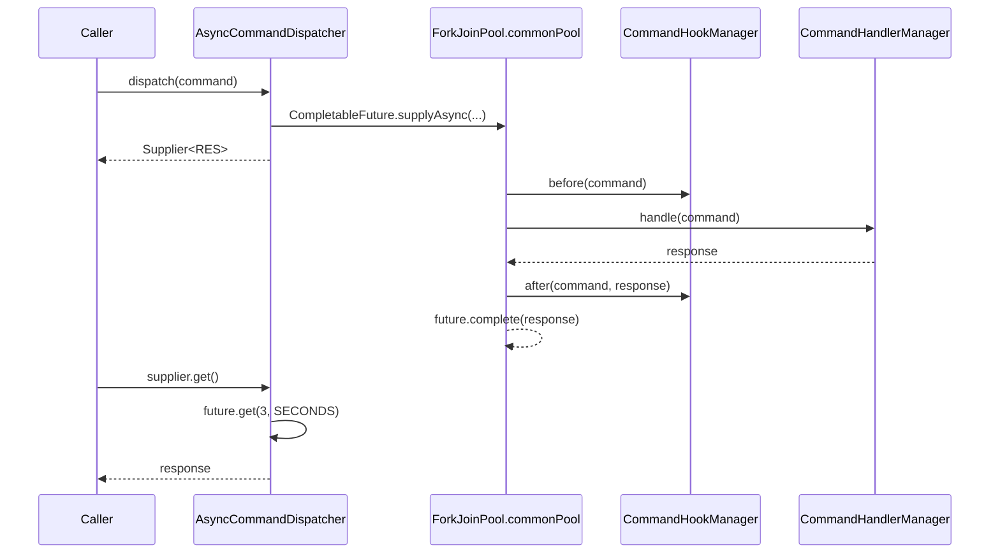
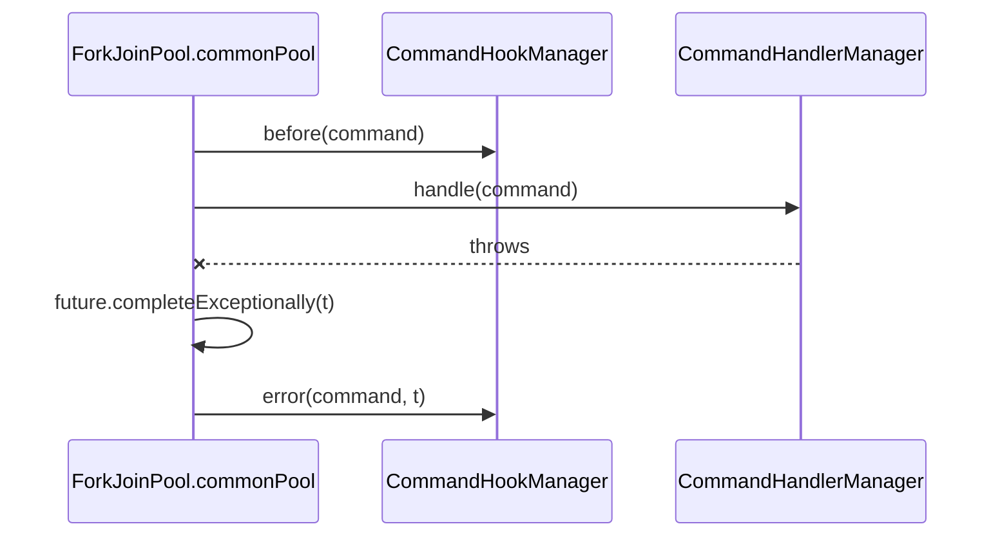

`fineract-command-async` is one of the opt-in Spring Boot starters that re-implement the command dispatch contract on the modular `org.apache.fineract.command.core` API. It runs a `Command<REQ>` on the JDK common `ForkJoinPool` via `CompletableFuture.supplyAsync`, with a bounded wait on the result. It is the smallest of the four `fineract-command-*` modules — three Java files — and a good way to understand the shape they share before looking at the Disruptor or JDBC variants.

This page documents the module layout, the `AsyncCommandDispatcher` implementation, the `AsyncCommandProperties` knobs, and how the starter is conditionally activated.

<Info>
  The classes carry an explicit `// TODO: WIP - not ready yet for prime time`
  comment in source. Treat this module as a building block — useful for
  experimentation and benchmarking, not as a production replacement for the
  classical `SynchronousCommandProcessingService` pipeline.
</Info>

## Layout

The module is small. Under `fineract-command-async/src/main/java/org/apache/fineract/command/async`:

| File | Purpose |
| --- | --- |
| `AsyncCommandProperties.java` | `@ConfigurationProperties("fineract.command.async")` for `enabled` and `timeout`. |
| `implementation/AsyncCommandDispatcher.java` | `CommandDispatcher` implementation that wraps `CompletableFuture.supplyAsync`. |
| `starter/AsyncCommandAutoConfiguration.java` | Spring Boot `@AutoConfiguration` that activates the module when `fineract.command.async.enabled=true`. |

The shared API the dispatcher depends on (`Command`, `CommandDispatcher`, `CommandHandlerManager`, `CommandHookManager`) lives in `org.apache.fineract.command.core` and is provided by the `fineract-command-core` module. The async module brings no transport, persistence, or hook — it only provides one dispatcher implementation.

## Properties

```java
@Builder
@Data
@NoArgsConstructor
@AllArgsConstructor
@FieldNameConstants
@ConfigurationProperties(prefix = "fineract.command.async")
public final class AsyncCommandProperties implements Serializable {

    @Builder.Default
    private Boolean enabled = false;

    @Builder.Default
    private Duration timeout = Duration.ofSeconds(3L);
}
```

Two settings:

| Property | Default | Purpose |
| --- | --- | --- |
| `fineract.command.async.enabled` | `false` | Master switch. Both the auto-configuration and the dispatcher are gated on this property. |
| `fineract.command.async.timeout` | `PT3S` (3 seconds) | Maximum time the returned `Supplier<RES>` will block waiting for the future to complete. |

`timeout` is a Spring `Duration`, so any of these are valid in `application.properties`:

```
fineract.command.async.enabled=true
fineract.command.async.timeout=5s
# or
fineract.command.async.timeout=PT500MS
```

<Info>
  The current dispatcher source still uses a hard-coded
  `future.get(3, SECONDS)` (see the `// TODO: make this configurable` comment),
  so changing the property only affects future revisions. Track the linked TODO
  before relying on `timeout` in production.
</Info>

## The dispatcher

`AsyncCommandDispatcher` is the entire transport:

```java
@Slf4j
@RequiredArgsConstructor
@Component
@ConditionalOnProperty(value = "fineract.command.async.enabled", havingValue = "true")
public class AsyncCommandDispatcher implements CommandDispatcher {

    private final CommandHandlerManager handlerManager;
    private final CommandHookManager hookManager;

    @Override
    public <REQ, RES> Supplier<RES> dispatch(final Command<REQ> command) {
        requireNonNull(command, "Command must not be null");

        CompletableFuture<RES> future = CompletableFuture.supplyAsync(() -> {
            hookManager.before(command);

            RES response = handlerManager.handle(command);

            hookManager.after(command, response);

            return response;
        }).whenComplete((response, t) -> {
            if (t != null) {
                hookManager.error(command, t);
            }
        });

        return () -> {
            try {
                // TODO: make this configurable
                return future.get(3, SECONDS);
            } catch (InterruptedException | ExecutionException | TimeoutException e) {
                throw new RuntimeException(e);
            }
        };
    }
}
```

Step by step:

<Steps>
  <Step title="Null-check the command">
    `requireNonNull(command, "Command must not be null")` rejects null input
    eagerly so the failure happens on the calling thread, not inside the worker.
  </Step>
  <Step title="Submit on the common pool">
    `CompletableFuture.supplyAsync(...)` runs the supplied lambda on the JDK
    common `ForkJoinPool`. The dispatcher does not configure its own executor,
    so command throughput shares CPU with anything else on the common pool.
  </Step>
  <Step title="Call hooks around the handler">
    Inside the lambda: `hookManager.before(command)` first, then
    `handlerManager.handle(command)` to invoke the registered handler, then
    `hookManager.after(command, response)`.
  </Step>
  <Step title="Forward exceptions to the error hook">
    `whenComplete((response, t) -> { if (t != null) hookManager.error(command, t); })`
    fires when the future completes with an exception. The error hook gets the
    same `command` instance plus the throwable; the future itself is left in its
    completed-exceptionally state so the caller's `get` rethrows.
  </Step>
  <Step title="Return a Supplier that joins with a timeout">
    The dispatcher does not return the future directly. It hands back a
    `Supplier<RES>` that calls `future.get(3, SECONDS)` on first invocation and
    converts any failure into an unchecked `RuntimeException`. Callers can
    therefore use `dispatcher.dispatch(cmd).get()` synchronously and ignore the
    fact that work is happening on another thread.
  </Step>
</Steps>

Hook ordering matches the classical dispatcher: `before` → handler → `after` on success, or `before` → handler-throws → `error` on failure.

## Lifecycle



If the handler throws:



`hookManager.after(...)` is **not** called on the failure path — the lambda body bails out before reaching it. Only the `error` hook fires, and only after the future has already been marked exceptional.

## Auto-configuration

The starter wiring is one class:

```java
@AutoConfiguration
@EnableConfigurationProperties(AsyncCommandProperties.class)
@ComponentScan("org.apache.fineract.command.async.implementation")
@ConditionalOnProperty(value = "fineract.command.async.enabled", havingValue = "true")
public class AsyncCommandAutoConfiguration {}
```

Three things happen here:

- **`@AutoConfiguration`** registers the configuration so Spring Boot picks it up via the auto-configuration import file shipped in `META-INF/spring/org.springframework.boot.autoconfigure.AutoConfiguration.imports`. No `@EnableAutoConfiguration` user-side hint is needed.
- **`@EnableConfigurationProperties`** binds the `fineract.command.async.*` keys to the `AsyncCommandProperties` bean.
- **`@ComponentScan("org.apache.fineract.command.async.implementation")`** scans the dispatcher package, picking up `AsyncCommandDispatcher` (and any future package siblings).
- **`@ConditionalOnProperty`** makes the entire auto-configuration a no-op unless `fineract.command.async.enabled=true`. The dispatcher itself also carries the same condition for belt-and-braces protection.

The conditional means the safe default is "off": adding the JAR to the classpath without setting the property leaves the application untouched. Flip the property to opt in.

## Choosing this dispatcher

The async dispatcher is the right choice when:

- **You want non-blocking call sites.** Holding the response as a `Supplier<RES>` lets the caller submit several commands before joining on any of them. (In practice the current implementation joins inside the supplier, so the benefit is small until the joins themselves become asynchronous.)
- **You need quick failure for slow handlers.** The bounded `future.get(3, SECONDS)` gives the caller a `TimeoutException` instead of letting a runaway handler block the request thread indefinitely.
- **You are benchmarking against the Disruptor path.** Side-by-side comparisons of `AsyncCommandDispatcher` and `DisruptorCommandDispatcher` are useful when tuning for throughput.

Reach for `fineract-command-disruptor` instead if you need a fixed-size ring buffer and a dedicated daemon consumer thread; reach for the classical `SynchronousCommandProcessingService` for the audited, maker-checker-aware production path.

## Side effects and limitations

A few things to keep in mind before enabling this in a live deployment:

- **The JDK common pool is shared.** Any work that already runs on `ForkJoinPool.commonPool` competes with command dispatch. For predictable latency, replace `supplyAsync(lambda)` with `supplyAsync(lambda, executor)` and configure a dedicated executor.
- **No transactional propagation.** Spring's `@Transactional` bound to the calling thread does not follow `supplyAsync`. Handlers that need a transaction must open one themselves (typically by delegating to a `@Transactional` service inside `CommandHandlerManager#handle`).
- **MDC and SecurityContext are not propagated.** Logging context and the authenticated principal are thread-locals; they do not cross into the worker thread without explicit forwarding. Hook implementations that depend on either must capture them at submission time.
- **The hard-coded 3-second timeout is currently authoritative.** Even when `fineract.command.async.timeout` is set, the dispatcher's own `future.get(3, SECONDS)` is what blocks. The property is the configurable knob the TODO points at.

## Testing pattern

The bundled `TestConfiguration` under `fineract-command-async/src/test/java` enables the feature and registers stub `CommandHandlerManager` / `CommandHookManager` beans, then exercises `AsyncCommandDispatcher#dispatch` against in-memory commands. The shape of the tests is:

```java
Supplier<String> supplier = dispatcher.dispatch(new TestCommand("input"));
assertThat(supplier.get()).isEqualTo("expected");
verify(hookManager).before(any());
verify(hookManager).after(any(), eq("expected"));
verify(hookManager, never()).error(any(), any());
```

Switching the handler to throw and re-running asserts the symmetric `error` path. The tests are deliberately small — the dispatcher's surface area is two method calls and a future.

## Related pages

- `core/commands-framework` — the shared `command.core` API (`Command`,
  `CommandDispatcher`, `CommandHandlerManager`, `CommandHookManager`) the module
  depends on.
- `commands/commands-disruptor` — the higher-throughput alternative based on an
  LMAX Disruptor ring buffer.
- `commands/commands-jdbc` — the persistence sink that pairs with either
  dispatcher.
- `commands/commands-audit-module` — the hook implementation that records
  state transitions through the dispatcher.
