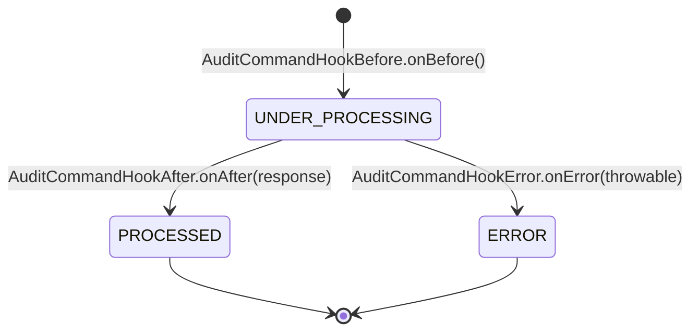
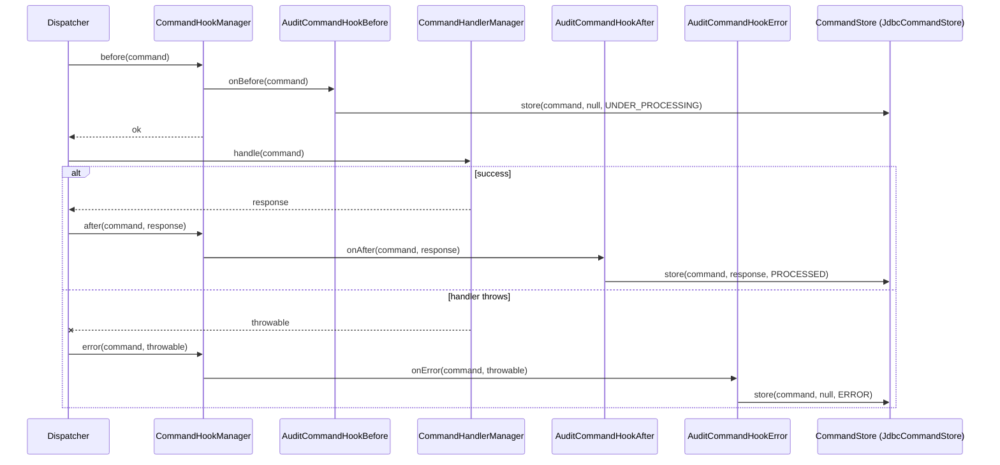

`fineract-command-audit` is the smallest module in the modular command stack. It contributes three `Command*Hook` beans — one for each transition — that write the command's lifecycle into the configured `CommandStore`. When `fineract-command-jdbc` is also enabled, the result is a row-by-row history of every command in `m_command`: an `UNDER_PROCESSING` insert before the handler runs, then either a `PROCESSED` update with the response or an `ERROR` update with the exception message.

This page walks the three hook implementations, the order constants they use, the property switches that turn them on, and the state diagram they collectively produce.

<Info>
  The hooks call `CommandStore` but do not implement it. Pair this module with
  `fineract-command-jdbc` for durable persistence, or supply your own
  `CommandStore` bean to redirect the writes elsewhere. See `commands/commands-jdbc`
  for the database side of the story.
</Info>

## Layout

Under `fineract-command-audit/src/main/java/org/apache/fineract/command/audit`:

| File | Purpose |
| --- | --- |
| `AuditCommandConstants.java` | The three `@Order` values used by the hooks. |
| `AuditCommandProperties.java` | `@ConfigurationProperties("fineract.command.audit")` — single `enabled` flag. |
| `hook/AuditCommandHookBefore.java` | `CommandHookBefore<Object>` — writes `UNDER_PROCESSING`. |
| `hook/AuditCommandHookAfter.java` | `CommandHookAfter<Object, Object>` — writes `PROCESSED` with the response. |
| `hook/AuditCommandHookError.java` | `CommandHookError<Object>` — writes `ERROR` with the throwable message. |
| `starter/AuditCommandAutoConfiguration.java` | `@AutoConfiguration` that turns the module on with `fineract.command.audit.enabled=true`. |

## Properties

```java
@ConfigurationProperties(prefix = "fineract.command.audit")
public final class AuditCommandProperties implements Serializable {

    @Builder.Default
    private Boolean enabled = false;
}
```

A single property turns the module on:

| Property | Default | Purpose |
| --- | --- | --- |
| `fineract.command.audit.enabled` | `false` | Activates the auto-configuration and the component scan. |

Each individual hook is gated further by a per-hook property — see the next section.

## The order constants

All three hooks share the same `@Order`:

```java
public final class AuditCommandConstants {

    private AuditCommandConstants() {}

    public static final int COMMAND_HOOK_AUDIT_BEFORE = 20;
    public static final int COMMAND_HOOK_AUDIT_AFTER  = 20;
    public static final int COMMAND_HOOK_AUDIT_ERROR  = 20;
}
```

`@Order(20)` reserves a slot in the hook ordering for the audit step. Other modules that contribute hooks should pick a lower number to run before audit (closer to the handler) and a higher number to run after (further from the handler). The constants are exposed publicly so a custom hook can intentionally bracket the audit step: `@Order(COMMAND_HOOK_AUDIT_BEFORE - 1)` runs immediately before, `@Order(COMMAND_HOOK_AUDIT_AFTER + 1)` runs immediately after.

The same number `20` for all three slots is deliberate: each set of hooks (`before`, `after`, `error`) is ordered independently, so there is no collision.

## The before hook

`AuditCommandHookBefore` writes the `UNDER_PROCESSING` row:

```java
@Slf4j
@RequiredArgsConstructor
@Component
@Order(COMMAND_HOOK_AUDIT_BEFORE)
@ConditionalOnProperty(value = "fineract.command.hooks.audit-pre", havingValue = "true")
final class AuditCommandHookBefore implements CommandHookBefore<Object> {

    private final CommandStore store;

    @Override
    public void onBefore(Command<Object> command) {
        final var now = Instant.now();

        command.setExecutedByUsername(command.getInitiatedByUsername());
        command.setUpdatedAt(now);
        command.setExecutedAt(now);

        store.store(command, null, UNDER_PROCESSING);
    }
}
```

Three notable behaviours:

- **`@ConditionalOnProperty("fineract.command.hooks.audit-pre")`**. The before hook is gated independently of the module switch. Set `fineract.command.hooks.audit-pre=true` to enable it.
- **Initial actor stamping.** The hook stamps `executed_by_username = initiated_by_username` so the row carries a non-null executor from the start. If a later approval step changes the actor, the `approved_by_username` / `rejected_by_username` columns will record that separately.
- **Timestamps.** `updatedAt` and `executedAt` are both set to `Instant.now()`. The `created_at` column is left to the mapper / Spring Data JDBC defaults — the before hook only writes mutable fields.

The store call is `store.store(command, null, UNDER_PROCESSING)`: the response argument is `null` because the handler has not run yet, and the state is forced to `UNDER_PROCESSING`.

### Why `<Object>`?

`CommandHookBefore<Object>` means the hook is registered for **any** command request type. The store call boxes the command through `CommandStore#store(Command<?>, Object, CommandState)`, which is itself untyped on payload. That makes the audit hook generic — it does not care what the request looks like, only that it has the standard `idempotencyKey`, timestamps, and actor fields.

## The after hook

`AuditCommandHookAfter` transitions the row to `PROCESSED` and stores the response:

```java
@Slf4j
@RequiredArgsConstructor
@Component
@Order(COMMAND_HOOK_AUDIT_AFTER)
@ConditionalOnProperty(value = "fineract.command.hooks.audit-post", havingValue = "true")
final class AuditCommandHookAfter implements CommandHookAfter<Object, Object> {

    private final CommandStore store;

    @Override
    public void onAfter(Command<Object> command, Object response) {
        final var now = Instant.now();

        command.setExecutedByUsername(command.getInitiatedByUsername());
        command.setUpdatedAt(now);
        command.setExecutedAt(now);

        store.store(command, response, PROCESSED);
    }
}
```

Same shape as the before hook, but with two differences:

- **Gating property is `fineract.command.hooks.audit-post`.** Operators can enable before-only auditing (state inserts) without paying the cost of storing the response, or after-only (response cache, no `UNDER_PROCESSING` row).
- **The response is passed to the store.** `JdbcCommandStore` maps it to the `response` JSON column. If the response is `null` — for example a fire-and-forget command — the mapper writes a null `response` column.

The actor stamping is repeated even though it was already set in the before hook. That keeps the after hook self-contained: it remains correct whether or not the before hook ran.

## The error hook

`AuditCommandHookError` writes the failure breadcrumb:

```java
@Slf4j
@RequiredArgsConstructor
@Component
@Order(COMMAND_HOOK_AUDIT_ERROR)
@ConditionalOnProperty(value = "fineract.command.hooks.audit-error", havingValue = "true")
final class AuditCommandHookError implements CommandHookError<Object> {

    private final CommandStore store;

    @Override
    public void onError(Command<Object> command, Throwable error) {
        final var now = Instant.now();

        command.setError(error.getMessage());
        command.setUpdatedAt(now);
        command.setExecutedAt(now);

        store.store(command, null, ERROR);
    }
}
```

Differences from the success hooks:

- **No response stored.** The store call passes `null` for the response.
- **Error message captured.** `command.setError(error.getMessage())` populates the `error` column on the persisted row. The stack trace is not stored — only the message. For full trace capture, hook a logging appender or extend the implementation.
- **Gating property is `fineract.command.hooks.audit-error`.**

The error hook does not rethrow. After it returns, control flows back to the dispatcher, which is responsible for completing the future exceptionally (see `commands/commands-disruptor` and `commands/commands-async` for the per-dispatcher behaviour).

## State transitions in one picture

Combining the three hooks and the dispatcher gives a clean state machine on `m_command`:



`PROCESSED` and `ERROR` are terminal. The hooks do not write an `AWAITING_APPROVAL` state because the modular stack does not (yet) implement maker-checker — that lives on the classical `m_portfolio_command_source` path. See `commands/command-source` for the equivalent state diagram in the classical world.

## Property switches summarised

The module is fully off by default. To enable the standard before/after/error flow:

```properties
fineract.command.audit.enabled=true

fineract.command.hooks.audit-pre=true
fineract.command.hooks.audit-post=true
fineract.command.hooks.audit-error=true
```

Each hook is independent. Common combinations:

| Goal | Enable |
| --- | --- |
| Full lifecycle persistence | all three |
| Only response caching | `audit-post` (skip `UNDER_PROCESSING` rows) |
| Only failure tracking | `audit-error` (write nothing for successes) |
| Only outstanding state | `audit-pre` (insert `UNDER_PROCESSING`, never finalise) |

Note that `enabled=true` on the module is required for the bean scan to run; the per-hook properties then decide which hook instances are actually created.

## Auto-configuration

The starter is a slim `@AutoConfiguration`:

```java
@AutoConfiguration
@EnableConfigurationProperties(AuditCommandProperties.class)
@ComponentScan("org.apache.fineract.command.audit.hook")
@ConditionalOnProperty(value = "fineract.command.audit.enabled", havingValue = "true")
public class AuditCommandAutoConfiguration {}
```

It enables the property binding, scans the `hook` package, and gates everything on `fineract.command.audit.enabled=true`. Without the property set, none of the hooks register and the dispatcher runs without an audit step.

## How dispatchers invoke the hooks

Both modular dispatchers funnel calls through `CommandHookManager`, which fans out to the registered before/after/error hooks in `@Order` sequence:



The store calls are what update the row — the hooks themselves carry no persistence; they only marshal timestamps and actor names onto the in-memory `Command<?>` and delegate.

## Composition with other hooks

Other modules can contribute their own `CommandHookBefore`, `CommandHookAfter`, or `CommandHookError` beans. Spring's `@Order` decides the firing sequence; `@Order(20)` is the audit step's slot, so:

- A hook annotated `@Order(0)` runs **before** audit. Use this for header propagation, security context capture, or idempotency lookup.
- A hook annotated `@Order(40)` runs **after** audit. Use this for downstream notification, business event publication, or webhooks.

The audit hooks tolerate other hooks in either position because they mutate only well-defined columns (`executed_by_username`, `updated_at`, `executed_at`, `error`) and delegate persistence to the shared `CommandStore`.

## Operational notes

- **The hooks log nothing by default.** They rely on the underlying `CommandStore` for logging (see `JdbcCommandStore`'s debug/warn statements). Turn on `DEBUG` for `org.apache.fineract.command.jdbc.store.JdbcCommandStore` to see the per-command lifecycle.
- **Repeated stamping is intentional.** Both before and after hooks set `executed_by_username` to `initiated_by_username`. If your deployment introduces an explicit approval step that changes actor, you can implement a separate before-hook with a lower order to override the field before it lands in `PROCESSED`.
- **The `null` response on `UNDER_PROCESSING` is by design.** The before hook persists a placeholder row so concurrent calls observe an in-flight state via `getStateByKey(idempotencyKey)`. The after hook later overwrites the `response` column.
- **There is no maker-checker hook here.** If you need the four-eye flow, stay on the classical command path with `SynchronousCommandProcessingService` (see `commands/makercheckers`).

## Related pages

- `commands/commands-jdbc` — the `JdbcCommandStore` that backs the hook writes.
- `commands/commands-async`, `commands/commands-disruptor` — the dispatchers
  that invoke `CommandHookManager`.
- `commands/command-source` — the classical audit row that this module's
  hooks effectively replace for the modular stack.
- `core/commands-framework` — the broader tour of the `command.core` API.
