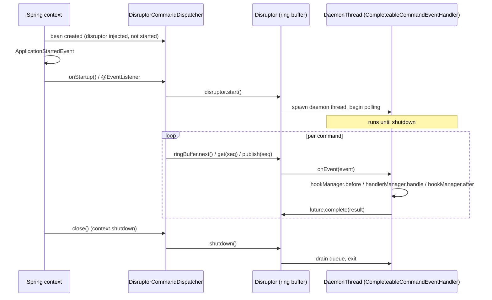

`fineract-command-disruptor` is the high-throughput sibling of `fineract-command-async`. Instead of submitting each command to the JDK common `ForkJoinPool`, it places work onto a fixed-size LMAX Disruptor ring buffer and consumes it from a daemon thread. The transport contract is unchanged — `dispatch(command)` still returns a `Supplier<RES>` that joins on a `CompletableFuture` — but the queueing model is different: a single producer (or multiple, if configured) hands sequence-numbered slots to a single consumer using a lock-free pattern designed for predictable latency.

This page documents the four-file module, the producer/consumer wiring, the properties, and the daemon-thread consumer lifecycle.

<Info>
  As with `fineract-command-async`, the source carries an explicit
  `// TODO: WIP - not ready yet for prime time` comment. Use it for benchmarking
  and exploration; the classical
  `SynchronousCommandProcessingService` remains the audited production path.
</Info>

## Layout

Under `fineract-command-disruptor/src/main/java/org/apache/fineract/command/disruptor`:

| File | Purpose |
| --- | --- |
| `DisruptorCommandProperties.java` | `@ConfigurationProperties("fineract.command.disruptor")` for `enabled`, `ringBufferSize`, `producerType`. |
| `implementation/DisruptorCommandDispatcher.java` | `CommandDispatcher` implementation, plus the nested `CommandEvent` and `CompleteableCommandEventHandler`. |
| `starter/DisruptorCommandAutoConfiguration.java` | `@AutoConfiguration` gating the module on `fineract.command.disruptor.enabled=true`. |
| `starter/DisruptorCommandConfiguration.java` | `@Configuration` that builds the `WaitStrategy` and the `Disruptor<CommandEvent>` beans. |

The shared `CommandDispatcher`, `CommandHandlerManager`, and `CommandHookManager` types live in `org.apache.fineract.command.core`.

## Properties

```java
@Builder
@Data
@NoArgsConstructor
@AllArgsConstructor
@FieldNameConstants
@ConfigurationProperties(prefix = "fineract.command.disruptor")
public final class DisruptorCommandProperties implements Serializable {

    @Builder.Default
    private Boolean enabled = false;

    @Builder.Default
    private Integer ringBufferSize = 1024;

    @Builder.Default
    private ProducerType producerType = ProducerType.SINGLE;
}
```

The three knobs:

| Property | Default | Purpose |
| --- | --- | --- |
| `fineract.command.disruptor.enabled` | `false` | Master switch. Auto-configuration and dispatcher are both gated on this. |
| `fineract.command.disruptor.ring-buffer-size` | `1024` | Number of slots in the ring buffer. Must be a power of two (Disruptor will reject any other value). |
| `fineract.command.disruptor.producer-type` | `SINGLE` | One of `SINGLE` or `MULTI`. Selects the LMAX `ProducerType` enum and therefore the publishing strategy. |

When in doubt, leave `producer-type` at `SINGLE` and serialise calls upstream. The `MULTI` setting adds CAS-based publish coordination, which is correct but more expensive.

## The dispatcher

`DisruptorCommandDispatcher` is the dispatcher half:

```java
@Slf4j
@RequiredArgsConstructor
@Component
@ConditionalOnProperty(value = "fineract.command.disruptor.enabled", havingValue = "true")
@SuppressWarnings({ "unchecked", "rawtypes" })
public class DisruptorCommandDispatcher implements CommandDispatcher, Closeable {

    private final Disruptor<CommandEvent> disruptor;

    @Override
    public <REQ, RES> Supplier<RES> dispatch(Command<REQ> command) {
        requireNonNull(command, "Command must not be null");

        CommandEvent<REQ, RES> processedEvent = next(command);

        var future = processedEvent.getFuture();

        return future::join;
    }

    @Override
    public void close() throws IOException {
        disruptor.shutdown();
    }

    @EventListener(ApplicationStartedEvent.class)
    void onStartup() {
        disruptor.start();
    }

    private <REQ, RES> CommandEvent<REQ, RES> next(Command<REQ> command) {
        var ringBuffer = disruptor.getRingBuffer();

        var sequenceId = ringBuffer.next();

        CommandEvent<REQ, RES> event = ringBuffer.get(sequenceId);
        event.setCommand(command);
        ringBuffer.publish(sequenceId);

        return event;
    }
}
```

A few details to unpack:

- **`dispatch(command)`** claims a sequence, populates the pre-allocated `CommandEvent`, and publishes. The returned `Supplier<RES>` is `future::join` — calling `get()` blocks on the same `CompletableFuture` that the consumer will complete.
- **`next(command)`** is the canonical Disruptor producer recipe: `ringBuffer.next()` to claim a sequence, `ringBuffer.get(seq)` to retrieve the pre-allocated event, mutate it in place, and finally `ringBuffer.publish(seq)`. No garbage is produced per command beyond the `CompletableFuture` reset.
- **`onStartup()`** is bound to Spring's `ApplicationStartedEvent`. The disruptor is only started after the entire context is ready, so handler and hook beans are guaranteed to be available when the consumer thread first runs.
- **`close()`** is the `Closeable` contract — Spring calls it on context shutdown, and `disruptor.shutdown()` drains in-flight events and joins the consumer thread.

### The event

The slot type is a small data class:

```java
@Getter
@Setter
public static class CommandEvent<REQ, RES> {

    private Command<REQ> command;
    private CompletableFuture<RES> future = new CompletableFuture<>();
}
```

It carries the inbound `Command<REQ>` and a fresh `CompletableFuture<RES>` that the consumer will complete. Note the future is allocated *per event slot*; the per-call cost is one ref assignment plus the dispatcher's own bookkeeping.

### The consumer

The consumer side is a Disruptor `EventHandler<CommandEvent>` declared inside the dispatcher:

```java
@RequiredArgsConstructor
@SuppressWarnings({ "unchecked", "rawtypes" })
public static class CompleteableCommandEventHandler implements EventHandler<CommandEvent> {

    private final CommandHookManager hookManager;
    private final CommandHandlerManager handlerManager;

    @Override
    public void onEvent(CommandEvent event, long sequence, boolean endOfBatch) {
        var command = event.getCommand();

        try {
            hookManager.before(command);

            var result = handlerManager.handle(command);

            hookManager.after(command, result);

            event.getFuture().complete(result);
        } catch (Exception e) {
            hookManager.error(command, e);

            event.getFuture().completeExceptionally(e);
        }
    }
}
```

The handler runs on the disruptor's consumer thread (see `DaemonThreadFactory.INSTANCE` below). The control flow mirrors the async dispatcher:

- On success: `before` → `handle` → `after`, then complete the future with the response.
- On failure: `error` (with the throwable), then complete the future exceptionally.

The result is that any caller blocked on `future.join()` either gets the response or has the exception rethrown unwrapped — Disruptor's `IgnoreExceptionHandler` (set as the default exception handler in the configuration) keeps the consumer thread alive across faults.

## Wiring the ring buffer

The disruptor itself is built in `DisruptorCommandConfiguration`:

```java
@Configuration
class DisruptorCommandConfiguration {

    @Bean
    @ConditionalOnMissingBean
    WaitStrategy waitStrategy() {
        return new YieldingWaitStrategy();
    }

    @Bean
    Disruptor<?> disruptor(DisruptorCommandProperties properties, WaitStrategy waitStrategy, CommandHookManager hookManager,
            CommandHandlerManager handlerManager) {

        @SuppressWarnings("rawtypes")
        Disruptor<DisruptorCommandDispatcher.CommandEvent> disruptor = new Disruptor<>(
                DisruptorCommandDispatcher.CommandEvent::new,
                properties.getRingBufferSize(),
                DaemonThreadFactory.INSTANCE,
                properties.getProducerType(),
                waitStrategy);

        disruptor.handleEventsWith(new DisruptorCommandDispatcher.CompleteableCommandEventHandler(hookManager, handlerManager));
        disruptor.setDefaultExceptionHandler(new IgnoreExceptionHandler());

        return disruptor;
    }
}
```

Five LMAX building blocks meet here:

| Component | Choice | Why |
| --- | --- | --- |
| Event factory | `CommandEvent::new` | Pre-allocates `ringBufferSize` `CommandEvent` slots at startup, avoiding GC on the hot path. |
| Ring buffer size | `properties.getRingBufferSize()` | Default `1024`. Must be a power of two. |
| Thread factory | `DaemonThreadFactory.INSTANCE` | Consumer runs as a daemon so it never blocks JVM shutdown. |
| Producer type | `properties.getProducerType()` | `SINGLE` (default) or `MULTI`. |
| Wait strategy | `YieldingWaitStrategy` (overridable) | Low-latency wait strategy: the consumer yields to other threads instead of sleeping. |

Notes:

- **`@ConditionalOnMissingBean WaitStrategy`** means an application can override the wait strategy by declaring its own `WaitStrategy` bean. `YieldingWaitStrategy` is a good default for high-CPU machines under load; alternatives are `BlockingWaitStrategy` (lower CPU, higher latency), `BusySpinWaitStrategy` (lowest latency, full core), or `SleepingWaitStrategy` (cheapest at idle).
- **`setDefaultExceptionHandler(new IgnoreExceptionHandler())`** is essential. The `CompleteableCommandEventHandler` already catches `Exception` internally; the default exception handler is the safety net for anything that escapes (typically `Error` subclasses). Without it, a stray `OutOfMemoryError` could kill the consumer thread and stall every subsequent dispatch.
- **`handleEventsWith(new CompleteableCommandEventHandler(...))`** binds the handler to the disruptor. There is a single consumer here; LMAX supports chaining multiple handlers, but this module deliberately keeps it simple.

## Lifecycle



The consumer thread is created and started as part of `disruptor.start()` and stops as part of `disruptor.shutdown()`. Because it is a daemon, the JVM will not wait for it on exit; the explicit `close()` call ensures clean teardown.

## Producer types in practice

`ProducerType.SINGLE` is the default and the fastest. It assumes that only one thread will ever call `ringBuffer.next()` at a time. In Fineract, where commands are submitted from JAX-RS request threads, that assumption is not satisfied by default — every request thread is potentially a producer. There are two ways to make `SINGLE` correct:

- **Serialise upstream.** Funnel all submissions through a single producer thread (for example a dedicated executor) and have that thread call `dispatch`.
- **Switch to `MULTI`.** Set `fineract.command.disruptor.producer-type=MULTI`. The disruptor will use a multi-producer claim strategy, which is a touch slower but tolerates concurrent producers.

The `producerType` enum comes straight from LMAX's `com.lmax.disruptor.dsl.ProducerType`, and the configuration property is bound to it directly by Spring's converter.

## Auto-configuration

```java
@AutoConfiguration
@EnableConfigurationProperties(DisruptorCommandProperties.class)
@ComponentScan({
        "org.apache.fineract.command.disruptor.implementation",
        "org.apache.fineract.command.disruptor.starter"
})
@ConditionalOnProperty(value = "fineract.command.disruptor.enabled", havingValue = "true")
public class DisruptorCommandAutoConfiguration {}
```

(The actual constants are in the source file `DisruptorCommandAutoConfiguration.java`; the snippet above summarises the shape.)

This activates everything in one go: the properties bean, the dispatcher component scan, and the `@Configuration` that builds the disruptor. Without the property set, none of the beans materialise and the module is inert on the classpath.

## When to choose this dispatcher

The disruptor variant pays off when:

- **Throughput is the bottleneck.** A 1024-slot ring buffer plus a single consumer thread is a well-known LMAX pattern for low-latency, high-throughput dispatch. The pre-allocated event slots eliminate per-command allocation overhead.
- **Latency variance matters.** The `YieldingWaitStrategy` keeps the consumer hot and gives near-zero wake-up latency on a populated buffer. The async dispatcher's reliance on the JDK common pool offers fewer guarantees here.
- **You want a single-thread invariant.** All hook and handler calls run on the disruptor's daemon thread. That makes some forms of state cheaper (no synchronisation on the handler-internal state), at the cost of giving up parallelism across the consumer.

It is the wrong choice when:

- **You need parallel handler execution.** A single consumer thread cannot help here. Chain multiple event handlers or use the async dispatcher with a sized executor.
- **You need transactional or security-context propagation.** Both are thread-bound; crossing into the disruptor thread requires explicit forwarding.
- **You need the maker-checker / audit story.** That lives in the classical `SynchronousCommandProcessingService` path, not in this module.

## Operational pitfalls

- **Ring buffer back-pressure.** When the buffer is full, `ringBuffer.next()` blocks until a slot becomes available. A slow handler will eventually stall every producer. Size the buffer for your peak burst, not your average rate.
- **`YieldingWaitStrategy` is CPU-hungry.** It spins for a while before yielding. On under-provisioned hosts, swap for `BlockingWaitStrategy` by overriding the `WaitStrategy` bean.
- **Disruptor failures eat events silently** unless the consumer handler completes the future exceptionally. The bundled `CompleteableCommandEventHandler` does the right thing in its `catch (Exception e)`; do not bypass it.
- **No retry.** This module is the transport — there is no replay if the JVM dies between `publish` and the consumer running. Pair it with `fineract-command-jdbc` if you need durable storage of the request.

## Related pages

- `commands/commands-async` — the simpler `CompletableFuture` variant.
- `commands/commands-jdbc` — the persistence side that often pairs with the
  disruptor for durable in-flight storage.
- `commands/commands-audit-module` — hook implementations that record state
  transitions as commands move through the dispatcher.
- `core/commands-framework` — the broader `command.core` API tour.
