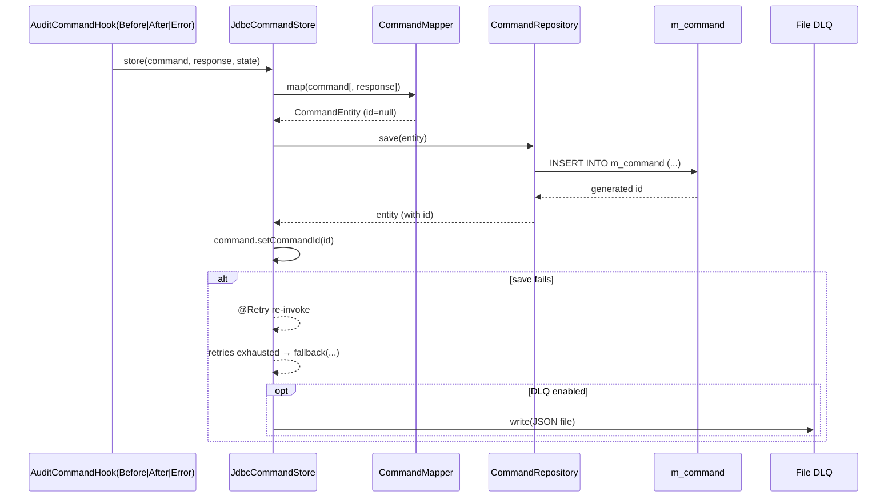

`fineract-command-jdbc` is the persistence half of the modular command stack. Where `fineract-command-async` and `fineract-command-disruptor` are transports, this module is a *sink*: it implements the `CommandStore` contract on top of a relational table (`m_command`), wraps the writes in resilience4j retries, and offers an optional file dead-letter queue for cases where the database is unreachable. Combined with `fineract-command-audit` (which calls into the store from `before`/`after`/`error` hooks), it gives the new command stack a durable history that is independent of the classical `m_portfolio_command_source` table.

This page walks the module layout, the `JdbcCommandStore` implementation, the `CommandEntity` mapping, the Liquibase changes that create and reshape `m_command`, and the dead-letter queue knobs.

<Info>
  `m_command` is the new home for command state in the modular stack. Do not
  confuse it with `m_portfolio_command_source` (the classical audit row described
  in `commands/command-source`). The two tables coexist; which one is written to
  depends on which dispatcher path the request follows.
</Info>

## Layout

Under `fineract-command-jdbc/src/main/java/org/apache/fineract/command/jdbc`:

| File | Purpose |
| --- | --- |
| `JdbcCommandProperties.java` | `@ConfigurationProperties("fineract.command.jdbc")` — `enabled`, dead-letter queue settings. |
| `starter/JdbcCommandAutoConfiguration.java` | `@AutoConfiguration` gating the module on `fineract.command.jdbc.enabled=true`. |
| `store/JdbcCommandStore.java` | `CommandStore` implementation backed by Spring Data JDBC. |
| `store/converter/JsonNodeReadingConverter.java` | Read converter for the `request`/`response` JSON columns. |
| `store/converter/JsonNodeWritingConverter.java` | Write converter for the same columns. |
| `store/domain/CommandEntity.java` | Spring Data JDBC `@Table("m_command")` entity. |
| `store/domain/CommandRepository.java` | `CrudRepository<CommandEntity, Long>` plus `findOneByIdempotencyKey`. |
| `store/mapping/CommandJsonMapper.java` | Maps a `Command<?>` (and optional response) to a `JsonNode`. |
| `store/mapping/CommandMapper.java` | Maps a `Command<?>` to a `CommandEntity`. |

Under `src/main/resources/db/changelog/tenant/module/command/`:

| File | Purpose |
| --- | --- |
| `module-changelog-master.xml` | Liquibase master include. |
| `parts/0001_command_init.xml` | Creates the initial table. |
| `parts/0002_command_fix_structure.xml` | Renames it to `m_command` and adds the audit / idempotency columns. |

## Properties

```java
@Builder
@Data
@NoArgsConstructor
@AllArgsConstructor
@FieldNameConstants
@ConfigurationProperties(prefix = "fineract.command.jdbc")
public final class JdbcCommandProperties implements Serializable {

    @Builder.Default
    private Boolean enabled = false;

    @Builder.Default
    private Boolean fileDeadLetterQueueEnabled = false;

    @Builder.Default
    private String fileDeadLetterQueuePath = "/tmp/fineract/dlq";
}
```

Three settings:

| Property | Default | Purpose |
| --- | --- | --- |
| `fineract.command.jdbc.enabled` | `false` | Master switch. The auto-configuration is gated on this. |
| `fineract.command.jdbc.file-dead-letter-queue-enabled` | `false` | If true, failed `store(...)` calls write the command to disk after retry exhaustion. |
| `fineract.command.jdbc.file-dead-letter-queue-path` | `/tmp/fineract/dlq` | Directory used as the dead-letter queue. Created on startup. |

The DLQ path is created (`mkdirs()`) on the `ApplicationStartedEvent` if the feature is enabled — see `JdbcCommandStore#onStartup()` below.

## The CommandEntity

`CommandEntity` is a Spring Data JDBC entity, not JPA. It maps onto `m_command`:

```java
@Getter
@Setter
@ToString
@FieldNameConstants
@Table("m_command")
public class CommandEntity implements Serializable {

    @Id
    @Column("id")
    private Long id;

    @Column("created_at")
    private Instant createdAt;

    @Column("updated_at")
    private Instant updatedAt;

    @Column("executed_at")
    private Instant executedAt;

    @Column("approved_at")
    private Instant approvedAt;

    @Column("rejected_at")
    private Instant rejectedAt;

    @Column("initiated_by_username")
    private String initiatedByUsername;

    @Column("executed_by_username")
    private String executedByUsername;

    @Column("approved_by_username")
    private String approvedByUsername;

    @Column("rejected_by_username")
    private String rejectedByUsername;

    @Column("idempotency_key")
    private String idempotencyKey;

    @Column("state")
    private CommandState state;

    @Column("error")
    private String error;

    @Column("ip_address")
    private String ipAddress;

    @Column("request")
    private JsonNode request;

    @Column("response")
    private JsonNode response;
}
```

The columns split into four groups:

| Group | Columns | Notes |
| --- | --- | --- |
| Timestamps | `created_at`, `updated_at`, `executed_at`, `approved_at`, `rejected_at` | `Instant`-typed; populated by the audit hooks (`before`/`after`/`error`). |
| Actors | `initiated_by_username`, `executed_by_username`, `approved_by_username`, `rejected_by_username` | Free-form username strings — no FK back to `m_appuser`. |
| Identity | `id` (PK), `idempotency_key` (indexed) | Surrogate id from the autoincrement column; idempotency key for replay detection. |
| Payload | `request` (`JsonNode`), `response` (`JsonNode`), `error`, `state`, `ip_address` | `JsonNode` columns serialise to `text` and back through the bundled converters. |

The `state` column maps onto `org.apache.fineract.command.core.CommandState`. The audit hooks write three of its values:

- `UNDER_PROCESSING` — set by `AuditCommandHookBefore`.
- `PROCESSED` — set by `AuditCommandHookAfter`.
- `ERROR` — set by `AuditCommandHookError`.

See `commands/commands-audit-module` for the hook implementations.

## The schema

The table is created across two changelogs.

### `0001_command_init.xml` — initial creation

```xml
<changeSet author="fineract" id="command-00001" context="postgresql">
    <preConditions onFail="MARK_RAN">
        <not><tableExists tableName="m_command"/></not>
    </preConditions>
    <createTable tableName="m_command">
        <column autoIncrement="true" name="id" type="bigint" remarks="Internal ID">
            <constraints nullable="false" primaryKey="true"/>
        </column>
        <column name="created_at" type="timestamp with time zone" />
        <column name="command_id" type="uuid" />
        <column name="tenant_id" type="varchar(255)" />
        <column name="username" type="varchar(255)" />
        <column name="payload" type="text" />
    </createTable>
</changeSet>

<changeSet author="fineract" id="command-00002" context="mysql">
    <createTable tableName="command">
        <!-- same columns, MySQL datetime types -->
    </createTable>
</changeSet>
```

PostgreSQL creates the table as `m_command` directly. MySQL creates it as `command` and the next changelog renames it. The first cut of the schema has just `created_at`, `command_id`, `tenant_id`, `username`, and a `payload` text column.

### `0002_command_fix_structure.xml` — rename and extend

```xml
<changeSet author="fineract" id="command-00002" context="mysql">
    <renameTable oldTableName="command" newTableName="m_command" />
    <addColumn tableName="m_command">
        <column name="updated_at" type="datetime" />
        <column name="executed_at" type="datetime" />
        <column name="approved_at" type="datetime" />
        <column name="rejected_at" type="datetime" />
    </addColumn>
</changeSet>

<changeSet author="fineract" id="command-00003" context="postgresql">
    <addColumn tableName="m_command">
        <column name="updated_at"  type="timestamp with time zone" />
        <column name="executed_at" type="timestamp with time zone" />
        <column name="approved_at" type="timestamp with time zone" />
        <column name="rejected_at" type="timestamp with time zone" />
    </addColumn>
</changeSet>

<changeSet author="fineract" id="command-00004" context="postgresql,mysql">
    <renameColumn tableName="m_command" oldColumnName="username" newColumnName="initiated_by_username"
                  columnDataType="varchar(255)" />
    <renameColumn tableName="m_command" oldColumnName="payload" newColumnName="request"
                  columnDataType="text" />

    <addColumn tableName="m_command">
        <column name="idempotency_key" type="varchar(255)" />
        <column name="executed_by_username" type="varchar(255)" />
        <column name="approved_by_username" type="varchar(255)" />
        <column name="rejected_by_username" type="varchar(255)" />
        <column name="ip_address" type="varchar(255)" />
        <column name="state" type="varchar(255)" />
        <column name="response" type="text" />
        <column name="error" type="text" />
    </addColumn>
    <createIndex tableName="m_command" indexName="m_command_idempotency_key_index">
        <column name="idempotency_key" />
    </createIndex>
</changeSet>
```

The net effect:

- The MySQL `command` table is renamed to `m_command`.
- Both backends gain `updated_at`, `executed_at`, `approved_at`, `rejected_at`.
- `username` becomes `initiated_by_username`; `payload` becomes `request`.
- `idempotency_key`, `response`, `error`, `state`, `ip_address`, and the three additional actor usernames are added.
- A non-unique index `m_command_idempotency_key_index` covers `idempotency_key` lookups.

`JdbcCommandStore.findOneByIdempotencyKey(key)` is what consumes that index — see below.

## The store implementation

`JdbcCommandStore` is the `CommandStore` implementation:

```java
@Slf4j
@RequiredArgsConstructor
@Component
@ConditionalOnMissingBean(value = CommandStore.class, ignored = JdbcCommandStore.class)
public class JdbcCommandStore implements CommandStore {

    private final CommandMapper mapper;
    private final CommandRepository repository;
    private final ObjectMapper objectMapper;
    private final JdbcCommandProperties properties;

    @Override
    public <T> T getRequestById(Long id) { ... }
    @Override
    public <T> T getResponseById(Long id) { ... }
    @Override
    public CommandState getStateById(Long id) { ... }
    @Override
    public <T> T getRequestByKey(String key) { ... }
    @Override
    public <T> T getResponseByKey(String key) { ... }
    @Override
    public CommandState getStateByKey(String key) { ... }

    @Override
    @Retry(name = "commandStore", fallbackMethod = "fallback")
    public void store(Command<?> command, Object response, CommandState state) { ... }

    void fallback(Command<?> command, Object response, CommandState state, Throwable t) throws Exception { ... }
}
```

A few key behaviours:

### `@ConditionalOnMissingBean`

```java
@ConditionalOnMissingBean(value = CommandStore.class, ignored = JdbcCommandStore.class)
```

If a different `CommandStore` bean is already in the context (for example a test fake or a custom implementation), the JDBC store does not register. This makes the JDBC implementation a sensible default that is easy to replace.

### Reads

The six accessor methods come in two flavours, by id and by idempotency key:

```java
@Override
public <T> T getRequestById(Long id) {
    return (T) repository.findById(id).map(CommandEntity::getRequest)
            .map(json -> objectMapper.convertValue(json, forName(json.get(COMMAND_JSON_CLASS_ATTRIBUTE).asText())))
            .orElse(null);
}
```

The `forName(...)` call reads a `@class`-style attribute (`COMMAND_JSON_CLASS_ATTRIBUTE`) embedded in the persisted JSON, looks up the corresponding `Class`, and asks Jackson to deserialise into that target. This is how the store survives polymorphic payloads: the writer records the runtime class alongside the JSON, and the reader reconstitutes it.

`getResponseById`, `getRequestByKey`, and `getResponseByKey` follow the same pattern. The `*ByKey` variants call `repository.findOneByIdempotencyKey(key)`, which is what makes the idempotency index pay off.

`getStateById` and `getStateByKey` return `CommandState.UNKNOWN` when the row is missing, so callers never have to deal with `null` for state.

### Writes (`store(...)`)

```java
@Override
@Retry(name = "commandStore", fallbackMethod = "fallback")
public void store(Command<?> command, Object response, CommandState state) {
    final long startedAt = System.nanoTime();
    final var commandEntity = isNull(response) ? mapper.map(command) : mapper.map(command, response);

    if (state != null) {
        commandEntity.setState(state);
    }

    log.debug("Storing command idempotencyKey={}, state={}, payloadType={}, thread={}",
              command.getIdempotencyKey(), commandEntity.getState(),
              payloadType(command), Thread.currentThread().getName());

    try {
        repository.save(commandEntity);
        command.setCommandId(commandEntity.getId());
        log.debug("Stored command id={}, idempotencyKey={}, state={}, elapsedMs={}",
                  commandEntity.getId(), command.getIdempotencyKey(),
                  commandEntity.getState(), elapsedMillis(startedAt));
    } catch (RuntimeException e) {
        log.warn("Command store save failed ...", e);
        throw e;
    }
}
```

What happens:

1. **Map.** `CommandMapper` turns the `Command<?>` (and optional response) into a `CommandEntity`. If a `state` was passed, it overrides the mapper's default.
2. **Save.** `repository.save(...)` is the standard Spring Data JDBC call. The id is autogenerated; the store writes it back onto the `Command` so subsequent hooks share the same id.
3. **Retry.** The method is annotated `@Retry(name = "commandStore", fallbackMethod = "fallback")`. resilience4j re-invokes the method according to whatever policy is configured under that name in the application's resilience4j configuration.
4. **Fallback.** If retries exhaust, control flows into `fallback(...)`.

### The fallback and the dead-letter queue

```java
void fallback(Command<?> command, Object response, CommandState state, Throwable t) throws Exception {
    log.warn("Command store fallback idempotencyKey={}, state={}, payloadType={}, deadLetterQueueEnabled={}",
             command.getIdempotencyKey(), state, payloadType(command),
             properties.getFileDeadLetterQueueEnabled(), t);
    if (Boolean.TRUE.equals(properties.getFileDeadLetterQueueEnabled())) {
        write(command);
    }
}

@EventListener(ApplicationStartedEvent.class)
void onStartup() {
    try {
        var created = Path.of(properties.getFileDeadLetterQueuePath()).toFile().mkdirs();
        log.info("Created command dead-letter queue: {} ({})", properties.getFileDeadLetterQueuePath(), created);
    } catch (Exception e) {
        log.error("Unable to initialize command dead-letter queue:", e);
    }
}

private void write(Command<?> command) throws IOException {
    var file = Path.of(properties.getFileDeadLetterQueuePath(),
            command.getCreatedAt().toEpochMilli() + "-"
                    + Optional.ofNullable(command.getIdempotencyKey()).orElseGet(() -> UUID.randomUUID().toString())
                    + ".json").toFile();
    FileUtils.write(file, objectMapper.writeValueAsString(command), UTF_8);
}
```

In words:

- **On startup,** `onStartup()` calls `mkdirs()` on the configured DLQ path. The result is logged but failures are not fatal — they just mean a future `write(command)` will throw.
- **On store failure,** if `file-dead-letter-queue-enabled=true`, the dispatcher writes a one-file-per-command JSON dump to disk. The filename is `<createdAtMillis>-<idempotencyKeyOrUuid>.json`.
- **If the DLQ is disabled,** the fallback only logs. The dispatcher will not see an exception (because `@Retry` swallows the failure once the fallback returns successfully), but the command state is *not* persisted.

This gives operators a recovery channel for the worst-case "database is gone" scenario without requiring a separate queue.

## Repository

The `CommandRepository` interface is short:

```java
public interface CommandRepository extends CrudRepository<CommandEntity, Long> {

    Optional<CommandEntity> findOneByIdempotencyKey(String idempotencyKey);
}
```

Standard Spring Data JDBC derived query — the engine generates a `WHERE idempotency_key = ?` lookup that uses the index added in `0002_command_fix_structure.xml`.

## End-to-end write path



The same `JdbcCommandStore#store` call covers the `UNDER_PROCESSING` insert, the `PROCESSED` update with a response, and the `ERROR` update with the throwable message. Whether the call is an insert or an update is decided by Spring Data JDBC based on the entity id — the `@Id` field is `null` on first store and populated on subsequent calls.

## Operational notes

- **DLQ files are not auto-replayed.** They are a recovery channel. Production deployments should pair them with a sweeper that picks up files and pushes them back through the store when the database is available again.
- **`m_command` is per-tenant.** The Liquibase changelogs live under `db/changelog/tenant`, so each tenant database carries its own copy.
- **Choose between this and `m_portfolio_command_source` consciously.** The two tables serve different command pipelines. Mixing requests across both does not violate any constraint, but it complicates audit reporting; operators usually pick one as the source of truth for the modules they care about.
- **The JSON converters write polymorphic JSON.** The `COMMAND_JSON_CLASS_ATTRIBUTE` carries the original class name. Renaming or moving a payload class breaks deserialisation of historical rows — either keep the class around or write a migration.

## Related pages

- `commands/commands-audit-module` — the hook implementations that call
  `JdbcCommandStore.store(...)` for the three transitions.
- `commands/commands-async`, `commands/commands-disruptor` — the transport
  options that pair with this store.
- `core/commands-framework` — the broader tour of the modular command stack.
- `commands/command-source` — the classical audit row this module sits alongside.
