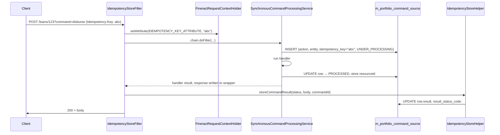
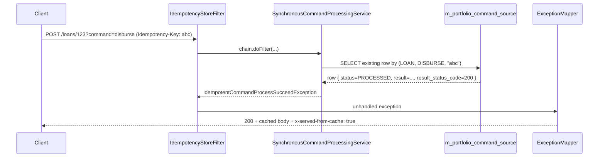
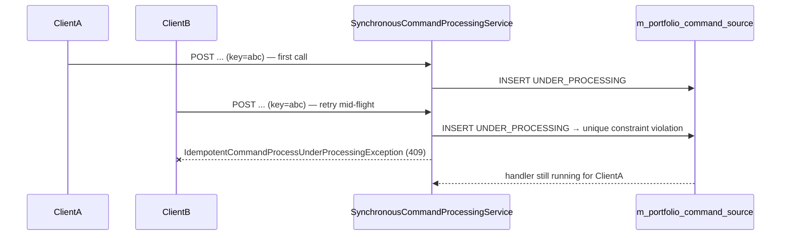

Idempotency in Fineract is built around one HTTP header (`Idempotency-Key`), one database column (`m_portfolio_command_source.idempotency_key`), one unique constraint (`(action_name, entity_name, idempotency_key)`), and a small set of cooperating classes that turn a retry into a cache hit instead of a duplicate side effect. The promise to the caller is simple: send the same `Idempotency-Key` with the same `(entity, action)` and you get back the same response — same body, same HTTP status — without re-running the handler.

This page documents the header configuration, the `IdempotencyStoreFilter` that captures responses, the `IdempotencyStoreHelper` that records them, and the three `IdempotentCommand*Exception` types that translate database hits into replays.

<Info>
  Idempotency works against the classical command pipeline
  (`SynchronousCommandProcessingService`,
  `m_portfolio_command_source`). The modular `fineract-command-*` stack has its
  own idempotency story based on the `m_command.idempotency_key` column — see
  `commands/commands-jdbc`.
</Info>

## The header

The header name is configurable but defaults to the de-facto standard:

```properties
# fineract-provider/src/main/resources/application.properties
fineract.idempotency-key-header-name=${FINERACT_IDEMPOTENCY_KEY_HEADER_NAME:Idempotency-Key}
fineract.command.idempotency-key-header-name=${FINERACT_IDEMPOTENCY_KEY_HEADER_NAME:Idempotency-Key}
```

Two properties, both backed by the same `FINERACT_IDEMPOTENCY_KEY_HEADER_NAME` environment variable, both defaulting to `Idempotency-Key`. The duplication is intentional: `fineract.idempotency-key-header-name` is read by the classical pipeline (via `FineractProperties`), and `fineract.command.idempotency-key-header-name` is reserved for the modular command stack so it can be split into its own module without a circular dependency.

The property is consumed by `IdempotencyStoreFilter`:

```java
private Optional<String> extractIdempotentKeyFromHttpServletRequest(HttpServletRequest request) {
    return Optional.ofNullable(request.getHeader(fineractProperties.getIdempotencyKeyHeaderName()));
}
```

If the header is absent, the request still goes through, but no key is captured. `IdempotencyKeyGenerator` will then mint a UUID later in the pipeline so the audit row's `idempotency_key` column is always populated; that synthetic key just is not used for replay matching.

## The filter

`IdempotencyStoreFilter` is the servlet filter that bridges the HTTP layer and the command framework. It does two things:

1. **Capture the idempotency key on the way in** so the command framework can pick it up via `FineractRequestContextHolder`.
2. **Persist the response body on the way out** so a future replay can serve it from cache.

```java
@RequiredArgsConstructor
@Slf4j
public class IdempotencyStoreFilter extends OncePerRequestFilter {

    private final FineractRequestContextHolder fineractRequestContextHolder;
    private final IdempotencyStoreHelper helper;
    private final FineractProperties fineractProperties;

    @Override
    protected void doFilterInternal(@NonNull HttpServletRequest request, @NonNull HttpServletResponse response,
            @NonNull FilterChain filterChain) throws ServletException, IOException {
        Mutable<ContentCachingResponseWrapper> wrapper = new MutableObject<>();
        if (helper.isAllowedContentTypeRequest(request)) {
            wrapper.setValue(new ContentCachingResponseWrapper(response));
        }
        extractIdempotentKeyFromHttpServletRequest(request).ifPresent(idempotentKey -> fineractRequestContextHolder
                .setAttribute(SynchronousCommandProcessingService.IDEMPOTENCY_KEY_ATTRIBUTE, idempotentKey, request));

        filterChain.doFilter(request, wrapper.get() != null ? wrapper.get() : response);
        Optional<Long> commandId = helper.getCommandId(request);
        boolean isSuccessWithoutStored = commandId.isPresent() && wrapper.get() != null && helper.isStoreIdempotencyKey(request)
                && helper.isAllowedContentTypeResponse(response);
        if (isSuccessWithoutStored) {
            helper.storeCommandResult(response.getStatus(), Optional.ofNullable(wrapper.get())
                    .map(ContentCachingResponseWrapper::getContentAsByteArray).map(s -> new String(s, StandardCharsets.UTF_8)).orElse(null),
                    commandId.get());
        }
        if (wrapper.get() != null) {
            wrapper.get().copyBodyToResponse();
        }
    }
}
```

Walking the method:

<Steps>
  <Step title="Wrap the response if the content type qualifies">
    For JSON requests (`helper.isAllowedContentTypeRequest`), wrap the response
    in Spring's `ContentCachingResponseWrapper`. This lets the filter read the
    body after the downstream chain has written it.
  </Step>
  <Step title="Capture the idempotency key">
    `extractIdempotentKeyFromHttpServletRequest` reads the configured header.
    If present, the value is stored on the per-request context under
    `SynchronousCommandProcessingService.IDEMPOTENCY_KEY_ATTRIBUTE` so
    downstream code (the command processor, the resolver) can find it.
  </Step>
  <Step title="Run the downstream chain">
    `filterChain.doFilter(request, wrappedOrPlainResponse)` runs the actual
    Fineract logic. The command processor either runs the handler, throws an
    `IdempotentCommand*Exception`, or fails.
  </Step>
  <Step title="On the way out, decide whether to persist">
    Four conditions must all be true to record the response:
    `commandId` is set (the processor stored a row), a response wrapper was
    installed, the per-request `IDEMPOTENCY_KEY_STORE_FLAG` is set, and the
    response content type is JSON or the status is in the 2xx range.
  </Step>
  <Step title="Store the response">
    `helper.storeCommandResult(status, body, commandId)` writes the captured
    body and HTTP status into the corresponding `m_portfolio_command_source`
    row. The filter then copies the buffered body back to the real response.
  </Step>
</Steps>

The filter is structured as an `OncePerRequestFilter`, so it runs at most once per request even if dispatcher forwarding bounces the request internally.

## The helper

`IdempotencyStoreHelper` is the small bean that the filter delegates to:

```java
@Component
@RequiredArgsConstructor
public class IdempotencyStoreHelper {

    private final CommandSourceService commandSourceService;
    private final FineractRequestContextHolder fineractRequestContextHolder;

    public void storeCommandResult(Integer response, String body, Long commandId) {
        commandSourceService.saveResultInTransaction(commandId, response, body);
    }

    public boolean isAllowedContentTypeResponse(HttpServletResponse response) {
        return Optional.ofNullable(response.getContentType()).map(String::toLowerCase).map(ct -> ct.contains("application/json"))
                .orElse(false) || (response.getStatus() > 200 && response.getStatus() < 300);
    }

    public boolean isAllowedContentTypeRequest(HttpServletRequest request) {
        return Optional.ofNullable(request.getContentType()).map(String::toLowerCase).map(ct -> ct.contains("application/json"))
                .orElse(false);
    }

    public boolean isStoreIdempotencyKey(HttpServletRequest request) {
        return Optional
                .ofNullable(
                        fineractRequestContextHolder.getAttribute(SynchronousCommandProcessingService.IDEMPOTENCY_KEY_STORE_FLAG, request))
                .filter(Boolean.class::isInstance).map(Boolean.class::cast).orElse(false);
    }

    public Optional<Long> getCommandId(HttpServletRequest request) {
        return Optional
                .ofNullable(fineractRequestContextHolder.getAttribute(SynchronousCommandProcessingService.COMMAND_SOURCE_ID, request))
                .filter(Long.class::isInstance).map(Long.class::cast);
    }
}
```

Four methods, each one tightly scoped:

- **`storeCommandResult(status, body, commandId)`** delegates to `CommandSourceService.saveResultInTransaction(...)`, which opens its own transaction (so the response is persisted even if the request-level transaction has already committed).
- **`isAllowedContentTypeResponse(response)`** allows storage when the response is JSON, or when the status is in the 2xx range but not exactly 200 (covering 201 and 204 responses without a body).
- **`isAllowedContentTypeRequest(request)`** is the matching predicate on the request side. Non-JSON requests are not eligible for idempotent replay; they pass through the filter untouched.
- **`isStoreIdempotencyKey(request)`** reads a boolean flag the processor sets when a key was present. Without it, the filter does not bother capturing the response.

The two `getAttribute` calls reference symbolic constants defined on `SynchronousCommandProcessingService`:

| Constant | Carried value |
| --- | --- |
| `IDEMPOTENCY_KEY_ATTRIBUTE` | The header value (or generated UUID). |
| `IDEMPOTENCY_KEY_STORE_FLAG` | `Boolean` flag set when a key was present. |
| `COMMAND_SOURCE_ID` | The persisted audit row id. |

## The unique constraint

The database side of idempotency is one unique key and one index, added in `0061_add_idempotency_key_to_command_source.xml`:

```xml
<addUniqueConstraint
    columnNames="action_name, entity_name, idempotency_key"
    constraintName="UNIQUE_PORTFOLIO_COMMAND_SOURCE"
    tableName="m_portfolio_command_source"/>

<createIndex indexName="portfolio_command_source_composite_index"
             tableName="m_portfolio_command_source">
    <column name="action_name"/>
    <column name="entity_name"/>
    <column name="idempotency_key"/>
</createIndex>
```

A retried request with the same `(action_name, entity_name, idempotency_key)` cannot insert a second row. The processor catches the conflict (or pre-queries with the same triple), looks up the existing row, and turns it into one of the three exceptions described below.

A later PostgreSQL changeset adds `NOT NULL` on `idempotency_key`, and a MySQL changeset enforces the same. Every row therefore carries a key — either the header value or a generated UUID.

## TTL

The classical Fineract idempotency path does **not** maintain an explicit time-to-live on the cached response. Once a row is stored, the unique constraint and the `result`/`result_status_code` columns remain valid indefinitely. Two consequences:

- **Replays continue to work for the entire history of the row.** A retry six months later with the same key still serves the cached response.
- **The Spring Batch cleanup tasklet trims processed commands.** The job `org.apache.fineract.commands.jobs.CleanCommandsTasklet` purges old processed commands on a schedule; rows it removes will no longer match for replay. Configure or disable the job to match your retention policy.

Operators that want true TTL semantics (for example "replay only within 24 hours") layer their own cleanup on top of the audit table or move to the modular stack and configure the JDBC store accordingly.

## The three exceptions

`AbstractIdempotentCommandException` is the base type. All three subclasses share the same fields (action, entity, key, response body) but differ in the HTTP status they carry and the semantic they communicate.

### Base class

```java
public abstract class AbstractIdempotentCommandException extends AbstractPlatformException {

    public static final String IDEMPOTENT_CACHE_HEADER = "x-served-from-cache";

    @Getter private final String action;
    @Getter private final String entity;
    @Getter private final String idempotencyKey;
    @Getter private final String response;

    protected AbstractIdempotentCommandException(String action, String entity, String idempotencyKey, String response) {
        super(null, null);
        this.action = action;
        this.entity = entity;
        this.idempotencyKey = idempotencyKey;
        this.response = response;
    }
}
```

Two things to highlight:

- **`IDEMPOTENT_CACHE_HEADER = "x-served-from-cache"`**. The exception mapper attaches this header to any cached response so the caller can tell a fresh response from a replay.
- **Four fields, three accessors.** `action`, `entity`, and `idempotencyKey` are the lookup triple. `response` is the cached body that will be served back.

### `IdempotentCommandProcessSucceedException`

The "happy replay" case — the original command succeeded, and the cached response is suitable to serve as-is:

```java
public class IdempotentCommandProcessSucceedException extends AbstractIdempotentCommandException {

    private final Integer statusCode;

    public IdempotentCommandProcessSucceedException(CommandWrapper wrapper, String idempotencyKey, CommandSource command) {
        super(wrapper.actionName(), wrapper.entityName(), idempotencyKey, command.getResult());
        this.statusCode = command.getResultStatusCode();
    }

    public Integer getStatusCode() {
        return statusCode;
    }
}
```

The status code comes directly from the stored row (`result_status_code`). The body comes from `command.getResult()`. The exception mapper writes both back to the response, plus the `x-served-from-cache` header.

### `IdempotentCommandProcessFailedException`

The "failed replay" case — the original command failed (or returned a non-success status), and the cache reproduces that failure:

```java
public class IdempotentCommandProcessFailedException extends AbstractIdempotentCommandException {

    private final Integer statusCode;

    public IdempotentCommandProcessFailedException(CommandWrapper wrapper, String idempotencyKey, CommandSource command) {
        super(wrapper.actionName(), wrapper.actionName(), idempotencyKey, command.getResult());
        this.statusCode = command.getResultStatusCode();
    }

    @NotNull
    public Integer getStatusCode() {
        return statusCode == null ? Integer.valueOf(SC_INTERNAL_SERVER_ERROR) : statusCode;
    }
}
```

The `@NotNull getStatusCode` defends against a corrupt audit row: if for some reason `result_status_code` is `null`, the replay returns `500` rather than crashing.

### `IdempotentCommandProcessUnderProcessingException`

The "still in flight" case — the original command was accepted, the audit row exists with status `UNDER_PROCESSING`, but the handler has not completed:

```java
public class IdempotentCommandProcessUnderProcessingException extends AbstractIdempotentCommandException {

    public IdempotentCommandProcessUnderProcessingException(CommandWrapper wrapper, String idempotencyKey) {
        super(wrapper.actionName(), wrapper.entityName(), idempotencyKey, wrapper.getJson());
    }

    public IdempotentCommandProcessUnderProcessingException(CommandWrapper wrapper, String idempotencyKey, Exception e) {
        super(wrapper.actionName(), wrapper.entityName(), idempotencyKey, wrapper.getJson());
    }
}
```

Two constructors: one for the "we see the row but nothing happened to it yet" path, and one for the "we tried to insert and hit the unique constraint" race. Both pass the *current* request JSON as the response (the helper has nothing better to send), letting the exception mapper return a meaningful status (the platform's convention is to return `409`).

This is the exception that prevents the same retried request from racing twice through the handler — even before the original has finished writing its `result`.

## Request lifecycle

The full happy path with idempotency in play:



The replay path one minute later, same key:



And the in-flight race:



## Operational notes

- **Pick keys carefully.** A good `Idempotency-Key` is unique per logical request and stable across retries. UUIDv4 is the usual choice. Avoid hashing the request body alone — equal bodies can be intentional reissues.
- **Pair the key with `(entity, action)`.** The unique constraint includes both. A single client key can be reused for two different commands without colliding.
- **Inspect via the audit API.** `GET /v1/audits?status=4` surfaces rows currently in `UNDER_PROCESSING`. If they are stuck, the JVM probably died mid-handler — manual cleanup is required.
- **`x-served-from-cache` is your friend.** Inspect for that header in retry-heavy clients to confirm the platform served from cache rather than re-running the command.
- **The cleanup job is your retention policy.** `CleanCommandsTasklet` controls how far back replays remain effective. Tune the job's schedule and retention window for your compliance needs.

## Related pages

- `commands/command-source` — the row layout, the unique constraint, and the
  status enum that underwrite idempotency.
- `commands/audits` — the read API used to inspect `UNDER_PROCESSING` rows.
- `commands/makercheckers` — how `AWAITING_APPROVAL` rows differ from the
  idempotency replay path.
- `commands/commands-jdbc` — the modular stack's idempotency story on
  `m_command.idempotency_key`.
