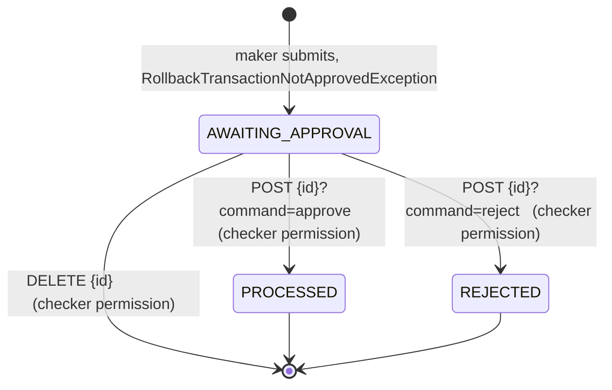
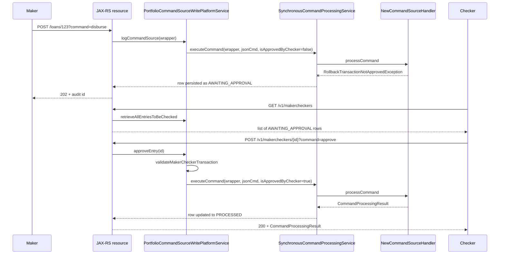

Maker-checker — also called four-eye approval — is the rule that a sensitive operation must be authored by one user (the *maker*) and confirmed by another (the *checker*) before it can take effect. In Fineract, this is not a separate workflow engine. It re-uses the command framework: a maker submits a command, the platform throws `RollbackTransactionNotApprovedException`, and the row in `m_portfolio_command_source` is left in status `AWAITING_APPROVAL`. The `/v1/makercheckers` API is how a checker browses those pending rows and acts on them.

This page documents the JAX-RS resource that surfaces the inbox, the write platform service it delegates to, the state-machine transitions it triggers, and the permissions required for each action.

<Info>
  All maker-checker rows live in `m_portfolio_command_source`. See
  `commands/command-source` for the column-level reference. The resource itself
  lives at
  `fineract-provider/src/main/java/org/apache/fineract/commands/api/MakercheckersApiResource.java`.
</Info>

## Resource shape

`MakercheckersApiResource` is a regular JAX-RS resource mounted at `/v1/makercheckers`:

```java
@Path("/v1/makercheckers")
@Component
@Tag(name = "Maker Checker (or 4-eye) functionality")
@RequiredArgsConstructor
public class MakercheckersApiResource {

    private static final String COMMAND_APPROVE = "approve";
    private static final String COMMAND_REJECT = "reject";

    private final AuditReadPlatformService readPlatformService;
    private final ApiRequestParameterHelper apiRequestParameterHelper;
    private final PortfolioCommandSourceWritePlatformService writePlatformService;
}
```

The class wires up exactly three dependencies:

- `AuditReadPlatformService` for the list and search-template queries.
- `ApiRequestParameterHelper` to honour the standard `fields=` and `includeJson=` query parameters.
- `PortfolioCommandSourceWritePlatformService` for the approve, reject, and delete operations.

## Endpoints

| Method | Path | Operation | Read/write |
| --- | --- | --- | --- |
| `GET` | `/v1/makercheckers` | List entries the requestor can check, with filters. | Read |
| `GET` | `/v1/makercheckers/searchtemplate` | Lookup data for the checker UI (`appUsers`, allowed `actionNames` / `entityNames`). | Read |
| `POST` | `/v1/makercheckers/{auditId}?command=approve` | Approve the entry, run the underlying command. | Write |
| `POST` | `/v1/makercheckers/{auditId}?command=reject` | Reject the entry without running it. | Write |
| `DELETE` | `/v1/makercheckers/{auditId}` | Delete the entry. | Write |

The `POST` endpoint multiplexes approve and reject via the `command` query parameter. Any other value triggers `UnrecognizedQueryParamException("command", commandParam)`.

## Listing the inbox

The list endpoint uses the same `AuditReadPlatformService` as the audits API, but filters down to rows the caller is allowed to check. The full method:

```java
@GET
@Produces({ MediaType.APPLICATION_JSON })
public List<AuditData> retrieveCommands(@Context final UriInfo uriInfo, @BeanParam MakerCheckerRequest makerCheckerRequest) {
    final SQLBuilder extraCriteria = getExtraCriteria(makerCheckerRequest);

    final ApiRequestJsonSerializationSettings settings = apiRequestParameterHelper.process(uriInfo.getQueryParameters());
    return readPlatformService.retrieveAllEntriesToBeChecked(extraCriteria, settings.isIncludeJson());
}
```

Two things to notice:

1. **`retrieveAllEntriesToBeChecked` vs `retrieveAuditEntries`.** The maker-checker variant filters internally to `status = AWAITING_APPROVAL` and further restricts to entries the caller has a matching `CHECKER_*` permission for.
2. **`includeJson` is opt-in.** By default the `commandAsJson` field is omitted from `AuditData` to keep payloads small. The checker UI sets `includeJson=true` to inspect the actual request body before approving.

### Supported filters

The `MakerCheckerRequest` `@BeanParam` exposes the following query parameters, each mapped onto an SQL fragment in `getExtraCriteria`:

| Query parameter | Column | Match |
| --- | --- | --- |
| `actionName` | `aud.action_name` | exact (`=`) |
| `entityName` | `aud.entity_name` | prefix (`like ENTITYNAME%`) |
| `resourceId` | `aud.resource_id` | exact |
| `makerId` | `aud.maker_id` | exact |
| `makerDateTimeFrom` | `aud.made_on_date` | `>=` |
| `makerDateTimeTo` | `aud.made_on_date` | `<=` |
| `officeId` | `aud.office_id` | exact |
| `groupId` | `aud.group_id` | exact |
| `clientId` | `aud.client_id` | exact |
| `loanId` | `aud.loan_id` | exact |
| `savingsAccountId` | `aud.savings_account_id` | exact |

Example requests, all taken from the resource's Swagger docs:

```
GET /v1/makercheckers
GET /v1/makercheckers?fields=madeOnDate,maker,processingResult
GET /v1/makercheckers?makerDateTimeFrom=2013-03-25 08:00:00&makerDateTimeTo=2013-04-04 18:00:00
GET /v1/makercheckers?officeId=1
GET /v1/makercheckers?officeId=1&includeJson=true
```

## The search template

`GET /v1/makercheckers/searchtemplate` is a convenience endpoint for UIs:

```java
@GET
@Path("/searchtemplate")
public AuditSearchData retrieveAuditSearchTemplate() {
    return readPlatformService.retrieveSearchTemplate("makerchecker");
}
```

The returned `AuditSearchData` carries:

- `appUsers` — users in the caller's data scope, suitable as a "maker" dropdown.
- `actionNames` and `entityNames` — restricted to those the caller has matching `CHECKER_*` permissions for.
- Office and processing-result lookups.

Passing `"makerchecker"` instead of `"audit"` is how the same underlying service produces a scope tailored to the checker inbox.

## Approve and reject

The combined approve/reject endpoint is:

```java
@POST
@Path("{auditId}")
public CommandProcessingResult approveMakerCheckerEntry(
        @PathParam("auditId") final Long auditId,
        @QueryParam("command") final String commandParam) {

    CommandProcessingResult result = null;
    if (is(commandParam, COMMAND_APPROVE)) {
        result = writePlatformService.approveEntry(auditId);
    } else if (is(commandParam, COMMAND_REJECT)) {
        final Long id = writePlatformService.rejectEntry(auditId);
        result = CommandProcessingResult.commandOnlyResult(id);
    } else {
        throw new UnrecognizedQueryParamException("command", commandParam);
    }
    return result;
}
```

Both branches delegate to `PortfolioCommandSourceWritePlatformService`. The next two sections walk what those service methods do.

### Approve

`approveEntry(makerCheckerId)` re-runs the original command, this time with the checker's blessing:

```java
@Override
public CommandProcessingResult approveEntry(final Long makerCheckerId) {
    final CommandSource commandSourceInput = validateMakerCheckerTransaction(makerCheckerId);
    validateIsUpdateAllowed();

    final CommandWrapper wrapper = CommandWrapper.fromExistingCommand(
            makerCheckerId,
            commandSourceInput.getActionName(),
            commandSourceInput.getEntityName(),
            commandSourceInput.getResourceId(),
            commandSourceInput.getSubResourceId(),
            commandSourceInput.getResourceGetUrl(),
            commandSourceInput.getProductId(),
            commandSourceInput.getOfficeId(),
            commandSourceInput.getGroupId(),
            commandSourceInput.getClientId(),
            commandSourceInput.getLoanId(),
            commandSourceInput.getSavingsId(),
            commandSourceInput.getTransactionId(),
            commandSourceInput.getCreditBureauId(),
            commandSourceInput.getOrganisationCreditBureauId(),
            commandSourceInput.getIdempotencyKey(),
            commandSourceInput.getLoanExternalId());
    final JsonElement parsedCommand = this.fromApiJsonHelper.parse(commandSourceInput.getCommandAsJson());
    final JsonCommand command = JsonCommand.fromExistingCommand(/* ... */);

    return this.processAndLogCommandService.executeCommand(wrapper, command, true);
}
```

The key step is the trailing `true` to `executeCommand` — the `isApprovedByChecker` flag that bypasses the maker-checker enforcement on the second run. After validation, the original wrapper and `JsonCommand` are reconstituted from the stored row and dispatched through `SynchronousCommandProcessingService` exactly as if a fresh request had been submitted.

### Reject

`rejectEntry(makerCheckerId)` does not run the underlying command. It flips the row to `REJECTED` and lets registered cleanup services tidy up:

```java
@Override
public Long rejectEntry(final Long makerCheckerId) {
    final CommandSource commandSourceInput = validateMakerCheckerTransaction(makerCheckerId);
    validateIsUpdateAllowed();
    final AppUser maker = this.context.authenticatedUser();
    commandSourceInput.markAsRejected(maker);
    this.commandSourceRepository.save(commandSourceInput);
    if (cleanupServices != null) {
        for (CleanupService cleanupService : cleanupServices) {
            cleanupService.cleanup(commandSourceInput);
        }
    }
    return makerCheckerId;
}
```

`CommandSource#markAsRejected(AppUser)` records `checker_id`, stamps `checked_on_date_utc`, and switches status to `REJECTED`. The resource wraps the returned id in `CommandProcessingResult.commandOnlyResult(id)`.

### Delete

`DELETE /v1/makercheckers/{auditId}` removes the row entirely:

```java
@DELETE
@Path("{auditId}")
public CommandProcessingResult deleteMakerCheckerEntry(@PathParam("auditId") final Long auditId) {
    final Long id = writePlatformService.deleteEntry(auditId);
    return CommandProcessingResult.commandOnlyResult(id);
}
```

The service implementation is just:

```java
@Transactional
@Override
public Long deleteEntry(final Long makerCheckerId) {
    validateMakerCheckerTransaction(makerCheckerId);
    validateIsUpdateAllowed();
    this.commandSourceRepository.deleteById(makerCheckerId);
    return makerCheckerId;
}
```

After validation the row is removed via Spring Data's `deleteById`. There is no rejection breadcrumb left behind, so delete is the right verb when the row was never meant to be created (a clerical mistake, a duplicate submission) rather than declined on merit.

## Validation: who can do what

All three write operations route through `validateMakerCheckerTransaction(makerCheckerId)`, which enforces three rules in this order:

```java
private CommandSource validateMakerCheckerTransaction(final Long makerCheckerId) {
    final CommandSource commandSource = this.commandSourceRepository.findById(makerCheckerId)
            .orElseThrow(() -> new CommandNotFoundException(makerCheckerId));
    if (!commandSource.isAwaitingApproval()) {
        throw new CommandNotAwaitingApprovalException(makerCheckerId);
    }
    AppUser appUser = this.context.authenticatedUser();
    String permissionCode = commandSource.getPermissionCode();
    appUser.validateHasCheckerPermissionTo(permissionCode);
    if (!configurationService.isSameMakerCheckerEnabled() && !appUser.isCheckerSuperUser()) {
        AppUser maker = commandSource.getMaker();
        if (maker == null) {
            throw new UnsupportedCommandException(permissionCode, "Maker user is missing.");
        }
        if (Objects.equals(appUser.getId(), maker.getId())) {
            throw new UnsupportedCommandException(permissionCode, "Can not be checked by the same user.");
        }
    }
    return commandSource;
}
```

The four checks, mapped to their failure modes:

| Check | Failure |
| --- | --- |
| Row exists in `m_portfolio_command_source`. | `CommandNotFoundException` (404). |
| Row status is `AWAITING_APPROVAL`. | `CommandNotAwaitingApprovalException` (403). |
| Caller holds the checker permission for the row's permission code. | `NoAuthorizationException` from `validateHasCheckerPermissionTo`. |
| Caller is not the original maker (unless explicitly allowed). | `UnsupportedCommandException` (403). |

### Permissions

The permission code is built directly from the audit row:

```java
public String getPermissionCode() {
    return this.actionName + "_" + this.entityName;
}
```

`validateHasCheckerPermissionTo(permissionCode)` checks that the caller has either:

- `CHECKER_<permissionCode>` — the matching checker permission, e.g. `CHECKER_DISBURSE_LOAN`, **or**
- `ALL_FUNCTIONS`, or
- `CHECKER_SUPER_USER` (which also bypasses the same-maker check).

The `CHECKER_` prefix is the convention everywhere in Fineract. For each business permission `<ACTION>_<ENTITY>` there is a paired `CHECKER_<ACTION>_<ENTITY>` that grants the right to approve other users' submissions of the same command.

`configurationService.isSameMakerCheckerEnabled()` is the global toggle that controls whether a single user is allowed to both submit and approve. By default it is off — the same-user check is enforced and a maker cannot self-approve.

### `validateIsUpdateAllowed()`

Both the write path and the maker-checker write path consult `SchedulerJobRunnerReadService.isUpdatesAllowed()`. This blocks writes while certain scheduler jobs are running. Approve, reject, and delete all participate in the same check — you cannot push state through the maker-checker inbox while a system-wide freeze is in effect.

## State machine



Once a row leaves `AWAITING_APPROVAL` it is terminal. A `PROCESSED` row will never come back to the inbox; the maker has to resubmit if a further change is needed.

## End-to-end flow



## Operational notes

- **Same-maker self-approval.** Disabled by default; enable via the global configuration toggle `same-maker-checker-enabled` only if your policy permits it.
- **Re-running an approved command.** The second `executeCommand` runs the same wrapper through the same provider lookup, so any handler-level idempotency assumption (an underlying duplicate-suppression key, for example) still applies.
- **Cleanup hooks.** `rejectEntry` invokes every `CleanupService` bean registered in the context. Modules that need to clean up side effects of a rejected request (e.g. uploaded attachments) register a `CleanupService` rather than hooking the resource directly.
- **No partial JSON edit.** The maker-checker API does not let the checker modify the command before approving. If something is wrong, reject (or delete) and ask the maker to resubmit.

## Related pages

- `commands/command-source` — fields and status enum used by the inbox queries.
- `commands/audits` — same underlying read service, but searching the full history.
- `commands/idempotency` — how replays interact with `AWAITING_APPROVAL` rows.
- `commands/overview` — pipeline view, including where `RollbackTransactionNotApprovedException` is raised.
