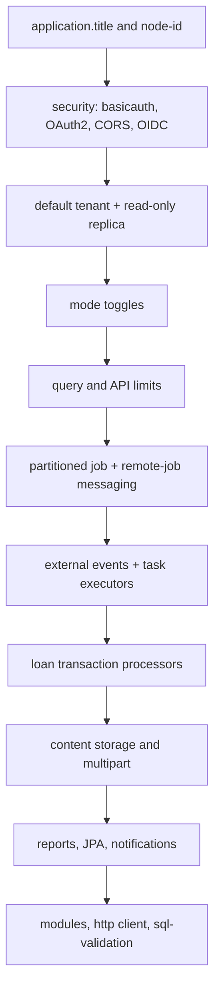
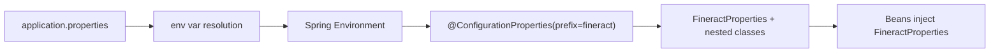

The canonical configuration file for Apache Fineract is `fineract-provider/src/main/resources/application.properties`. It is several hundred lines long and combines Spring Boot's standard property names with the `fineract.*` namespace that binds into `FineractProperties`. Every value uses `${ENV_VAR:default}` substitution so operators can override without editing the file.

This page walks the file section by section. Keys are quoted exactly as they appear in source.

## File anatomy

The file is grouped into informal sections that align with subsystems:



## Identity and base

```properties
application.title=Apache Fineract
fineract.node-id=${FINERACT_NODE_ID:1}
```

`application.title` becomes the title shown in any built-in banner. `fineract.node-id` identifies the instance in a cluster; the value is used by the Quartz scheduler and event sourcing.

## Security block

```properties
fineract.security.basicauth.enabled=${FINERACT_SECURITY_BASICAUTH_ENABLED:true}
fineract.security.oauth2.enabled=${FINERACT_SECURITY_OAUTH_ENABLED:false}
fineract.security.2fa.enabled=${FINERACT_SECURITY_2FA_ENABLED:false}
fineract.security.hsts.enabled=${FINERACT_SECURITY_HSTS_ENABLED:false}
```

Authentication strategies are mutually exclusive in practice: turn on basic OR OAuth2. 2FA layers on top of either. HSTS enforces HTTPS-only responses.

CORS keys follow:

```properties
fineract.security.cors.enabled=${FINERACT_SECURITY_CORS_ENABLED:true}
fineract.security.cors.allowed-origin-patterns=${FINERACT_SECURITY_CORS_ALLOWED_ORIGIN_PATTERNS:*}
fineract.security.cors.allowed-methods=${FINERACT_SECURITY_CORS_ALLOWED_METHODS:*}
fineract.security.cors.allowed-headers=${FINERACT_SECURITY_CORS_ALLOWED_HEADERS:*}
fineract.security.cors.exposed-headers=${FINERACT_SECURITY_CORS_EXPOSED_HEADERS:*}
fineract.security.cors.allow-credentials=${FINERACT_SECURITY_CORS_ALLOW_CREDENTIALS:true}
```

A sample OAuth2 client registration is shipped commented-in as an example:

```properties
fineract.security.oauth2.client.registrations.frontend-client.client-id=${FINERACT_SECURITY_OAUTH2_CLIENTS_FRONTEND_ID:frontend-client}
fineract.security.oauth2.client.registrations.frontend-client.scopes=${FINERACT_SECURITY_OAUTH2_CLIENTS_FRONTEND_SCOPES:read,write}
fineract.security.oauth2.client.registrations.frontend-client.authorization-grant-types=${FINERACT_SECURITY_OAUTH2_CLIENTS_FRONTEND_GRANTS:authorization_code,refresh_token}
```

OIDC federation (Keycloak, Azure AD, Okta, Auth0) is gated by:

```properties
fineract.security.oidc-federation.enabled=${FINERACT_SECURITY_OIDC_FEDERATION_ENABLED:false}
fineract.security.oidc-federation.tenant-claim-name=${FINERACT_SECURITY_OIDC_TENANT_CLAIM:fineract_tenant}
fineract.security.oidc-federation.username-claim=${FINERACT_SECURITY_OIDC_USERNAME_CLAIM:preferred_username}
fineract.security.oidc-federation.auto-create-user=${FINERACT_SECURITY_OIDC_AUTO_CREATE_USER:false}
fineract.security.oidc-federation.provider=${FINERACT_SECURITY_OIDC_PROVIDER:generic}
```

The two `spring.security.oauth2.resourceserver.jwt.*` keys (issuer-uri, jwk-set-uri) are commented examples — operators uncomment them when wiring an IdP.

## Default tenant

The default tenant is the one auto-provisioned for new installs and used by integration tests:

```properties
fineract.tenant.host=${FINERACT_DEFAULT_TENANTDB_HOSTNAME:localhost}
fineract.tenant.port=${FINERACT_DEFAULT_TENANTDB_PORT:5432}
fineract.tenant.username=${FINERACT_DEFAULT_TENANTDB_UID:root}
fineract.tenant.password=${FINERACT_DEFAULT_TENANTDB_PWD:postgres}
fineract.tenant.parameters=${FINERACT_DEFAULT_TENANTDB_CONN_PARAMS:}
fineract.tenant.timezone=${FINERACT_DEFAULT_TENANTDB_TIMEZONE:Asia/Kolkata}
fineract.tenant.identifier=${FINERACT_DEFAULT_TENANTDB_IDENTIFIER:default}
fineract.tenant.name=${FINERACT_DEFAULT_TENANTDB_NAME:fineract_default}
fineract.tenant.description=${FINERACT_DEFAULT_TENANTDB_DESCRIPTION:Default Demo Tenant}
fineract.tenant.master-password=${FINERACT_DEFAULT_TENANTDB_MASTER_PASSWORD:fineract}
fineract.tenant.encrytion=${FINERACT_DEFAULT_TENANTDB_ENCRYPTION:"AES/CBC/PKCS5Padding"}
```

A read-only replica may be defined with the parallel `fineract.tenant.read-only-*` keys; if `read-only-host` is blank, the primary is reused.

Hikari pool sizing for tenants:

```properties
fineract.tenant.config.min-pool-size=${FINERACT_CONFIG_MIN_POOL_SIZE:-1}
fineract.tenant.config.max-pool-size=${FINERACT_CONFIG_MAX_POOL_SIZE:-1}
fineract.tenant.config.leak-detection-threshold=${FINERACT_CONFIG_LEAK_DETECTION_THRESHOLD:0}
fineract.tenant.config.rounding-mode=${FINERACT_CONFIG_ROUNDING_MODE:6}
```

A value of `-1` defers to the Hikari default.

## Instance modes

```properties
fineract.mode.read-enabled=${FINERACT_MODE_READ_ENABLED:true}
fineract.mode.write-enabled=${FINERACT_MODE_WRITE_ENABLED:true}
fineract.mode.batch-worker-enabled=${FINERACT_MODE_BATCH_WORKER_ENABLED:true}
fineract.mode.batch-manager-enabled=${FINERACT_MODE_BATCH_MANAGER_ENABLED:true}
```

Disable combinations to deploy specialized instances (read-only HTTP node, dedicated batch worker, etc). See [Feature flags](/config/feature-flags-and-modes).

## API and query limits

```properties
fineract.query.in-clause-parameter-size-limit=${FINERACT_QUERY_PARAMETER_SIZE:1000}
fineract.api.body-item-size-limit.inline-loan-cob=${FINERACT_API_REQUEST_BODY_SIZE_LIMIT_INLINE_COB:1000}
fineract.correlation.enabled=${FINERACT_LOGGING_HTTP_CORRELATION_ID_ENABLED:false}
fineract.correlation.header-name=${FINERACT_LOGGING_HTTP_CORRELATION_ID_HEADER_NAME:X-Correlation-ID}
fineract.job.stuck-retry-threshold=${FINERACT_JOB_STUCK_RETRY_THRESHOLD:5}
fineract.ip-tracking.enabled=${FINERACT_CLIENT_IP_TRACKING_ENABLED:false}
fineract.job.loan-cob-enabled=${FINERACT_JOB_LOAN_COB_ENABLED:true}
```

Aggregation tunables:

```properties
fineract.job.journal-entry-aggregation.exclude-recent-N-days=${FINERACT_JOB_JOURNAL_ENTRY_AGGREGATION_EXCLUDE_RECENT_N_DAYS:1}
fineract.job.journal-entry-aggregation.enabled=${FINERACT_JOB_JOURNAL_ENTRY_AGGREGATION_ENABLED:true}
fineract.job.journal-entry-aggregation.chunk-size=${FINERACT_JOB_JOURNAL_ENTRY_AGGREGATION_CHUNK_SIZE:2000}
```

## Partitioned LOAN_COB

```properties
fineract.partitioned-job.partitioned-job-properties[0].job-name=LOAN_COB
fineract.partitioned-job.partitioned-job-properties[0].chunk-size=${LOAN_COB_CHUNK_SIZE:100}
fineract.partitioned-job.partitioned-job-properties[0].partition-size=${LOAN_COB_PARTITION_SIZE:100}
fineract.partitioned-job.partitioned-job-properties[0].thread-pool-core-pool-size=${LOAN_COB_THREAD_POOL_CORE_POOL_SIZE:5}
fineract.partitioned-job.partitioned-job-properties[0].thread-pool-max-pool-size=${LOAN_COB_THREAD_POOL_MAX_POOL_SIZE:5}
fineract.partitioned-job.partitioned-job-properties[0].thread-pool-queue-capacity=${LOAN_COB_THREAD_POOL_QUEUE_CAPACITY:20}
fineract.partitioned-job.partitioned-job-properties[0].retry-limit=${LOAN_COB_RETRY_LIMIT:5}
fineract.partitioned-job.partitioned-job-properties[0].poll-interval=${LOAN_COB_POLL_INTERVAL:500}
```

The list is indexed (`[0]`) — add `[1]`, `[2]` blocks to declare additional partitioned jobs.

## Remote job message handler

Three transports are mutually exclusive — pick exactly one:

```properties
fineract.remote-job-message-handler.spring-events.enabled=${FINERACT_REMOTE_JOB_MESSAGE_HANDLER_SPRING_EVENTS_ENABLED:true}
fineract.remote-job-message-handler.jms.enabled=${FINERACT_REMOTE_JOB_MESSAGE_HANDLER_JMS_ENABLED:false}
fineract.remote-job-message-handler.jms.request-queue-name=${FINERACT_REMOTE_JOB_MESSAGE_HANDLER_JMS_QUEUE_NAME:JMS-request-queue}
fineract.remote-job-message-handler.jms.broker-url=${FINERACT_REMOTE_JOB_MESSAGE_HANDLER_JMS_BROKER_URL:tcp://127.0.0.1:61616}

fineract.remote-job-message-handler.kafka.enabled=${FINERACT_REMOTE_JOB_MESSAGE_HANDLER_KAFKA_ENABLED:false}
fineract.remote-job-message-handler.kafka.topic.name=${FINERACT_REMOTE_JOB_MESSAGE_HANDLER_KAFKA_TOPIC_NAME:job-topic}
fineract.remote-job-message-handler.kafka.bootstrap-servers=${FINERACT_REMOTE_JOB_MESSAGE_HANDLER_KAFKA_BOOTSTRAP_SERVERS:localhost:9092}
```

`FineractRemoteJobMessageHandlerCondition` rejects boot if zero or more than one are enabled.

## External events

Per-instance publisher knobs:

```properties
fineract.events.external.enabled=${FINERACT_EXTERNAL_EVENTS_ENABLED:false}
fineract.events.external.partition-size=${FINERACT_EXTERNAL_EVENTS_PARTITION_SIZE:5000}
fineract.events.external.thread-pool-core-pool-size=${FINERACT_EVENT_TASK_EXECUTOR_CORE_POOL_SIZE:2}
fineract.events.external.thread-pool-max-pool-size=${FINERACT_EVENT_TASK_EXECUTOR_MAX_POOL_SIZE:25}
fineract.events.external.thread-pool-queue-capacity=${FINERACT_EVENT_TASK_EXECUTOR_QUEUE_CAPACITY:500}
```

A JMS producer block (`.producer.jms.*`) and a Kafka producer block (`.producer.kafka.*`) follow with brokers, queues, topics, and extra-property maps that use `|` and `=` as separators.

## Task executors

```properties
fineract.task-executor.default-task-executor-core-pool-size=${FINERACT_DEFAULT_TASK_EXECUTOR_CORE_POOL_SIZE:10}
fineract.task-executor.default-task-executor-max-pool-size=${FINERACT_DEFAULT_TASK_EXECUTOR_MAX_POOL_SIZE:100}
fineract.task-executor.tenant-upgrade-task-executor-core-pool-size=1
fineract.task-executor.tenant-upgrade-task-executor-max-pool-size=1
fineract.task-executor.tenant-upgrade-task-executor-queue-capacity=${FINERACT_TENANT_UPGRADE_TASK_EXECUTOR_QUEUE_CAPACITY:100}
```

The tenant-upgrade executor is intentionally pinned to a single thread to dodge a known Liquibase thread-safety issue.

## Idempotency

```properties
fineract.idempotency-key-header-name=${FINERACT_IDEMPOTENCY_KEY_HEADER_NAME:Idempotency-Key}
```

## Loan transaction processors

Each repayment strategy can be turned off without removing code:

```properties
fineract.loan.transactionprocessor.creocore.enabled=...:true
fineract.loan.transactionprocessor.early-repayment.enabled=...:true
fineract.loan.transactionprocessor.mifos-standard.enabled=...:true
fineract.loan.transactionprocessor.heavensfamily.enabled=...:true
fineract.loan.transactionprocessor.interest-principal-penalties-fees.enabled=...:true
fineract.loan.transactionprocessor.principal-interest-penalties-fees.enabled=...:true
fineract.loan.transactionprocessor.rbi-india.enabled=...:true
fineract.loan.transactionprocessor.advanced-payment-strategy.enabled=...:true
fineract.loan.transactionprocessor.error-not-found-fail=...:true
fineract.loan.status-change-history-statuses=${FINERACT_LOAN_STATUS_CHANGE_HISTORY_STATUSES:NONE}
```

## Content storage

```properties
fineract.content.regex-whitelist-enabled=${FINERACT_CONTENT_REGEX_WHITELIST_ENABLED:true}
fineract.content.regex-whitelist=${FINERACT_CONTENT_REGEX_WHITELIST:.*\\.pdf$,.*\\.doc,.*\\.docx,.*\\.xls,.*\\.xlsx,.*\\.jpg,.*\\.jpeg,.*\\.png}
fineract.content.mime-whitelist-enabled=${FINERACT_CONTENT_MIME_WHITELIST_ENABLED:true}
fineract.content.filesystem.enabled=${FINERACT_CONTENT_FILESYSTEM_ENABLED:true}
fineract.content.filesystem.rootFolder=${FINERACT_CONTENT_FILESYSTEM_ROOT_FOLDER:${user.home}/.fineract}
fineract.content.s3.enabled=${FINERACT_CONTENT_S3_ENABLED:false}
fineract.content.s3.bucketName=${FINERACT_CONTENT_S3_BUCKET_NAME:}
fineract.content.s3.region=${FINERACT_CONTENT_S3_REGION:}
spring.servlet.multipart.max-file-size=${FINERACT_MULTIPART_FILE_SIZE:5MB}
spring.servlet.multipart.max-request-size=${FINERACT_MULTIPART_REQUEST_SIZE:10MB}
```

## SQL validation

The SQL injection guard ships with named regex patterns:

```properties
fineract.sql-validation.patterns[0].name=inject-blind
fineract.sql-validation.patterns[0].pattern=(?i).*[\\\"'`]?\\s*[and|or]+\\s*[\\\"'`]?([\\d\\w])+...
fineract.sql-validation.patterns[1].name=detect-entry-point
fineract.sql-validation.patterns[2].name=inject-timing
fineract.sql-validation.patterns[3].name=detect-backend
fineract.sql-validation.patterns[4].name=detect-column
```

Patterns are evaluated against user-supplied SQL fragments (for example custom report parameters).

## Other tunables

```properties
fineract.jpa.statementLoggingEnabled=${FINERACT_STATEMENT_LOGGING_ENABLED:false}
fineract.database.defaultMasterPassword=${FINERACT_DEFAULT_MASTER_PASSWORD:fineract}
fineract.notification.user-notification-system.enabled=${FINERACT_USER_NOTIFICATION_SYSTEM_ENABLED:true}
fineract.logging.json.enabled=${FINERACT_LOGGING_JSON_ENABLED:false}
fineract.sampling.enabled=${FINERACT_SAMPLING_ENABLED:false}
fineract.module.investor.enabled=${FINERACT_MODULE_INVESTOR_ENABLED:true}
fineract.module.loan-origination.enabled=${FINERACT_MODULE_LOAN_ORIGINATION_ENABLED:true}
fineract.insecure-http-client=${FINERACT_INSECURE_HTTP_CLIENT:true}
fineract.client-connect-timeout=${FINERACT_CLIENT_CONNECT_TIMEOUT:30}
fineract.client-read-timeout=${FINERACT_CLIENT_READ_TIMEOUT:30}
fineract.client-write-timeout=${FINERACT_CLIENT_WRITE_TIMEOUT:30}
```

## How values reach Java code



The `@ConfigurationProperties(prefix = "fineract")` annotation on `FineractProperties` (in `fineract-core`) binds the entire subtree in one pass. Other modules autowire `FineractProperties` directly when they need a value.

## See also

- [FineractProperties class reference](/config/fineract-properties)
- [Environment variables reference](/config/environment-variables)
- [Security and authentication properties](/config/security-properties)
- [Database and Liquibase properties](/config/database-properties)
