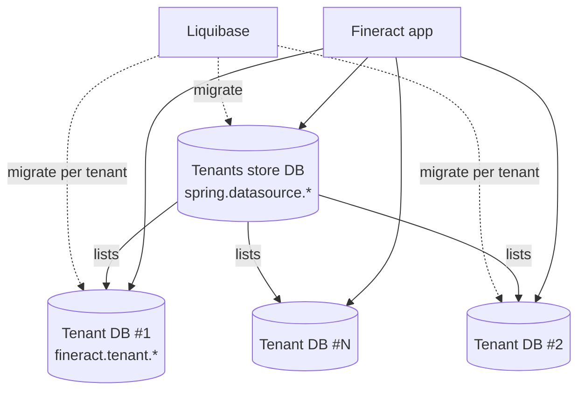
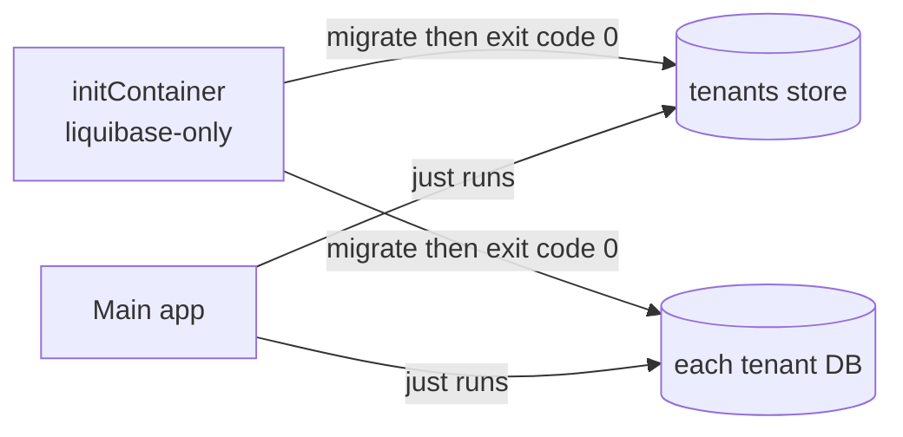

Apache Fineract is multi-tenant, and that shapes its database configuration. There is one "tenants store" database (a catalog listing all tenants) and one schema per tenant containing the actual banking data. Schema migrations are driven by Liquibase. This page covers all properties that control connections, pools, master-passwords, and migration behavior.

## Database topology



The tenants store maintains rows in `tenants` and `tenant_server_connections`. At startup, Fineract reads each row, builds a per-tenant Hikari datasource, and applies Liquibase migrations as needed.

## Tenants store (Spring datasource)

The tenants-store uses standard Spring Boot keys:

| Property | Default in code | Notes |
|---|---|---|
| `spring.datasource.url` | environment-driven | Points at the catalog DB. |
| `spring.datasource.username` | environment-driven | |
| `spring.datasource.password` | environment-driven | |
| `spring.datasource.driver-class-name` | auto-detected | `org.postgresql.Driver` or MariaDB. |
| `spring.datasource.hikari.*` | Hikari defaults | Pool tuning. |

Operators usually set these via `SPRING_DATASOURCE_URL`, `SPRING_DATASOURCE_USERNAME`, `SPRING_DATASOURCE_PASSWORD`.

## Default tenant database

The default tenant block in `application.properties` is what Fineract uses to (a) provision a demo tenant on first boot, and (b) provide bootstrap credentials when no tenants-store entry yet exists for `default`:

```properties
fineract.tenant.host=${FINERACT_DEFAULT_TENANTDB_HOSTNAME:localhost}
fineract.tenant.port=${FINERACT_DEFAULT_TENANTDB_PORT:5432}
fineract.tenant.username=${FINERACT_DEFAULT_TENANTDB_UID:root}
fineract.tenant.password=${FINERACT_DEFAULT_TENANTDB_PWD:postgres}
fineract.tenant.parameters=${FINERACT_DEFAULT_TENANTDB_CONN_PARAMS:}
fineract.tenant.timezone=${FINERACT_DEFAULT_TENANTDB_TIMEZONE:Asia/Kolkata}
fineract.tenant.identifier=${FINERACT_DEFAULT_TENANTDB_IDENTIFIER:default}
fineract.tenant.name=${FINERACT_DEFAULT_TENANTDB_NAME:fineract_default}
fineract.tenant.description=${FINERACT_DEFAULT_TENANTDB_DESCRIPTION:Default Demo Tenant}
fineract.tenant.master-password=${FINERACT_DEFAULT_TENANTDB_MASTER_PASSWORD:fineract}
fineract.tenant.encrytion=${FINERACT_DEFAULT_TENANTDB_ENCRYPTION:"AES/CBC/PKCS5Padding"}
```

Notes:

- `master-password` is used by the column-level encryption helpers when encrypting sensitive fields. It is NOT the admin user password.
- `encrytion` (typo preserved from the source file) selects the cipher transformation; the default `AES/CBC/PKCS5Padding` is supported on all platforms.
- `parameters` accepts a JDBC URL query suffix (e.g. `useSSL=false&serverTimezone=UTC`).
- `timezone` configures the per-tenant Java timezone — Fineract uses this to compute COB dates and statement boundaries.

## Read-only replica

```properties
fineract.tenant.read-only-host=${FINERACT_DEFAULT_TENANTDB_RO_HOSTNAME:}
fineract.tenant.read-only-port=${FINERACT_DEFAULT_TENANTDB_RO_PORT:}
fineract.tenant.read-only-username=${FINERACT_DEFAULT_TENANTDB_RO_UID:}
fineract.tenant.read-only-password=${FINERACT_DEFAULT_TENANTDB_RO_PWD:}
fineract.tenant.read-only-parameters=${FINERACT_DEFAULT_TENANTDB_RO_CONN_PARAMS:}
fineract.tenant.read-only-name=${FINERACT_DEFAULT_TENANTDB_RO_NAME:}
```

When `read-only-host` is non-empty, a second datasource is built for read queries. Read-write transactions still use the primary; SELECTs that are explicitly read-only (or that opt in via the read-only routing path) can hit the replica.

## Pool sizing

```properties
fineract.tenant.config.min-pool-size=${FINERACT_CONFIG_MIN_POOL_SIZE:-1}
fineract.tenant.config.max-pool-size=${FINERACT_CONFIG_MAX_POOL_SIZE:-1}
fineract.tenant.config.leak-detection-threshold=${FINERACT_CONFIG_LEAK_DETECTION_THRESHOLD:0}
fineract.tenant.config.rounding-mode=${FINERACT_CONFIG_ROUNDING_MODE:6}
```

- A pool size of `-1` means "fall back to Hikari defaults".
- `leak-detection-threshold` (milliseconds) enables Hikari's `leakDetectionThreshold` for finding connections that never close.
- `rounding-mode` is an integer from `java.math.RoundingMode` — `6` is `HALF_EVEN`.

## Connection checkout diagnostics

```properties
fineract.datasource.connection-checkout-diagnostics.enabled=${FINERACT_DATASOURCE_CONNECTION_CHECKOUT_DIAGNOSTICS_ENABLED:false}
fineract.datasource.connection-checkout-diagnostics.stack-depth=${FINERACT_DATASOURCE_CONNECTION_CHECKOUT_DIAGNOSTICS_STACK_DEPTH:12}
```

When `true`, each connection checkout captures a stack trace truncated to `stack-depth` frames — useful for tracking down connection-leak culprits but expensive in production.

## Statement logging

```properties
fineract.jpa.statementLoggingEnabled=${FINERACT_STATEMENT_LOGGING_ENABLED:false}
```

Turns on EclipseLink SQL logging. Pair with `LOGGING_LEVEL_ORG_ECLIPSE_PERSISTENCE=FINE` for full statement and bind-parameter dumps.

## Master password

```properties
fineract.database.defaultMasterPassword=${FINERACT_DEFAULT_MASTER_PASSWORD:fineract}
```

This is the master password used by the column-encryption helper across all tenants when one has not been overridden on the per-tenant level. **Override in production** — the default value `fineract` is intended for local development only.

## Liquibase

Fineract uses Liquibase to manage schemas for both the tenants store and each tenant. The runtime is wired through Spring Boot's standard Liquibase integration; the relevant keys are:

- `spring.liquibase.enabled` — when `false`, migrations are skipped at boot (advanced use case).
- `spring.liquibase.change-log` — typically defaults to `classpath:db/changelog/db.changelog-master.xml`.
- `spring.sql.init.mode` — generally `never`; Fineract never wants Spring to seed schema, Liquibase owns that.

### Liquibase-only mode

The `FineractLiquibaseOnlyApplicationCondition` allows running a process that applies migrations and then exits — ideal for Kubernetes initContainers and CI bootstrap. See [Feature flags](/config/feature-flags-and-modes#liquibase-only-mode).



### Tenant upgrade executor

```properties
fineract.task-executor.tenant-upgrade-task-executor-core-pool-size=1
fineract.task-executor.tenant-upgrade-task-executor-max-pool-size=1
fineract.task-executor.tenant-upgrade-task-executor-queue-capacity=${FINERACT_TENANT_UPGRADE_TASK_EXECUTOR_QUEUE_CAPACITY:100}
```

Tenants are upgraded one at a time. The single-thread sizing is **intentional** — it works around a known Liquibase thread-safety issue, documented inline in the property file:

> *"This is intentionally restricted to a single thread due to an outstanding Liquibase thread-safety issue: https://github.com/liquibase/liquibase/pull/7227"*

## Supported databases

Fineract's build matrix tests three relational databases:

| DB | CI workflow |
|---|---|
| PostgreSQL | `.github/workflows/build-postgresql.yml` |
| MariaDB | `.github/workflows/build-mariadb.yml` |
| MySQL | `.github/workflows/build-mysql.yml` |

The driver is auto-selected from the JDBC URL prefix. The `connection-parameters` property differs per DB:

- PostgreSQL: typically empty or `useUnicode=true&characterEncoding=UTF-8`.
- MariaDB / MySQL: `sessionVariables=time_zone=...&useUnicode=true&characterEncoding=UTF-8`.

## Query tuning

```properties
fineract.query.in-clause-parameter-size-limit=${FINERACT_QUERY_PARAMETER_SIZE:1000}
```

Fineract chunks IN-clauses (mostly for batch reads inside the COB pipeline) to avoid hitting per-DB parameter limits. PostgreSQL allows ~65k but MySQL behaves badly past a few thousand; the default `1000` is safe across all targets.

## Multipart upload

Database-adjacent because uploads land in the `m_document` table or the configured content storage:

```properties
spring.servlet.multipart.max-file-size=${FINERACT_MULTIPART_FILE_SIZE:5MB}
spring.servlet.multipart.max-request-size=${FINERACT_MULTIPART_REQUEST_SIZE:10MB}
```

## Deployment recipes

### PostgreSQL primary + replica
```bash
export SPRING_DATASOURCE_URL=jdbc:postgresql://catalog-db:5432/fineract_tenants
export SPRING_DATASOURCE_USERNAME=fineract
export SPRING_DATASOURCE_PASSWORD=...

export FINERACT_DEFAULT_TENANTDB_HOSTNAME=primary-db
export FINERACT_DEFAULT_TENANTDB_PORT=5432
export FINERACT_DEFAULT_TENANTDB_UID=fineract
export FINERACT_DEFAULT_TENANTDB_PWD=...

export FINERACT_DEFAULT_TENANTDB_RO_HOSTNAME=replica-db
export FINERACT_DEFAULT_TENANTDB_RO_PORT=5432
export FINERACT_DEFAULT_TENANTDB_RO_UID=fineract_ro
export FINERACT_DEFAULT_TENANTDB_RO_PWD=...
```

### MariaDB local dev
```bash
export FINERACT_DEFAULT_TENANTDB_HOSTNAME=localhost
export FINERACT_DEFAULT_TENANTDB_PORT=3306
export FINERACT_DEFAULT_TENANTDB_CONN_PARAMS=useSSL=false&serverTimezone=UTC
```

### Liquibase-only migration job
Run the same container with the liquibase-only profile/condition enabled; once migrations finish the process exits. The main app pods are started afterward.

## See also

- [application.properties reference](/config/application-properties)
- [FineractProperties class reference](/config/fineract-properties)
- [Environment variables reference](/config/environment-variables)
- [Feature flags and instance modes](/config/feature-flags-and-modes)
