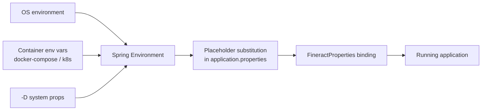
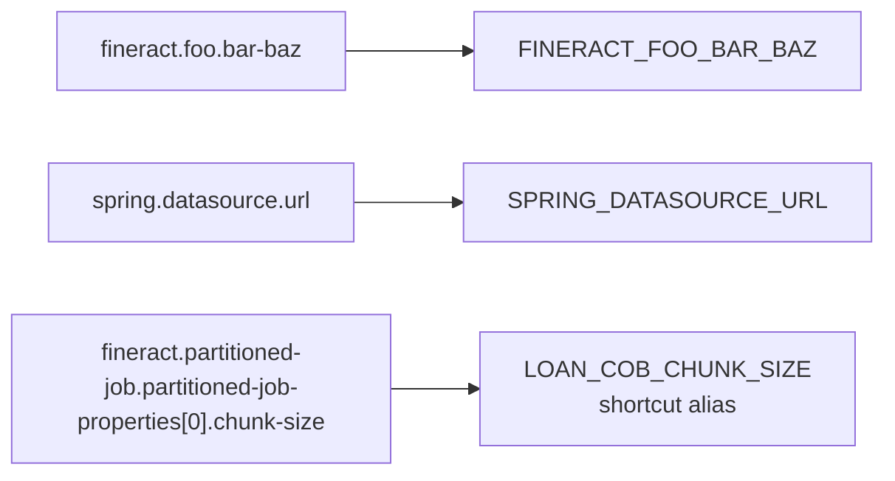

Apache Fineract is configured almost entirely through environment variables in production. The `application.properties` file resolves placeholders of the form `${VAR:default}`, so any property can be overridden by exporting the matching variable. This page indexes the variables grouped by subsystem, with the property key and default value each one drives.

## How resolution works

Spring Boot also accepts `SPRING_*` names — for example `SPRING_DATASOURCE_URL` binds to `spring.datasource.url`. Both flavors work side by side.

## Identity and base

| Variable | Property | Default |
|---|---|---|
| `FINERACT_NODE_ID` | `fineract.node-id` | `1` |

## Default tenant database

| Variable | Property | Default |
|---|---|---|
| `FINERACT_DEFAULT_TENANTDB_HOSTNAME` | `fineract.tenant.host` | `localhost` |
| `FINERACT_DEFAULT_TENANTDB_PORT` | `fineract.tenant.port` | `5432` |
| `FINERACT_DEFAULT_TENANTDB_UID` | `fineract.tenant.username` | `root` |
| `FINERACT_DEFAULT_TENANTDB_PWD` | `fineract.tenant.password` | `postgres` |
| `FINERACT_DEFAULT_TENANTDB_CONN_PARAMS` | `fineract.tenant.parameters` | empty |
| `FINERACT_DEFAULT_TENANTDB_TIMEZONE` | `fineract.tenant.timezone` | `Asia/Kolkata` |
| `FINERACT_DEFAULT_TENANTDB_IDENTIFIER` | `fineract.tenant.identifier` | `default` |
| `FINERACT_DEFAULT_TENANTDB_NAME` | `fineract.tenant.name` | `fineract_default` |
| `FINERACT_DEFAULT_TENANTDB_DESCRIPTION` | `fineract.tenant.description` | `Default Demo Tenant` |
| `FINERACT_DEFAULT_TENANTDB_MASTER_PASSWORD` | `fineract.tenant.master-password` | `fineract` |
| `FINERACT_DEFAULT_TENANTDB_ENCRYPTION` | `fineract.tenant.encrytion` | `AES/CBC/PKCS5Padding` |

### Read-only replica

| Variable | Property | Default |
|---|---|---|
| `FINERACT_DEFAULT_TENANTDB_RO_HOSTNAME` | `fineract.tenant.read-only-host` | empty |
| `FINERACT_DEFAULT_TENANTDB_RO_PORT` | `fineract.tenant.read-only-port` | empty |
| `FINERACT_DEFAULT_TENANTDB_RO_UID` | `fineract.tenant.read-only-username` | empty |
| `FINERACT_DEFAULT_TENANTDB_RO_PWD` | `fineract.tenant.read-only-password` | empty |
| `FINERACT_DEFAULT_TENANTDB_RO_CONN_PARAMS` | `fineract.tenant.read-only-parameters` | empty |
| `FINERACT_DEFAULT_TENANTDB_RO_NAME` | `fineract.tenant.read-only-name` | empty |

### Connection pool

| Variable | Property | Default |
|---|---|---|
| `FINERACT_CONFIG_MIN_POOL_SIZE` | `fineract.tenant.config.min-pool-size` | `-1` |
| `FINERACT_CONFIG_MAX_POOL_SIZE` | `fineract.tenant.config.max-pool-size` | `-1` |
| `FINERACT_CONFIG_LEAK_DETECTION_THRESHOLD` | `fineract.tenant.config.leak-detection-threshold` | `0` |
| `FINERACT_CONFIG_ROUNDING_MODE` | `fineract.tenant.config.rounding-mode` | `6` |

## Instance modes

| Variable | Property | Default |
|---|---|---|
| `FINERACT_MODE_READ_ENABLED` | `fineract.mode.read-enabled` | `true` |
| `FINERACT_MODE_WRITE_ENABLED` | `fineract.mode.write-enabled` | `true` |
| `FINERACT_MODE_BATCH_WORKER_ENABLED` | `fineract.mode.batch-worker-enabled` | `true` |
| `FINERACT_MODE_BATCH_MANAGER_ENABLED` | `fineract.mode.batch-manager-enabled` | `true` |

## Security

| Variable | Property | Default |
|---|---|---|
| `FINERACT_SECURITY_BASICAUTH_ENABLED` | `fineract.security.basicauth.enabled` | `true` |
| `FINERACT_SECURITY_OAUTH_ENABLED` | `fineract.security.oauth2.enabled` | `false` |
| `FINERACT_SECURITY_2FA_ENABLED` | `fineract.security.2fa.enabled` | `false` |
| `FINERACT_SECURITY_HSTS_ENABLED` | `fineract.security.hsts.enabled` | `false` |
| `FINERACT_SECURITY_CORS_ENABLED` | `fineract.security.cors.enabled` | `true` |
| `FINERACT_SECURITY_CORS_ALLOWED_ORIGIN_PATTERNS` | `fineract.security.cors.allowed-origin-patterns` | `*` |
| `FINERACT_SECURITY_CORS_ALLOW_CREDENTIALS` | `fineract.security.cors.allow-credentials` | `true` |
| `FINERACT_SECURITY_OIDC_FEDERATION_ENABLED` | `fineract.security.oidc-federation.enabled` | `false` |
| `FINERACT_SECURITY_OIDC_TENANT_CLAIM` | `fineract.security.oidc-federation.tenant-claim-name` | `fineract_tenant` |
| `FINERACT_SECURITY_OIDC_USERNAME_CLAIM` | `fineract.security.oidc-federation.username-claim` | `preferred_username` |
| `FINERACT_SECURITY_OIDC_AUTO_CREATE_USER` | `fineract.security.oidc-federation.auto-create-user` | `false` |
| `FINERACT_SECURITY_OIDC_PROVIDER` | `fineract.security.oidc-federation.provider` | `generic` |

OIDC also reads the standard Spring keys:

- `SPRING_SECURITY_OAUTH2_RESOURCESERVER_JWT_ISSUER_URI`
- `SPRING_SECURITY_OAUTH2_RESOURCESERVER_JWT_JWK_SET_URI`

## API and logging

| Variable | Property | Default |
|---|---|---|
| `FINERACT_QUERY_PARAMETER_SIZE` | `fineract.query.in-clause-parameter-size-limit` | `1000` |
| `FINERACT_API_REQUEST_BODY_SIZE_LIMIT_INLINE_COB` | `fineract.api.body-item-size-limit.inline-loan-cob` | `1000` |
| `FINERACT_LOGGING_HTTP_CORRELATION_ID_ENABLED` | `fineract.correlation.enabled` | `false` |
| `FINERACT_LOGGING_HTTP_CORRELATION_ID_HEADER_NAME` | `fineract.correlation.header-name` | `X-Correlation-ID` |
| `FINERACT_LOGGING_JSON_ENABLED` | `fineract.logging.json.enabled` | `false` |
| `FINERACT_CLIENT_IP_TRACKING_ENABLED` | `fineract.ip-tracking.enabled` | `false` |
| `FINERACT_IDEMPOTENCY_KEY_HEADER_NAME` | `fineract.idempotency-key-header-name` | `Idempotency-Key` |
| `FINERACT_STATEMENT_LOGGING_ENABLED` | `fineract.jpa.statementLoggingEnabled` | `false` |

## Jobs

| Variable | Property | Default |
|---|---|---|
| `FINERACT_JOB_STUCK_RETRY_THRESHOLD` | `fineract.job.stuck-retry-threshold` | `5` |
| `FINERACT_JOB_LOAN_COB_ENABLED` | `fineract.job.loan-cob-enabled` | `true` |
| `FINERACT_JOB_JOURNAL_ENTRY_AGGREGATION_ENABLED` | `fineract.job.journal-entry-aggregation.enabled` | `true` |
| `FINERACT_JOB_JOURNAL_ENTRY_AGGREGATION_EXCLUDE_RECENT_N_DAYS` | `fineract.job.journal-entry-aggregation.exclude-recent-N-days` | `1` |
| `FINERACT_JOB_JOURNAL_ENTRY_AGGREGATION_CHUNK_SIZE` | `fineract.job.journal-entry-aggregation.chunk-size` | `2000` |

### Partitioned LOAN_COB

| Variable | Property | Default |
|---|---|---|
| `LOAN_COB_CHUNK_SIZE` | `fineract.partitioned-job.partitioned-job-properties[0].chunk-size` | `100` |
| `LOAN_COB_PARTITION_SIZE` | `...partition-size` | `100` |
| `LOAN_COB_THREAD_POOL_CORE_POOL_SIZE` | `...thread-pool-core-pool-size` | `5` |
| `LOAN_COB_THREAD_POOL_MAX_POOL_SIZE` | `...thread-pool-max-pool-size` | `5` |
| `LOAN_COB_THREAD_POOL_QUEUE_CAPACITY` | `...thread-pool-queue-capacity` | `20` |
| `LOAN_COB_RETRY_LIMIT` | `...retry-limit` | `5` |
| `LOAN_COB_POLL_INTERVAL` | `...poll-interval` | `500` |

## Remote job messaging

| Variable | Property | Default |
|---|---|---|
| `FINERACT_REMOTE_JOB_MESSAGE_HANDLER_SPRING_EVENTS_ENABLED` | `fineract.remote-job-message-handler.spring-events.enabled` | `true` |
| `FINERACT_REMOTE_JOB_MESSAGE_HANDLER_JMS_ENABLED` | `fineract.remote-job-message-handler.jms.enabled` | `false` |
| `FINERACT_REMOTE_JOB_MESSAGE_HANDLER_JMS_QUEUE_NAME` | `...jms.request-queue-name` | `JMS-request-queue` |
| `FINERACT_REMOTE_JOB_MESSAGE_HANDLER_JMS_BROKER_URL` | `...jms.broker-url` | `tcp://127.0.0.1:61616` |
| `FINERACT_REMOTE_JOB_MESSAGE_HANDLER_KAFKA_ENABLED` | `...kafka.enabled` | `false` |
| `FINERACT_REMOTE_JOB_MESSAGE_HANDLER_KAFKA_TOPIC_NAME` | `...kafka.topic.name` | `job-topic` |
| `FINERACT_REMOTE_JOB_MESSAGE_HANDLER_KAFKA_BOOTSTRAP_SERVERS` | `...kafka.bootstrap-servers` | `localhost:9092` |
| `FINERACT_REMOTE_JOB_MESSAGE_HANDLER_KAFKA_CONSUMER_GROUPID` | `...kafka.consumer.group-id` | `fineract-consumer-group-id` |

## External events

| Variable | Property | Default |
|---|---|---|
| `FINERACT_EXTERNAL_EVENTS_ENABLED` | `fineract.events.external.enabled` | `false` |
| `FINERACT_EXTERNAL_EVENTS_PARTITION_SIZE` | `fineract.events.external.partition-size` | `5000` |
| `FINERACT_EVENT_TASK_EXECUTOR_CORE_POOL_SIZE` | `fineract.events.external.thread-pool-core-pool-size` | `2` |
| `FINERACT_EVENT_TASK_EXECUTOR_MAX_POOL_SIZE` | `fineract.events.external.thread-pool-max-pool-size` | `25` |
| `FINERACT_EVENT_TASK_EXECUTOR_QUEUE_CAPACITY` | `fineract.events.external.thread-pool-queue-capacity` | `500` |
| `FINERACT_EXTERNAL_EVENTS_PRODUCER_JMS_ENABLED` | `fineract.events.external.producer.jms.enabled` | `false` |
| `FINERACT_EXTERNAL_EVENTS_KAFKA_ENABLED` | `fineract.events.external.producer.kafka.enabled` | `false` |
| `FINERACT_EXTERNAL_EVENTS_KAFKA_TOPIC_NAME` | `...kafka.topic.name` | `external-events` |
| `FINERACT_EXTERNAL_EVENTS_KAFKA_BOOTSTRAP_SERVERS` | `...kafka.bootstrap-servers` | `localhost:9092` |

## Content storage

| Variable | Property | Default |
|---|---|---|
| `FINERACT_CONTENT_REGEX_WHITELIST_ENABLED` | `fineract.content.regex-whitelist-enabled` | `true` |
| `FINERACT_CONTENT_MIME_WHITELIST_ENABLED` | `fineract.content.mime-whitelist-enabled` | `true` |
| `FINERACT_CONTENT_FILESYSTEM_ENABLED` | `fineract.content.filesystem.enabled` | `true` |
| `FINERACT_CONTENT_FILESYSTEM_ROOT_FOLDER` | `fineract.content.filesystem.rootFolder` | `${user.home}/.fineract` |
| `FINERACT_CONTENT_S3_ENABLED` | `fineract.content.s3.enabled` | `false` |
| `FINERACT_CONTENT_S3_BUCKET_NAME` | `fineract.content.s3.bucketName` | empty |
| `FINERACT_CONTENT_S3_REGION` | `fineract.content.s3.region` | empty |
| `FINERACT_MULTIPART_FILE_SIZE` | `spring.servlet.multipart.max-file-size` | `5MB` |
| `FINERACT_MULTIPART_REQUEST_SIZE` | `spring.servlet.multipart.max-request-size` | `10MB` |

## Modules

| Variable | Property | Default |
|---|---|---|
| `FINERACT_MODULE_INVESTOR_ENABLED` | `fineract.module.investor.enabled` | `true` |
| `FINERACT_MODULE_LOAN_ORIGINATION_ENABLED` | `fineract.module.loan-origination.enabled` | `true` |

## Misc

| Variable | Property | Default |
|---|---|---|
| `FINERACT_DEFAULT_MASTER_PASSWORD` | `fineract.database.defaultMasterPassword` | `fineract` |
| `FINERACT_USER_NOTIFICATION_SYSTEM_ENABLED` | `fineract.notification.user-notification-system.enabled` | `true` |
| `FINERACT_INSECURE_HTTP_CLIENT` | `fineract.insecure-http-client` | `true` |
| `FINERACT_CLIENT_CONNECT_TIMEOUT` | `fineract.client-connect-timeout` | `30` |
| `FINERACT_CLIENT_READ_TIMEOUT` | `fineract.client-read-timeout` | `30` |
| `FINERACT_CLIENT_WRITE_TIMEOUT` | `fineract.client-write-timeout` | `30` |
| `FINERACT_DEFAULT_TASK_EXECUTOR_CORE_POOL_SIZE` | `fineract.task-executor.default-task-executor-core-pool-size` | `10` |
| `FINERACT_DEFAULT_TASK_EXECUTOR_MAX_POOL_SIZE` | `fineract.task-executor.default-task-executor-max-pool-size` | `100` |
| `FINERACT_SAMPLING_ENABLED` | `fineract.sampling.enabled` | `false` |
| `FINERACT_SAMPLING_RATE` | `fineract.sampling.samplingRate` | `1000` |

## Spring-managed extras

These standard Spring Boot variables work without any Fineract-specific mapping:

- `SPRING_PROFILES_ACTIVE` — activates additional profile files.
- `SPRING_DATASOURCE_URL` / `SPRING_DATASOURCE_USERNAME` / `SPRING_DATASOURCE_PASSWORD` — tenants-store connection.
- `SERVER_PORT` — overrides Tomcat's listening port.
- `SERVER_TOMCAT_ACCESSLOG_ENABLED` — turns on access logging.
- `LOGGING_LEVEL_*` — per-package log thresholds.

## Naming convention

The repository follows a consistent pattern:

For most properties the conversion is mechanical: uppercase, replace `.` and `-` with `_`. A few list-indexed properties (e.g. LOAN_COB knobs) provide short aliases for ergonomics.

## See also

- [application.properties reference](/config/application-properties)
- [FineractProperties class reference](/config/fineract-properties)
- [Database properties](/config/database-properties)
- [Security properties](/config/security-properties)
