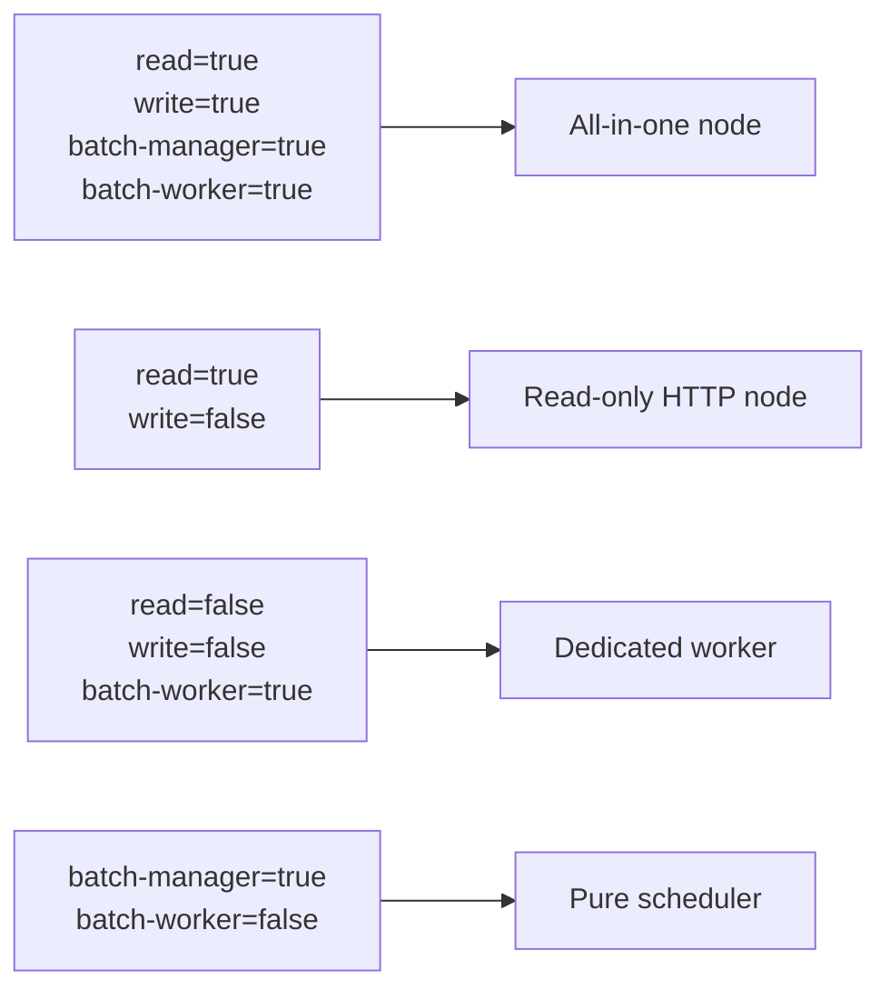
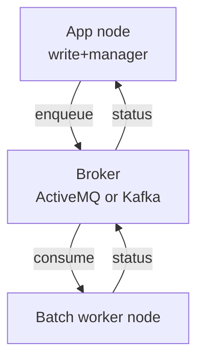
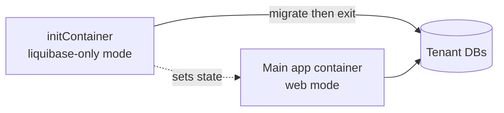

Apache Fineract uses Spring's `@Conditional` mechanism extensively to gate beans behind property switches. Together with a handful of property toggles, these conditions let operators run specialized instances — for example, a read-only HTTP node, a batch-only worker, or a migrate-and-exit Liquibase pod — from the same artifact. This page lists the conditional classes, the properties that drive them, and the deployment shapes they enable.

## Mode properties

The four `fineract.mode.*` toggles are the highest-level flags. They map onto `FineractProperties.FineractModeProperties`:

| Property | Default | Effect |
|---|---|---|
| `fineract.mode.read-enabled` | `true` | Allows HTTP read endpoints to register. |
| `fineract.mode.write-enabled` | `true` | Allows HTTP write endpoints to register. |
| `fineract.mode.batch-manager-enabled` | `true` | Enables the Spring Batch manager (schedules partitioned jobs). |
| `fineract.mode.batch-worker-enabled` | `true` | Enables Spring Batch step workers. |

Combinations:



`FineractModeValidationCondition` validates that the combination is internally consistent at startup.

## Condition classes

All conditional classes live under `fineract-core/src/main/java/org/apache/fineract/infrastructure/core/condition/`:

| Class | Reads | Purpose |
|---|---|---|
| `FineractModeValidationCondition` | `fineract.mode.*` | Fails fast on contradictory mode combinations. |
| `FineractWebApplicationCondition` | servlet env | Distinguishes web vs non-web runs (e.g. Liquibase-only). |
| `FineractLiquibaseOnlyApplicationCondition` | env/flag | Skips the web stack and runs migrations only. |
| `FineractPartitionJobConfigValidationCondition` | `fineract.partitioned-job.*` | Validates pool/queue sizing against chunk/partition size. |
| `FineractRemoteJobMessageHandlerCondition` | `fineract.remote-job-message-handler.*` | Exactly one of spring-events / JMS / Kafka must be enabled. |
| `EnableFineractEventsCondition` | `fineract.events.external.enabled` | Turns the event publisher pipeline on/off. |
| `EnableFineractEventListenerCondition` | listener-side toggles | Turns the listener bus on/off. |
| `FineractExternalEventConfigCondition` | publisher transport flags | Sanity-checks that one transport is selected when events are on. |
| `FineractValidationCondition` | feature flags | Wraps cross-cutting validation toggles. |
| `ProfileCondition` | active Spring profiles | Generic profile gate used by a few beans. |

## How conditions plug into beans

```java
@Configuration
@Conditional(EnableFineractEventsCondition.class)
public class ExternalEventsAutoConfiguration {
    // beans here only register when events.external.enabled = true
}
```

The condition itself implements `org.springframework.context.annotation.Condition`:

```java
public class EnableFineractEventsCondition implements Condition {
    @Override
    public boolean matches(ConditionContext context, AnnotatedTypeMetadata metadata) {
        var env = context.getEnvironment();
        return Boolean.parseBoolean(env.getProperty("fineract.events.external.enabled", "false"));
    }
}
```

This pattern keeps the property names in one place and prevents the wrong combination from ever materializing as beans.

## Loan COB enablement

`fineract.job.loan-cob-enabled` (`FINERACT_JOB_LOAN_COB_ENABLED`, default `true`) acts as the master switch for the Close-of-Business loan job. When `false`, the partitioned `LOAN_COB` job is not registered, which is useful when a sister node owns the schedule.

This property pairs with `fineract.mode.batch-manager-enabled` and `fineract.mode.batch-worker-enabled` to determine where the job actually runs.

## Remote job message handler

When a non-batch instance triggers a job, it must reach the batch instance. The handler property tree selects the transport:

```properties
fineract.remote-job-message-handler.spring-events.enabled=true   # in-process default
fineract.remote-job-message-handler.jms.enabled=false
fineract.remote-job-message-handler.kafka.enabled=false
```

`FineractRemoteJobMessageHandlerCondition` enforces that exactly one is true. In a single-process dev setup the default `spring-events` is sufficient; in a multi-node deployment switch to JMS (ActiveMQ) or Kafka.



## External events

Two independent property trees:

- `fineract.events.external.enabled` — turns the **publisher** on. When `true`, every domain mutation goes through `BusinessEventNotifierService` and is materialized as a `ExternalEvent` row, then dispatched to a JMS queue/topic or a Kafka topic.
- `fineract.events.external.producer.jms.enabled` / `.producer.kafka.enabled` — pick the outbound transport.

`FineractExternalEventConfigCondition` enforces that when events are enabled, exactly one producer is configured.

## Modules

Several whole modules can be switched off:

| Property | Default | Module |
|---|---|---|
| `fineract.module.investor.enabled` | `true` | Asset externalization to investors (`fineract-investor`). |
| `fineract.module.loan-origination.enabled` | `true` | Loan origination workflow (`fineract-loan-origination`). |

When set to `false`, the module's beans skip registration. Endpoints and entity managers in that module are effectively absent at runtime.

## Loan transaction processors

Every named repayment strategy in `fineract.loan.transactionprocessor.*` can be flipped off. The strategies are auto-registered into a `LoanRepaymentScheduleTransactionProcessorFactory`; disabling one simply removes it from the factory's map.

```properties
fineract.loan.transactionprocessor.advanced-payment-strategy.enabled=true
fineract.loan.transactionprocessor.creocore.enabled=true
fineract.loan.transactionprocessor.rbi-india.enabled=true
fineract.loan.transactionprocessor.mifos-standard.enabled=true
fineract.loan.transactionprocessor.error-not-found-fail=true
```

`error-not-found-fail` causes loan creation/repayment to fail loudly if a strategy referenced by a loan product is disabled.

## Loan status history

```properties
fineract.loan.status-change-history-statuses=${FINERACT_LOAN_STATUS_CHANGE_HISTORY_STATUSES:NONE}
```

Special values are `NONE` (off) and `ALL`. Any other value is a comma-separated list of statuses to record. This is a runtime feature flag for the loan status history feature.

## Notification system

```properties
fineract.notification.user-notification-system.enabled=${FINERACT_USER_NOTIFICATION_SYSTEM_ENABLED:true}
```

When `false`, the in-app notification publisher is skipped.

## Sampling

```properties
fineract.sampling.enabled=${FINERACT_SAMPLING_ENABLED:false}
fineract.sampling.samplingRate=${FINERACT_SAMPLING_RATE:1000}
fineract.sampling.sampledClasses=${FINERACT_SAMPLED_CLASSES:}
fineract.sampling.resetPeriodSec=${FINERACT_SAMPLING_RESET_PERIOD_IN_SEC:60}
```

A diagnostic feature: when enabled, certain classes log invocation samples.

## Liquibase-only mode

`FineractLiquibaseOnlyApplicationCondition` lets you run a container whose only job is to apply schema migrations and exit. This is the recommended pattern for Kubernetes initContainers:



The condition pairs with `FineractWebApplicationCondition` to short-circuit servlet initialization in the migrate pod.

## Putting it together: deployment shapes

| Shape | Mode settings | Other |
|---|---|---|
| Single-node dev | all `true` | spring-events handler |
| HA HTTP + worker | write/read `true`; batch-manager only on one node; batch-worker `true` on workers | JMS or Kafka handler |
| Read replicas | `write=false`, `batch-manager=false`, `batch-worker=false` | OAuth2 enabled |
| Migrate-and-exit | liquibase-only | no servlet |

## Adding a new conditional

1. Implement a class that implements `org.springframework.context.annotation.Condition` and reads the desired property from the `ConditionContext`'s `Environment`.
2. Annotate the configuration or `@Bean` factory with `@Conditional(YourCondition.class)`.
3. Document the property default in `application.properties` and add the env-var alias.

This keeps the codebase's feature-flag surface uniform and discoverable in `infrastructure/core/condition/`.

## See also

- [FineractProperties class reference](/config/fineract-properties) — typed properties driving conditions.
- [application.properties reference](/config/application-properties) — full defaults.
- [Environment variables reference](/config/environment-variables) — operator overrides.
