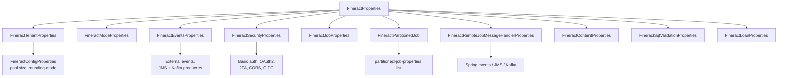
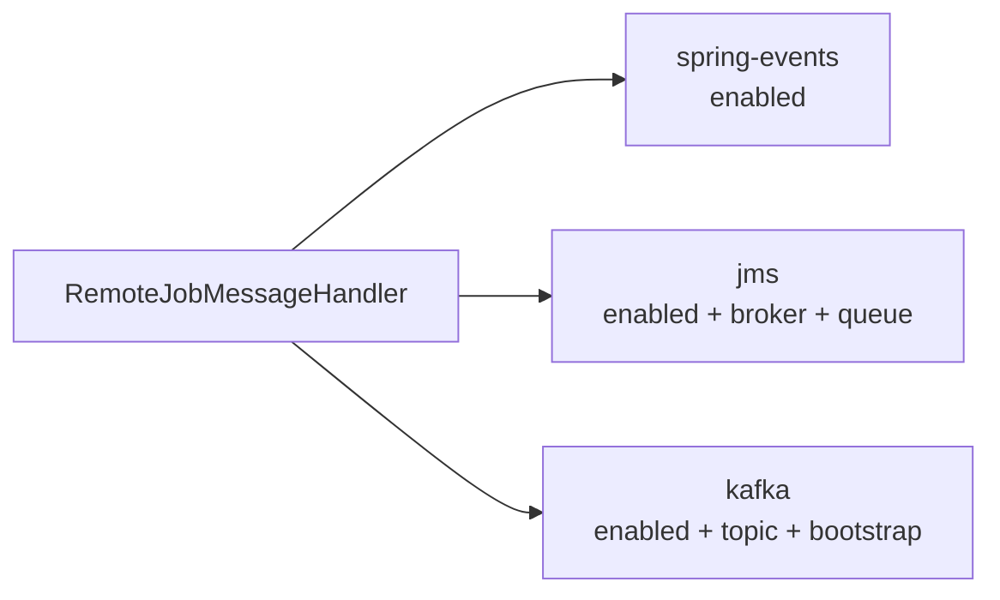

In Apache Fineract, every key under the `fineract.*` namespace in `application.properties` is bound to a single typed object: `org.apache.fineract.infrastructure.core.config.FineractProperties`. The class lives in the `fineract-core` module and serves as a one-stop hub for runtime configuration. Beans across the codebase autowire this object instead of pulling individual `@Value`s — the result is a strongly typed, navigable configuration surface.

## Class location and annotation

```java
package org.apache.fineract.infrastructure.core.config;

@Getter
@Setter
@ConfigurationProperties(prefix = "fineract")
public class FineractProperties {
    // ...
}
```

The Lombok `@Getter` / `@Setter` keeps the class succinct; the Spring Boot `@ConfigurationProperties(prefix = "fineract")` is the binding hook.

Source: `fineract-core/src/main/java/org/apache/fineract/infrastructure/core/config/FineractProperties.java`.

## Top-level fields

The outermost properties on the class are:

| Field | Type | Property prefix |
|---|---|---|
| `nodeId` | `String` | `fineract.node-id` |
| `idempotencyKeyHeaderName` | `String` | `fineract.idempotency-key-header-name` |
| `insecureHttpClient` | `Boolean` | `fineract.insecure-http-client` |
| `clientConnectTimeout` | `long` | `fineract.client-connect-timeout` |
| `clientReadTimeout` | `long` | `fineract.client-read-timeout` |
| `clientWriteTimeout` | `long` | `fineract.client-write-timeout` |
| `tenant` | `FineractTenantProperties` | `fineract.tenant.*` |
| `mode` | `FineractModeProperties` | `fineract.mode.*` |
| `correlation` | `FineractCorrelationProperties` | `fineract.correlation.*` |
| `ipTracking` | `FineractIpTrackingProperties` | `fineract.ip-tracking.*` |
| `partitionedJob` | `FineractPartitionedJob` | `fineract.partitioned-job.*` |
| `remoteJobMessageHandler` | `FineractRemoteJobMessageHandlerProperties` | `fineract.remote-job-message-handler.*` |
| `events` | `FineractEventsProperties` | `fineract.events.*` |
| `taskExecutor` | `FineractTaskExecutor` | `fineract.task-executor.*` |
| `content` | `FineractContentProperties` | `fineract.content.*` |
| `report` | `FineractReportProperties` | `fineract.report.*` |
| `job` | `FineractJobProperties` | `fineract.job.*` |
| `template` | `FineractTemplateProperties` | `fineract.template.*` |
| `jpa` | `FineractJpaProperties` | `fineract.jpa.*` |
| `database` | `FineractDatabaseProperties` | `fineract.database.*` |
| `query` | `FineractQueryProperties` | `fineract.query.*` |
| `api` | `FineractApiProperties` | `fineract.api.*` |
| `security` | `FineractSecurityProperties` | `fineract.security.*` |
| `notification` | `FineractNotificationProperties` | `fineract.notification.*` |
| `loan` | `FineractLoanProperties` | `fineract.loan.*` |
| `sampling` | `FineractSamplingProperties` | `fineract.sampling.*` |
| `module` | `FineractModulesProperties` | `fineract.module.*` |
| `sqlValidation` | `FineractSqlValidationProperties` | `fineract.sql-validation.*` |
| `cache` | `FineractCache` | `fineract.cache.*` |
| `retry` | `RetryProperties` | `fineract.retry.*` |
| `defaults` | `FineractDefaultValues` | `fineract.defaults.*` |

## Binding tree



## Notable nested classes

### `FineractTenantProperties`

```java
public static class FineractTenantProperties {
    private String host;
    private Integer port;
    private String username;
    private String password;
    private String parameters;
    private String timezone;
    private String identifier;
    private String name;
    private String description;
    private String masterPassword;
    private String encryption;
    private String readOnlyHost;
    private Integer readOnlyPort;
    private String readOnlyUsername;
    private String readOnlyPassword;
    private String readOnlyParameters;
    private String readOnlyName;
    private FineractConfigProperties config;
}
```

Used by `TenantDetailsService` and `DataSourceTenantsService` to build the default tenant entry and to compute its read-only sibling when present.

### `FineractModeProperties`

Maps the four `fineract.mode.*` booleans. `FineractModeValidationCondition` consumes it at startup to fail fast on invalid combinations (for instance, a node that disables both `read-enabled` and `write-enabled`).

### `FineractEventsProperties`

Holds an `external` sub-object that aggregates:

- `enabled`, `partitionSize`, thread-pool sizing for the publisher dispatcher.
- A `producer.jms` block: `enabled`, broker URL, queue/topic name, async-send, producer-count.
- A `producer.kafka` block: `enabled`, bootstrap-servers, topic auto-create, replicas, partitions, separators and extra-properties maps.

### `FineractPartitionedJob`

```java
public static class FineractPartitionedJob {
    private List<PartitionedJobProperty> partitionedJobProperties = new ArrayList<>();
}
```

Each entry holds `jobName`, `chunkSize`, `partitionSize`, `threadPoolCorePoolSize`, `threadPoolMaxPoolSize`, `threadPoolQueueCapacity`, `retryLimit`, and `pollInterval`. Currently a single entry (`LOAN_COB`) ships in the defaults.

### `FineractRemoteJobMessageHandlerProperties`



`FineractRemoteJobMessageHandlerCondition` asserts exactly one of the three transports is enabled.

### `FineractSecurityProperties`

Carries:

- `basicauth.enabled`, `oauth2.enabled`, `2fa.enabled`, `hsts.enabled`.
- A `cors` sub-block: enabled flag, allowed origins/methods/headers, exposed headers, allow-credentials.
- An `oauth2.client.registrations` map keyed by registration id — id, scopes, grant types, redirect URIs, consent flag.
- An `oidc-federation` block with `OidcFederationType` provider enum, claim names, auto-create flag, default roles, post-logout URI.

### `FineractContentProperties`

`regex-whitelist-enabled`, `regex-whitelist`, `mime-whitelist-enabled`, `mime-whitelist`, `default-buffer-size`, plus `filesystem` and `s3` sub-blocks.

### `FineractSqlValidationProperties`

Holds a `List<Pattern>` named patterns. Each pattern has a `name` and a regex `pattern`. The default file ships five (`inject-blind`, `detect-entry-point`, `inject-timing`, `detect-backend`, `detect-column`).

### `FineractLoanProperties`

Wraps a `TransactionProcessor` map that flags each repayment strategy on or off, plus `statusChangeHistoryStatuses` (`NONE`, `ALL`, or a comma-list).

## How beans consume it

A typical pattern is:

```java
@Component
@RequiredArgsConstructor
public class SomeService {
    private final FineractProperties properties;

    public void doWork() {
        if (Boolean.TRUE.equals(properties.getMode().getWriteEnabled())) {
            // ...
        }
    }
}
```

Constructor injection of `FineractProperties` is preferred over scattering `@Value("${fineract.foo}")` annotations because:

1. The class enforces the configuration shape — typos in the property file fail to bind and surface at startup.
2. The configuration tree is discoverable in an IDE.
3. Conditional classes can read the same tree, keeping behaviour consistent.

## Sub-tree to docs page map

| Sub-object | Documented in |
|---|---|
| `tenant`, `database` | [Database properties](/config/database-properties) |
| `mode`, `module` | [Feature flags](/config/feature-flags-and-modes) |
| `security` | [Security properties](/config/security-properties) |
| `events`, `partitionedJob`, `remoteJobMessageHandler`, `job` | [application.properties](/config/application-properties) |
| `content`, `template`, `report` | [application.properties](/config/application-properties) |
| All env var overrides | [Environment variables](/config/environment-variables) |

## Adding a new property

When the engineering team adds a new tunable:

1. Add a field to either `FineractProperties` or a nested class, with Lombok `@Getter`/`@Setter`.
2. Declare a default in `application.properties` using `${FINERACT_NEW_THING:default}` substitution.
3. Optionally add a `Condition` class if the property gates beans.
4. Reference the field from code via constructor-injected `FineractProperties`.

This pattern keeps the binding surface centralized while letting the runtime tree grow safely.

## See also

- [application.properties reference](/config/application-properties) — the source of truth for defaults.
- [Environment variables reference](/config/environment-variables) — operator-facing names.
- [Feature flags and instance modes](/config/feature-flags-and-modes) — the `Condition` classes that read the tree.
