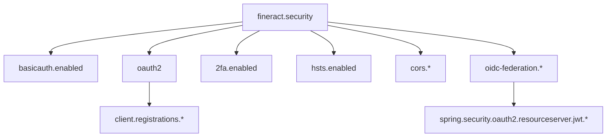
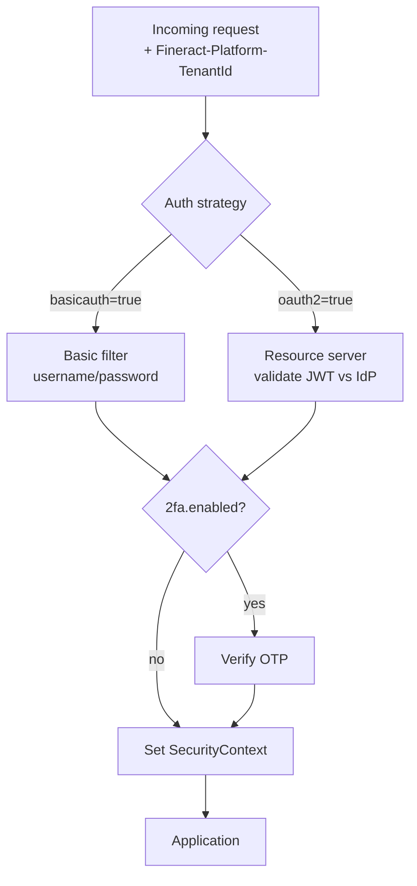

Apache Fineract's security configuration is property-driven and supports three authentication strategies (HTTP Basic, OAuth2 bearer tokens, and OIDC federation), an optional 2FA layer, CORS, and HSTS. All knobs are read through the `fineract.security.*` subtree of `FineractProperties` plus standard `spring.security.oauth2.*` keys when wiring an IdP.

## The security property tree



## The four primary toggles

```properties
fineract.security.basicauth.enabled=${FINERACT_SECURITY_BASICAUTH_ENABLED:true}
fineract.security.oauth2.enabled=${FINERACT_SECURITY_OAUTH_ENABLED:false}
fineract.security.2fa.enabled=${FINERACT_SECURITY_2FA_ENABLED:false}
fineract.security.hsts.enabled=${FINERACT_SECURITY_HSTS_ENABLED:false}
```

- **basicauth.enabled** wires `BasicAuthTenantDetailsService` and the standard Spring Security basic filter chain. Username and password are matched against `m_appuser`.
- **oauth2.enabled** turns on JWT bearer-token validation through Spring Security's resource server.
- **2fa.enabled** layers a one-time-passcode flow on top of basic or OAuth2 authentication. The 2FA module lives in `twofactor-tests` and `fineract-security`.
- **hsts.enabled** sets the HTTP Strict-Transport-Security response header so browsers refuse plain HTTP.

In practice, you pick **basic OR oauth2**; you do not enable both. The OIDC federation flag (below) can sit alongside oauth2 to add tenant-claim mapping.

## CORS

The CORS sub-block configures the global `CorsConfiguration`:

```properties
fineract.security.cors.enabled=${FINERACT_SECURITY_CORS_ENABLED:true}
fineract.security.cors.allowed-origin-patterns=${FINERACT_SECURITY_CORS_ALLOWED_ORIGIN_PATTERNS:*}
fineract.security.cors.allowed-methods=${FINERACT_SECURITY_CORS_ALLOWED_METHODS:*}
fineract.security.cors.allowed-headers=${FINERACT_SECURITY_CORS_ALLOWED_HEADERS:*}
fineract.security.cors.exposed-headers=${FINERACT_SECURITY_CORS_EXPOSED_HEADERS:*}
fineract.security.cors.allow-credentials=${FINERACT_SECURITY_CORS_ALLOW_CREDENTIALS:true}
```

Defaults are permissive (`*`) for development; production deployments restrict origin patterns and headers to known web clients.

## OAuth2 client registrations

Fineract can act as an authorization-code OAuth2 client (for example, to obtain tokens for a front-end SPA). Each registration becomes an entry under `fineract.security.oauth2.client.registrations.{name}`:

```properties
fineract.security.oauth2.client.registrations.frontend-client.client-id=${FINERACT_SECURITY_OAUTH2_CLIENTS_FRONTEND_ID:frontend-client}
fineract.security.oauth2.client.registrations.frontend-client.scopes=${FINERACT_SECURITY_OAUTH2_CLIENTS_FRONTEND_SCOPES:read,write}
fineract.security.oauth2.client.registrations.frontend-client.authorization-grant-types=${FINERACT_SECURITY_OAUTH2_CLIENTS_FRONTEND_GRANTS:authorization_code,refresh_token}
fineract.security.oauth2.client.registrations.frontend-client.redirect-uris=${FINERACT_SECURITY_OAUTH2_CLIENTS_FRONTEND_REDIRECT:http://localhost:3000/callback}
fineract.security.oauth2.client.registrations.frontend-client.require-authorization-consent=${FINERACT_SECURITY_OAUTH2_CLIENTS_FRONTEND_CONSENT:false}
```

Add more registrations by repeating the key prefix with a new short name (`{name}`). The list binds into a `Map<String, ClientRegistration>` inside `FineractSecurityProperties`.

## OIDC federation

Fineract supports federating identity to an external IdP (Keycloak, Azure AD, Okta, Auth0) via OpenID Connect. The federation block is independent of the OAuth2 client block — federation governs how incoming JWT claims map onto Fineract users and tenants.

```properties
fineract.security.oidc-federation.enabled=${FINERACT_SECURITY_OIDC_FEDERATION_ENABLED:false}
fineract.security.oidc-federation.tenant-claim-name=${FINERACT_SECURITY_OIDC_TENANT_CLAIM:fineract_tenant}
fineract.security.oidc-federation.username-claim=${FINERACT_SECURITY_OIDC_USERNAME_CLAIM:preferred_username}
fineract.security.oidc-federation.auto-create-user=${FINERACT_SECURITY_OIDC_AUTO_CREATE_USER:false}
fineract.security.oidc-federation.default-roles=${FINERACT_SECURITY_OIDC_DEFAULT_ROLES:}
fineract.security.oidc-federation.provider=${FINERACT_SECURITY_OIDC_PROVIDER:generic}
fineract.security.oidc-federation.post-logout-redirect-uri=${FINERACT_SECURITY_OIDC_POST_LOGOUT_URI:}
```

- `provider` accepts values from the `OidcFederationType` enum in `fineract-security` (`generic`, plus vendor-specific codes).
- `tenant-claim-name` names the JWT claim that holds the Fineract tenant identifier — the value flows into the same tenant resolution path used by `Fineract-Platform-TenantId`.
- `username-claim` selects which claim becomes the Fineract username.
- `auto-create-user` provisions an `m_appuser` row on first login.
- `default-roles` is a comma-separated list of role names assigned to auto-created users.

The IdP itself is wired through the standard Spring keys (commented in the property file as a hint):

```properties
# spring.security.oauth2.resourceserver.jwt.issuer-uri=https://your-idp.example.com/realm/your-realm
# spring.security.oauth2.resourceserver.jwt.jwk-set-uri=https://your-idp.example.com/.../certs
```

In env-var form:

- `SPRING_SECURITY_OAUTH2_RESOURCESERVER_JWT_ISSUER_URI`
- `SPRING_SECURITY_OAUTH2_RESOURCESERVER_JWT_JWK_SET_URI`

## Authentication flows at a glance



When `oidc-federation.enabled=true` the resource server path also performs claim mapping into a Fineract user/tenant pair using the `tenant-claim-name` and `username-claim` settings.

## Two-factor authentication

The 2FA layer ships with its own property surface (read by the `fineract-security` module). It is OFF by default and exposes:

- `fineract.security.2fa.enabled` — master switch.
- Per-channel deliverability (email, SMS) configured through the tenant's configuration table rather than properties, because keys vary per tenant.

Integration tests for 2FA live in the `twofactor-tests` module, which boots Fineract with the toggle on and exercises the OTP flow.

## HSTS

```properties
fineract.security.hsts.enabled=${FINERACT_SECURITY_HSTS_ENABLED:false}
```

When `true`, the security filter chain appends `Strict-Transport-Security: max-age=...` to every response. Enable only when the deployment is exclusively reached over HTTPS — otherwise browsers will refuse subsequent HTTP requests.

## Password policy

Password policy in Fineract is not driven by properties but by tenant-scoped configuration in the `m_password_validation_policy` table. Operators configure the policy through the `PasswordValidationPolicy` admin endpoints. The only related property is `fineract.database.defaultMasterPassword` which seeds the initial admin user during bootstrap:

```properties
fineract.database.defaultMasterPassword=${FINERACT_DEFAULT_MASTER_PASSWORD:fineract}
```

Override this in production — the default `fineract` is intended only for local development.

## SQL injection guard

A defence-in-depth feature for endpoints that accept user-written SQL (e.g. custom reports). The patterns are configured as a list:

```properties
fineract.sql-validation.patterns[0].name=inject-blind
fineract.sql-validation.patterns[0].pattern=(?i).*[\\\"'`]?\\s*[and|or]+...
fineract.sql-validation.patterns[1].name=detect-entry-point
fineract.sql-validation.patterns[2].name=inject-timing
fineract.sql-validation.patterns[3].name=detect-backend
fineract.sql-validation.patterns[4].name=detect-column
```

These bind to `FineractProperties.FineractSqlValidationProperties.patterns`. Operators can add custom patterns by appending higher-indexed entries.

## IP tracking

```properties
fineract.ip-tracking.enabled=${FINERACT_CLIENT_IP_TRACKING_ENABLED:false}
```

When on, the client IP is recorded against authenticated requests, supporting audit and rate-limiting use cases.

## Correlation IDs

```properties
fineract.correlation.enabled=${FINERACT_LOGGING_HTTP_CORRELATION_ID_ENABLED:false}
fineract.correlation.header-name=${FINERACT_LOGGING_HTTP_CORRELATION_ID_HEADER_NAME:X-Correlation-ID}
```

A request filter inserts the header into MDC so logs across services can be stitched together.

## Insecure HTTP client

For development and CI where Fineract must call self-signed test services:

```properties
fineract.insecure-http-client=${FINERACT_INSECURE_HTTP_CLIENT:true}
fineract.client-connect-timeout=${FINERACT_CLIENT_CONNECT_TIMEOUT:30}
fineract.client-read-timeout=${FINERACT_CLIENT_READ_TIMEOUT:30}
fineract.client-write-timeout=${FINERACT_CLIENT_WRITE_TIMEOUT:30}
```

Set `FINERACT_INSECURE_HTTP_CLIENT=false` in production.

## Deployment recipes

### Local dev (basic auth + 2FA off)
```bash
export FINERACT_SECURITY_BASICAUTH_ENABLED=true
export FINERACT_SECURITY_OAUTH_ENABLED=false
```

### OAuth2 resource server against Keycloak
```bash
export FINERACT_SECURITY_BASICAUTH_ENABLED=false
export FINERACT_SECURITY_OAUTH_ENABLED=true
export FINERACT_SECURITY_OIDC_FEDERATION_ENABLED=true
export FINERACT_SECURITY_OIDC_PROVIDER=generic
export FINERACT_SECURITY_OIDC_TENANT_CLAIM=fineract_tenant
export SPRING_SECURITY_OAUTH2_RESOURCESERVER_JWT_ISSUER_URI=https://keycloak.example.com/realms/fineract
```

### Public production node
```bash
export FINERACT_SECURITY_HSTS_ENABLED=true
export FINERACT_SECURITY_CORS_ALLOWED_ORIGIN_PATTERNS=https://app.example.com
export FINERACT_SECURITY_CORS_ALLOW_CREDENTIALS=true
export FINERACT_INSECURE_HTTP_CLIENT=false
```

## See also

- [application.properties reference](/config/application-properties)
- [Environment variables reference](/config/environment-variables)
- [Feature flags and instance modes](/config/feature-flags-and-modes)
