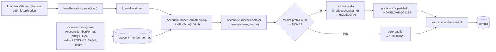

Apache Fineract assigns a human-readable account number to every client, loan, savings, share, group, and centre. The defaults are bare numeric IDs, but most deployments want a richer scheme — branch prefixes, product codes, custom characters — so the platform exposes a small configuration model and a pluggable generator. The configuration sits in the `org.apache.fineract.infrastructure.accountnumberformat` package in `fineract-core`; the generator that consumes it (`AccountNumberGenerator`) and the REST resource (`AccountNumberFormatsApiResource`) live in `fineract-provider`.

This page documents the entities, the entity-type catalogue, the prefix enumeration, and the generator that ties them together.

## Package layout

```text
fineract-core/.../infrastructure/accountnumberformat/
├── data/        — DTOs (AccountNumberFormatData, …)
├── domain/      — JPA entities + enumerations
│   ├── AccountNumberFormat.java
│   ├── AccountNumberFormatEnumerations.java
│   ├── AccountNumberFormatLookup.java
│   ├── AccountNumberFormatRepository.java
│   └── EntityAccountType.java
└── service/     — service interfaces + constants
```

The data model is intentionally small: one row per entity type per tenant, and one enumeration listing the entity types.

## The `AccountNumberFormat` entity

`AccountNumberFormat` (`m_account_number_format`) is the configuration row. There is one row per `EntityAccountType` per tenant, enforced by a unique constraint on the account-type column:

```java
@Entity
@Table(name = ACCOUNT_NUMBER_FORMAT_TABLE_NAME,
       uniqueConstraints = { @UniqueConstraint(
           columnNames = { ACCOUNT_TYPE_ENUM_COLUMN_NAME },
           name = ACCOUNT_TYPE_UNIQUE_CONSTRAINT_NAME) })
public class AccountNumberFormat extends AbstractPersistableCustom<Long> {

    @Column(name = ACCOUNT_TYPE_ENUM_COLUMN_NAME, nullable = false)
    private Integer accountTypeEnum;

    @Column(name = PREFIX_TYPE_ENUM_COLUMN_NAME, nullable = true)
    private Integer prefixEnum;

    @Column(name = PREFIX_CHARACTER_COLUMN_NAME, nullable = true)
    private String prefixCharacter;

    public AccountNumberFormat(EntityAccountType entityAccountType,
                               AccountNumberPrefixType prefixType,
                               String prefixCharacter) { … }

    public EntityAccountType getAccountType() {
        return EntityAccountType.fromInt(this.accountTypeEnum);
    }
}
```

Three fields carry the entire model:

* `accountTypeEnum` — which kind of account this format applies to (client, loan, savings, …).
* `prefixEnum` — which dimension to derive the prefix from (office, product, fund, type, …) or `null` for "no prefix".
* `prefixCharacter` — a free-form character to put between the prefix and the numeric ID (typically `-`, `/`, or empty).

The unique constraint means each tenant has at most one format per entity type. Creating a format is therefore an upsert from the operator's point of view, even though the REST API exposes it as a normal POST.

## `EntityAccountType`

The catalogue of account types Fineract knows how to format:

```java
public enum EntityAccountType {

    CLIENT(1, "accountType.client"),
    LOAN(2, "accountType.loan"),
    SAVINGS(3, "accountType.savings"),
    CENTER(4, "accountType.center"),
    GROUP(5, "accountType.group"),
    SHARES(6, "accountType.shares"),
    WORKING_CAPITAL_LOAN(7, "accountType.workingCapitalLoan");
    // …
}
```

| Value | Constant | Used for |
| --- | --- | --- |
| `1` | `CLIENT` | Individual / entity clients. |
| `2` | `LOAN` | Loan accounts. |
| `3` | `SAVINGS` | Savings accounts (regular, fixed, recurring). |
| `4` | `CENTER` | Centres (a JLG aggregation above groups). |
| `5` | `GROUP` | Groups. |
| `6` | `SHARES` | Share accounts. |
| `7` | `WORKING_CAPITAL_LOAN` | Working-capital loan products — a specialised loan flavour. |

The enum exposes `isClientAccount()`, `isLoanAccount()`, `isSavingsAccount()`, `isCenterAccount()`, `isGroupAccount()` predicates so generator code can branch by type without a `switch`.

`AccountNumberFormatLookup` is the small read-side helper that returns the row for a given `EntityAccountType` (or null if none is configured).

## Prefix types

`AccountNumberFormatEnumerations.AccountNumberPrefixType` enumerates the dimensions a prefix can be derived from. The exact members vary by entity but include the canonical ones:

* `NONE` — no prefix, just the numeric ID.
* `OFFICE_NAME` — branch / office name (or initials) prefix.
* `PRODUCT_NAME` — for loans / savings / shares, the product the account belongs to.
* `CLIENT_TYPE` — for client accounts, the value-list code for the client's type.

The prefix character configured alongside the type is inserted between the prefix value and the numeric ID. So a `LOAN` format with `prefixEnum = PRODUCT_NAME` and `prefixCharacter = "-"` produces account numbers shaped like `HOMELOAN-000123`.

## `AccountNumberGenerator`

`AccountNumberGenerator` (in `fineract-provider`) is the service that consumes an `AccountNumberFormat` to actually produce a string for a freshly-created account. It exposes overloads for each `EntityAccountType` — typically a `generate(Client client, AccountNumberFormat format)` and analogous methods for loans, savings, shares, groups, and centres. The shape:

1. Look up the format row for the entity's type (or use the default if none is configured).
2. Compute the prefix value from the indicated dimension on the account being created (office name, product short name, …).
3. Concatenate `prefix + prefixCharacter + zeroPaddedId`.

If the prefix is `NONE` (or no format is configured), the generator falls back to the zero-padded primary key — the historical Fineract default.

### Where it is wired in

The generator is called from the create-side write services for every supported entity type — `ClientWritePlatformService`, `LoanWritePlatformService`, `SavingsAccountWritePlatformService`, etc. Right after the entity is persisted and an ID is assigned, the service:

1. Looks up the `AccountNumberFormat` for the entity's type.
2. Calls `AccountNumberGenerator.generate(entity, format)`.
3. Sets the result on the entity's `account_no` column.

Because the lookup is per-tenant, multi-tenant deployments can configure different formats per tenant without code changes.

## REST API — `AccountNumberFormatsApiResource`

The provider-side `AccountNumberFormatsApiResource` exposes the standard CRUD pattern:

| Method | Path | Purpose |
| --- | --- | --- |
| `GET` | `/v1/accountnumberformats/template` | Allowed account types + prefix types per type. |
| `GET` | `/v1/accountnumberformats` | List configured formats. |
| `GET` | `/v1/accountnumberformats/{id}` | Retrieve one format. |
| `POST` | `/v1/accountnumberformats` | Create a format. |
| `PUT` | `/v1/accountnumberformats/{id}` | Update a format. |
| `DELETE` | `/v1/accountnumberformats/{id}` | Delete a format (falls back to default generation). |

### Create example

```json
POST /v1/accountnumberformats
{
  "accountType": 2,
  "prefixType": 102,
  "prefixCharacter": "-"
}
```

Here `accountType=2` is `LOAN` and `prefixType=102` is a `PRODUCT_NAME` prefix. Subsequent loan creations will receive account numbers shaped like `HOMELOAN-000123`. The numeric enum values are returned by `/template` so a UI never has to hardcode them.

## Concept flow



## Operational notes

- **Backfilling.** Changing a format only affects accounts created after the change. Existing account numbers stay as they were — Fineract never rewrites them.
- **Uniqueness.** The generator does not by itself enforce a unique account number; the database column on each entity table does. If your custom prefix scheme can collide, add a unique index on the entity's `account_no` column.
- **Internationalisation.** The `code` returned by `EntityAccountType` (`accountType.loan`, `accountType.savings`, …) is the i18n key the UI should localise.
- **Permissions.** CRUD on `AccountNumberFormat` is gated by the `ACCOUNTNUMBERFORMAT_*` permissions in the standard permissions catalogue.
- **Working capital loans.** `WORKING_CAPITAL_LOAN` is treated as a separate `EntityAccountType` so deployments using both regular and working-capital loan products can have distinct account number schemes per product family.

## Customising the generator

If a deployment needs a scheme that cannot be expressed via `(prefixType, prefixCharacter)` — for example a checksum digit, or a yearly-resetting counter — the right extension point is to subclass or replace `AccountNumberGenerator` with a Spring `@Primary` bean. Because it is a small interface, replacing it does not require touching any write service. Common bespoke variants in production:

* **Year + sequence** — `YYYY/00001`, resetting each January.
* **Branch code + checksum** — Luhn check digit appended.
* **Customer reference echo** — for clients, mirror an external ID supplied at registration.

Whatever the scheme, keep two invariants:

1. The generator is deterministic given the entity + format — re-running it produces the same string.
2. The result fits the column width on the account's table (`account_no VARCHAR(20)` is the standard).

## Worked examples

### Loans by product, "-" separator

Configuration:

```json
{ "accountType": 2, "prefixType": 102, "prefixCharacter": "-" }
```

Behaviour: a loan created against the product "Home Loan" (short name `HOMELOAN`) with ID `123` becomes `HOMELOAN-000000123`.

### Clients by office, no separator

```json
{ "accountType": 1, "prefixType": 101, "prefixCharacter": "" }
```

A client created at office "Mumbai Central" (short code `MUM`) with ID `45` becomes `MUM000000045`.

### Savings, no prefix, zero-padded ID

```json
{ "accountType": 3, "prefixType": 1, "prefixCharacter": "" }
```

Default behaviour: a savings account with ID `7` becomes `000000007`. This is also what every entity gets when no `AccountNumberFormat` row exists at all.

### Shares with both office and "/" separator

```json
{ "accountType": 6, "prefixType": 101, "prefixCharacter": "/" }
```

A share account opened at office `DEL` with ID `12` becomes `DEL/000000012`.

The exact `prefixType` integer values for each entity are returned by the `/v1/accountnumberformats/template` endpoint, so the UI never hardcodes them.

## Read-side surfacing

Once generated, the account number lives on the entity's own table:

- `m_client.account_no`
- `m_loan.account_no`
- `m_savings_account.account_no`
- `m_share_account.account_no`
- `m_group.account_no`

The read APIs surface it in the standard response shape under `accountNo`. Search endpoints index it so tellers can look up clients and accounts by typing the human-friendly number.

## Edge cases

- **Format change after some accounts exist.** Existing rows keep their pre-change account numbers; only new accounts use the new format. There is no built-in renumbering job.
- **Missing prefix value.** If `prefixType=PRODUCT_NAME` but the product has a null/empty short name, the generator falls back to a sensible default (typically the numeric ID). The exact policy depends on the entity-specific generator branch.
- **Office hierarchy.** When `prefixType=OFFICE_NAME`, the generator uses the office *the account belongs to*, not the office of the user creating it. A head-office user creating a loan for a Mumbai branch produces a Mumbai-prefixed account.
- **Working capital loans share the `LOAN` table** but are routed via the `WORKING_CAPITAL_LOAN` entity type during generation — so the two product families can have completely separate prefix schemes even though their rows coexist in `m_loan`.

## Multi-tenant behaviour

Each tenant has its own `m_account_number_format` table, so two tenants on the same database server can configure different schemes independently. The lookup is per-request and uses the standard tenant routing — no special wiring is required.

## Related pages

- [JPA persistence](/core/jpa-persistence) — `AccountNumberFormat` extends `AbstractPersistableCustom`; the generator runs inside the create-side write transactions.
- [Commands framework](/core/commands-framework) — CRUD on account number formats flows through the standard command source pipeline.
