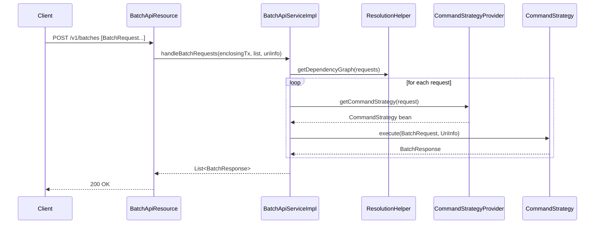

The Batch API is the mechanism by which Apache Fineract collapses many REST calls into a single transactional round-trip. A client posts an array of `BatchRequest` objects, the server fans them out to per-verb **command strategies**, and returns an array of `BatchResponse` objects. This page documents the internal classes that implement that flow, all under `org.apache.fineract.batch` in the `fineract-core` module.

<Info>
The user-facing reference for crafting Batch payloads lives at [/batch/overview](/batch/overview). This page targets contributors who need to extend the dispatcher or add a new strategy.
</Info>

## Package layout

```
org.apache.fineract.batch
├── api/            BatchApiResource, BatchApiResourceSwagger
├── command/        CommandStrategy, CommandStrategyProvider, CommandContext, CommandHandlerRegistry, CommandStrategyUtils
│   └── internal/   UnknownCommandStrategy (rest of the strategies live in fineract-provider)
├── domain/         BatchRequest, BatchResponse, Header
├── exception/      BatchExecutionException
├── serialization/  Gson type adapters for batch payloads
└── service/        BatchApiService, BatchApiServiceImpl, ResolutionHelper
```

Strategies for concrete verbs (apply loan, approve loan, create client, …) live in `fineract-provider` under the same `command/internal/` path so they can depend on portfolio modules.

## End-to-end flow



## REST entry point: `BatchApiResource`

Class: `org.apache.fineract.batch.api.BatchApiResource`.

| Trait | Value |
|-------|-------|
| Path | `/v1/batches` |
| Method | `POST` |
| Consumes | `application/json` |
| Produces | `application/json` |
| Body | JSON array of `BatchRequest` |
| Query param | `enclosingTransaction` (default `false`) |

When `enclosingTransaction=true` every sub-request runs inside one Spring-managed transaction; if any sub-request fails the whole batch is rolled back. When `false` each strategy runs in its own transaction and partial success is allowed. The resource delegates everything to `BatchApiService`.

A companion class `BatchApiResourceSwagger` carries Swagger model annotations so the OpenAPI definition can describe nested request/response shapes that Gson would otherwise erase.

## Service layer: `BatchApiService`

```java
public interface BatchApiService {
    List<BatchResponse> handleBatchRequestsWithoutEnclosingTransaction(
            List<BatchRequest> requestList, UriInfo uriInfo);
    List<BatchResponse> handleBatchRequestsWithEnclosingTransaction(
            List<BatchRequest> requestList, UriInfo uriInfo);
}
```

`BatchApiServiceImpl` is responsible for:

1. Asking `ResolutionHelper` to compute the **request dependency graph** from `reference` fields.
2. Calling `CommandStrategyProvider#getCommandStrategy` for each node.
3. Substituting `$.field` JSON-Path expressions in child bodies with values harvested from parent responses.
4. Aggregating the per-strategy `BatchResponse` objects, preserving order.

<Note>
The implementation uses `TransactionTemplate` with `PROPAGATION_REQUIRES_NEW` so an enclosing batch transaction is independent from any ambient one (e.g. a job worker thread).
</Note>

## Request and response model

### `BatchRequest`

| Field | Type | Purpose |
|-------|------|---------|
| `requestId` | `Long` | Caller-assigned identifier; echoed back on the response. |
| `relativeUrl` | `String` | Path under `/v1/`, e.g. `loans?command=applyLoan`. |
| `method` | `String` | One of `GET`, `POST`, `PUT`, `DELETE`. |
| `headers` | `Set<Header>` | Per-sub-request headers, merged with the outer request. |
| `body` | `String` | Raw JSON body; may contain `$.x` references. |
| `reference` | `Long` | Parent `requestId` that produces values referenced in `body`. |

### `BatchResponse`

| Field | Type | Purpose |
|-------|------|---------|
| `requestId` | `Long` | Echo of the corresponding `BatchRequest.requestId`. |
| `statusCode` | `Integer` | HTTP status the strategy would have returned. |
| `headers` | `Set<Header>` | Response headers (location, idempotency). |
| `body` | `String` | JSON serialised response payload. |

### `Header`

A plain `name`/`value` POJO used both inbound and outbound. Headers from the outer HTTP request (auth tokens, tenant identifier, idempotency key) are propagated automatically by `CommandStrategyUtils`.

## `CommandStrategy` contract

```java
public interface CommandStrategy {
    BatchResponse execute(BatchRequest request, UriInfo uriInfo);
}
```

Every strategy is a Spring bean. The contract is intentionally narrow: take a `BatchRequest`, return a `BatchResponse`. Implementations typically:

- Parse `relativeUrl` path segments via `CommandStrategyUtils.relativeUrlWithoutVersion`.
- Convert the embedded `body` into the concrete DTO the existing JAX-RS resource accepts.
- Delegate to the **same write platform service** the synchronous REST endpoint would call, so behaviour stays in lock-step.
- Wrap the result into a `BatchResponse` with the correct status code.

### `UnknownCommandStrategy`

Located in `fineract-core` (the only strategy that ships in core). It is returned by `CommandStrategyProvider` when no concrete strategy matches `method + relativeUrl`. It returns HTTP **501 Not Implemented** so the client clearly distinguishes a misrouted request from a business failure.

## `CommandStrategyProvider`

Resolves a `BatchRequest` to a `CommandStrategy` by examining `method` and the first two segments of `relativeUrl`. Internally backed by `CommandHandlerRegistry`, a `Map<String, CommandStrategy>` whose keys follow the convention `METHOD_resource_command`, e.g. `POST_loans_applyLoan`.

```java
CommandStrategy strategy = commandStrategyProvider.getCommandStrategy(request);
return strategy.execute(request, uriInfo);
```

If lookup fails, `UnknownCommandStrategy` is returned instead of throwing, so the batch can continue.

## `CommandHandlerRegistry`

A registry seeded at start-up by Spring component scanning of `org.apache.fineract.batch.command.internal`. Adding a new strategy is a three-step exercise:

<Steps>
  <Step title="Implement CommandStrategy">
    Place the class in `command/internal/` and annotate with `@Component(value = "POST_resource_command")`. The bean name is the lookup key.
  </Step>
  <Step title="Reuse existing write services">
    Inject the same `*WritePlatformService` your JAX-RS resource uses. Convert `request.getBody()` to the DTO with Gson.
  </Step>
  <Step title="Map results back">
    Build a `BatchResponse` carrying the resource's status code, body and any headers (e.g. `Location` for created entities).
  </Step>
</Steps>

## `ResolutionHelper`

Implements the rule **"a child request may reference the response of any earlier request whose `requestId` it lists as `reference`"**. Responsibilities:

- Topologically order requests so parents execute first.
- For each child, walk its `body` looking for `$.field` placeholders and substitute them with values picked from the parent's serialised response using the underlying JSON tree.
- Detect cycles and throw `BatchExecutionException` with a clear message.

```jsonc
[
  { "requestId": 1, "method": "POST", "relativeUrl": "clients",
    "body": "{ \"officeId\": 1, \"firstname\": \"Ada\", ... }" },
  { "requestId": 2, "reference": 1,
    "method": "POST", "relativeUrl": "loans",
    "body": "{ \"clientId\": \"$.clientId\", ... }" }
]
```

After request 1 runs, `ResolutionHelper` extracts `clientId` from its response body and rewrites request 2's body before request 2 executes.

## Header propagation

`CommandStrategyUtils` merges three header sources, with later ones winning:

| Source | Examples |
|--------|----------|
| Outer HTTP request | `Authorization`, `Fineract-Platform-TenantId`, `Accept-Language` |
| `BatchRequest.headers` | per-sub-request overrides such as `Idempotency-Key` |
| Strategy-added | `Location` for `201 Created`, `Content-Type` |

<Tip>
Idempotency keys are honoured per sub-request. Re-posting an identical batch will hit the command-source de-duplication path and reuse the prior response when supported by the underlying resource.
</Tip>

## Error handling

`BatchExecutionException` carries the failing `BatchResponse` and is re-thrown by `BatchApiServiceImpl` when running with an enclosing transaction; the framework's exception mapper then converts it into a single error response and rolls back. Without an enclosing transaction, the failure is recorded as one entry in the result list and the next request continues.

<Warning>
A `5xx` from one sub-request will only stop the rest of the batch when `enclosingTransaction=true`. Inspect each `BatchResponse.statusCode` even when the outer HTTP status is `200 OK`.
</Warning>

## Serialization

The `serialization` sub-package registers Gson type adapters so that `BatchRequest.body` can stay a raw `String` over the wire (preserving caller formatting) yet be parsed lazily by individual strategies. This matters because each strategy expects a different DTO shape and central deserialisation would force a union type.

## Test surface

| Test target | What it proves |
|-------------|----------------|
| `BatchApiTest` (integration) | End-to-end fan-out through the resource. |
| Strategy unit tests | Each `*CommandStrategy` is unit-tested by mocking the underlying write service and asserting status + body. |
| `ResolutionHelperTest` | Reference substitution and cycle detection. |

## Adding observability

The dispatcher logs each request at `DEBUG` with `requestId`, `method`, `relativeUrl` and elapsed time. For production tracing, attach the tenant identifier and an `X-Correlation-ID` header upstream — `Header` propagation will carry them into the per-strategy MDC.

## Catalog of bundled strategies

The full list lives in `fineract-provider/src/main/java/org/apache/fineract/batch/command/internal/`. A representative slice:

| Strategy class | Verb / URL |
|----------------|-----------|
| `CreateClientCommandStrategy` | `POST clients` |
| `ActivateClientCommandStrategy` | `POST clients/{id}?command=activate` |
| `ApplyLoanCommandStrategy` | `POST loans` |
| `ApproveLoanCommandStrategy` | `POST loans/{id}?command=approve` |
| `DisburseLoanCommandStrategy` | `POST loans/{id}?command=disburse` |
| `CreateTransactionLoanCommandStrategy` | `POST loans/{id}/transactions` |
| `AdjustLoanTransactionCommandStrategy` | `POST loans/{id}/transactions/{tid}` |
| `CreateChargeCommandStrategy` / `AdjustChargeCommandStrategy` | charge ops by id |
| `CollectChargesCommandStrategy` | `GET loans/{id}/charges` |
| `ApplySavingsCommandStrategy` | `POST savingsaccounts` |
| `CreateSavingsAccountChargeCommandStrategy` | savings charge ops |
| `CreateLoanInterestPauseByLoanIdCommandStrategy` | interest pause |
| `CreateLoanRescheduleRequestCommandStrategy` | reschedule application |
| `ApproveLoanRescheduleCommandStrategy` | reschedule approval |
| `CreateAccountTransferCommandStrategy` | account-to-account transfers |
| `CreateDatatableEntryCommandStrategy` | datatable insert |
| `DeleteDatatableEntryOneToOneCommandStrategy` | datatable delete |
| `*ByExternalId*` variants | every above by external id |
| `ApplyWorkingCapitalLoanCommandStrategy` | working capital flavour |
| `UnknownCommandStrategy` | fallback, returns 501 |

Adding a strategy for an existing JAX-RS endpoint is normally a one-day exercise — the bulk of the code is body parsing and result mapping; business logic stays in the underlying write platform service.

## Idempotency and command source

Every strategy is free to opt into the platform's command-source de-duplication. When an `Idempotency-Key` header is present on the parent HTTP request, `CommandStrategyUtils` propagates it to every sub-request unless the sub-request specifies its own. The downstream write platform service then looks up `m_command_source` and replays the prior result if available, returning the exact same `BatchResponse`.

This makes the Batch API safe to retry from the caller: re-posting the same payload after a network blip will not double-create entities.

## Performance characteristics

| Aspect | Behaviour |
|--------|-----------|
| In-memory cost | Bounded by the size of the request and per-strategy response. No streaming. |
| Throughput | Roughly `min(individual_endpoint_throughput * N, DB_connection_pool)` per batch when not enclosed in a transaction. |
| Latency | Dominated by the slowest sub-request when running with `enclosingTransaction=false`. |
| Concurrency | Sub-requests run sequentially today; the dispatcher does not parallelise. |

<Tip>
For very large batches consider splitting at the client side and pipelining. The dispatcher's single-thread execution model is intentional — most strategies share the same JDBC connection through Spring's transaction manager.
</Tip>

## Related

- Caller-facing documentation: [/batch/overview](/batch/overview).
- Strategies for portfolio verbs live in `fineract-provider/src/main/java/org/apache/fineract/batch/command/internal/` (over a hundred concrete classes).
- The Command Source de-duplication used by individual strategies is documented under the Maker-Checker / command framework pages.
