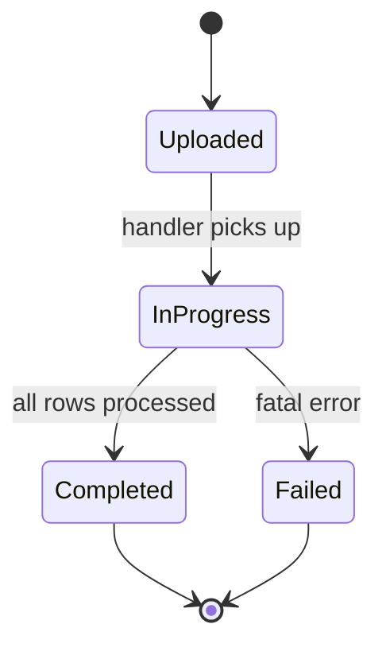
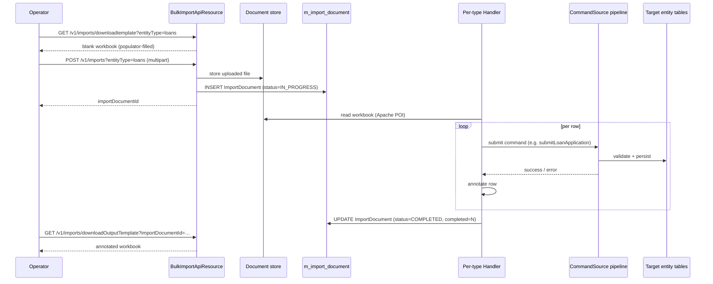

Apache Fineract supports **bulk import** of common business data from filled-in Excel workbooks: offices, staff, clients, loans, savings, journal entries, charts of accounts, and a long tail of related entities. The implementation lives in `org.apache.fineract.infrastructure.bulkimport`, split between `fineract-core` (the catalogue of importable entities and the shared data shape) and `fineract-provider` (template generation, parsing, and the per-template import handlers).

This page covers the entity catalogue, the `ImportDocument` lifecycle, the handler chain, and the API operators use to download templates and upload filled-in workbooks.

## Package layout

```text
fineract-core/.../infrastructure/bulkimport/
├── data/
│   ├── GlobalEntityType.java   — catalogue of importable entities
│   └── ImportData.java         — read DTO for the API
└── service/                    — service interfaces

fineract-provider/.../infrastructure/bulkimport/
├── api/                        — JAX-RS resource
├── data/                       — additional DTOs
├── domain/
│   ├── ImportDocument.java     — tracking entity
│   └── ImportDocumentRepository.java
├── handler/                    — one handler per importable type
├── importhandler/              — sheet → command-source adapters
├── mapping/                    — MapStruct mappers
├── populator/                  — fills the template with reference data
└── service/                    — orchestration services
```

The split is deliberate: the catalogue of entity types is core (everything in Fineract has to know it), while the handlers and the workbook-shaped code stay in the provider module to keep `fineract-core` free of Apache POI.

## `GlobalEntityType` — what can be imported

Every importable entity is registered as a `GlobalEntityType` value with an integer code and a string code used in URLs:

| Code | Constant | What it imports |
| --- | --- | --- |
| `1` | `CLIENTS_PERSON` | Individual clients. |
| `2` | `CLIENTS_ENTITY` | Entity (corporate) clients. |
| `3` | `GROUPS` | Groups. |
| `4` | `CENTERS` | Centres. |
| `5` | `OFFICES` | Branch / office hierarchy. |
| `6` | `STAFF` | Staff members. |
| `7` | `USERS` | App users (rare in practice — usually managed via UI). |
| `8` | `SMS` | SMS campaigns / messages. |
| `9` | `DOCUMENTS` | Document references. |
| `10` | `TEMPLATES` | UGD templates. |
| `11` | `NOTES` | Notes. |
| `12` | `CALENDAR` | Calendar entries. |
| `13` | `MEETINGS` | Group meetings. |
| `14` | `HOLIDAYS` | Holiday definitions. |
| `15` | `LOANS` | Loan applications. |
| `16` | `LOAN_PRODUCTS` | (Used for loan charges import.) |
| `18` | `LOAN_TRANSACTIONS` | Loan repayments and adjustments. |
| `19` | `GUARANTORS` | Guarantor records. |
| `20` | `COLLATERALS` | Collaterals. |
| `21` | `FUNDS` | Funding sources. |
| `22` | `CURRENCY` | Currency definitions. |
| `23` | `SAVINGS_ACCOUNT` | Savings account openings. |
| `24` | `SAVINGS_CHARGES` | Savings charges. |
| `25` | `SAVINGS_TRANSACTIONS` | Savings deposits and withdrawals. |
| `26` | `SAVINGS_PRODUCTS` | Savings products. |
| `27` | `GL_JOURNAL_ENTRIES` | Manual journal entries. |
| `28` | `CODE_VALUE` | Code values for value lists. |
| `29` | `CODE` | Top-level codes. |
| `30` | `CHART_OF_ACCOUNTS` | GL account hierarchy. |
| `31` | `FIXED_DEPOSIT_ACCOUNTS` | Fixed deposit account openings. |
| `32` | `FIXED_DEPOSIT_TRANSACTIONS` | Fixed deposit transactions. |
| `33` | `SHARE_ACCOUNTS` | Share account openings. |
| `34` | `RECURRING_DEPOSIT_ACCOUNTS` | Recurring deposit openings. |
| `35` | `RECURRING_DEPOSIT_ACCOUNTS_TRANSACTIONS` | Recurring deposit transactions. |
| `36` | `CLIENT` | Generic client lookup type used by importers that take a client reference. |

The enum exposes `fromInt(int)` and `fromCode(String)` so URL handling and SDK code can switch from one representation to the other freely.

## `ImportDocument` lifecycle

Every upload is tracked by an `ImportDocument` row (`m_import_document`). The entity carries:

* `documentId` — the underlying uploaded file (the Excel workbook itself goes through the standard document store).
* `importTime` — when the upload was accepted.
* `endTime` — when processing finished.
* `completed` — how many rows succeeded.
* `totalRecords` — total rows in the input file.
* `entityType` — the `GlobalEntityType` code being imported.
* `importStatus` — `IN_PROGRESS`, `COMPLETED`, `FAILED`, …
* `createdBy` — the `AppUser` that uploaded the file.

The lifecycle is:



Row-level failures do **not** flip the document to `FAILED`. They are captured in the workbook itself — the handler writes an extra `errors` column next to each input row, and at the end of processing the operator downloads the annotated file via `GET /v1/imports/downloadOutputTemplate?importDocumentId=…`. `FAILED` is reserved for failures that prevent the whole sheet from being processed (bad file format, missing required tabs).

## The handler chain

For each `GlobalEntityType` there is one handler class wired in `fineract-provider`. The shape is:

1. **Read** — parse the workbook with Apache POI. Each importable type has a known sheet layout and column order.
2. **Validate** — per-row validation. Required fields, value-list constraints, foreign-key existence.
3. **Translate** — turn each row into a command JSON shaped like the corresponding REST request body.
4. **Execute** — submit the command through the standard `CommandSourceWritePlatformService`, the same pipeline a UI POST would use.
5. **Annotate** — write success / failure back onto the input row.

Because every importer ends up calling the same command pipeline as the REST API, business validation is **never duplicated**: the loan importer goes through `LoanCommandSourceWritePlatformService.submitApplication(...)` exactly like a `POST /v1/loans` would.

### Why command sources

Reusing the command pipeline gives the importer:

* Full audit trail — each imported row appears in `m_portfolio_command_source` with `created_by = <importer user>` and the source row reference.
* Consistent permission checks — `CREATE_LOAN` is required for both the API and the importer.
* Hook firing — every imported entity triggers the same hooks as one created via the API.
* Idempotency where the business commands provide it (e.g. external-ID-based dedup on the create-client command).

## Template generation

Before uploading, operators download a **template workbook** pre-filled with the reference data for their tenant (office list, product list, code values, …). The `populator` package does this — for every entity type there is a populator class that writes the reference sheets so the user's drop-downs are always valid.

Endpoint:

```
GET /v1/imports/downloadtemplate?entityType=loans&officeId=…&staffId=…&dateFormat=…&locale=…
```

The query parameters scope the template — for example, `officeId` filters the staff drop-down to that office's staff. The result is a `.xls` file sized to the tenant.

## REST API

`BulkImportApiResource` (in `fineract-provider/.../bulkimport/api`) exposes:

| Method | Path | Purpose |
| --- | --- | --- |
| `GET` | `/v1/imports/downloadtemplate` | Download a blank, reference-data-populated template for an entity type. |
| `POST` | `/v1/imports` | Upload a filled-in workbook for processing. Multipart upload. |
| `GET` | `/v1/imports` | List the tenant's `ImportDocument` rows. |
| `GET` | `/v1/imports/downloadOutputTemplate` | Download the annotated workbook for a completed import. |

### Upload example (multipart)

```
POST /v1/imports?entityType=loans
Content-Type: multipart/form-data

[file: filled-loans.xls]
```

The response is the `importDocumentId` you can poll for status.

### Status polling

```
GET /v1/imports
→ [
  {
    "importId": 42,
    "importTime": "2024-01-15T10:12:00Z",
    "endTime":    "2024-01-15T10:13:21Z",
    "completed":  148,
    "totalRecords": 150,
    "entityType": "loans",
    "importStatus": "COMPLETED",
    "createdBy": "demo"
  }
]
```

148 of 150 rows succeeded; the remaining two have error messages in the output workbook.

## End-to-end flow



## Operational notes

- **Performance.** Imports run in-process and are not partitioned. For workbooks larger than a few thousand rows, split the file or schedule the upload outside of peak hours. The handler commits per-row so a long import shows progressive results in the database even before the document flips to `COMPLETED`.
- **Validation is reused.** Because each row goes through the same command pipeline as the REST API, you cannot bypass business rules via bulk import. A loan that would fail `POST /v1/loans` will fail the importer too.
- **External IDs.** For idempotent re-imports, fill in the external ID column. The corresponding create commands honour it and will fail duplicates rather than create twins.
- **Permissions.** Uploading requires the `BULKIMPORT_CREATE` permission *and* the underlying entity permission (`CREATE_LOAN`, `CREATE_CLIENT`, …). Operators with the import role but no per-entity write permission will see every row rejected.
- **Hooks fire.** Imports trigger the same [hooks](/core/hooks) as API calls. A large import can therefore generate a large burst of outbound webhook deliveries — coordinate with downstream systems.
- **Code values.** When a column maps to a code value (e.g. client classification), the populator writes the live values from the tenant's `m_code_value` table into a hidden sheet so Excel's data validation can constrain the cell to those values only.

## Customisation

To add a new importer:

1. Add a new value to `GlobalEntityType` with a stable integer + string code.
2. Implement a populator that writes the entity's reference data sheets.
3. Implement a handler that reads the input rows and submits the corresponding command.
4. Register both in the provider's bulk-import configuration so `BulkImportApiResource` can route to them.

The existing handlers are excellent templates — start by copying the closest sibling (e.g. for a new deposit product, copy `FixedDepositImportHandler`).

## Template structure

Each entity type's template follows a stable convention:

- **Sheet 1 — input data.** The columns the operator fills in. The first row is a header row; subsequent rows are records. An `errors` column on the right is reserved for the handler to write back error messages per row.
- **Hidden reference sheets.** One per drop-down dimension — `Offices`, `Staff`, `Products`, `Currencies`, etc. — populated by the per-type populator. Excel data validation references these sheets to constrain input cells.
- **Metadata sheet.** Carries the template version and the entity type code, so the handler can validate that the uploaded workbook matches the route.

Operators should not rename sheets, reorder columns, or change cell types — the handler reads by sheet/column position, not by header text.

## Re-imports and idempotency

Two patterns prevent duplicate creation when an import has to be rerun:

1. **External ID column.** Fill it in for every row. The create commands (`POST /v1/loans`, `POST /v1/clients`, …) reject duplicates with a clear error, so the handler annotates the existing row as a duplicate rather than creating a twin.
2. **External-keyed lookup.** For transactions (`LOAN_TRANSACTIONS`, `SAVINGS_TRANSACTIONS`), include an external transaction ID so dedup is enforced at the transaction layer.

Without an external ID, a rerun creates new entities for every row that succeeded the first time. There is no built-in "delete-and-replay" path — operators write a corrective journal entry or use the soft-delete APIs.

## Concurrency

Imports are not exclusive. Two operators can upload different entity types at the same time, or even the same entity type, and the handlers will run them concurrently. The command pipeline serialises at the per-row level (each row is its own transaction), so simultaneous imports will not corrupt state, but they can contend on locks (e.g. two imports of office-scoped entities both targeting the same parent office). For very large imports, scheduling them sequentially is more predictable.

## Related pages

- [Commands framework](/core/commands-framework) — every imported row submits a command source.
- [Hooks](/core/hooks) — imports fire hooks just like API mutations.
- [JPA persistence](/core/jpa-persistence) — `ImportDocument` follows the standard audited entity pattern.
