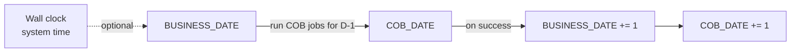

Apache Fineract decouples the "wall-clock" date from the **business date** the platform uses for posting transactions, accruing interest and ageing loans. This separation lets operators replay an end-of-day, freeze processing, or run a Close-Of-Business (COB) batch deterministically. The implementation lives in `org.apache.fineract.infrastructure.businessdate` in the `fineract-core` module.

## Package layout

```
org.apache.fineract.infrastructure.businessdate
├── api/         BusinessDateApiResource
├── command/     internal command DTOs for set / increase-by-one
├── data/        BusinessDateData transport object
├── domain/      BusinessDate (entity), BusinessDateRepository, BusinessDateType (enum)
├── exception/   BusinessDateActionException
├── handler/     BusinessDateUpdateHandler (Update + UpdateAll)
├── mapper/      MapStruct mapper between entity and DTO
├── service/     Read + Write platform services
└── validation/  request-level validators
```

## Two dates, one platform

`BusinessDateType` enumerates the two supported clocks:

| Type | ID | Description | Typical use |
|------|----|----|-------------|
| `BUSINESS_DATE` | `1` | The current business date used by online transactions. | Repayments, disbursals, fee posting. |
| `COB_DATE` | `2` | The Close-Of-Business date — the date COB-style batch jobs are processing. | Loan COB job, accruals, ageing, delinquency. |

<Info>
`COB_DATE` is normally `BUSINESS_DATE − 1` while batch jobs catch up the previous day. After all COB jobs succeed, both dates move forward together.
</Info>



## `BusinessDate` entity

Maps to table `m_business_date`. One row per `BusinessDateType` per tenant.

| Column | Type | Notes |
|--------|------|-------|
| `id` | `BIGINT` | Surrogate primary key. |
| `type` | `VARCHAR` | Enum name (`BUSINESS_DATE` or `COB_DATE`). |
| `date` | `DATE` | The current value of that date. |

The entity is intentionally minimal — there is no per-row history; movement is recorded indirectly through `m_command_source` audit rows generated by the command handler.

`BusinessDateRepository` is a Spring Data JPA repository exposing:

- `findByType(BusinessDateType type)`
- `findAll()`

## Read service

`BusinessDateReadPlatformServiceImpl` returns the current dates either:

- as a `List<BusinessDateData>` for `GET /v1/businessdate`, or
- as a `BusinessDateData` for `GET /v1/businessdate/{type}`.

A convenience method exposes the dates as a `HashMap<BusinessDateType, LocalDate>` for callers (the loan COB job is the largest consumer).

## Write service and validation

`BusinessDateWritePlatformServiceImpl` performs all mutations. Two operations:

| Operation | Effect |
|-----------|--------|
| `updateBusinessDate(JsonCommand)` | Set one specific date type to a date. |
| `increaseDate(JsonCommand)` | Increment **both** `BUSINESS_DATE` and `COB_DATE` by one day in a single transaction. |

Validation rules enforced before the entity is saved:

- The new date must not be after the system date (no future dating).
- `COB_DATE` must always be `≤ BUSINESS_DATE`.
- Backwards moves are gated by a configuration toggle (see [/core/configuration](/core/configuration)).
- The feature is only available when `enable-business-date` is enabled in `c_configuration`.

<Warning>
Moving `BUSINESS_DATE` backwards is destructive: subsequent transactions can be posted with a date already covered by accruals. The validator refuses by default and requires explicit operator confirmation via configuration.
</Warning>

## REST API

Class: `BusinessDateApiResource`, base path `/v1/businessdate`.

### `GET /v1/businessdate`

Returns the array of current business dates.

```jsonc
[
  { "type": "BUSINESS_DATE", "description": "Business Date", "date": [2025, 1, 15] },
  { "type": "COB_DATE",      "description": "Close of Business Date", "date": [2025, 1, 14] }
]
```

### `GET /v1/businessdate/{type}`

Returns a single entry. `type` is one of the enum names.

### `POST /v1/businessdate`

Update one date. Body:

<ParamField body="type" type="string" required>
`BUSINESS_DATE` or `COB_DATE`.
</ParamField>

<ParamField body="date" type="string" required>
ISO date string. Must respect the format `dateFormat` field.
</ParamField>

<ParamField body="dateFormat" type="string" required>
e.g. `yyyy-MM-dd`.
</ParamField>

<ParamField body="locale" type="string" required>
e.g. `en`.
</ParamField>

Successful response carries the standard `CommandProcessingResult` with the changed resource id.

### `POST /v1/businessdate?command=increase_date_by_one_day`

No body. Increments both date types in one transaction. Used by the orchestrator after a successful COB run.

## Command handlers

The package wires two `CommandSourceWritePlatformService`-resolved handlers, both implemented in `BusinessDateUpdateHandler`:

| Action | Entity | Handler logic |
|--------|--------|---------------|
| `UPDATE_BUSINESS_DATE` | `BUSINESS_DATE` | Calls `updateBusinessDate`. |
| `UPDATE_BUSINESS_DATE_UPDATE_ALL` | `BUSINESS_DATE` | Calls `increaseDate` — moves both dates. |

Because the actions go through the command processor, they are subject to maker-checker, idempotency and audit just like any other write.

<Note>
The COB orchestration job (`LOAN_COB`) reads the current dates, performs its work, then invokes the `increase_date_by_one_day` command in a final step. If any of the COB jobs fail, the increase is **not** issued and the operator must investigate before the next day's processing.
</Note>

## Interaction with other subsystems

| Consumer | How it uses business date |
|----------|---------------------------|
| Loan transactions | All `transactionDate` defaults are sourced from `BUSINESS_DATE`. |
| Interest accrual job | Iterates from last accrual date to `COB_DATE` inclusive. |
| Delinquency classification | Computes bucket based on `COB_DATE` minus oldest overdue installment date. |
| Standing instructions | Triggered on `BUSINESS_DATE` change. |
| External events | Each business date change publishes a `BusinessDateUpdatedBusinessEvent` (see [/core/business-events](/core/business-events)). |

## Worked example: closing a day

<Steps>
  <Step title="Operations confirms postings are complete">
    Online traffic is paused or low; no in-flight transactions need today's `BUSINESS_DATE`.
  </Step>
  <Step title="Run LOAN_COB">
    The job picks loans flagged `is_cob_required` and posts accruals, ages installments, classifies delinquency and writes the day's audit.
  </Step>
  <Step title="Promote dates">
    `POST /v1/businessdate?command=increase_date_by_one_day` increments both dates atomically. `BUSINESS_DATE` becomes D+1, `COB_DATE` becomes D.
  </Step>
  <Step title="External event">
    The change emits a `BusinessDateUpdatedBusinessEvent`; downstream consumers can refresh caches or trigger end-of-day reports.
  </Step>
</Steps>

## Configuration flags involved

| Flag (`c_configuration.name`) | Effect |
|------|--------|
| `enable-business-date` | Master switch — when off, all writes are rejected and reads fall back to system date. |
| `enable-automatic-cob-date-adjustment` | When on, write to `BUSINESS_DATE` automatically moves `COB_DATE` to `BUSINESS_DATE − 1`. |

See [/core/configuration](/core/configuration) for how these flags are stored and read.

## Errors

| Exception | When |
|-----------|------|
| `BusinessDateActionException` | Validation failure (future date, COB ahead of business, backwards without permission). |
| `BusinessDateNotFoundException` | `GET /{type}` for a type not yet seeded. |

Both are mapped to HTTP `400`/`404` by the platform's exception mapper.

## Tests

Integration tests under `BusinessDateApiTest` cover the happy path, backwards-move rejection and the combined "increase by one" command. Unit tests verify the validator independent of the database.

## Reading the business date in code

Application code never reaches into `m_business_date` directly. The two supported access patterns are:

```java
@Service
public class LoanTransactionService {

    private final BusinessDateReadPlatformService businessDateReadService;

    public LocalDate effectiveTransactionDate(LocalDate supplied) {
        if (supplied != null) {
            return supplied;
        }
        return businessDateReadService.retrieveBusinessDates()
                .stream()
                .filter(d -> d.getType().equals(BusinessDateType.BUSINESS_DATE.name()))
                .findFirst()
                .map(BusinessDateData::getDate)
                .orElseGet(LocalDate::now);
    }
}
```

For COB code the equivalent helper resolves `COB_DATE`. A convenience method on the read service returns the two dates as a `Map<BusinessDateType, LocalDate>` so callers can grab both in one call without going through the table layer twice.

## Thread context

Inside Spring Batch tasklets the active business date is also attached to the `FineractContext` thread-local. This avoids re-reading the database for every loan processed during a COB run.

## Liquibase seed

When a new tenant is provisioned, two rows are inserted into `m_business_date`:

| Row | Initial value |
|-----|---------------|
| `BUSINESS_DATE` | The system date at provisioning. |
| `COB_DATE` | `BUSINESS_DATE - 1`. |

Subsequent moves are made exclusively through the REST API. Direct SQL updates are discouraged because they bypass cache eviction and event emission.

## Operator runbook excerpts

<AccordionGroup>
  <Accordion title="Stalled COB — business date not advancing">
    Inspect `m_external_event` for unsent events from the previous COB run; address broker failures before issuing the increase-by-one command.
  </Accordion>
  <Accordion title="Reverse a mistaken move">
    With `enable-business-date` enabled, issue `POST /v1/businessdate` with the previous date. The validator allows backwards moves when no transactions exist in the interim — otherwise it refuses and the operator must reconcile manually.
  </Accordion>
  <Accordion title="Disable the feature temporarily">
    Toggle `enable-business-date` off via [/core/configuration](/core/configuration). Reads then fall back to system date and writes are rejected. Re-enable once the underlying issue is resolved.
  </Accordion>
</AccordionGroup>

## Related

- COB job orchestration: [/jobs/overview](/jobs/overview).
- Event emitted on change: [/core/business-events](/core/business-events).
- Configuration storage: [/core/configuration](/core/configuration).
