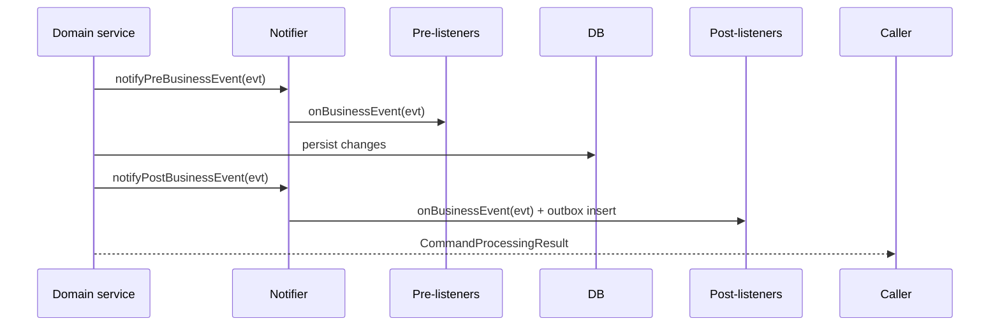
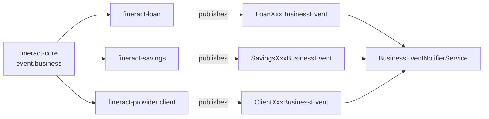

Apache Fineract emits **business events** from inside its domain services so that other services — both inside the same JVM and, via the outbox pipeline, downstream consumers — can react. This page documents the in-process side of the bus: the contract that domain code follows when raising events, the listener interface, and a representative catalog of event types. The base classes live in `org.apache.fineract.infrastructure.event.business` in `fineract-core`.

## Package layout

```
org.apache.fineract.infrastructure.event.business
├── BusinessEventListener.java        - listener SPI
└── domain/
    ├── BusinessEvent.java            - root interface
    ├── AbstractBusinessEvent.java    - base impl with aggregate-root + timestamp
    ├── BulkBusinessEvent.java        - wraps a list of events for batched delivery
    ├── NoExternalEvent.java          - marker: event is in-process only
    └── datatable/                    - datatable-row change events
└── service/
    ├── BusinessEventNotifierService.java
    ├── BusinessEventNotifierServiceImpl.java
    ├── ExternalBusinessEventConfigurationService.java
    ├── ExternalBusinessEventConfigurationServiceImpl.java
    └── TransactionHelper.java
```

Concrete event classes (`LoanApprovedBusinessEvent` etc.) live close to the domain they describe — usually in `fineract-loan`, `fineract-savings`, `fineract-provider` — so the dependency points the right way.

## The contract

### `BusinessEvent<T>`

```java
public interface BusinessEvent<T> {
    T get();
    String getType();
    String getCategory();
    Long getAggregateRootId();
}
```

`T` is the domain entity carried inside the event (e.g. `Loan`, `Client`). `getType()` is the short class name and is the same key used by the [external events configuration](/core/external-events).

### `AbstractBusinessEvent`

Provides a default `getType` (class simple name) and `getCategory` (sub-package) implementation, plus an event timestamp.

### `NoExternalEvent`

A **marker interface**. Events that implement it are delivered only to in-process listeners and never written to the outbox. Useful for transient signals (cache invalidation, logging) that have no downstream consumer.

### `BulkBusinessEvent`

Wraps a list of events that should be delivered together — used by batch jobs that mutate many entities so a single listener invocation can take advantage of bulk-update paths.

## Listener SPI

```java
public interface BusinessEventListener<T extends BusinessEvent<?>> {
    void onBusinessEvent(T event);
}
```

Listeners are normal Spring beans. They are registered with `BusinessEventNotifierService` either at startup (`@PostConstruct`) or dynamically.

## `BusinessEventNotifierService`

The notifier is the central hub.

| Method | Purpose |
|--------|---------|
| `notifyPreBusinessEvent(BusinessEvent<?>)` | Called before the domain write commits. Useful for guards (e.g. block a disbursal if a sanction list match exists). |
| `notifyPostBusinessEvent(BusinessEvent<?>)` | Called after the domain write. Most listeners hook here. |
| `addPreBusinessEventListener(eventType, listener)` | Register a pre-listener. |
| `addPostBusinessEventListener(eventType, listener)` | Register a post-listener. |
| `startExternalEventRecording()` / `stopExternalEventRecording()` / `resetEventRecording()` | Toggle outbox capture for the current thread — used by command handlers to scope external events to a logical operation. |

<Info>
Pre-listeners run inside the domain transaction; throwing from them rolls back the operation. Post-listeners also run inside the transaction but are conventionally side-effect-free (record an event, send a notification request, …). The outbox row is written here.
</Info>



## `ExternalBusinessEventConfigurationService`

Bridges the in-process bus to the outbox pipeline. For each event type, it looks up the corresponding `ExternalEventConfiguration` row and decides whether the post-listener should also write to `m_external_event`. See [/core/external-events](/core/external-events) for the outbox half.

## `TransactionHelper`

Small utility used by listeners that need to defer side-effects until **after** the surrounding transaction commits — e.g. issuing an HTTP webhook only once the database state is durable. It registers a Spring `TransactionSynchronization`.

## Representative event catalog

The full catalog is large; the table below lists the most frequently consumed events. All extend `AbstractBusinessEvent` and live next to their domain.

| Event | Carrier | Fired when |
|-------|---------|-----------|
| `ClientCreateBusinessEvent` | `Client` | A client is created. |
| `ClientActivateBusinessEvent` | `Client` | Client moves to `Active` status. |
| `ClientRejectBusinessEvent` | `Client` | Client application is rejected. |
| `LoanCreatedBusinessEvent` | `Loan` | A loan application is submitted. |
| `LoanApprovedBusinessEvent` | `Loan` | A loan is approved. |
| `LoanRejectedBusinessEvent` | `Loan` | Loan application rejected. |
| `LoanDisbursalBusinessEvent` | `Loan` | Loan is disbursed. |
| `LoanCloseBusinessEvent` | `Loan` | Loan closed (paid in full / written off). |
| `LoanCloseAsRescheduleBusinessEvent` | `Loan` | Closed via reschedule outcome. |
| `LoanAdjustTransactionBusinessEvent` | `LoanTransaction` | A transaction is adjusted. |
| `LoanChargebackTransactionBusinessEvent` | `LoanTransaction` | Chargeback posted. |
| `LoanBalanceChangedBusinessEvent` | `Loan` | Outstanding balance changed. |
| `LoanApplyOverdueChargeBusinessEvent` | `Loan` | Overdue penalty applied by COB. |
| `LoanAcceptTransferBusinessEvent` | `Loan` | Inter-office transfer accepted. |
| `LoanInitiateTransferBusinessEvent` | `Loan` | Transfer initiated. |
| `LoanRejectTransferBusinessEvent` | `Loan` | Transfer rejected. |
| `LoanReassignOfficerBusinessEvent` | `Loan` | Loan officer changed. |
| `LoanRescheduledDueAdjustScheduleBusinessEvent` | `LoanRepaymentScheduleHistory` | Schedule adjusted. |
| `LoanRescheduledDueCalendarChangeBusinessEvent` | `Loan` | Meeting calendar change shifted dates. |
| `LoanInterestRecalculationBusinessEvent` | `Loan` | Daily recalculation produced new accruals. |
| `LoanDelinquencyRangeChangeBusinessEvent` | `Loan` | Delinquency bucket changed. |
| `LoanAccountDelinquencyPauseChangedBusinessEvent` | `Loan` | Pause/resume of delinquency ageing. |
| `LoanAccountSnapshotBusinessEvent` | `Loan` | Daily snapshot for analytics. |
| `LoanApplicationModifiedBusinessEvent` | `Loan` | Application edited before approval. |
| `LoanApprovedAmountChangedBusinessEvent` | `Loan` | Approved amount edited. |
| `BusinessDateUpdatedBusinessEvent` | `BusinessDateData` | `BUSINESS_DATE` or `COB_DATE` moved (see [/core/business-date](/core/business-date)). |

<Tip>
When introducing a new domain operation, raise the corresponding event even if no consumer exists yet — adding a consumer later then requires no change to the domain code.
</Tip>

## Datatable events

The `domain/datatable` sub-package defines events for create / update / delete of datatable rows. They piggy-back on the same bus so downstream systems can be notified of changes to tenant-defined columns (see [/core/data-queries](/core/data-queries)).

## Registering a listener

```java
@Component
@RequiredArgsConstructor
public class GuarantorFundsBlockerListener
        implements BusinessEventListener<LoanApprovedBusinessEvent> {

    private final BusinessEventNotifierService notifier;
    private final GuarantorWritePlatformService guarantorWriteService;

    @PostConstruct
    public void register() {
        notifier.addPostBusinessEventListener(LoanApprovedBusinessEvent.class, this);
    }

    @Override
    public void onBusinessEvent(LoanApprovedBusinessEvent event) {
        guarantorWriteService.blockFundsForApprovedLoan(event.get());
    }
}
```

Listeners run synchronously in the publishing thread; long-running work (e.g. HTTP calls) should be done via `TransactionHelper.afterCommit(() -> ...)` so they execute outside the transaction.

## Threading and recording

`startExternalEventRecording()` / `stopExternalEventRecording()` use a `ThreadLocal` to scope external event capture. A command handler typically:

```java
notifier.startExternalEventRecording();
try {
    writeService.doWork(); // publishes events
} finally {
    notifier.stopExternalEventRecording();
}
```

This lets a single REST request emit a coherent batch of external events, with `BulkBusinessEvent` used to coalesce them when desirable.

## Common patterns

<AccordionGroup>
  <Accordion title="Adding a custom event">
    1. Create a class implementing `BusinessEvent<MyEntity>` (or extending `AbstractBusinessEvent`) next to your domain.
    2. Raise it from the write platform service via `notifyPostBusinessEvent`.
    3. Add a row to `m_external_event_configuration` (Liquibase) if downstream consumers should receive it.
  </Accordion>
  <Accordion title="Pre-event veto">
    Implement a pre-listener that throws a `PlatformApiDataValidationException` to block the operation. Useful for sanctions screening and fraud rules.
  </Accordion>
  <Accordion title="Differentiating in-process from outbox">
    Mark the event with `NoExternalEvent` if it should never reach the outbox — common for cache eviction signals.
  </Accordion>
</AccordionGroup>

## Tests

`BusinessEventNotifierServiceTest` verifies listener dispatch and the recording lifecycle. Integration tests in the loan and client modules assert that the expected events fire on each state transition.

## Listener registration vs Spring `@EventListener`

Fineract predates Spring's generic event mechanism and uses a typed `BusinessEventListener<T>` registry instead. Reasons to keep this style:

| Reason | Detail |
|--------|--------|
| Type safety | The listener method receives the concrete event type, not `ApplicationEvent`. |
| Pre/Post split | `notifyPreBusinessEvent` runs inside the transaction before mutation; `@EventListener` does not model this. |
| Recording state | The notifier owns the per-thread recording flag used to scope outbox writes. |
| Bulk dispatch | `BulkBusinessEvent` natively supports list dispatch — Spring's bus does not. |

New listeners should follow the existing pattern. Avoid mixing `@EventListener` with `BusinessEventListener` for the same event class — only one will be invoked.

## Failure handling

A listener that throws propagates the exception to the calling domain service. The default behaviour rolls the transaction back — this is the intended outcome for pre-listeners enforcing business rules.

Post-listeners that wish to log-and-swallow must catch their own exceptions; the notifier does **not** isolate listener failures. The motivation is consistency: silently swallowing a post-listener error could leave the outbox out of sync with the database.

<Warning>
If a post-listener has an expensive external dependency (e.g. an HTTP webhook), wrap it in `TransactionHelper.afterCommit(...)` so it runs after the transaction settles. Failing inside the transaction would otherwise undo the domain write.
</Warning>

## Threading

All event delivery is synchronous on the publishing thread. Listeners that need to do work asynchronously should post to a `TaskExecutor` from inside their `onBusinessEvent`. The notifier deliberately does **not** dispatch on a background thread, so it never silently swallows callbacks during shutdown.

## Performance notes

- Listener lookup is `O(1)` by event class.
- Bulk events skip per-element listener dispatch when no listener is registered for the inner type — the lookup is done once for the wrapper.
- The notifier itself does no JSON serialisation; that happens in `ExternalEventService` only when the outbox path is taken.

## Domain dependency graph



The arrows point from core to feature modules — the bus does not know about loans or savings, the feature modules know about the bus.

## Backwards compatibility

Existing event classes form part of the public contract. The codebase therefore favours **adding new events** over renaming or removing existing ones. When an event must change, the typical migration is:

1. Add the new event alongside the old one.
2. Mark the old event `@Deprecated` and document the replacement.
3. Keep both for at least one major release cycle.
4. Remove the old event only after consumers have had time to migrate.

## Related

- Outbox / async send: [/core/external-events](/core/external-events).
- Business date events: [/core/business-date](/core/business-date).
- Datatable row events: [/core/data-queries](/core/data-queries).
