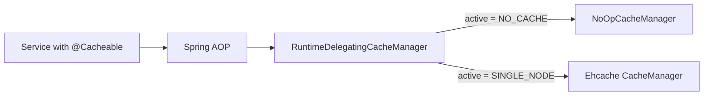

Apache Fineract has a thin caching abstraction in `org.apache.fineract.infrastructure.cache` that lets an operator switch between a **no-cache** strategy and a **single-node Ehcache** strategy at runtime through a REST call. The same mechanism would later be extended to clustered caches; today these are the two providers shipped in `fineract-core`.

## Package layout

```
org.apache.fineract.infrastructure.cache
├── CacheApiConstants.java        - JSON keys + permission names
├── CacheEnumerations.java        - DTO factory for CacheType
├── PlatformCacheConfiguration.java
├── api/CacheApiResource.java     - REST endpoint
├── command/                       - JSON command DTO
├── data/                          - CacheData transport
├── domain/                        - PlatformCache entity, CacheType enum
├── handler/CacheSwitchCommandHandler.java
└── service/                       - read + write platform services + RuntimeDelegatingCacheManager
```

## Cache types

`CacheType` is the enum that names the providers. Both shipped values are defined in `fineract-core`.

| Type | Code | Meaning | Notes |
|------|------|---------|-------|
| `NO_CACHE` | `1` | No caching; every lookup hits the database. | Safe default, used in tests. |
| `SINGLE_NODE` | `2` | In-JVM Ehcache. | Suitable for single-instance deployments. |

`CacheEnumerations.cacheType(int / String)` produces the `EnumOptionData` used in API responses so the UI can render a dropdown.

<Warning>
There is no "distributed" provider out of the box. Running multiple Fineract pods with `SINGLE_NODE` selected leads to stale caches on the pods that did not perform the write. For clustered deployments either keep the cache at `NO_CACHE` or front the cluster with an external coordinator.
</Warning>

## Entity: `PlatformCache`

Maps to `m_cache`. Persists which cache type is **active** for the tenant. One row.

| Column | Type | Notes |
|--------|------|-------|
| `id` | `BIGINT` | PK. |
| `cache_type_enum` | `SMALLINT` | One of `CacheType.value`. |

`PlatformCacheRepository` is a `JpaRepository<PlatformCache, Long>` with `findFirstBy()` semantics.

## Configuration: `PlatformCacheConfiguration`

A Spring `@Configuration` that builds the Ehcache `CacheManager` and registers it together with a `NoOpCacheManager`. The two are then exposed to the rest of the application through `RuntimeDelegatingCacheManager`.

| Cache region | Backed by | Purpose |
|--------------|-----------|---------|
| `usersByUsername` | Ehcache | Avoid a DB hit on every authenticated request. |
| `users` | Ehcache | User entity by id. |
| `usersByOffice` | Ehcache | Resolve office-scoped user lists. |
| `tenantsById` | Ehcache | Multi-tenant connection resolution. |
| `payment-types-with-code` | Ehcache | Payment-type lookups during transaction posting. |
| `code-values-by-code-name` | Ehcache | Code-value lookups (see [/core/codes](/core/codes)). |
| `offices-for-dropdown` | Ehcache | UI dropdowns. |

The exact region list is driven by the `@Cacheable` annotations in service code; the configuration only declares default settings (TTL, max entries).

## `RuntimeDelegatingCacheManager`

This class implements Spring's `CacheManager` interface but delegates at runtime to either the Ehcache manager or the no-op manager depending on the value of `PlatformCache.cache_type_enum`.



Switching providers is therefore a single field flip on `PlatformCache` followed by a manager refresh — application code is unaware.

## REST API

Class: `CacheApiResource`, base path `/v1/caches`.

### `GET /v1/caches`

Returns the list of supported cache providers, marking the active one.

```jsonc
[
  { "id": 1, "code": "cache.no.cache",     "value": "No cache",    "selected": false },
  { "id": 2, "code": "cache.single.node",  "value": "Single node", "selected": true }
]
```

### `PUT /v1/caches`

Switch the active provider. Body:

<ParamField body="cacheType" type="integer" required>
`1` for `NO_CACHE`, `2` for `SINGLE_NODE`.
</ParamField>

Permission: `UPDATE_CACHE` (see `CacheApiConstants`).

Response is the standard `CommandProcessingResult` with the change set.

<Note>
Switching from Ehcache to `NO_CACHE` evicts all regions. Switching the other way starts with empty regions — repeat lookups warm them up.
</Note>

## Command handler

`CacheSwitchCommandHandler` is registered for action `UPDATE` on entity `CACHE`. It:

1. Parses the body into the command DTO.
2. Validates `cacheType` against `CacheType` values.
3. Updates `PlatformCache.cache_type_enum`.
4. Calls `RuntimeDelegatingCacheManager.switchToCache(...)` to swap delegates.
5. Returns a `CommandProcessingResult` with the new id.

Because it runs through `CommandSource`, the switch is recorded in the audit log and (when configured) is subject to maker-checker.

## `CacheApiConstants`

| Constant | Value | Used for |
|----------|-------|----------|
| `RESOURCENAME` | `"CACHE"` | Command source `entity`. |
| `cacheTypeParameter` | `"cacheType"` | JSON key in request body. |
| `UPDATE_CACHE` | permission name | RBAC check. |

## Operational guidance

| Situation | Recommended provider |
|-----------|----------------------|
| Single Fineract pod, low write churn | `SINGLE_NODE` (default). |
| Multi-pod active/active | `NO_CACHE` (until a distributed provider ships) or use sticky sessions. |
| Hot-path benchmarking / integration tests | `NO_CACHE` — avoids hidden state across test cases. |
| Production with a warm-up grace period | Start `NO_CACHE`, flip to `SINGLE_NODE` after data migrations stabilise. |

<Tip>
Cache regions of interest are most often `usersByUsername` (auth latency) and `code-values-by-code-name` (lookup latency during loan and client writes). Watch these in JMX to verify the provider switch took effect.
</Tip>

## Adding a new region

<Steps>
  <Step title="Annotate the service method">
    Use `@Cacheable("my-region")` or `@CacheEvict("my-region")` on the read or write method.
  </Step>
  <Step title="Declare defaults">
    Add the region to `PlatformCacheConfiguration` with TTL, max entries and statistics-on setting.
  </Step>
  <Step title="Validate eviction on writes">
    Any service that mutates the cached data must carry `@CacheEvict`. Forgetting this leaves stale data in `SINGLE_NODE` mode until restart.
  </Step>
</Steps>

## Failure modes

| Symptom | Likely cause | Resolution |
|---------|--------------|-----------|
| API returns the new cache type but reads still slow | Region not annotated `@Cacheable`. | Add annotation, redeploy. |
| Two pods serve different user data | `SINGLE_NODE` selected in a multi-pod deployment. | Switch to `NO_CACHE` or use sticky routing. |
| `OutOfMemoryError` after long uptime | Region TTL set to forever, max-entries too high. | Tighten settings in `PlatformCacheConfiguration`. |

## Worked example — switching providers

<Steps>
  <Step title="Inspect current state">
    `GET /v1/caches` returns the two providers; `selected: true` on one of them. For a fresh tenant this is usually `NO_CACHE` until an operator switches it.
  </Step>
  <Step title="Switch to single-node">
    `PUT /v1/caches` with body `{"cacheType": 2}`. The handler updates `m_cache`, flips `RuntimeDelegatingCacheManager` and returns a `CommandProcessingResult`.
  </Step>
  <Step title="Verify hits">
    Run a few authenticated requests, then inspect JMX for `usersByUsername.Hits` rising. If it does not move, check that the user service still has `@Cacheable` and that the same JVM is being hit.
  </Step>
  <Step title="Switch back">
    `PUT /v1/caches` with `{"cacheType": 1}` clears all regions and reverts to no-op. Subsequent reads go straight to the database.
  </Step>
</Steps>

## FAQ

<AccordionGroup>
  <Accordion title="Does switching to NO_CACHE evict existing entries?">
    Yes. The switch drops references to the Ehcache regions, and the next access through `RuntimeDelegatingCacheManager` returns the no-op variant.
  </Accordion>
  <Accordion title="Can I add a Redis or Hazelcast provider?">
    Yes — implement a Spring `CacheManager` and integrate it through `RuntimeDelegatingCacheManager`. You will need to extend `CacheType` and the API constants. Cluster-wide eviction is the harder part: the existing eviction annotations are per-JVM.
  </Accordion>
  <Accordion title="What happens if I disable a region's @Cacheable?">
    Reads bypass the cache and hit the DB. The region disappears from JMX after the next restart. Pre-existing `@CacheEvict` annotations become no-ops.
  </Accordion>
</AccordionGroup>

## Tests

The `CacheApiTest` integration test toggles the cache type and asserts both the returned value and the runtime behaviour of `usersByUsername` (cached vs not). Unit tests cover the `RuntimeDelegatingCacheManager` switch logic.

## Region-by-region notes

<AccordionGroup>
  <Accordion title="usersByUsername">
    Loaded on every authenticated REST request. Eviction happens on user create / update / password change. With `NO_CACHE`, expect one extra `SELECT` per request — usually negligible compared to the platform's JDBC overhead but observable on tight auth-heavy benchmarks.
  </Accordion>
  <Accordion title="code-values-by-code-name">
    Read by `CodeValueRepositoryWrapper` (see [/core/codes](/core/codes)) on every domain write that consults a code value (client identifier type, loan purpose, gender, address type). Eviction is wired on `m_code_value` writes.
  </Accordion>
  <Accordion title="tenantsById">
    Used by the multi-tenant resolver to map the `Fineract-Platform-TenantId` header to a data source. Eviction happens on tenant provisioning. Stale entries here are dangerous because they route writes to the wrong database.
  </Accordion>
  <Accordion title="payment-types-with-code">
    Cached for the duration of a transaction posting batch. Refreshed when payment types are added through the configuration UI.
  </Accordion>
</AccordionGroup>

## Tracing cache effects

The platform exposes Ehcache JMX beans when `SINGLE_NODE` is active. Useful gauges:

| MBean | What it tells you |
|-------|-------------------|
| `LocalHeap.size` | Number of entries currently held. |
| `Hits` / `Misses` | Effectiveness of the region. |
| `Eviction` | How often the size cap was hit. |
| `Expiry` | TTL-based evictions. |

A region that shows zero hits in production is a sign that the `@Cacheable` annotation is misconfigured (wrong region name) or that the region is never repeatedly queried.

## Interaction with other subsystems

| Subsystem | Cache regions consulted |
|-----------|------------------------|
| [/core/codes](/core/codes) | `code-values-by-code-name`, `code-values-by-code-id` |
| Authentication | `usersByUsername`, `users` |
| Multi-tenancy | `tenantsById` |
| Payment posting | `payment-types-with-code` |
| Office hierarchy | `offices-for-dropdown` |
| Configuration | `configurationByName` (see [/core/configuration](/core/configuration)) |

## Cold start behaviour

When Fineract boots:

1. `PlatformCacheConfiguration` constructs both the Ehcache `CacheManager` and the no-op manager unconditionally.
2. `RuntimeDelegatingCacheManager` is initialised with the no-op manager as default.
3. The first read of `m_cache` (during the first authenticated request) flips the delegate to the persisted choice.

The reason for starting with no-op is to avoid an Ehcache initialisation failure (e.g. disk persistence path missing) from preventing the server from accepting traffic. If `m_cache` is unreachable, the system stays on no-op and logs a warning.

## Implementation notes

- The Ehcache manager uses on-heap storage only. Disk persistence is intentionally not enabled because cache entries (codes, users, tenants) are cheap to repopulate from the database.
- Region settings live in `PlatformCacheConfiguration` and not in an `ehcache.xml` file — keeping configuration in Java keeps it close to the annotations that use it.
- `RuntimeDelegatingCacheManager.switchToCache(CacheType)` is `synchronized` so a switch in progress blocks concurrent reads on the cache manager.

## Migration from older versions

Older Fineract releases shipped a `MULTI_NODE` (Hazelcast) cache type. That implementation is no longer included — the enum value, if encountered in an existing `m_cache` row, is treated as `NO_CACHE` until an operator explicitly switches it.

## Related

- The cache is heavily used by [/core/codes](/core/codes) and the user/tenant subsystems.
- Cache eviction is a part of every command handler that writes to a `@Cacheable` region — see the maker-checker pages for the broader command framework.
- `configurationByName` belongs to [/core/configuration](/core/configuration) and follows the same eviction discipline described here.
