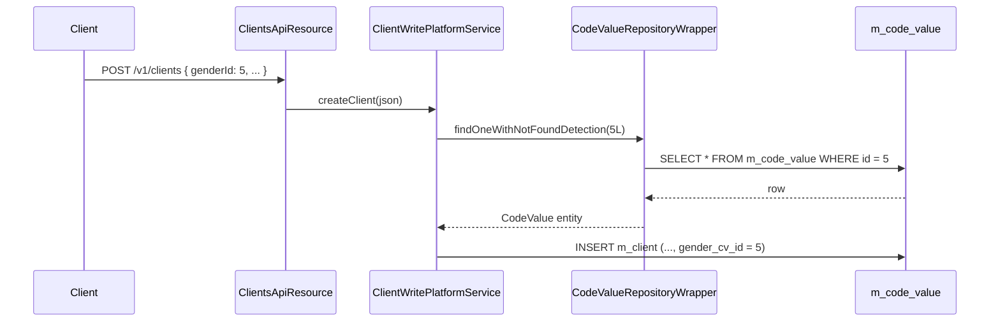

Apache Fineract represents almost every soft-enumeration — gender, identifier type, loan purpose, address type, marital status, and so on — through the **Code / CodeValue** pair. A `Code` is a category, a `CodeValue` is one of its options, and the rest of the platform looks them up by name. The classes live in `org.apache.fineract.infrastructure.codes` in `fineract-core`.

## Package layout

```
org.apache.fineract.infrastructure.codes
├── CodeConstants.java
├── api/        Swagger model classes (CodesApiResourceSwagger, CodeValuesApiResourceSwagger)
├── data/       CodeData, CodeValueData transports
├── domain/     Code, CodeValue, repositories, RepositoryWrapper
├── exception/  CodeNotFoundException, CodeValueNotFoundException, SystemDefinedCodeCannotBeChangedException
├── mapper/     MapStruct mappers
└── service/    CodeReadPlatformService, CodeValueReadPlatformService
```

The REST resources (`CodesApiResource`, `CodeValuesApiResource`) live in `fineract-provider`; only the domain and read service live in core because they are dependencies of many core entities.

## Entities

### `Code`

Maps to `m_code`.

| Column | Type | Notes |
|--------|------|-------|
| `id` | `BIGINT` | PK. |
| `code_name` | `VARCHAR(100)` | Unique category name. Used as the lookup key. |
| `is_system_defined` | `BOOLEAN` | When `true` the code is seeded by Liquibase and cannot be deleted. |

A `Code` has `@OneToMany List<CodeValue> values` with cascade-all. Deleting a non-system code deletes its values.

### `CodeValue`

Maps to `m_code_value`.

| Column | Type | Notes |
|--------|------|-------|
| `id` | `BIGINT` | PK — what other tables actually store as FK. |
| `code_id` | `BIGINT` | FK to `m_code`. |
| `code_value` | `VARCHAR(100)` | Display name. |
| `code_description` | `VARCHAR(500)` | Long-form description. |
| `order_position` | `INT` | Sort order in UI dropdowns. |
| `code_score` | `INT` | Numeric score for risk-style codes. |
| `is_active` | `BOOLEAN` | Soft-disabled values stay in DB but disappear from dropdowns. |
| `is_mandatory` | `BOOLEAN` | UI hint — value must be filled when the code is consulted. |

The entity exposes `factory(...)` builders used by the write service to enforce invariants (e.g. `code_value` non-blank, unique within the parent code).

## Repositories

| Class | Purpose |
|-------|---------|
| `CodeRepository` | Spring Data JPA repository for `Code`. |
| `CodeValueRepository` | Repository for `CodeValue`, with derived finders by `code_id` and by `code_id + code_value`. |
| `CodeValueRepositoryWrapper` | Wraps the JPA repository and throws `CodeValueNotFoundException` when a row is missing — the rest of the platform always injects the wrapper. |

## Read services

`CodeReadPlatformService` lists `Code` rows for the codes administration UI.

`CodeValueReadPlatformService` is by far the more important class. Its methods are heavily cached (region `code-values-by-code-name`, see [/core/cache](/core/cache)) because they are called on every client and loan write.

| Method | Returns | Caller examples |
|--------|---------|-----------------|
| `retrieveCodeValuesByCode(String codeName)` | `Collection<CodeValueData>` | Client identifier types, loan purpose dropdowns. |
| `retrieveCodeValue(Long codeValueId)` | `CodeValueData` | When showing a single chosen value. |
| `retrieveAllCodeValues(Long codeId)` | `Collection<CodeValueData>` | Codes admin UI. |

## System codes

Codes seeded by Liquibase with `is_system_defined = true`. They cannot be renamed or deleted, and the write service throws `SystemDefinedCodeCannotBeChangedException` if asked to do so. Common ones:

| Code name | Used by |
|-----------|---------|
| `Gender` | Client demographics. |
| `ClientType` | Person / Entity / Group classification. |
| `ClientClassification` | Risk grading. |
| `Customer Identifier` | Identifier types (passport, national id, …). |
| `LoanPurpose` | Optional purpose on a loan application. |
| `LoanCollateral` | Collateral type dropdown. |
| `AddressType` | Postal / residential / office. |
| `Country` | Address country list. |
| `State` | Address state list. |
| `YesNo` | Generic boolean rendered as a dropdown for datatables. |

<Info>
Adding a row to one of these codes is the supported extension point. Removing a row that is referenced by historical data is rejected by the database FK and surfaced as a domain validation error.
</Info>

## Lookup flow



For dropdown population, the request hits `CodeValueReadPlatformService.retrieveCodeValuesByCode("Gender")`, which is cached and avoids the DB.

## REST endpoints

The resource classes are in `fineract-provider` but, for completeness, they are:

| Endpoint | Purpose |
|----------|---------|
| `GET /v1/codes` | List all codes. |
| `POST /v1/codes` | Create a non-system code. |
| `GET /v1/codes/{codeId}` | One code. |
| `PUT /v1/codes/{codeId}` | Rename a non-system code. |
| `DELETE /v1/codes/{codeId}` | Delete a non-system code. |
| `GET /v1/codes/{codeId}/codevalues` | List values for a code. |
| `POST /v1/codes/{codeId}/codevalues` | Add a value. |
| `PUT /v1/codes/{codeId}/codevalues/{id}` | Edit a value. |
| `DELETE /v1/codes/{codeId}/codevalues/{id}` | Delete a value. |

All writes go through `CommandSource`, so they participate in maker-checker and audit.

## Validators and errors

| Class | Raised when |
|-------|-------------|
| `CodeNotFoundException` | `GET /codes/{id}` for a missing id. |
| `CodeValueNotFoundException` | Wrapper lookup for an unknown `CodeValue` id. |
| `SystemDefinedCodeCannotBeChangedException` | Attempting to delete or rename a system code. |
| `CodeValueNotFoundException` (with code name) | `retrieveCodeValuesByCode` for an unknown code. |

## Typical extension patterns

<AccordionGroup>
  <Accordion title="Adding a new identifier type">
    Insert a row into `m_code_value` under the `Customer Identifier` code. No code change required; existing client APIs accept the new id.
  </Accordion>
  <Accordion title="Letting a datatable column reference a code">
    Define the column with `type = "Dropdown"` and `code = "MyCodeName"` when creating the datatable. The dataqueries layer (see [/core/data-queries](/core/data-queries)) will validate inserts against `m_code_value`.
  </Accordion>
  <Accordion title="Localising display values">
    `code_value` is the raw text shown in dropdowns. For multilingual deployments, store the translation key here and translate in the UI; the platform does not localise these strings server-side.
  </Accordion>
</AccordionGroup>

## Caching

Two regions, both managed by `RuntimeDelegatingCacheManager`:

| Region | Key | TTL |
|--------|-----|-----|
| `code-values-by-code-name` | `(tenant, codeName)` | Until eviction. |
| `code-values-by-code-id` | `(tenant, codeId)` | Until eviction. |

`@CacheEvict` is wired on every write method so that adding or editing a value invalidates the two regions.

<Tip>
If a freshly added code value does not appear in a dropdown after a write, verify the eviction annotations on the write path — the most frequent cause is a custom branch that bypasses the standard write service.
</Tip>

## Tests

| Test | Coverage |
|------|----------|
| `CodeHelperTest` (integration) | Create / list / delete codes. |
| `CodeValueHelperTest` | Same for code values, including duplicate-value rejection. |
| `SystemDefinedCodeTest` | Ensures system codes cannot be deleted. |

## Code-value FK pattern

Most core entities follow this pattern:

```java
@ManyToOne
@JoinColumn(name = "gender_cv_id")
private CodeValue gender;
```

The `_cv_id` suffix is the convention for "FK to `m_code_value`". The same column is exposed in the REST API as a plain id and a separate `genderValue` field carrying the display text in responses.

When updating an entity, the write platform service:

1. Reads the incoming id from `JsonCommand`.
2. Looks up the `CodeValue` through `CodeValueRepositoryWrapper.findOneWithNotFoundDetection(id)`.
3. Optionally cross-checks that the value belongs to the expected code (e.g. that `genderId` points to a value under the `Gender` code).
4. Persists the FK.

## Cross-code validation

The platform does not enforce at the DB level that `genderId` belongs to the `Gender` code — `m_code_value` is a single table indexed only by `code_id`. The check is performed in Java by the write platform service, comparing the `CodeValue.code.codeName` to the expected one.

<Warning>
Inserting code-value ids by raw SQL can produce inconsistent state: the FK exists, but the read services that compose dropdowns will not list a value belonging to a different code. Always go through the API.
</Warning>

## Naming conventions

| Convention | Example |
|------------|---------|
| Code name is `PascalCase` with no spaces | `LoanPurpose`, `Gender` |
| Code value text is human-readable | `"Male"`, `"Vehicle purchase"` |
| FK column is `_cv_id` suffix | `purpose_cv_id`, `address_type_cv_id` |
| Response field carries `Value` suffix | `purposeValue`, `addressTypeValue` |

Adhering to the convention keeps client UIs renderable generically — they can pick the `*Value` field for display and the `*Id` field for editing.

## Permissions

Code administration is gated by four permissions, all under the maker-checker framework:

| Permission | Allows |
|------------|--------|
| `READ_CODE` | List and view codes / values. |
| `CREATE_CODE` | Create a new (non-system) code. |
| `UPDATE_CODE` | Rename a non-system code, edit values. |
| `DELETE_CODE` | Delete a non-system code or a value. |

`READ_CODEVALUE`, `CREATE_CODEVALUE`, etc. exist as finer-grained permissions for the values themselves; both layers are typically enabled together.

## Audit trail

Because all writes go through `CommandSource`, each create / update / delete produces a row in `m_command_source` carrying:

- The action and entity (`CREATE_CODE`, `UPDATE_CODEVALUE`, …).
- The submitting user and timestamp.
- The full JSON command, so a reviewer can see exactly what was changed.

Operators rely on this audit trail when reconstructing why a dropdown value appeared, disappeared or moved in the UI.

## Performance

| Operation | Cost |
|-----------|------|
| `retrieveCodeValuesByCode(name)` | `O(1)` after cache warm-up. |
| Single-value lookup by id (`CodeValueRepositoryWrapper`) | `O(log n)` index lookup, also cached. |
| Code admin reads (`retrieveAllCodes`) | One un-cached `SELECT` — admin pages are not hot paths. |
| Adding a value | Insert + cache eviction of both regions. |

## Liquibase changesets

A new system code is added by a changeset that inserts the `m_code` row, sets `is_system_defined = true`, and then inserts the seed values into `m_code_value`. The changeset should be marked `runOnChange="false"` so re-applying the migration does not duplicate values; idempotency is preserved by including a `preConditions` block that checks for the code's existence.

## Related

- Caching of lookups: [/core/cache](/core/cache).
- Code values referenced from datatable columns: [/core/data-queries](/core/data-queries).
- Business events fired on changes are part of the broader event framework — see [/core/business-events](/core/business-events).
