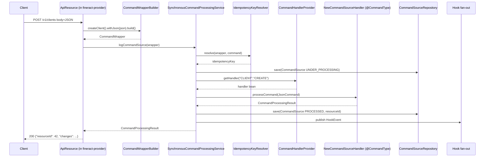

Apache Fineract serializes every write through a small but rigid command bus. This page documents `fineract-core/src/main/java/org/apache/fineract/commands/` in full: the `@CommandType` annotation, the `CommandHandlerProvider` registry, the `CommandSource` JPA audit row, the `SynchronousCommandProcessingService` retry+idempotency loop, and the maker-checker workflow.

## Responsibility

The `commands` package implements:

- **Routing**: given an entity (e.g. `CLIENT`) and an action (e.g. `CREATE`), find the right Spring bean to handle it.
- **Audit**: every write is persisted to `m_portfolio_command_source` so it can be replayed, approved, or rejected.
- **Idempotency**: the same `Idempotency-Key` produces the same response without re-executing.
- **Maker-checker**: writes can be queued for approval before being applied.
- **Retry**: Resilience4j-driven transient-error retry (skipped inside a batch enclosing transaction).
- **Background purge**: a Spring Batch job deletes processed audit rows.

## File inventory

```
fineract-core/src/main/java/org/apache/fineract/commands/
├── annotation/CommandType.java
├── configuration/RetryConfigurationAssembler.java
├── domain/
│   ├── CommandProcessingResultType.java
│   ├── CommandSource.java
│   ├── CommandSourceRepository.java
│   ├── CommandWrapper.java
│   └── CommandWrapperConstants.java
├── exception/
│   ├── CommandNotAwaitingApprovalException.java
│   ├── CommandNotFoundException.java
│   ├── CommandResultPersistenceException.java
│   ├── RollbackTransactionNotApprovedException.java
│   └── UnsupportedCommandException.java
├── handler/NewCommandSourceHandler.java
├── jobs/
│   ├── PurgeProcessedCommandsConfig.java
│   └── PurgeProcessedCommandsTasklet.java
├── provider/CommandHandlerProvider.java
└── service/
    ├── CommandProcessingService.java
    ├── CommandSourceService.java
    ├── CommandWrapperBuilder.java
    ├── IdempotencyKeyGenerator.java
    ├── IdempotencyKeyResolver.java
    ├── PortfolioCommandSourceWritePlatformService.java
    ├── PortfolioCommandSourceWritePlatformServiceImpl.java
    └── SynchronousCommandProcessingService.java
```

| File | Role |
| --- | --- |
| `annotation/CommandType.java` | `@Retention(RUNTIME) @Target(TYPE)` annotation carrying `entity()` and `action()` strings (see source: `package org.apache.fineract.commands.annotation`). |
| `configuration/RetryConfigurationAssembler.java` | Builds the Resilience4j `Retry` used by `SynchronousCommandProcessingService.retryWrapper`. |
| `domain/CommandProcessingResultType.java` | Enum: `PROCESSED`, `AWAITING_APPROVAL`, `REJECTED`, `UNDER_PROCESSING`, `ERROR`. |
| `domain/CommandSource.java` | `@Entity @Table(name = "m_portfolio_command_source")` — the audit row, see snippet below. |
| `domain/CommandSourceRepository.java` | Spring Data repository. |
| `domain/CommandWrapper.java` | Immutable VO carrying everything a handler needs: `actionName`, `entityName`, `entityId`, `subentityId`, `clientId`, `loanId`, `idempotencyKey`, `taskPermissionName`. |
| `domain/CommandWrapperConstants.java` | String constants for actions (`ACTION_CREATE`, `ACTION_UPDATE`, `ACTION_DELETE`, `ACTION_CHANGEPWD`, `ACTION_REGISTER`) and entities (`ENTITY_CACHE`, `ENTITY_CLIENTNOTE`, `ENTITY_CURRENCY`, `ENTITY_DISBURSEMENTDETAIL`, …). |
| `exception/UnsupportedCommandException.java` | Thrown by `CommandHandlerProvider.getHandler` when no handler is registered for `entity|action`. |
| `exception/CommandNotFoundException.java`, `CommandNotAwaitingApprovalException.java`, `RollbackTransactionNotApprovedException.java` | Thrown by the maker-checker path in `PortfolioCommandSourceWritePlatformServiceImpl`. |
| `exception/CommandResultPersistenceException.java` | Wraps a failure to write the `CommandSource` row. |
| `handler/NewCommandSourceHandler.java` | The handler SPI — a single method `CommandProcessingResult processCommand(JsonCommand command)`. |
| `jobs/PurgeProcessedCommandsConfig.java` | Spring Batch `@Configuration` registering the purge job. |
| `jobs/PurgeProcessedCommandsTasklet.java` | The `Tasklet` that deletes successful/processed rows from `m_portfolio_command_source`. |
| `provider/CommandHandlerProvider.java` | Spring-context scanner that indexes all `@CommandType` beans by `entity\|action`. |
| `service/CommandProcessingService.java` | Interface implemented by `SynchronousCommandProcessingService`. |
| `service/CommandSourceService.java` | Persists/loads `CommandSource` rows. |
| `service/CommandWrapperBuilder.java` | Fluent builder used by API resources to construct `CommandWrapper`. |
| `service/IdempotencyKeyGenerator.java`, `IdempotencyKeyResolver.java` | Generate / resolve the `Idempotency-Key` header. |
| `service/PortfolioCommandSourceWritePlatformService.java`, `…Impl.java` | Maker-checker API — approve / reject / rollback a queued command. |
| `service/SynchronousCommandProcessingService.java` | The main loop: resolve idempotency, look up handler, run, audit, fire hooks, return result. |

## Key abstractions

### `@CommandType`

Source: `commands/annotation/CommandType.java`

```java
@Retention(RetentionPolicy.RUNTIME)
@Target(ElementType.TYPE)
@Documented
public @interface CommandType {
    String entity();
    String action();
}
```

Any `@Service`/`@Component` annotated with `@CommandType(entity = "CLIENT", action = "CREATE")` becomes a routable handler. The entity/action pair is the primary key in the registry; you cannot have two handlers for the same pair.

### `NewCommandSourceHandler`

Source: `commands/handler/NewCommandSourceHandler.java`

```java
public interface NewCommandSourceHandler {
    CommandProcessingResult processCommand(JsonCommand command);
}
```

A single method. Implementations are expected to be transactional (`@Transactional`) and return a fully populated `CommandProcessingResult`.

### `CommandHandlerProvider`

Source: `commands/provider/CommandHandlerProvider.java`

`CommandHandlerProvider` implements `ApplicationContextAware` + `InitializingBean`. On `afterPropertiesSet` it asks the context for every bean carrying the `@CommandType` annotation and stuffs them into a `HashMap<String, String>` keyed by `entity + "|" + action`:

```java
final String[] commandHandlerBeans =
    applicationContext.getBeanNamesForAnnotation(CommandType.class);
for (final String commandHandlerName : commandHandlerBeans) {
    final CommandType commandType =
        applicationContext.findAnnotationOnBean(commandHandlerName, CommandType.class);
    registeredHandlers.put(commandType.entity() + "|" + commandType.action(), commandHandlerName);
}
```

Lookup throws `UnsupportedCommandException` when the key is missing:

```java
public NewCommandSourceHandler getHandler(final String entity, final String action) {
    final String key = entity + "|" + action;
    if (!registeredHandlers.containsKey(key)) {
        throw new UnsupportedCommandException(key);
    }
    return (NewCommandSourceHandler) applicationContext.getBean(registeredHandlers.get(key));
}
```

### `CommandWrapper`

Source: `commands/domain/CommandWrapper.java`. Immutable VO with `@Getter` Lombok. Notable fields:

- `actionName`, `entityName` — the routing key.
- `taskPermissionName = actionName + "_" + entityName` — used by `PlatformSecurityContext.authenticatedUser().validateHasPermissionTo(...)`.
- `entityId`, `subentityId` — primary keys for the affected resource and a nested resource (e.g. loan + transaction).
- `idempotencyKey` — propagated from the HTTP `Idempotency-Key` header.
- `clientId`, `loanId`, `savingsId`, `groupId`, `officeId`, `productId`, `creditBureauId`, `organisationCreditBureauId` — contextual links written to `m_portfolio_command_source` so the audit row can be filtered per entity.

Builders: static `wrap(...)` and `fromExistingCommand(...)` plus the long-form constructor used by `CommandWrapperBuilder`.

### `CommandSource`

Source: `commands/domain/CommandSource.java`. JPA entity on `m_portfolio_command_source` extending `AbstractPersistableCustom<Long>`. Key columns:

| Column | Field | Purpose |
| --- | --- | --- |
| `action_name`, `entity_name` | strings | matches `CommandWrapper.actionName`/`entityName` |
| `office_id`, `group_id`, `client_id`, `loan_id`, `savings_account_id` | scoping FKs | filter audits by entity |
| `api_get_url` | `resourceGetUrl` | back-pointer the UI can use to fetch the resource |
| `resource_id`, `subresource_id` | longs | what was created/changed |
| `command_as_json` | `commandAsJson` | the inbound JSON body |

### `SynchronousCommandProcessingService`

Source: `commands/service/SynchronousCommandProcessingService.java`. The main loop. Dependencies (constructor-injected via `@RequiredArgsConstructor`):

```java
private final PlatformSecurityContext context;
private final ApplicationContext applicationContext;
private final ToApiJsonSerializer<Map<String, Object>> toApiJsonSerializer;
private final ToApiJsonSerializer<CommandProcessingResult> toApiResultJsonSerializer;
private final ConfigurationDomainService configurationDomainService;
private final CommandHandlerProvider commandHandlerProvider;
private final IdempotencyKeyResolver idempotencyKeyResolver;
private final CommandSourceService commandSourceService;
private final RetryConfigurationAssembler retryConfigurationAssembler;
private final FineractRequestContextHolder fineractRequestContextHolder;
```

The constants at the top of the class are referenced widely:

- `IDEMPOTENCY_KEY_STORE_FLAG = "idempotencyKeyStoreFlag"`
- `IDEMPOTENCY_KEY_ATTRIBUTE = "IdempotencyKeyAttribute"`
- `COMMAND_SOURCE_ID = "commandSourceId"`

`retryWrapper` only attaches a Resilience4j retry when the call is **not** inside a `/v1/batches` enclosing transaction:

```java
private CommandProcessingResult retryWrapper(Supplier<CommandProcessingResult> supplier) {
    try {
        if (!BatchRequestContextHolder.isEnclosingTransaction()) {
            return retryConfigurationAssembler.getRetryConfigurationForExecuteCommand().executeSupplier(supplier);
        }
        return supplier.get();
    } catch (RuntimeException e) {
        return fallbackExecuteCommand(e);
    }
}
```

`executeCommand(CommandWrapper wrapper, JsonCommand command, boolean isApprovedByChecker)` handles:

1. Retry attempts (`COMMAND_SOURCE_ID` already populated → reuse the existing `CommandSource`).
2. Replay of an existing command (`command.commandId() != null`).
3. Idempotency: `idempotencyKeyResolver.resolve(...)` → `IdempotentCommandProcessSucceedException` / `IdempotentCommandProcessUnderProcessingException` short-circuits the call.
4. Permission check via `context.authenticatedUser().validateHasPermissionTo(taskPermissionName, ...)`.
5. Handler dispatch via `commandHandlerProvider.getHandler(entity, action).processCommand(command)`.
6. Persistence of the result back onto `CommandSource` (status = `PROCESSED` / `ERROR`).
7. Hook fan-out via `HookEvent` + `HookEventSource` (from `infrastructure.hooks`).

### `PortfolioCommandSourceWritePlatformService`

The maker-checker entry point. Methods include `approveEntry(Long id)`, `rejectEntry(Long id)`, `deleteEntry(Long id)`. Throws `CommandNotAwaitingApprovalException` if the caller approves a row not in the `AWAITING_APPROVAL` state, and `RollbackTransactionNotApprovedException` when a transaction must be rolled back because the checker rejected.

### Idempotency

`IdempotencyKeyResolver` first looks for an `Idempotency-Key` HTTP header (placed onto the request by `IdempotencyStoreFilter` in `infrastructure/core/filters/`). If absent, `IdempotencyKeyGenerator` synthesizes one. The key is stored on the `CommandSource` row via `commandSourceService.saveInitialCommand(...)` so retries can find the existing row before re-executing.

### `RetryConfigurationAssembler`

Source: `commands/configuration/RetryConfigurationAssembler.java`. Reads from `fineract.command.retry.*` properties (max attempts, wait duration) and constructs the named Resilience4j `Retry` `executeCommand`. The fallback in `SynchronousCommandProcessingService.fallbackExecuteCommand` translates `RuntimeException`s into either a populated `CommandProcessingResult` with `ERROR` type or rethrows.

### Purge job

`jobs/PurgeProcessedCommandsConfig.java` + `jobs/PurgeProcessedCommandsTasklet.java` register a Spring Batch job that periodically deletes `m_portfolio_command_source` rows whose status is `PROCESSED` and whose `created_date` is older than a configurable window. Useful for keeping the audit table bounded in long-running tenants.

## Control / data flow



## Tabs: writing a handler

<Tabs>
  <Tab title="Annotate">
    ```java
    @Service
    @CommandType(entity = "CLIENT", action = "CREATE")
    @RequiredArgsConstructor
    public class CreateClientCommandHandler implements NewCommandSourceHandler {
        private final ClientWritePlatformService writeService;

        @Override
        @Transactional
        public CommandProcessingResult processCommand(JsonCommand command) {
            return writeService.createClient(command);
        }
    }
    ```
  </Tab>
  <Tab title="Build the wrapper">
    ```java
    final CommandWrapper wrapper = new CommandWrapperBuilder()
            .createClient()
            .withJson(apiRequestBodyAsJson)
            .build();
    ```
    `CommandWrapperBuilder.createClient()` is a thin alias for
    `withEntity("CLIENT").withAction("CREATE")`.
  </Tab>
  <Tab title="Dispatch">
    ```java
    final CommandProcessingResult result =
        commandsSourceWritePlatformService.logCommandSource(wrapper);
    ```
    `PortfolioCommandSourceWritePlatformServiceImpl.logCommandSource` either calls
    `SynchronousCommandProcessingService.executeCommand` immediately, or — when
    maker-checker is on — persists a `CommandSource` with status
    `AWAITING_APPROVAL` for a future approver.
  </Tab>
</Tabs>

## Connections

- **Imports** — `infrastructure.core.api.JsonCommand`, `infrastructure.core.data.CommandProcessingResult`, `infrastructure.core.domain.{BatchRequestContextHolder,FineractRequestContextHolder}`, `infrastructure.configuration.domain.ConfigurationDomainService`, `infrastructure.hooks.event.{HookEvent,HookEventSource}`, `useradministration.domain.AppUser`, `infrastructure.security.service.PlatformSecurityContext`.
- **Dependents** — Every JAX-RS resource that performs a write. Examples: `fineract-portfolio` client/loan resources, `fineract-document` `DocumentApiResource` (which uses `DocumentCreateCommandHandler` etc.), `infrastructure/cache/handler/CacheSwitchCommandHandler`.
- **Persistence** — Liquibase tables `m_portfolio_command_source`, indexes on `(entity_name, action_name)` and `idempotency_key`.

## Gotchas

<Warning>
  `@CommandType` is matched by *bean name → annotation*. If you wrap a handler in a Spring AOP proxy that strips annotations (e.g. an aspect with `proxyTargetClass=false` on an interface-only bean), `CommandHandlerProvider` will silently fail to register it. Symptom: `UnsupportedCommandException` at runtime.
</Warning>

<Warning>
  Inside `BatchApiServiceImpl` the enclosing transaction skips Resilience4j retries. A handler that throws a `ConcurrencyFailureException` in batch mode will *not* be retried — the whole batch will be retried by `BatchApiServiceImpl`'s own outer retry instead.
</Warning>

<Info>
  Idempotency requires a stable `Idempotency-Key`. The `BatchRequestPreprocessor` copies the parent batch's key onto child requests so the per-child retries dedupe correctly.
</Info>

<Tip>
  When testing a handler, use `JsonCommand.fromExistingCommand(...)` to construct a synthetic command without going through Jersey. The factory methods are in `infrastructure/core/api/JsonCommand.java`.
</Tip>
