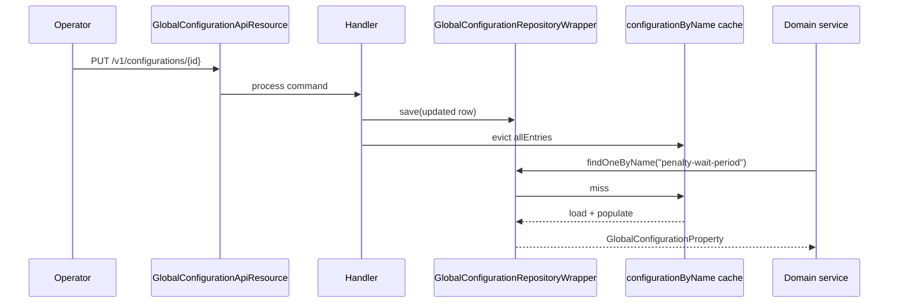

Operators tune Apache Fineract through a single tenant-scoped table of named feature flags and parameters: `c_configuration`. The supporting code lives in `org.apache.fineract.infrastructure.configuration` (`fineract-core`) and exposes both a REST API and a programmatic `ConfigurationDomainService` that the rest of the platform calls during command processing.

## Package layout

```
org.apache.fineract.infrastructure.configuration
├── api/         GlobalConfigurationApiConstant, GlobalConfigurationConstants
├── data/        GlobalConfigurationPropertyData transport
├── domain/      GlobalConfigurationProperty entity, repository, RepositoryWrapper, ConfigurationDomainService
├── exception/   GlobalConfigurationPropertyNotFoundException, etc.
└── service/     ConfigurationReadPlatformService, GlobalConfigurationValidationService,
                 MoneyHelperInitializationService, TemporaryConfigurationServiceContainer
```

## The entity

`GlobalConfigurationProperty` maps to `c_configuration`. One row per flag per tenant.

| Column | Type | Notes |
|--------|------|-------|
| `id` | `BIGINT` | PK. |
| `name` | `VARCHAR(100)` | Unique flag name — the lookup key. |
| `value` | `BIGINT` | Numeric value (for thresholds and ids). |
| `date_value` | `DATE` | Optional date (e.g. "lock until"). |
| `string_value` | `VARCHAR(100)` | Free-form string. |
| `enabled` | `BOOLEAN` | Master on/off. |
| `is_trap_door` | `BOOLEAN` | When `true`, switching the flag off is rejected (one-way switches). |
| `description` | `TEXT` | Human-readable explanation. |

Each flag uses whichever columns make sense — a boolean toggle only needs `enabled`, a numeric threshold uses `value`, a "lock until" date uses `date_value`. `is_trap_door` is reserved for safety-critical settings that should be enabled once and never disabled (e.g. an accounting irreversibility flag).

## Seed data

Liquibase changelogs in `fineract-provider/src/main/resources/db/changelog/tenant/parts/` seed dozens of well-known flags. Common ones:

| Flag (`name`) | Default | Effect |
|---------------|---------|--------|
| `maker-checker` | off | Master switch enabling maker-checker on commands that opt in via `m_permission.can_maker_checker`. |
| `amazon-S3` | off | Switch document store to S3 (see [/core/document-management](/core/document-management)). |
| `reschedule-future-repayments` | on | When repayments are re-derived after a reschedule. |
| `allow-transactions-on-non_workingday` | off | Whether postings may be dated to a non-working day. |
| `allow-transactions-on-holiday` | off | Same, for holidays. |
| `constraint_approach_for_datatables` | off | Enables the constraint-based datatable validation pipeline. |
| `penalty-wait-period` | `2` (days) | Grace before overdue penalty is applied. |
| `force-password-reset-days` | `0` (disabled) | Days between mandatory password rotations. |
| `savings-interest-posting-current-period-end` | off | Posting cadence selector. |
| `meetings-mandatory-for-jlg-loans` | off | Whether JLG groups must have a meeting recorded. |
| `office-specific-products-enabled` | off | Restricts product visibility by office. |
| `rounding-mode` | `6` (HALF_EVEN) | Default `RoundingMode` ordinal used by `MoneyHelper`. |
| `business-date-enabled` | off | Master switch for [/core/business-date](/core/business-date). |
| `enable-automatic-cob-date-adjustment` | off | Auto-move `COB_DATE` when `BUSINESS_DATE` changes. |
| `next-payment-date` | `1` (overdue installment) | Strategy for "next due" calculations. |

<Info>
The Liquibase IDs that introduce these flags are the canonical source of truth — when adding a new flag, write a changeset that inserts the row into `c_configuration` so all existing tenants get it on the next migration.
</Info>

## Lookup: `ConfigurationDomainService`

`ConfigurationDomainService` is the interface the rest of Fineract uses. Implemented by `ConfigurationDomainServiceJpa`, every method:

1. Looks up the row through `GlobalConfigurationRepositoryWrapper.findOneByNameWithNotFoundDetection(name)`.
2. Reads the appropriate column (`enabled`, `value`, `date_value`, `string_value`).
3. Returns the typed result, throwing if the flag is missing.

Examples used across the codebase:

```java
boolean makerCheckerEnabled = configurationDomainService.isMakerCheckerEnabledForTask(taskCode);
boolean s3 = configurationDomainService.isAmazonS3Enabled();
Long penaltyWait = configurationDomainService.retrievePenaltyWaitPeriod();
LocalDate lock = configurationDomainService.retrieveRescheduleFutureRepaymentsDate();
RoundingMode rm = MoneyHelper.getRoundingMode(); // initialised from `rounding-mode`
```

Several caches (region `configurationByName`) front these reads — see [/core/cache](/core/cache) — and every write evicts them.

## `MoneyHelperInitializationService`

At startup, this service reads `rounding-mode` and primes `MoneyHelper`, the platform's shared `BigDecimal` rounding helper. Doing this once means every transaction posting code path can use `MoneyHelper.getRoundingMode()` without re-reading the database.

## `TemporaryConfigurationServiceContainer`

Test fixture that lets integration tests override flag values for the duration of a request without touching the database. Wrapped around `ConfigurationDomainService` via Spring `@Primary` in the test classpath.

## REST API

Class: `GlobalConfigurationApiResource` (lives in `fineract-provider`), base path `/v1/configurations`.

### `GET /v1/configurations`

Returns all flags as a page of `GlobalConfigurationPropertyData`.

```jsonc
{ "globalConfiguration": [
    { "id": 12, "name": "maker-checker", "enabled": false, "trapDoor": false },
    { "id": 17, "name": "penalty-wait-period", "value": 2, "enabled": true }
] }
```

### `GET /v1/configurations/{id}` / `GET /v1/configurations/name/{name}`

Single flag lookup.

### `PUT /v1/configurations/{id}`

Update one flag. Body shape:

<ParamField body="enabled" type="boolean">
Master on/off.
</ParamField>
<ParamField body="value" type="integer">
Numeric value, when applicable.
</ParamField>
<ParamField body="dateValue" type="string">
ISO date.
</ParamField>
<ParamField body="stringValue" type="string">
Free-form string.
</ParamField>

The validation service rejects:

- Updates to a `is_trap_door` row that try to set `enabled` from `true` to `false`.
- Numeric values outside the configured range for that flag.
- Empty values when the flag schema requires one.

## Validation

`GlobalConfigurationValidationService` is the single class that knows about per-flag constraints. It is keyed on the flag `name` so adding a new flag with custom validation means extending this class.

<Warning>
Bypassing `GlobalConfigurationValidationService` (e.g. by direct SQL) can put the platform in a state where caches reflect one value and the database another. Always go through `PUT /v1/configurations/{id}` or, if seeding via Liquibase, restart the application to clear caches.
</Warning>

## Caching

Region `configurationByName` is `@Cacheable` on `findOneByNameWithNotFoundDetection`. Every write method on the configuration service carries `@CacheEvict(allEntries = true)` to avoid stale reads.

## Reading a flag in command code

```java
@Service
public class LoanApprovalService {

    private final ConfigurationDomainService configurationDomainService;

    public void approve(Loan loan, JsonCommand command) {
        if (configurationDomainService.isMakerCheckerEnabledForTask("APPROVE_LOAN")) {
            // route through maker-checker
        }
        Long waitPeriod = configurationDomainService.retrievePenaltyWaitPeriod();
        // ...
    }
}
```

The injected service is a Spring bean — never read `c_configuration` with raw JPA queries, because that path also bypasses the cache.

## Operational guidance

<AccordionGroup>
  <Accordion title="Rolling out a new feature flag">
    1. Add a Liquibase changeset that inserts the row with default `enabled = false`.
    2. Add a typed accessor on `ConfigurationDomainService` and its implementation.
    3. Gate the new code path on the accessor.
    4. Document the flag here and in the operator runbook.
  </Accordion>
  <Accordion title="Enabling maker-checker globally">
    Set `maker-checker.enabled = true`, then enable per-task by toggling `can_maker_checker` on the corresponding `m_permission` rows. The configuration flag is the master switch; without it, per-task settings are ignored.
  </Accordion>
  <Accordion title="Switching documents to S3">
    Enable `amazon-S3`, then provide the bucket and credentials through environment variables. The next document upload will land in S3 — existing on-disk files stay on disk and are still served.
  </Accordion>
</AccordionGroup>

## Errors

| Exception | When |
|-----------|------|
| `GlobalConfigurationPropertyNotFoundException` | Lookup by name or id misses. |
| `GlobalConfigurationPropertyCannotBeModified` | Trap-door flag asked to flip off. |
| Standard `PlatformApiDataValidationException` | Validation rule rejected the value. |

## Tests

`GlobalConfigurationTest` flips a handful of flags and asserts platform behaviour changes — for example, that `maker-checker` toggles whether `POST /loans` returns immediately or routes through approval.

## Flag categories

Although `c_configuration` is a flat table, flags conceptually group into a handful of categories. Knowing the category helps when scanning for a setting.

| Category | Examples |
|----------|----------|
| Maker-checker | `maker-checker`, per-task overrides through `m_permission` |
| Calendar / business day | `allow-transactions-on-non_workingday`, `allow-transactions-on-holiday`, `meetings-mandatory-for-jlg-loans` |
| Business date | `business-date-enabled`, `enable-automatic-cob-date-adjustment` |
| Loan behaviour | `penalty-wait-period`, `reschedule-future-repayments`, `next-payment-date`, `rounding-mode` |
| Savings behaviour | `savings-interest-posting-current-period-end` |
| Security | `force-password-reset-days` |
| Integration | `amazon-S3` |
| Reporting / data | `constraint_approach_for_datatables` |
| Multi-product | `office-specific-products-enabled` |

## How a flag is consumed end-to-end



After the operator's `PUT`, the next call from a domain service repopulates the cache with the new value, so the change takes effect on the very next request.

## Multi-tenancy

`c_configuration` is **tenant-scoped** — every tenant has its own copy of the table. The same flag may therefore have different values across tenants. The cache region key incorporates the tenant identifier so that two tenants running in the same JVM do not see each other's values.

## Anti-patterns

| Anti-pattern | Why it hurts |
|--------------|--------------|
| Direct SQL `UPDATE c_configuration` | Bypasses cache eviction, validation and audit. |
| Reading a flag from a deeply-nested code path | Couples that code to configuration; prefer reading once at the top of the request and passing the value down. |
| Using `string_value` for structured data | The field is opaque to the rest of the platform; if you find yourself parsing JSON out of it, model a proper table instead. |

## Tests

`GlobalConfigurationTest` flips a handful of flags and asserts platform behaviour changes — for example, that `maker-checker` toggles whether `POST /loans` returns immediately or routes through approval. Additional unit tests on `GlobalConfigurationValidationService` cover trap-door enforcement.

## Related

- Caching strategy: [/core/cache](/core/cache).
- Business date flags: [/core/business-date](/core/business-date).
- S3 flag and the document layer: [/core/document-management](/core/document-management).
