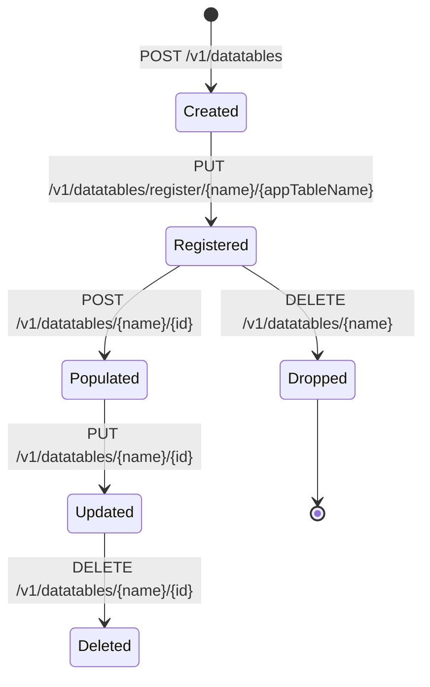
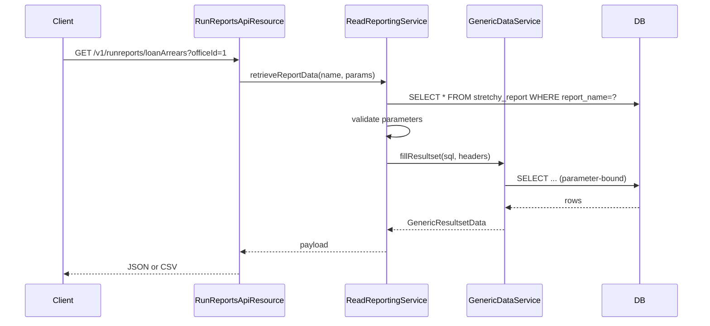

Apache Fineract supports two tenant-level extensibility surfaces in one package: **datatables**, which let operators attach arbitrary columns to core entities at runtime, and **reports**, which expose parameterised SQL or Pentaho artefacts as REST endpoints. Both live under `org.apache.fineract.infrastructure.dataqueries`, with the SPI types in `fineract-core` and the implementation classes in `fineract-provider`.

## Package layout

```
org.apache.fineract.infrastructure.dataqueries
├── api/         DataTableApiConstant (REST resources live in fineract-provider)
├── data/        DTOs: DatatableData, ResultsetColumnHeaderData, ReportData, ReportParameterData
├── domain/      ReportType (core); EntityDatatableChecks, Report, ReportParameter, RegisteredDatatable
├── exception/   DatatableNotFoundException, DatatableSystemErrorException, etc.
└── service/     DatatableReadService, DatatableWriteService, GenericDataService, CleanupService,
                 DatatableKeywordGenerator
```

<Info>
The end-user reference for datatables and reports lives at [/data/data-tables](/core/data-queries) and [/api/datatables-reports](/api/datatables-and-data-queries-api). This page documents the internals.
</Info>

## Datatables

A **datatable** is a real SQL table whose schema is managed through Fineract APIs. It is registered against a core entity (client, loan, savings account, group, office, …) so that one or many rows of custom data can be attached to each row of the parent.

### Lifecycle



### Catalog tables

| Table | Purpose |
|-------|---------|
| `x_registered_table` | Registry — name, parent entity, category. |
| `x_table_column_code_mappings` | Bind a `Dropdown` column to a `m_code`. |
| `m_entity_datatable_check` | Required/checked datatables for a workflow stage. |

### `DatatableWriteService`

Concrete impl in `fineract-provider`. Key methods:

| Method | Action |
|--------|--------|
| `createDatatable(JsonCommand)` | Creates the SQL table and the `x_registered_table` row. |
| `updateDatatable(name, JsonCommand)` | Adds/drops columns; rejects type changes that would lose data. |
| `deleteDatatable(name)` | Drops the table and removes its registry row. |
| `createNewDatatableEntry(...)` | Inserts a row into the datatable for a parent entity. |
| `updateDatatableEntryOneToOne` / `OneToMany` | Updates by composite key. |
| `deleteDatatableEntries(name, parentId)` | Cleans up when a parent entity is deleted. |

Behind the scenes the service composes raw `CREATE TABLE` / `ALTER TABLE` SQL using `DatatableKeywordGenerator` to escape reserved words and identifiers safely.

### `DatatableReadService`

Reads datatable rows. Two flavours:

- `retrieveDatatableNames(appTable)` — list datatables attached to a given parent entity type.
- `retrieveDataTableGenericResultSet(name, parentId, order, limit)` — returns a `GenericResultsetData` with column metadata and rows so the UI can render the table generically.

### Column types

| `type` | SQL backing | Notes |
|--------|------------|-------|
| `String` | `VARCHAR(n)` | `length` required. |
| `Number` | `INT` | |
| `Decimal` | `DECIMAL(19,6)` | |
| `Boolean` | `BIT` / `BOOLEAN` | |
| `Date` | `DATE` | |
| `DateTime` | `DATETIME` | |
| `Text` | `TEXT` | |
| `Dropdown` | `INT` FK to `m_code_value` | `code` required; FK enforced. |

Choosing `Dropdown` is what ties datatables back to the codes subsystem ([/core/codes](/core/codes)).

### `EntityDatatableChecks`

Maps to `m_entity_datatable_check`. Each row says: *"to perform action X on entity Y the datatable Z must be populated"*.

| Column | Notes |
|--------|-------|
| `application_table_name` | e.g. `m_client`. |
| `x_registered_table_name` | The datatable that must be filled. |
| `status_enum` | The workflow stage (e.g. `CLIENT_ACTIVATE = 100`). |
| `system_defined` | Whether seeded by Liquibase. |
| `product_id` | Optional — narrow the check to a specific product. |

The check is consulted by the corresponding write platform service (e.g. `ClientWritePlatformService.activateClient`) — if a required datatable is empty, the action is rejected with a clear error.

### `GenericDataService`

Helper used by both datatables and reports. Wraps a `JdbcTemplate` and exposes:

- `fillResultsetColumnHeaders(table)` — reads `INFORMATION_SCHEMA.COLUMNS` to build the column metadata used in datatable responses.
- `fillResultsetRowData(sql, headers)` — runs the SQL and returns a `GenericResultsetData`.
- `replace(...)`, `wrapSQL(...)` — SQL templating utilities used by reports.

### `CleanupService`

Scheduled / on-demand service used by deletions and Liquibase rollback paths to drop orphan datatables.

## Reports

A **report** is a parameterised result-set exposed at `/v1/runreports/{name}`. The reporting framework supports three flavours.

### `ReportType` enum (`fineract-core`)

| Type | Purpose |
|------|---------|
| `Table` | SQL `SELECT` returned as rows + headers. |
| `Chart` | SQL whose first row drives a Pentaho-style chart. |
| `Pentaho` | A `.prpt` file rendered via the Pentaho reporting engine. |

### Entities (in `fineract-provider`)

| Class | Table | Purpose |
|-------|-------|---------|
| `Report` | `stretchy_report` | Metadata, raw SQL or .prpt name, category, sub-type. |
| `ReportParameter` | `stretchy_parameter` | The parameters offered to callers. |
| `ReportParameterUsage` | `stretchy_report_parameter` | Join — which parameters a given report accepts. |

### `RunReports`

Path: `/v1/runreports/{reportName}`. Resource:

1. Loads the `Report` row.
2. Validates the supplied query parameters against `ReportParameterUsage`.
3. Substitutes parameters into the SQL (named placeholders), then executes through `GenericDataService` for `Table` and `Chart` types.
4. For `Pentaho`, builds a master report and streams the PDF/Excel/HTML.

The same path supports a query parameter `exportCSV=true` to stream the row set as CSV.

### Allowed SQL surface

To avoid injection, reports go through `SQLInjectionValidator` and only the configured parameters are bound. Free-form table joins are allowed but each call must declare its parameters in advance.

<Warning>
The reporting engine executes whatever SQL is stored in `stretchy_report.report_sql`. Treat seed data carefully — a typo in a `WHERE` clause can expose another tenant's data on a shared database. Production systems pin reports to immutable Liquibase changesets.
</Warning>

## End-to-end: attaching a datatable to a loan

<Steps>
  <Step title="Create the table">
    `POST /v1/datatables` with the schema and `apptableName = "m_loan"`. The service emits `CREATE TABLE` and registers it.
  </Step>
  <Step title="(Optional) Mark as required for approval">
    Insert a row into `m_entity_datatable_check` for status `LOAN_APPROVE`. From now on, `approve` is rejected if the row is empty.
  </Step>
  <Step title="Populate per loan">
    `POST /v1/datatables/{name}/{loanId}` writes a child row.
  </Step>
  <Step title="Read back">
    `GET /v1/datatables/{name}/{loanId}` returns a generic result set the UI renders.
  </Step>
</Steps>

## Batch integration

The Batch API ([/core/batch-api](/core/batch-api)) ships a `CreateDatatableEntryCommandStrategy` so datatable inserts can be part of a single transactional batch with the parent's creation — typically used when onboarding a client with KYC datatables.

## Exceptions

| Class | When |
|-------|------|
| `DatatableNotFoundException` | Reads or writes against an unregistered name. |
| `DatatableSystemErrorException` | DDL or DML failure (wrapped SQL exception). |
| `EntityDatatableCheckNotSupportedException` | Status enum unknown for the entity. |
| `ReportNotFoundException` | Run report against unknown name. |
| `ReportParameterValidationException` | Required parameter missing or wrong type. |

## Performance notes

- Datatables are indexed only on the FK back to the parent — add custom indexes via Liquibase when querying by other columns.
- The reports engine streams large CSV via a chunked output stream to avoid OOM.
- Use `GenericDataService.fillResultsetColumnHeaders` cautiously: it queries the schema each call. For hot paths cache the headers.

## Tests

| Test | Coverage |
|------|----------|
| `DatatableIntegrationTest` | Create / register / populate / read / delete. |
| `EntityDatatableChecksIntegrationTest` | Required datatable blocks status transitions. |
| `RunReportTest` | Parameter binding, CSV export, Pentaho path. |

## Constraint approach for datatables

When the configuration flag `constraint_approach_for_datatables` is enabled (see [/core/configuration](/core/configuration)), validation moves from "best-effort at write time" to "FK constraints enforced by the database". The differences:

| Aspect | Default | Constraint approach |
|--------|---------|--------------------|
| Dropdown column ↔ code value | Checked in Java | DB FK ensures referential integrity |
| Required columns | Checked in Java | DB `NOT NULL` enforces |
| Schema changes | Allowed when current data fits | Rejected if existing data would violate new constraints |
| Failure mode | `PlatformApiDataValidationException` | `SQLException` mapped to a domain exception |

For production systems holding regulated data, the constraint approach is recommended because it makes back-channel writes (replication tooling, BI reverse-ETL) safe too.

## Multi-row datatables (one-to-many)

A datatable can be registered as **one-to-many** by including a `subjectId` column. The parent-id column then becomes part of a composite key, allowing multiple rows per parent. The write service exposes `OneToMany` variants of `update` and `delete` to operate on a specific child row.

This is how Fineract models, for instance, multiple addresses per client without baking address as a first-class column on `m_client`.

## SQL generation safety

`DatatableKeywordGenerator` escapes identifiers using the DB-specific quoting (MySQL backticks vs PostgreSQL double quotes) so that reserved words can be used as column names. It does **not** sanitise free-form SQL — datatable definitions go through a separate DDL builder that only emits `CREATE TABLE`, `ALTER TABLE`, and `DROP TABLE` with parameterised identifiers.

<Warning>
Never build datatable column definitions by string concatenation in custom code. Either go through `DatatableWriteService` or use the same `DatatableKeywordGenerator` it does — bypassing both opens an injection vector on the schema operation.
</Warning>

## Reports vs ad-hoc SQL

The reporting engine is **not** a query-builder. It runs predefined SQL stored in `stretchy_report.report_sql` with bound parameters. To expose a new report:

1. Insert a row into `stretchy_report` (via Liquibase for production).
2. Insert parameters into `stretchy_parameter` and link them through `stretchy_report_parameter`.
3. Grant the corresponding `READ_<reportname>` permission to roles that need it.

The report becomes available at `/v1/runreports/{name}` immediately without code changes.

## Permissions

| Permission | Allows |
|------------|--------|
| `READ_DATATABLE` | List and read datatable schemas. |
| `CREATE_DATATABLE` | Create a new datatable. |
| `UPDATE_DATATABLE` | Alter columns. |
| `DELETE_DATATABLE` | Drop a datatable. |
| `REGISTER_DATATABLE` / `DEREGISTER_DATATABLE` | Bind a datatable to a parent entity. |
| `READ_<datatableName>` / `CREATE_<datatableName>` / `UPDATE_<datatableName>` / `DELETE_<datatableName>` | Per-datatable row-level permissions. |
| `READ_REPORT` | Read report metadata. |
| `RUN_<reportname>` | Execute a specific report. |

Per-datatable permissions are created automatically when the datatable is registered, so role administration can scope access at the table level.

## End-to-end run-report path



## Caching

Neither datatable rows nor report results are cached by Fineract. Datatable schema metadata is cached briefly by `DatatableReadService` to avoid repeated `INFORMATION_SCHEMA` hits during a single request; this cache is process-local and invalidated on schema changes.

## Related

- End-user docs: [/data/data-tables](/core/data-queries) and [/api/datatables-reports](/api/datatables-and-data-queries-api).
- Dropdown columns are backed by [/core/codes](/core/codes).
- Datatable mutations participate in [/core/external-events](/core/external-events) when the corresponding event configuration is enabled.
