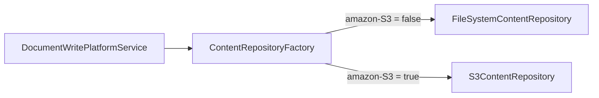
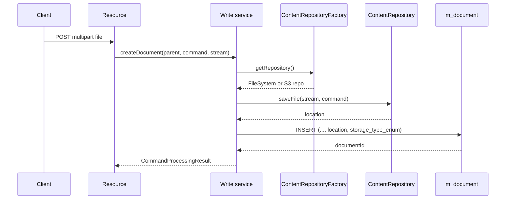

Documents in Apache Fineract are binary attachments (KYC scans, signed contracts, images) bound to a parent entity such as a client, loan or savings account. The metadata lives in a single table, but the bytes flow through a pluggable **content repository SPI** that ships with file-system and S3 implementations. The SPI types are declared in `fineract-core`; the file-system / S3 stores live in the `fineract-document` module.

## Modules at a glance

| Module | Path | Contents |
|--------|------|----------|
| `fineract-core` | `infrastructure/documentmanagement/adapter/` | `EntityImageIdAdapter` — keeps the lightweight contract that core entities (clients, staff) use to point at a stored image. |
| `fineract-document` | `infrastructure/documentmanagement/` | `Document` entity, `ContentRepository` SPI, `ContentRepositoryFactory`, S3 / file-system implementations, REST resource. |
| `fineract-document` | `infrastructure/contentstore/` | Shared upload pipeline: virus scan policy, content-type detector, mime processor, helpers. |

<Info>
End-to-end operator-facing documentation for uploading documents and switching the active store lives at [/integrations/document-management](/integrations/document-management). This page targets contributors who need to plug in a new store.
</Info>

## The `Document` entity

Maps to `m_document`. One row per attachment.

| Column | Type | Notes |
|--------|------|-------|
| `id` | `BIGINT` | PK. |
| `parent_entity_type` | `VARCHAR` | E.g. `clients`, `loans`, `savings`, `staff`. |
| `parent_entity_id` | `BIGINT` | FK to that entity. |
| `name` | `VARCHAR` | User-visible name. |
| `file_name` | `VARCHAR` | Original filename uploaded. |
| `size` | `BIGINT` | Bytes. |
| `type` | `VARCHAR` | MIME type (validated against the policy). |
| `description` | `TEXT` | Optional. |
| `location` | `VARCHAR(500)` | **Storage-specific key**: a path on disk, an S3 key, etc. |
| `storage_type_enum` | `SMALLINT` | `1` = file system, `2` = S3. |

The `location` field is opaque to the rest of the platform — only the active `ContentRepository` knows how to interpret it.

## `EntityImageIdAdapter` (core)

Some core entities (client, staff) have an "image" pointer that is logically just a foreign key to `m_image` (a sibling of `m_document`). `EntityImageIdAdapter` is the small bridge in `fineract-core` that lets these entities expose their image id without depending on the heavier `fineract-document` module.

## SPI: `ContentRepository`

```java
public interface ContentRepository {
    StorageType getStorageType();
    String saveFile(InputStream uploadedInputStream, DocumentCommand command);
    String saveImage(InputStream uploadedInputStream, Long resourceId, String imageName, Long fileSize);
    String saveImage(Base64EncodedImage base64EncodedImage, Long resourceId, String imageName);
    void deleteFile(String location);
    void deleteImage(String location);
    FileData fetchFile(DocumentData document);
    FileData fetchImage(ImageData imageData);
}
```

| Method | Returns | Purpose |
|--------|---------|---------|
| `getStorageType()` | `StorageType` enum (`FILE_SYSTEM` or `S3`). | Lets the factory route. |
| `saveFile` / `saveImage` | `String location` written into `m_document.location`. | Stores bytes. |
| `fetchFile` / `fetchImage` | `FileData` (stream + headers). | Streams bytes back. |
| `deleteFile` / `deleteImage` | `void` | Cleans up on delete and on overwrite. |

The SPI is **stateless** — implementations may consult `tenant` from the request context but must not retain per-call state between methods.

## `ContentRepositoryFactory`

Reads the active store from the configuration flag `amazon-S3` (see [/core/configuration](/core/configuration)) and returns the matching bean:



The factory is invoked **per request**, not cached — toggling the flag switches the store for the next upload without a restart. Existing files keep their `storage_type_enum`, so reads route correctly even after a switch.

## Built-in implementations

### `FileSystemContentRepository`

Writes under a configurable root directory (env var `FINERACT_CONTENT_FILESYSTEM_ROOT_FOLDER`, default `${user.home}/.fineract/documents`). Layout:

```
<root>/
  <tenant>/
    documents/
      <parentEntityType>/<parentEntityId>/<documentId>_<sanitized-filename>
    images/
      <parentEntityType>/<parentEntityId>/<sanitized-filename>
```

The path is what gets stored in `m_document.location`. Reads simply open a `FileInputStream`.

### `S3ContentRepository`

Uses the AWS SDK v2 client. Key configuration:

| Env var | Purpose |
|---------|---------|
| `FINERACT_CONTENT_S3_BUCKET_NAME` | Bucket. |
| `FINERACT_CONTENT_S3_REGION` | Region. |
| `FINERACT_CONTENT_S3_ACCESS_KEY` | IAM access key. |
| `FINERACT_CONTENT_S3_SECRET_KEY` | IAM secret. |

S3 keys follow the same logical layout as the file-system store, just under the bucket. The bucket is not created automatically — it must exist with the right ACL before enabling the flag.

<Warning>
Per-tenant separation in S3 is by **key prefix**, not by bucket. If multiple tenants share a bucket they must share the same IAM principal; do not enable `amazon-S3` in shared deployments without operator sign-off.
</Warning>

## Upload pipeline

The `fineract-document/infrastructure/contentstore` package wraps every upload with a small pipeline before bytes are handed to the `ContentRepository`:

1. **Content-type detection** — `ContentRepositoryDetector` re-derives the MIME type from the byte stream so the client-supplied `Content-Type` cannot lie.
2. **Policy check** — `ContentRepositoryPolicy` rejects MIME types not on the configured allow-list (PNG/JPG/PDF by default).
3. **Optional virus scan** — when ClamAV integration is enabled, the stream is scanned. The scan reads the entire stream, so the pipeline buffers to a temp file first.
4. **Processor** — final transformations (e.g. EXIF stripping on images) before persistence.

Each step is a Spring bean and can be overridden by providing an alternative `@Primary` implementation.

## REST resource

`DocumentManagementApiResource` lives in `fineract-document`, path `/v1/{entityType}/{entityId}/documents`. Endpoints:

| Endpoint | Purpose |
|----------|---------|
| `GET .../documents` | List documents for a parent entity. |
| `POST .../documents` | Upload a new document (multipart). |
| `GET .../documents/{id}` | Metadata. |
| `GET .../documents/{id}/attachment` | Stream the bytes. |
| `PUT .../documents/{id}` | Replace bytes / metadata. |
| `DELETE .../documents/{id}` | Delete metadata and bytes. |

Permissions: `CREATE_DOCUMENT`, `READ_DOCUMENT`, `UPDATE_DOCUMENT`, `DELETE_DOCUMENT`, scoped by the parent entity's permissions.

## Lifecycle



## Deletion semantics

Deleting a row through `DELETE /v1/{entity}/{id}/documents/{docId}`:

1. Loads `Document` to obtain `location` and `storage_type_enum`.
2. Asks the factory for the matching repository (not the currently active one — important if the active flag was toggled after upload).
3. Calls `deleteFile(location)`; ignores `NotFound` so re-deletes are idempotent.
4. Removes the row.

## Custom store: plugging in

<Steps>
  <Step title="Implement ContentRepository">
    Override every method. Return your own value in `getStorageType()` (extend the enum if needed).
  </Step>
  <Step title="Register a bean">
    Annotate with `@Component`. The factory picks up implementations via Spring `@Qualifier`.
  </Step>
  <Step title="Teach the factory">
    Either add a branch in `ContentRepositoryFactory` or override the factory entirely with `@Primary`.
  </Step>
  <Step title="Wire configuration">
    If your store has a master toggle, add a flag through [/core/configuration](/core/configuration) and gate the factory branch on it.
  </Step>
</Steps>

## Errors

| Exception | When |
|-----------|------|
| `DocumentNotFoundException` | Unknown document id. |
| `ContentManagementException` | Underlying storage failure (IO, S3 error). |
| `InvalidEntityTypeForDocumentManagementException` | Parent entity type not in the supported set. |
| `ImageDataURLNotValidException` | Bad base64 payload on `saveImage(Base64...)`. |

## Tests

`DocumentManagementApiTest` exercises both stores via the `amazon-S3` toggle, asserting that an upload → switch → read still works. Unit tests on `ContentRepositoryFactory` verify routing of a stored document according to its `storage_type_enum` rather than the current flag.

## Images vs documents

The platform makes a subtle distinction:

| Concept | Table | Used for |
|---------|-------|----------|
| Document | `m_document` | Generic attachments (PDF, JPG, …) bound to a parent entity. |
| Image | `m_image` | A single profile-picture-style image per entity (client, staff). |

Both flow through the same `ContentRepository`. The split exists because the image is rendered inline in many UIs and needs a fast path — `EntityImageIdAdapter` (in `fineract-core`) is the contract that lets entities reference their image without depending on the heavier document module.

## Mime detection vs declared type

Fineract trusts the bytes, not the client. `ContentRepositoryDetector` re-derives the MIME type from the stream's magic bytes; the `Content-Type` header sent by the caller is only used for fallback. This stops a renamed `.exe` from sneaking past content-type filtering.

## Policy and allow-list

`ContentRepositoryPolicy` declares the list of MIME types acceptable for upload. Defaults:

| MIME | Allowed for documents | Allowed for images |
|------|----------------------|--------------------|
| `image/png` | Yes | Yes |
| `image/jpeg` | Yes | Yes |
| `image/gif` | No | Yes |
| `application/pdf` | Yes | No |
| `application/msword`, `application/vnd.openxmlformats-officedocument.*` | Yes | No |
| Everything else | Rejected | Rejected |

The policy bean is overridable — a deployment that needs to accept additional types can publish a `@Primary` bean.

## Virus scanning

When the `clamav` Spring profile is active, every uploaded stream is forwarded to a configured ClamAV server before persistence. The scan adds latency (proportional to file size); for that reason the policy is opt-in through configuration. A failing scan results in `ContentManagementException` and the bytes are never written.

## Path sanitisation

Filenames provided by the client are normalised before being used as part of the storage key. The pipeline:

1. Strips path separators.
2. Strips control characters.
3. Replaces spaces with `_`.
4. Caps the length at 200 characters.
5. Prepends the document id for uniqueness.

The original filename is preserved in `m_document.file_name` for display purposes; only the stored key uses the sanitised version.

## Quota and limits

There is no built-in per-tenant quota for total document size — operators enforce this at the storage backend (disk monitoring, S3 lifecycle rules). The platform does enforce a single-upload size limit through the multipart configuration of the HTTP server (`fineract.content.maxFileSize`, default 5 MB).

## Related

- Toggle storage with [/core/configuration](/core/configuration) (`amazon-S3`).
- Operator playbook: [/integrations/document-management](/integrations/document-management).
- Documents emit business events; see [/core/business-events](/core/business-events) and the outbox at [/core/external-events](/core/external-events).
