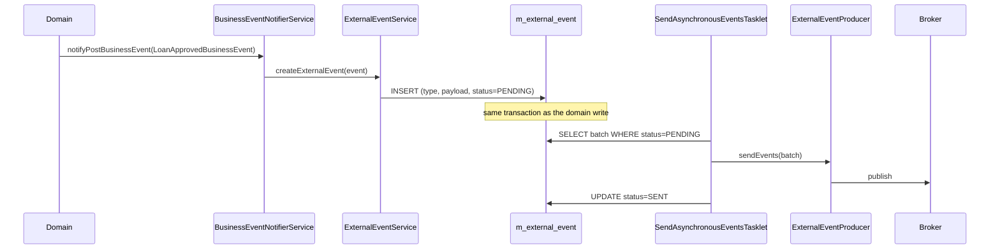

When something interesting happens inside Apache Fineract — a loan is approved, a savings transaction is posted — the platform writes a row to an **outbox table** in the same database transaction, then asynchronously hands those rows to a message broker. This page documents the external-events pipeline that powers that flow. The code lives in `org.apache.fineract.infrastructure.event.external` in `fineract-core`.

## Package layout

```
org.apache.fineract.infrastructure.event.external
├── api/         ExternalEventConfigurationApiResource, InternalExternalEventsApiResource
├── command/     ExternalConfigurationsUpdateCommand
├── config/      EnableExternalEventQueueCondition, EnableExternalEventTopicCondition,
│                EventTaskExecutorConfig, ExternalBusinessEventConfiguration, TaskExecutorConstant
├── data/        request/response DTOs (Configuration*, ExternalEventResponse)
├── exception/
├── handler/     ExternalEventConfigurationUpdateHandler
├── jobs/        SendAsynchronousEventsConfig + Tasklet, PurgeExternalEventsConfig + Tasklet
├── producer/    ExternalEventProducer SPI, NoopExternalEventEnabled, NoopExternalEventProducer
├── repository/  ExternalEventRepository, ExternalEventConfigurationRepository, domain entities
└── service/     ExternalEvent service (recording, validation, idempotency, serialisation, support, validation, datatable)
```

## High-level flow



The defining property of this design is **transactional consistency**: the outbox insert and the domain write are atomic, so a successful HTTP response always implies the event has been recorded. The send step is best-effort retried by the tasklet on the next run.

## Outbox table: `m_external_event`

Persistence is through `ExternalEventRepository` and the `ExternalEvent` JPA entity (in the `repository/domain` package).

| Column | Type | Notes |
|--------|------|-------|
| `id` | `BIGINT` | PK. |
| `type` | `VARCHAR` | Business event short name (e.g. `LoanApprovedBusinessEvent`). |
| `category` | `VARCHAR` | Coarse grouping (Loan, Savings, Client…). |
| `schema` | `VARCHAR` | Schema version for the payload. |
| `data` | `BLOB / JSON` | Serialised payload. |
| `aggregate_root_id` | `BIGINT` | Parent entity id for ordering. |
| `business_date` | `DATE` | Snapshot of `BUSINESS_DATE` at insert. |
| `status` | `VARCHAR` | `PENDING`, `SENT`, `FAILED`. |
| `created_at` | `TIMESTAMP` | Insert time. |
| `sent_at` | `TIMESTAMP` | Set when send succeeds. |
| `idempotency_key` | `VARCHAR` | For broker de-dup. |

`CustomExternalEventConfigurationRepositoryImpl` carries the projection queries used by the read API.

## SPI: `ExternalEventProducer`

```java
public interface ExternalEventProducer {
    void sendEvents(Map<Long, List<byte[]>> partitions);
}
```

The contract is intentionally minimal: take a map of `(aggregateRootId -> ordered serialised payloads)` and publish them. Per-aggregate ordering matters because downstream consumers normally apply changes in order.

### Built-in implementations

| Class | When active |
|-------|-------------|
| `NoopExternalEventProducer` | Default: discards events; the outbox row is marked `SENT` so the table still rotates. Gated on `@Conditional(NoopExternalEventEnabled)`. |
| Kafka / SQS / SNS producers | Enabled via `@Conditional` (`EnableExternalEventQueueCondition`, `EnableExternalEventTopicCondition`) when the corresponding Spring properties select a queue or topic profile. Implementations live in `fineract-investor` and `fineract-provider`. |

<Tip>
For local development run with the no-op producer. Outbox rows accumulate in `PENDING → SENT` instantly so you can inspect payloads in the database without standing up a broker.
</Tip>

## The send tasklet

`SendAsynchronousEventsTasklet` is a Spring Batch tasklet bound to the `SEND_ASYNCHRONOUS_EVENTS` job (see [/core/jobs-domain](/core/jobs-domain) and [/jobs/overview](/jobs/overview)).

Algorithm per execution:

1. Lock and pull a chunk of `PENDING` rows (configurable batch size).
2. Group by `aggregate_root_id` to preserve per-aggregate ordering.
3. Call `ExternalEventProducer.sendEvents(...)`.
4. Mark successful rows `SENT`; failures stay `PENDING` for retry on the next run, with a back-off.

`SendAsynchronousEventsConfig` registers the Spring Batch step, reader and writer; `EventTaskExecutorConfig` provides the bounded `ThreadPoolTaskExecutor` used to parallelise broker writes.

## Purge tasklet

`PurgeExternalEventsTasklet` (job `PURGE_EXTERNAL_EVENTS`) deletes `SENT` rows older than a configurable retention period to stop the outbox from growing forever. `PurgeExternalEventsConfig` wires the Spring Batch step.

## Configuration entities

### `ExternalEventConfiguration`

Maps to `m_external_event_configuration`. One row per event type, indicating whether the platform should write that event to the outbox at all.

| Column | Type | Notes |
|--------|------|-------|
| `type` | `VARCHAR` | Event class short name. |
| `enabled` | `BOOLEAN` | When `false`, the event is silently skipped (no outbox row). |

A separate **datatable** sub-package (`service/datatable`) lets operators bind specific datatable columns into the event payload — useful when downstream systems need denormalised custom fields.

## REST API: configuration

Class: `ExternalEventConfigurationApiResource`, base path `/v1/externalevents/configuration`.

### `GET /v1/externalevents/configuration`

Returns all event types and their `enabled` flag.

```jsonc
{ "externalEventConfiguration": [
    { "type": "LoanApprovedBusinessEvent",      "enabled": true  },
    { "type": "LoanInterestRecalculationBusinessEvent", "enabled": false }
] }
```

### `PUT /v1/externalevents/configuration`

Toggle one or more event types in a single call.

<ParamField body="externalEventConfigurations" type="map" required>
Map of `eventType -> { "enabled": boolean }`.
</ParamField>

The request is processed by `ExternalEventConfigurationUpdateHandler` (action `UPDATE_EXTERNALEVENTCONFIGURATIONS`).

`ExternalEventConfigurationValidationService` rejects unknown event types so a typo is caught before the database is touched.

## Internal REST: `InternalExternalEventsApiResource`

Path `/v1/internal/externalevents`. Restricted to internal use — typically not exposed via the public ingress.

| Endpoint | Purpose |
|----------|---------|
| `GET .../count` | Number of rows by status — used by health checks. |
| `DELETE .../` | Truncate the outbox — used by integration tests to start clean. |

## Producer routing toggles

| Spring profile / property | Active condition | Producer chosen |
|---------------------------|------------------|-----------------|
| `fineract.events.external.producer.read.enabled=false` | Always | `NoopExternalEventProducer`. |
| `fineract.events.external.producer.jms.enabled=true` + queue | `EnableExternalEventQueueCondition` | JMS queue producer. |
| `fineract.events.external.producer.kafka.enabled=true` | `EnableExternalEventTopicCondition` | Kafka topic producer. |
| `fineract.events.external.producer.aws.enabled=true` | per-condition | SQS / SNS producer. |

`TaskExecutorConstant` names the bean used by the tasklet so producers can share a common, sized thread pool.

## End-to-end example: loan approved

1. `LoanWritePlatformService.approveLoan(...)` performs domain changes.
2. It calls `businessEventNotifierService.notifyPostBusinessEvent(new LoanApprovedBusinessEvent(loan))`.
3. A listener (registered by the external-events subsystem) checks `ExternalEventConfiguration.enabled` and, if true, calls `ExternalEventService.postEvent(...)`.
4. `ExternalEventService` serialises the payload (using the configured schema), assigns an idempotency key and inserts an `m_external_event` row in the same DB transaction.
5. The transaction commits.
6. On the next `SEND_ASYNCHRONOUS_EVENTS` run, the tasklet picks up the row and the producer publishes to the broker.

## Failure modes

| Symptom | Cause | Mitigation |
|---------|-------|-----------|
| Outbox growing without bound | `SEND_ASYNCHRONOUS_EVENTS` not scheduled or failing. | Re-enable job; inspect broker connectivity. |
| Some events missing downstream | Type disabled in `m_external_event_configuration`. | Toggle via the API. |
| Out-of-order processing downstream | Producer or consumer not honouring per-`aggregate_root_id` ordering. | Use a partition key derived from `aggregate_root_id`. |
| Duplicate downstream effects on retry | Consumer not idempotent. | Use the `idempotency_key` column for de-dup. |

<Warning>
Disabling an event type stops new rows from being written but does **not** delete pending rows already in the outbox. They will be sent on the next run unless you explicitly purge them.
</Warning>

## Tests

| Test target | Coverage |
|-------------|----------|
| `ExternalEventApiTest` | REST roundtrip on the configuration endpoint. |
| `ExternalEventServiceTest` | Insert-on-publish, type-disabled skip. |
| `SendAsynchronousEventsTaskletTest` | Per-aggregate ordering and retry. |

## Schema versioning

The `schema` column on `m_external_event` records the schema version that produced the payload. Schemas evolve over time:

| Practice | Rationale |
|----------|-----------|
| New optional fields → bump minor | Consumers ignore unknown fields. |
| Removed or renamed fields → bump major | Consumers must adapt. |
| Multiple producers running side-by-side | Old `schema` values stay in already-sent rows; new rows carry the new version. |

The `serialization` sub-package of `service/` selects the serializer based on the configured schema version, defaulting to the latest.

## Idempotency support

`service/idempotency/` houses the helper that derives the per-event `idempotency_key`. The key is a deterministic function of `(type, aggregateRootId, business_date, monotonic_sequence)` so a re-send of the same row produces the same key, letting consumers de-dup without coordinating with the producer.

## Validation

`ExternalEventConfigurationValidationService` validates `PUT /v1/externalevents/configuration` requests:

- Each `type` key must match a known event class on the classpath. Unknown types are rejected.
- `enabled` must be a boolean.
- The full set of keys in a single request need not cover every event type; absent types keep their current value.

`service/validation/` extends these checks for payload-level rules (e.g. that the datatable add-on references columns that exist).

## Support utilities

`service/support/` contains shared helpers:

- A wrapper that captures the current `BUSINESS_DATE` and `tenant` on the producing thread so the outbox row carries them.
- A serializer factory for the Jackson `ObjectMapper` used to write payloads — configured to omit nulls and emit dates as ISO-8601.

## Message routing add-ons

`service/message/` and `service/datatable/` provide:

| Helper | Purpose |
|--------|---------|
| Message routing | Bind a message group / partition key to the event for ordered delivery. |
| Datatable enrichment | Resolve configured datatable columns and inline their values into the event payload. |

These run only when the corresponding feature is configured, keeping the default path lean.

## Operational levers

| Lever | Effect |
|-------|--------|
| Disable a noisy event type | `PUT /v1/externalevents/configuration` with that type set to `enabled=false`. |
| Drain backlog faster | Increase the batch size of `SEND_ASYNCHRONOUS_EVENTS` or scale producer threads via `EventTaskExecutorConfig`. |
| Stop sending entirely | Suspend the job through the scheduler — outbox rows accumulate and will resume on un-suspend. |
| Compact the outbox | Schedule `PURGE_EXTERNAL_EVENTS` more frequently or lower its retention. |

## Related

- The in-process counterpart of this pipeline is [/core/business-events](/core/business-events).
- Job metadata: [/core/jobs-domain](/core/jobs-domain) and [/jobs/overview](/jobs/overview).
- Configuration toggles for the global pipeline: [/core/configuration](/core/configuration).
