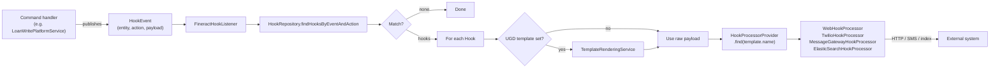

Apache Fineract ships an extensible **hooks framework** that turns business events (loan disbursed, savings deposit posted, client created, …) into outbound calls — HTTP webhooks, SMS/voice via Twilio, message-gateway calls, or Elasticsearch indexing — without forcing changes to the core domain code. The framework lives under `org.apache.fineract.infrastructure.hooks` in the `fineract-provider` module and is built around a small set of JPA entities, a `HookProcessor` SPI, and a single event listener that bridges the platform's internal event bus to user-configured hooks.

This page walks through the entities, the SPI, the built-in processors, and the listener pipeline. It is the reference for operators wiring third-party services into Fineract and for developers writing new `HookProcessor` implementations.

## Package layout

The package follows Fineract's standard slicing:

```text
org.apache.fineract.infrastructure.hooks/
├── api/         — JAX-RS resources (HooksApiResource)
├── command/     — CommandSourceWritePlatformService handlers (create/update/delete)
├── data/        — DTOs (HookData, EventData, GroupingData, …)
├── domain/      — JPA entities (Hook, HookTemplate, HookResource, HookConfiguration, …)
├── exception/   — domain exceptions (HookNotFoundException, …)
├── handler/     — NewCommandSourceHandler implementations
├── listener/    — FineractHookListener, HookListener
├── mapper/      — MapStruct mappers
├── processor/   — HookProcessor SPI + built-in processors
└── service/     — read / write platform services
```

The same shape is used for every Fineract feature, so once you have the hooks layout you can navigate any other module the same way.

## The `Hook` entity

`Hook` (`m_hook`) is the configured connection between events and a delivery channel. It extends `AbstractAuditableCustom` so created/updated timestamps and user IDs are tracked automatically.

```java
@Entity
@Table(name = "m_hook")
public final class Hook extends AbstractAuditableCustom {

    @Column(name = "name", nullable = false, length = 100)
    private String name;

    @Column(name = "is_active", nullable = false)
    private Boolean isActive;

    @OneToMany(cascade = ALL, mappedBy = "hook", orphanRemoval = true, fetch = EAGER)
    private Set<HookResource> events = new HashSet<>();

    @OneToMany(cascade = ALL, mappedBy = "hook", orphanRemoval = true, fetch = EAGER)
    private Set<HookConfiguration> config = new HashSet<>();

    @ManyToOne(optional = true)
    @JoinColumn(name = "template_id")
    private HookTemplate template;

    @ManyToOne(optional = true)
    @JoinColumn(name = "ugd_template_id")
    private Template ugdTemplate;
}
```

A hook always points at exactly one `HookTemplate` (the type of delivery — `Web`, `Twilio`, `SMS Bridge`, …). It carries a set of `HookResource` rows describing which `(entityName, actionName)` events it subscribes to, and a set of `HookConfiguration` rows holding the channel's parameters (URL, content type, account SID, etc.). When a User Generated Document (UGD) template is set, the hook delivers the *rendered* template instead of the raw event payload — useful for shaping JSON or SMS bodies.

### Associated rows

| Table | Purpose |
| --- | --- |
| `m_hook` | The hook itself. |
| `m_hook_resource` | `(entityName, actionName)` pairs the hook subscribes to. |
| `m_hook_configuration` | Free-form `name → value` configuration for the processor (URL, payload URL, account SID, content type). |
| `m_hook_templates` | The set of installable hook channels (Web, Twilio, …). |
| `m_hook_schema` | Per-template field schema used by the UI to render the configuration form. |

## `HookTemplate` and grouping

`HookTemplate` is the channel descriptor:

* `name` — matches one of the built-in processor names (`Web`, `Twilio`, `SMS Bridge`, `Elastic Search`).
* `HookSchema` rows — declare which configuration fields the processor expects, with type and whether they are optional. The UI uses this to render a config form when a user creates a hook of that type.

Templates are loaded once at boot (they ship as reference data in the database). Operators do not normally create new templates at runtime; they install a new processor bean and add the matching row in `m_hook_templates`.

## `HookProcessor` SPI

The SPI is intentionally minimal — a single method receives the configured hook, the JSON payload of the event, and the routing key `(entityName, actionName)` plus the current request context:

```java
package org.apache.fineract.infrastructure.hooks.processor;

public interface HookProcessor {

    void process(Hook hook, String payload, String entityName,
                 String actionName, FineractContext context) throws Exception;
}
```

The `FineractContext` carries the multi-tenant context (tenant identifier, authenticated user) so the processor can re-establish it on a background thread when delivery happens asynchronously.

### Built-in processors

| Bean | Channel | Notes |
| --- | --- | --- |
| `WebHookProcessor` | Generic HTTP POST | Most common — posts JSON or form-encoded payload to a configured URL. Uses `WebHookService` (Retrofit) under the hood. |
| `TwilioHookProcessor` | Twilio SMS / voice | Reads Twilio account SID, auth token, and source number from `m_hook_configuration`. |
| `MessageGatewayHookProcessor` | Apache Fineract Message Gateway | Forwards events to the Fineract CN messaging service. |
| `ElasticSearchHookProcessor` | Elasticsearch indexing | Indexes events into a configured index for downstream analytics. |

A `HookProcessorProvider` resolves the right processor for a hook by matching on the `HookTemplate.name`. To add a new processor:

1. Implement `HookProcessor` as a Spring `@Component` with a stable bean name (matching the template name).
2. Add a row in `m_hook_templates` and the field schema in `m_hook_schema` via a Liquibase changelog.
3. The provider picks it up automatically — no `HookProcessorProvider` change required.

`ProcessorHelper` centralises the cross-cutting concerns the built-in processors share: building an `OkHttpClient` (with optional TLS-trust-all in non-production), constructing JSON or form-encoded request bodies, and unwrapping configuration values into a `Map<String, String>`.

## Listeners — event → hook delivery

Fineract's command pipeline raises `HookEvent`s after each successful business command. `FineractHookListener` is the Spring `@Component` that consumes them. For each event it:

1. Looks up active hooks subscribed to the `(entityName, actionName)` pair via `HookRepository.findHooksByEventAndAction()`.
2. For each match, builds the payload (optionally rendering the UGD template via the templating service).
3. Resolves the processor from `HookProcessorProvider`.
4. Calls `processor.process(...)`. Failures are logged but do not roll back the originating business transaction — hooks are fire-and-forget by design.

`HookEventResultSetExtractor` is the small `RowMapper` companion used by the read service when listing the matrix of available `(entity, action)` subscriptions in the API.



## Subscribing to events

Each `(entityName, actionName)` pair is exposed via the `template` endpoint of the hooks API — the same pair the `FineractHookListener` uses when matching. Standard examples:

| entityName | actionName |
| --- | --- |
| `LOAN` | `CREATE`, `APPROVE`, `DISBURSE`, `MAKEREPAYMENT`, `WRITEOFF` |
| `SAVINGSACCOUNT` | `CREATE`, `APPROVE`, `ACTIVATE`, `DEPOSIT`, `WITHDRAWAL` |
| `CLIENT` | `CREATE`, `UPDATE`, `ACTIVATE`, `CLOSE` |
| `JOURNALENTRY` | `CREATE`, `REVERSE` |

The full matrix is generated from the command source registry — every command handler registered via `@CommandType` automatically contributes a row.

## REST API

`HooksApiResource` (under `api/`) exposes the standard CRUD pattern:

| Method | Path | Purpose |
| --- | --- | --- |
| `GET` | `/v1/hooks/template` | List available hook templates, events, and grouping. |
| `GET` | `/v1/hooks` | List configured hooks. |
| `GET` | `/v1/hooks/{hookId}` | Retrieve one hook. |
| `POST` | `/v1/hooks` | Create a hook. |
| `PUT` | `/v1/hooks/{hookId}` | Update a hook. |
| `DELETE` | `/v1/hooks/{hookId}` | Delete a hook. |

Mutating operations flow through the standard command-source pipeline — they end up as `Hook` commands handled by classes in `handler/` and `command/`.

### Create example

```json
POST /v1/hooks
{
  "name": "Web",
  "isActive": true,
  "displayName": "Loan disbursed → CRM",
  "events": [
    { "actionName": "DISBURSE", "entityName": "LOAN" }
  ],
  "config": {
    "Payload URL": "https://crm.example.com/fineract/hooks",
    "Content Type": "json"
  }
}
```

The `name` field is the template name (a `Web` hook here). The `config` map is validated against `m_hook_schema` for the chosen template — required fields with missing values fail validation up-front.

## Operational notes

- **Delivery semantics.** Hooks are best-effort. There is no built-in retry queue or persistent outbox; if delivery fails the listener logs the exception. Operators who need at-least-once delivery typically pair Fineract with an external broker (Kafka, RabbitMQ) and write a small `WebHookProcessor`-style adapter that pushes to it.
- **TLS.** `ProcessorHelper` honours the `fineract.security.tls.<…>` properties so you can opt in to a trust-all client in development without affecting production.
- **Tenant context.** `FineractContext` is captured on the request thread and replayed on the delivery thread, so processors can read tenant-aware datasources safely.
- **Permissions.** The CRUD operations are gated by the `HOOK_*` permissions (`CREATE_HOOK`, `UPDATE_HOOK`, `DELETE_HOOK`, `READ_HOOK`).
- **Auditing.** Because `Hook` extends `AbstractAuditableCustom`, every change is tracked in `m_hook` (`created_by`, `created_on_utc`, `last_modified_by`, `last_modified_on_utc`).

## Extending the framework

A typical "add a new hook channel" task in Fineract takes three pieces of code:

1. **Processor bean** — implement `HookProcessor`, register as a Spring component with a name matching the template.
2. **Template + schema rows** — Liquibase changelog adding a row in `m_hook_templates` and the configuration fields in `m_hook_schema`.
3. **Optional read-side enrichment** — extend the data mapper if the UI needs to display channel-specific summary information.

No change is needed in `FineractHookListener` or `HookProcessorProvider` — both are template-driven.

## UGD templates and payload shaping

When a hook needs a payload different from the raw event JSON, attach a User Generated Document (UGD) template via the `ugd_template_id` FK. At delivery time, `FineractHookListener` renders the template against the event payload (Mustache-style) and sends the result instead of the raw JSON.

Common use cases:

- **Slack / Teams webhooks** — render a chat-friendly markdown blob with one or two summary fields.
- **Custom SMS bodies** — `TwilioHookProcessor` honours the UGD template and uses the rendered text as the SMS body.
- **Field translation** — receivers that expect `customer_id` instead of `clientId` can be served with a renamed payload.

The UGD template machinery lives in the `template` package; the hook just supplies the `template_id`. See the templates feature for syntax and the available context variables.

## Diagnostics and troubleshooting

A few patterns recur when triaging hook problems in production:

- **"My hook never fires."** Check (a) the hook is active (`is_active = true` in `m_hook`), (b) the `(entityName, actionName)` subscription is correct — case-sensitive, must match the command source registry, (c) the originating command actually succeeded (no rollback). The `FineractHookListener` only runs for committed commands, so a failed transaction skips hook delivery entirely.
- **"The hook fires but the URL never receives anything."** The processor swallows delivery exceptions to avoid propagating failures into the business transaction. Look at the application log for the processor's warning. Common causes: TLS handshake failure, DNS resolution, or the receiver returning a non-2xx status that the processor treats as a delivery failure.
- **"The receiver gets a payload but the body is wrong."** If a UGD template is configured, the rendered template is sent — verify the template by previewing it in the templates API. If no template is configured, the raw event payload is sent — verify against the event schema.
- **"Hooks are firing twice for the same command."** Either you have two subscriptions (e.g. one on `LOAN/CREATE` and one on `LOAN/SUBMITTED`) that both apply, or the originating command actually executed twice (retry from the client). The hook table itself is the source of truth — look at `m_hook` to confirm.

## Payload shape

The payload delivered by `WebHookProcessor` is the JSON representation of the command's response — the same JSON your REST client would receive back from the corresponding mutation. For example a loan disbursal hook receives the `CommandProcessingResult` JSON for the `LOAN/DISBURSE` command. This makes it easy to reuse downstream consumers across the API and the hooks channel.

`Content Type` in the hook configuration toggles between JSON (`application/json`) and form-encoded (`application/x-www-form-urlencoded`) deliveries. JSON is the default and what almost every modern receiver expects. Form encoding is supported for older receivers that cannot parse JSON request bodies.

## Configuration field examples

The `config` map on a hook is validated against `m_hook_schema` for the chosen template. Field names per template:

| Template | Field | Example |
| --- | --- | --- |
| `Web` | `Payload URL` | `https://crm.example.com/fineract/hooks` |
| `Web` | `Content Type` | `json` or `form` |
| `Twilio` | `Account SID` | `ACxxxxxxxxxxxxxxxxxxxxxxxxxxxxxxxx` |
| `Twilio` | `Auth Token` | `xxxxxxxxxxxxxxxxxxxxxxxxxxxxxxxx` |
| `Twilio` | `From` | `+14155552671` |
| `SMS Bridge` | `Endpoint` | `https://gateway.example.com` |
| `SMS Bridge` | `Tenant Id` | `default` |
| `SMS Bridge` | `Mobile No` | template variable |
| `Elastic Search` | `Cluster Name` | `fineract-events` |
| `Elastic Search` | `Indexes` | comma-separated list |

The `/template` endpoint returns the canonical field list with required / optional flags so the UI can render the right form.

## Security

- **Outbound TLS.** Hook URLs are typically HTTPS. The processor builds an `OkHttpClient` honouring the standard JVM trust store. In dev environments operators can opt in to a trust-all client via `fineract.security.tls.skip-validation` — never enable this in production.
- **Authentication on the receiver side.** Fineract's hook configuration model has no first-class auth field. Receivers needing authentication typically encode it in the URL (signed query parameters, or a path with a one-shot token), or run behind a gateway that validates inbound traffic.
- **Idempotency.** Receivers must be idempotent. The framework offers no delivery guarantees beyond best-effort; design downstream consumers so re-delivery of the same event is safe.

## Related pages

- [Commands framework](/core/commands-framework) — every event that fires a hook comes from a command source.
- [Notification core](/core/notification-core) — in-app notifications use a separate pipeline with different delivery semantics.
- [User administration core](/core/user-administration-core) — `HOOK_*` permissions live in the standard permissions catalogue.
