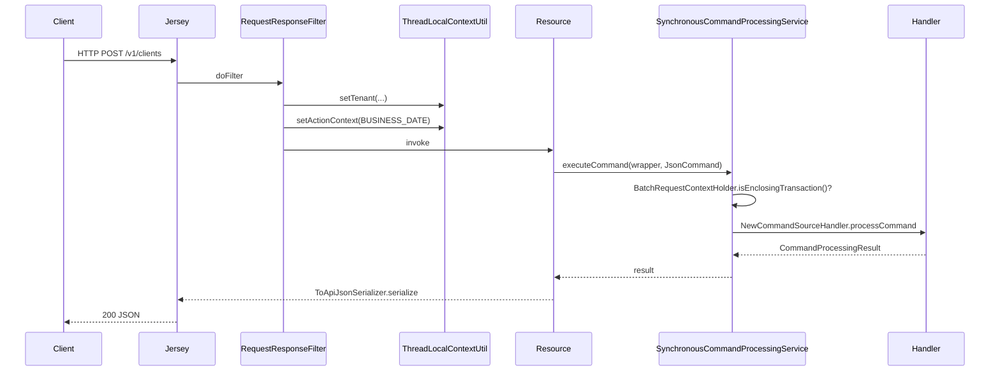

Apache Fineract's `infrastructure.core` is the plumbing layer that every other module imports without thinking about it. This page is a directory-by-directory tour of `fineract-core/src/main/java/org/apache/fineract/infrastructure/core/` covering 20 sub-packages, the file inventory in each, and the half-dozen "load-bearing" classes you must understand to read the rest of the codebase.

## Responsibility

`infrastructure.core` provides the **runtime contract** that the rest of the platform depends on:

- The base classes for every JPA entity (`AbstractPersistableCustom`, `AbstractAuditableCustom`).
- The request-scoped state (`FineractRequestContextHolder`, `BatchRequestContextHolder`, `ContextHolder`).
- The JSON command shape (`JsonCommand`, `CommandProcessingResult`).
- The fluent validator (`DataValidatorBuilder`) that powers every write-path validation in Fineract.
- The exception hierarchy and JAX-RS exception mappers that translate Java exceptions into the platform's standard error envelope.

## Sub-package tour

### `annotation/` — custom marker annotations

| File | Role |
| --- | --- |
| `WithFlushMode.java` | Method-level annotation honored by `FlushModeAspect` to switch JPA flush mode for the duration of a call. |

### `aop/` — Spring AOP aspects

| File | Role |
| --- | --- |
| `FlushModeAspect.java` | `@Aspect` advice that wraps methods annotated with `@WithFlushMode` and toggles the EntityManager flush mode. |

### `api/` — JAX-RS and JSON request helpers

The most-referenced class in this directory is `JsonCommand`. Every write endpoint in Fineract converts its inbound body to a `JsonCommand` and hands it to a `NewCommandSourceHandler`.

| File | Role |
| --- | --- |
| `ApiFacingEnum.java` | Marker interface for enums that need a stable code/value pair when serialized. |
| `ApiParameterHelper.java` | Pulls common query params (`command`, `tenantIdentifier`, locale, dateFormat) off `UriInfo`. |
| `ApiRequestParameterHelper.java` | Builds `ApiRequestJsonSerializationSettings` from request params (used by `ToApiJsonSerializer`). |
| `DateAdapter.java`, `JodaDateTimeAdapter.java`, `JodaMonthDayAdapter.java`, `LocalDateAdapter.java`, `LocalDateTimeAdapter.java`, `LocalTimeAdapter.java`, `OffsetDateTimeAdapter.java`, `ExternalIdAdapter.java` | Gson `TypeAdapter`s for JSR-310 types and `ExternalId`. |
| `DateParam.java` | JAX-RS-friendly `@QueryParam` wrapper that parses ISO dates lazily. |
| `IdTypeResolver.java` | Resolves either a numeric id or an `ExternalId` from a path segment. |
| `JsonCommand.java` | The platform's universal write request — see below. |
| `JsonQuery.java` | A read-side counterpart used by ad-hoc queries. |
| `MutableUriInfo.java` | Lets filters rewrite the request URI before resource methods run. |
| `ParameterListExclusionStrategy.java`, `ParameterListInclusionStrategy.java` | Gson `ExclusionStrategy` used by `ToApiJsonSerializer` to honor `fields=` selectors. |
| `jersey/` | Sub-package with Jersey-specific helpers. |

### `boot/` — Spring profiles

| File | Role |
| --- | --- |
| `FineractProfiles.java` | String constants for Spring profiles (`test`, `oauth`, `oauth-test`, `twofactor`, etc.). |

### `component/` — Spring component conditions

| File | Role |
| --- | --- |
| `FetcherRule.java` | Spring `Condition` toggling beans on the presence of a "fetcher" property. |

### `condition/` — Boot-time conditionals

| File | Role |
| --- | --- |
| `EnableFineractEventListenerCondition.java` | Activates the in-JVM `BusinessEvent` listener bean. |
| `EnableFineractEventsCondition.java` | Master switch for the event subsystem. |
| `FineractExternalEventConfigCondition.java` | Enables external event configuration repository beans. |
| `FineractLiquibaseOnlyApplicationCondition.java` | Used by the `fineract-db` module to start a Liquibase-only app. |
| `FineractModeValidationCondition.java` | Validates `fineract.mode.*` properties (read-only / write / batch-only). |
| `FineractPartitionJobConfigValidationCondition.java` | Validates partitioned-job properties. |
| `FineractRemoteJobMessageHandlerCondition.java` | Activates the remote job message handler in worker instances. |
| `FineractValidationCondition.java` | Aggregate boot-time validation gate. |
| `FineractWebApplicationCondition.java` | Distinguishes web vs. worker JVMs. |
| `ProfileCondition.java`, `PropertiesCondition.java`, `SpringPropertiesFactory.java` | Building blocks for the above. |

### `config/` — Spring `@ConfigurationProperties`

| File | Role |
| --- | --- |
| `AbstractFineractModuleProperties.java` | Base for module-specific property holders. |
| `ExplicitConfigurationPropertiesFactory.java` | Bridges classic `@Bean` definitions to `@ConfigurationProperties`. |
| `FineractProperties.java` | Root of the `fineract.*` property tree — see snippet below. |
| `MapstructMapperConfig.java` | Shared MapStruct config (component model: `spring`). |

### `data/` — request/response data carriers

| File | Role |
| --- | --- |
| `ApiErrorMessageArg.java`, `ApiGlobalErrorResponse.java`, `ApiParameterError.java` | Error envelope returned to clients by `PlatformApiDataValidationExceptionMapper`. |
| `BaseEnumOptionData.java`, `EnumOptionData.java`, `StringEnumOptionData.java` | Wire format for `{id,code,value}` enum tuples. |
| `CommandProcessingResult.java`, `CommandProcessingResultBuilder.java` | The result every write returns — id, changes, command id, etc. |
| `DataValidatorBuilder.java` | The fluent validator — every handler uses it. |
| `DateFormat.java` | Strongly-typed pattern wrapper. |
| `GenericEnumListConverter.java` | JPA `AttributeConverter` for enum lists. |
| `PaginationParameters.java`, `PaginationParametersDataValidator.java` | Common `offset`/`limit`/`orderBy` quartet. |
| `UploadRequest.java` | DTO for multipart uploads. |

### `diagnostics/performance/` — micro-benchmarking utilities

Contains `MeasuringUtil` (referenced by `SendAsynchronousEventsTasklet`) and friends for instrumenting hot paths without pulling in Micrometer.

### `domain/` — entity base classes and contextual holders

This is the most-imported sub-package in the entire codebase.

| File | Role |
| --- | --- |
| `AbstractPersistableCustom.java` | `@MappedSuperclass` with `id` plus `equals`/`hashCode` that survive lazy-init. |
| `AbstractAuditableCustom.java`, `AbstractAuditableWithUTCDateTimeCustom.java` | Add `createdBy`/`createdDate`/`lastModifiedBy`/`lastModifiedDate` via Spring Data JPA auditing. `BusinessDate` extends the UTC variant. |
| `ActionContext.java` | Thread-local enum noting whether the current call should use `BUSINESS_DATE` or `COB_DATE`. |
| `AuditableFieldsConstants.java` | Column-name constants (`created_on_utc`, etc.). |
| `Base64EncodedImage.java` | Inbound image payload helper. |
| `BatchRequestContextHolder.java` | Thread-local marker so command processing knows it is inside a `/v1/batches` enclosing transaction. |
| `ContextHolder.java` | Generic stack-based context utility used by `BatchRequestContextHolder` and others. |
| `ExternalId.java` | Strongly-typed external identifier value object. |
| `FineractContext.java` | Snapshot of tenant + business date used by background jobs to restore context. |
| `FineractEvent.java` | Spring `ApplicationEvent` base. |
| `FineractPlatformTenant.java`, `FineractPlatformTenantConnection.java`, `TenantOidcConfig.java` | Tenant metadata loaded from the tenants DB. |
| `FineractRequestContextHolder.java` | Per-request key/value bag used by `SynchronousCommandProcessingService` to stash idempotency keys. |
| `JdbcSupport.java` | Null-safe getters for `ResultSet` (`getLong`, `getLocalDate`, `getBigDecimal`). Used in nearly every read-platform service. |
| `LocalDateInterval.java` | Inclusive date range with overlap predicates — central to loan schedule code. |

<Tip>
  `JdbcSupport` is the most-imported class in the read path. Whenever you write a `RowMapper`, use `JdbcSupport.getLong(rs, "id")` rather than `rs.getLong("id")`; the former returns `null` for SQL `NULL` instead of `0`.
</Tip>

### `exception/` — platform exception hierarchy

| File | Role |
| --- | --- |
| `AbstractPlatformException.java` | Carries a `globalisationMessageCode`, default message, args. |
| `AbstractPlatformDomainRuleException.java` | 403 — business rule violation. |
| `AbstractPlatformResourceNotFoundException.java` | 404 — resource not found. |
| `AbstractPlatformServiceUnavailableException.java` | 503 — service unavailable. |
| `AbstractIdempotentCommandException.java`, `IdempotentCommandProcessFailedException.java`, `IdempotentCommandProcessSucceedException.java`, `IdempotentCommandProcessUnderProcessingException.java` | Used by `SynchronousCommandProcessingService` to short-circuit retried requests. |
| `ErrorHandler.java` | Static utility that converts Spring `DataAccessException`s into platform exceptions. |
| `GeneralPlatformDomainRuleException.java`, `PlatformDataIntegrityException.java`, `PlatformApiDataValidationException.java`, `PlatformInternalServerException.java`, `PlatformServiceUnavailableException.java`, `ResourceNotFoundException.java`, `UnrecognizedQueryParamException.java`, `UnsupportedParameterException.java` | Concrete subclasses thrown across the codebase. |
| `HttpMessageNotReadableErrorController.java` | Spring MVC translator for unreadable bodies. |
| `InvalidJsonException.java`, `MultiException.java`, `ImageDataURLNotValidException.java`, `ImageUploadException.java`, `JobIsNotFoundOrNotEnabledException.java`, `PlatformRequestBodyItemLimitValidationException.java` | Specialized exceptions. |

### `exceptionmapper/` — JAX-RS `ExceptionMapper`s

The mappers register against the Jersey runtime in `fineract-provider`. They translate Java exceptions into the standard `ApiGlobalErrorResponse` envelope. Examples:

| File | Status | Maps from |
| --- | --- | --- |
| `AccessDeniedExceptionMapper.java` | 403 | Spring Security `AccessDeniedException` |
| `BadCredentialsExceptionMapper.java` | 401 | Spring Security `BadCredentialsException` |
| `ConcurrencyFailureExceptionMapper.java` | 409 | Spring `ConcurrencyFailureException` |
| `DefaultExceptionMapper.java` | 500 | catch-all |
| `FineractExceptionMapper.java` | varies | umbrella mapper |
| `IdempotentCommandExceptionMapper.java` | varies | `AbstractIdempotentCommandException` family |
| `InvalidInstanceTypeMethodExceptionMapper.java` | 405 | calling a write on a read-only instance |
| `InvalidJsonExceptionMapper.java`, `JsonPathExceptionMapper.java`, `JsonSyntaxExceptionMapper.java`, `MalformedJsonExceptionMapper.java` | 400 | JSON parsing failures |
| `JpaOptimisticLockExceptionMapper.java`, `JakartaOptimisticLockExceptionMapper.java`, `OptimisticLockExceptionMapper.java` | 409 | JPA optimistic-lock failures |
| `JakartaValidationExceptionMapper.java` | 400 | Bean Validation errors |
| `JobIsNotFoundOrNotEnabledExceptionMapper.java` | 404 | scheduler errors |
| `NoAuthorizationExceptionMapper.java` | 403 | `PlatformSecurityContext` permission denial |
| `PlatformApiDataValidationExceptionMapper.java` | 400 | `DataValidatorBuilder` errors |
| `PlatformDataIntegrityExceptionMapper.java` | 403 | DB constraint translated to domain rule |
| `PlatformDomainRuleExceptionMapper.java` | 403 | `AbstractPlatformDomainRuleException` |
| `PlatformInternalServerExceptionMapper.java` | 500 | `PlatformInternalServerException` |
| `PlatformRequestBodyItemLimitValidationExceptionMapper.java` | 413 | request too large |
| `PlatformResourceNotFoundExceptionMapper.java` | 404 | `AbstractPlatformResourceNotFoundException` |
| `PlatformServiceUnavailableExceptionMapper.java` | 503 | `AbstractPlatformServiceUnavailableException` |
| `InvalidTenantIdentifierExceptionMapper.java` | 401 | bad `Fineract-Platform-TenantId` header |

### `filters/` — servlet filters and batch helpers

| File | Role |
| --- | --- |
| `BatchCallHandler.java` | Invoked by `BatchApiServiceImpl` for each sub-request — runs through the `BatchFilter` chain then calls the resource method. |
| `BatchFilter.java`, `BatchFilterChain.java` | Mini Servlet-style filter chain operating on `BatchRequest`/`BatchResponse`. |
| `BatchRequestPreprocessor.java` | Interface for code that needs to rewrite a `BatchRequest` (e.g. inject `Idempotency-Key`). |
| `CallerIpTrackingFilter.java` | Records the real client IP in MDC. |
| `CorrelationHeaderFilter.java` | Reads/generates `X-Correlation-Id`. |
| `IdempotencyStoreBatchFilter.java`, `IdempotencyStoreFilter.java`, `IdempotencyStoreHelper.java` | Implement the "first response wins" semantics for retried POSTs. |
| `RequestResponseFilter.java` | Wraps every request with MDC + timing logs. |

### `jersey/serializer/` (and `legacy/`)

Custom Jersey message body writers for legacy JSON shapes still emitted by some endpoints.

### `jpa/`

| File | Role |
| --- | --- |
| `CriteriaQueryFactory.java` | Boilerplate-saving factory for `CriteriaBuilder`/`CriteriaQuery`. |

### `logging/`

| File | Role |
| --- | --- |
| `TenantIdentifierLoggingConverter.java` | Logback converter that injects the current `Fineract-Platform-TenantId` into MDC for every log line. |

### `persistence/`

| File | Role |
| --- | --- |
| `DatabaseSelectingPersistenceUnitPostProcessor.java` | Picks the right `orm.xml` overrides for MySQL vs. PostgreSQL. |
| `ExtendedDataSourceTransactionManager.java`, `ExtendedJpaTransactionManager.java` | Subclasses that fire `TransactionLifecycleCallback`s. |
| `FlushModeHandler.java` | Used by the `WithFlushMode` aspect. |
| `TransactionLifecycleCallback.java` | Hook fired before/after each transaction — used by the event outbox. |

### `serialization/`

| File | Role |
| --- | --- |
| `AbstractFromApiJsonDeserializer.java`, `FromApiJsonDeserializer.java` | Marker for handler-level deserializers. |
| `ApiRequestJsonSerializationSettings.java` | Tells `ToApiJsonSerializer` which fields/pretty-printing to apply. |
| `CommandProcessingResultJsonSerializer.java`, `CommandSerializer.java`, `CommandSerializerDefaultToJson.java` | Serializers for command outputs. |
| `DatatableCommandFromApiJsonDeserializer.java` | Validates datatable command JSON. |
| `DefaultToApiJsonSerializer.java`, `ToApiJsonSerializer.java`, `ExcludeNothingWithPrettyPrintingOffJsonSerializerGoogleGson.java`, `GoogleGsonSerializerHelper.java` | Gson-based serializer stack used by every resource. |
| `FromJsonHelper.java` | Read accessors over a `JsonElement` — the basis of `JsonCommand`. |
| `JsonParserHelper.java` | Lower-level Gson helpers (date parsing, error reporting). |
| `ThrowableSerialization.java` | Serializes exceptions for the command audit row. |
| `gson/` | Custom Gson type adapters. |

### `service/` — pure utility services

| File | Role |
| --- | --- |
| `CommandParameterUtil.java` | Reads the `command=` query parameter and normalizes it. |
| `DataEnricher.java`, `DataEnricherProcessor.java` | Pluggable enrichment of business events before they are written to the outbox. |
| `DateUtils.java` | Tenant-aware "today" helpers honoring `BUSINESS_DATE`/`COB_DATE`. |
| `DefaultOption.java` | Static option list helper. |
| `ExternalIdFactory.java` | Generates/parses `ExternalId` values. |
| `FrequencyTypeUtil.java` | Loan/savings frequency conversions. |
| `IpAddressUtils.java` | Extracts client IP through proxies. |
| `JdbcTemplateFactory.java` | Builds a tenant-scoped `JdbcTemplate`. |
| `MDCWrapper.java` | Helpers around SLF4J MDC. |
| `MathUtil.java` | Null-safe BigDecimal arithmetic. |
| `Page.java`, `PagedRequest.java`, `PagedLocalRequest.java`, `PaginationHelper.java` | Custom pagination model. |
| `SearchParameters.java` | Carrier for search query params. |
| `StringUtil.java` | Misc string helpers. |
| `ThreadLocalContextUtil.java` | Stores the current tenant, business date, locale; used everywhere. |
| `database/` | DB type detection, dialect-specific SQL. |
| `migration/` | Tenant-DB migration helpers (Liquibase wrappers). |
| `tenant/` | Tenant resolver / loader. |

### `validator/`

| File | Role |
| --- | --- |
| `ParseAndValidator.java` | Combines JSON parsing with `DataValidatorBuilder`. |

## Key abstractions

These are the half-dozen types you must internalize to read any Fineract handler.

| Name | File | Signature | Role |
| --- | --- | --- | --- |
| `AbstractPersistableCustom` | `domain/AbstractPersistableCustom.java` | `abstract class AbstractPersistableCustom<T extends Serializable>` | Mapped-superclass with `@Id`/`@GeneratedValue` plus identity equality. |
| `AbstractAuditableCustom` | `domain/AbstractAuditableCustom.java` | `abstract class AbstractAuditableCustom<T extends Serializable> extends AbstractPersistableCustom<T>` | Adds `createdBy`/`createdOn`/`lastModifiedBy`/`lastModifiedOn`. |
| `JsonCommand` | `api/JsonCommand.java` | `public final class JsonCommand` | Wraps the inbound JSON body plus context (entity id, locale, dateFormat). |
| `CommandProcessingResult` | `data/CommandProcessingResult.java` | `public class CommandProcessingResult` | Standardized write response (`resourceId`, `changes`, `commandId`). |
| `DataValidatorBuilder` | `data/DataValidatorBuilder.java` | `public class DataValidatorBuilder` | Fluent `.resource(...).parameter(...).notBlank()` style validator. |
| `JdbcSupport` | `domain/JdbcSupport.java` | static utility | Null-safe `ResultSet` getters used by every `RowMapper`. |
| `FineractRequestContextHolder` | `domain/FineractRequestContextHolder.java` | Spring `@Component` | Per-request attribute bag. Used by `SynchronousCommandProcessingService.IDEMPOTENCY_KEY_ATTRIBUTE`. |
| `BatchRequestContextHolder` | `domain/BatchRequestContextHolder.java` | `public final class BatchRequestContextHolder` | Thread-local flag `isEnclosingTransaction()` consulted by the command processor to skip its own retry wrapper. |
| `ContextHolder` | `domain/ContextHolder.java` | `public final class ContextHolder<T>` | Generic stacked thread-local — the base for `BatchRequestContextHolder`. |

### `BatchRequestContextHolder` and friends

`BatchRequestContextHolder.isEnclosingTransaction()` is consulted at the top of `SynchronousCommandProcessingService.executeCommand` (see `fineract-core/src/main/java/org/apache/fineract/commands/service/SynchronousCommandProcessingService.java`) to decide whether to wrap the call in a Resilience4j `Retry`. Inside a `/v1/batches` enclosing transaction the wrapper is skipped because the outer batch already owns the transaction and retrying would re-execute already-applied SQL.

`BatchRequestPreprocessor` (`filters/BatchRequestPreprocessor.java`) is invoked by `BatchApiServiceImpl` before each child request runs; implementations can rewrite the `BatchRequest` (for example, copying the parent's `Idempotency-Key` header onto the children).

## Control flow

## Connections

- Imported by **every** other Fineract module — `fineract-loan`, `fineract-savings`, `fineract-accounting`, `fineract-document`, `fineract-provider`, etc.
- Exports the JPA configuration through `infrastructure/core/persistence/`, which the `fineract-db` module extends.
- Wires Jersey via `infrastructure/core/exceptionmapper/` — every mapper is auto-registered as a Spring `@Component` and picked up by `fineract-provider`'s Jersey config.

## Gotchas

<Warning>
  `AbstractAuditableCustom` requires Spring Data JPA auditing to be active (`@EnableJpaAuditing`). If you write tests that touch entities without the platform context, audit columns will be `null` and trigger a Liquibase `NOT NULL` violation.
</Warning>

<Warning>
  `ThreadLocalContextUtil` clears state on response completion. Inside background jobs (Spring Batch), use `FineractContext.snapshot()` and re-apply it on the worker thread or you will lose tenant information.
</Warning>

<Tip>
  When debugging "wrong business date" issues, log `ActionContext.getCurrentAction()` plus `DateUtils.getBusinessLocalDate()` to see which clock the call resolved against.
</Tip>
