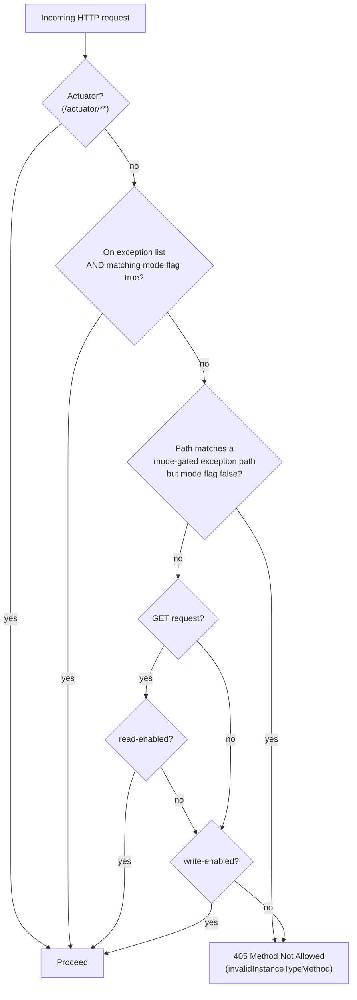

Apache Fineract is designed to run as a fleet of differently-roled JVMs all sharing the same database — a small read pool serving GETs, a larger write pool accepting commands, dedicated batch-manager nodes orchestrating the Spring Batch jobs, and a herd of batch-worker nodes executing partitions. The mechanism that turns one binary into all those roles is **instance mode**: four boolean properties that flip filters, conditional beans, and scheduler behaviour at boot.

This page covers the configuration keys, the filter that enforces them on the API edge, the conditional wiring on the batch side, and the small management endpoint that lets operators inspect the active mode.

## Package layout

The mechanism is split across two modules:

```text
fineract-core/.../infrastructure/instancemode/
├── api/
│   └── FineractInstanceModeConstants.java
└── filter/
    └── FineractInstanceModeApiFilter.java

fineract-provider/.../infrastructure/instancemode/
└── api/
    ├── InstanceModeApiResource.java
    └── InstanceModeApiResourceSwagger.java
```

The filter and constants live in `fineract-core` so any module that needs them (web stack, batch stack, scheduler) can import them without depending on the full provider. The REST resource is in `fineract-provider` because it is a JAX-RS endpoint.

## The four flags

The runtime mode is controlled by four properties under the `fineract.mode.*` prefix, bound onto `FineractProperties.FineractModeProperties`:

```properties
fineract.mode.read-enabled=${FINERACT_MODE_READ_ENABLED:true}
fineract.mode.write-enabled=${FINERACT_MODE_WRITE_ENABLED:true}
fineract.mode.batch-worker-enabled=${FINERACT_MODE_BATCH_WORKER_ENABLED:true}
fineract.mode.batch-manager-enabled=${FINERACT_MODE_BATCH_MANAGER_ENABLED:true}
```

All four default to `true`, which is the all-in-one developer profile: a single JVM serves reads and writes and also runs the scheduler and Spring Batch jobs.

| Property | Env | Enables |
| --- | --- | --- |
| `fineract.mode.read-enabled` | `FINERACT_MODE_READ_ENABLED` | HTTP `GET` requests via the JAX-RS stack. |
| `fineract.mode.write-enabled` | `FINERACT_MODE_WRITE_ENABLED` | HTTP `POST/PUT/DELETE/PATCH` — i.e. command-source mutations. |
| `fineract.mode.batch-manager-enabled` | `FINERACT_MODE_BATCH_MANAGER_ENABLED` | Scheduler, the `/v1/jobs` and `/v1/scheduler` APIs, the COB catch-up endpoints. |
| `fineract.mode.batch-worker-enabled` | `FINERACT_MODE_BATCH_WORKER_ENABLED` | Spring Batch step execution for partitioned jobs. |

## `FineractInstanceModeApiFilter`

Read/write enforcement happens at the servlet edge. `FineractInstanceModeApiFilter` extends Spring's `OncePerRequestFilter` and runs before the JAX-RS dispatcher:

```java
@RequiredArgsConstructor
public class FineractInstanceModeApiFilter extends OncePerRequestFilter {

    private static final List<ExceptionListItem> EXCEPTION_LIST = List.of(
            item(FineractModeProperties::isBatchManagerEnabled, pi -> pi.startsWith("/v1/jobs")),
            item(FineractModeProperties::isBatchManagerEnabled, pi -> pi.startsWith("/v1/scheduler")),
            item(FineractModeProperties::isBatchManagerEnabled, pi -> pi.startsWith("/v1/loans/catch-up")),
            item(FineractModeProperties::isBatchManagerEnabled, pi -> pi.startsWith("/v1/loans/is-catch-up-running")),
            item(p -> true,                                   pi -> pi.startsWith("/v1/instance-mode")),
            item(p -> true,                                   pi -> pi.startsWith("/v1/batches")));

    private final FineractProperties fineractProperties;

    @Override
    protected void doFilterInternal(HttpServletRequest request,
                                     HttpServletResponse response,
                                     FilterChain filterChain) {
        if (isOnExceptionList(request) || isActuatorApi(request)) {
            proceed(filterChain, request, response);
        } else if (isPathOnExceptionList(request)) {
            reject(request, response);
        } else if (fineractProperties.getMode().isReadEnabled() && isReadMethod(request)) {
            proceed(filterChain, request, response);
        } else if (fineractProperties.getMode().isWriteEnabled()) {
            proceed(filterChain, request, response);
        } else {
            reject(request, response);
        }
    }
    // …
}
```

### Decision flow



### What the exception list does

Two cases the simple read/write split cannot express:

1. **Batch-manager-only endpoints** — `/v1/jobs`, `/v1/scheduler`, `/v1/loans/catch-up`, `/v1/loans/is-catch-up-running`. These are *write*-shaped (POST/PUT) but conceptually belong to the batch role. They are allowed only when `batch-manager-enabled=true`, regardless of `write-enabled`. On a node that has `write-enabled=true` but `batch-manager-enabled=false`, calls to these paths return 405.
2. **Always-available endpoints** — `/v1/instance-mode` (lets operators discover the live mode without any role) and `/v1/batches` (Fineract's batch HTTP wrapper, gated separately by the `BatchApiResource` itself so GET-shaped batch calls can flow through read-only nodes).

Rejected requests return HTTP `405 Method Not Allowed` with the body produced by `ApiGlobalErrorResponse.invalidInstanceTypeMethod()` — the same shape as any other Fineract API error.

## `InstanceModeApiResource`

`InstanceModeApiResource` (in `fineract-provider/.../instancemode/api`) exposes the current mode as a tiny read-only resource so operators, load-balancer health checks, and orchestration tooling can ask the node which role it believes it is in:

| Method | Path | Returns |
| --- | --- | --- |
| `GET` | `/v1/instance-mode` | `{ "readEnabled": …, "writeEnabled": …, "batchManagerEnabled": …, "batchWorkerEnabled": … }` |

Because this path is in the always-on exception list, the endpoint is reachable from any node regardless of mode — including a degraded "everything off" instance.

## Typical deployment topologies

The four flags compose into a handful of common roles:

### Single-node (default)

```
fineract.mode.read-enabled=true
fineract.mode.write-enabled=true
fineract.mode.batch-manager-enabled=true
fineract.mode.batch-worker-enabled=true
```

Everything in one JVM. Suitable for development, test, and small production deployments.

### Read replica

```
fineract.mode.read-enabled=true
fineract.mode.write-enabled=false
fineract.mode.batch-manager-enabled=false
fineract.mode.batch-worker-enabled=false
```

Accepts only GETs. Pair with a read-only JDBC user and route reporting traffic to a fleet of these.

### Write node

```
fineract.mode.read-enabled=true
fineract.mode.write-enabled=true
fineract.mode.batch-manager-enabled=false
fineract.mode.batch-worker-enabled=false
```

Serves the regular API but does not run scheduled jobs.

### Dedicated batch manager

```
fineract.mode.read-enabled=false
fineract.mode.write-enabled=false
fineract.mode.batch-manager-enabled=true
fineract.mode.batch-worker-enabled=false
```

Runs the scheduler, owns `/v1/jobs`, dispatches partitions. No customer-facing traffic.

### Batch worker pool

```
fineract.mode.read-enabled=false
fineract.mode.write-enabled=false
fineract.mode.batch-manager-enabled=false
fineract.mode.batch-worker-enabled=true
```

Picks up partitions from the manager and executes them — the COB workers.

## Interaction with other subsystems

* **Scheduled jobs.** The job scheduler beans are wired conditionally on `fineract.mode.batch-manager-enabled`. A node with that flag off will not register cron triggers, so it never tries to fire a job. See [Spring Batch integration](/core/spring-batch-integration) and [/jobs/overview](/jobs/overview).
* **COB pipeline.** Catch-up endpoints (`/v1/loans/catch-up`, `/v1/loans/is-catch-up-running`) are exception-listed onto the batch-manager flag; the actual partition execution runs on `batch-worker-enabled` nodes. See [/cob/overview](/cob/overview).
* **Batches API.** Fineract's `/v1/batches` ("batch requests" — bundles of HTTP calls in one transaction) is always-allowed at the filter level but enforces its own read/write check inside the resource so that GET-only batches still work on read replicas.
* **Actuator.** All `/actuator/**` paths bypass the filter — health, readiness, and metrics endpoints stay available even on a node that has every business mode disabled.

## Configuration cheatsheet

`application.properties` (or environment overrides) — every property accepts a boolean and defaults to `true`:

```properties
# Default values. Override per-role via env vars.
fineract.mode.read-enabled=${FINERACT_MODE_READ_ENABLED:true}
fineract.mode.write-enabled=${FINERACT_MODE_WRITE_ENABLED:true}
fineract.mode.batch-worker-enabled=${FINERACT_MODE_BATCH_WORKER_ENABLED:true}
fineract.mode.batch-manager-enabled=${FINERACT_MODE_BATCH_MANAGER_ENABLED:true}
```

Common environment overlays:

```bash
# Read replica
FINERACT_MODE_WRITE_ENABLED=false
FINERACT_MODE_BATCH_MANAGER_ENABLED=false
FINERACT_MODE_BATCH_WORKER_ENABLED=false

# Batch manager
FINERACT_MODE_READ_ENABLED=false
FINERACT_MODE_WRITE_ENABLED=false
FINERACT_MODE_BATCH_WORKER_ENABLED=false
```

## Health probes

Two patterns work well with the filter:

1. Use `/actuator/health` for liveness / readiness — it bypasses the filter and tells you whether the JVM is up.
2. Use `/v1/instance-mode` from the orchestrator (Kubernetes operator, deploy script) to assert the node is in the role you intended — this surfaces a misconfigured environment variable as a deploy-time error rather than a 405 storm at first traffic.

## Troubleshooting

### "All my requests return 405"

Symptom: every business call comes back with `405 Method Not Allowed` and an `invalidInstanceTypeMethod` body.

Cause: both `read-enabled` and `write-enabled` are false. The node is intentionally idle (e.g. a pure batch worker).

Fix: check the live mode at `/v1/instance-mode`. If it does not match your deployment intent, look at the environment variables on the running container — these typically come from a misnamed Kubernetes secret or a missed env-var rename across versions.

### "GETs work, but POSTs fail with 405"

Symptom: read-only behaviour on what should be a read-write node.

Cause: `write-enabled=false`. Common after copy-pasting a read replica's environment overlay onto a write node.

Fix: set `FINERACT_MODE_WRITE_ENABLED=true` and restart. No data migration needed.

### "POSTs to `/v1/jobs` return 405 even though writes work"

Symptom: scheduler API rejects every call on a node where `/v1/loans` POSTs work fine.

Cause: `batch-manager-enabled=false`. The `/v1/jobs` and `/v1/scheduler` paths are exception-listed onto the batch-manager flag, regardless of `write-enabled`.

Fix: enable the batch-manager flag on this node, or call the scheduler API against the dedicated manager node.

### "Health checks fail when the node is configured for batch-only"

Symptom: load balancer marks the node unhealthy after switching to batch-only mode.

Cause: the health check is hitting a `/v1/...` business endpoint and getting `405`.

Fix: point the health check at `/actuator/health` or `/v1/instance-mode` — both bypass the filter and remain available regardless of mode.

## Related pages

- [Spring Batch integration](/core/spring-batch-integration) — what `batch-manager-enabled` and `batch-worker-enabled` actually wire up.
- [/jobs/overview](/jobs/overview) — scheduled jobs only run on a batch-manager node.
- [/cob/overview](/cob/overview) — close-of-business pipeline and its catch-up endpoints.
