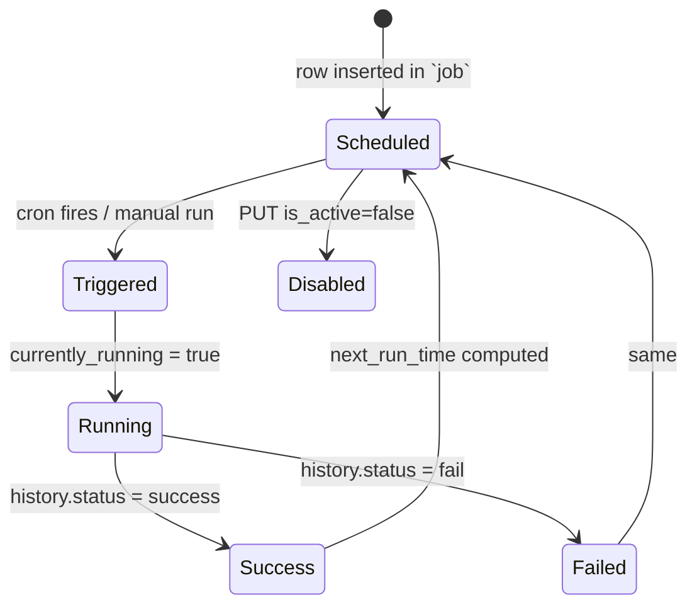

Apache Fineract runs end-of-day, hourly and ad-hoc work through Spring Batch jobs whose metadata is persisted in the platform's own database. This page covers the JPA entities and enums that make up that metadata. The naming enum and the core helpers live in `fineract-core` under `org.apache.fineract.infrastructure.jobs`; the heavier `ScheduledJobDetail` and `ScheduledJobRunHistory` entities live in `fineract-provider` because the scheduler that mutates them needs the rest of the platform.

## Package layout

```
org.apache.fineract.infrastructure.jobs   (fineract-core)
├── TenantAwareEqualsHashCodeAdvice.java
├── data/        JobDetailData, JobDetailHistoryData, JobParameterDTO, JobParametersDTO
├── domain/      CustomJobParameter + repository
├── exception/
└── service/     JobName (enum), StepName (enum), SchedulerJobRunnerReadService

org.apache.fineract.infrastructure.jobs   (fineract-provider)
└── domain/
    ├── ScheduledJobDetail
    ├── ScheduledJobDetailRepository
    ├── ScheduledJobRunHistory
    ├── ScheduledJobRunHistoryRepository
    ├── SchedulerDetail
    ├── SchedulerDetailRepository
    ├── JobParameter / JobParameterRepository
    ├── JobExecutionRepository
    └── RunningJobWithCustomParameters
```

## `JobName` enum

`JobName` is the canonical list of jobs the platform knows about. Each value carries a display name; the ordinal is irrelevant. New jobs append a value — never reuse one. A representative slice of the enum (over forty entries in total):

| Enum value | Display name |
|------------|--------------|
| `UPDATE_LOAN_ARREARS_AGEING` | Update Loan Arrears Ageing |
| `APPLY_ANNUAL_FEE_FOR_SAVINGS` | Apply Annual Fee For Savings |
| `APPLY_HOLIDAYS_TO_LOANS` | Apply Holidays To Loans |
| `POST_INTEREST_FOR_SAVINGS` | Post Interest For Savings |
| `TRANSFER_FEE_CHARGE_FOR_LOANS` | Transfer Fee For Loans From Savings |
| `ACCOUNTING_RUNNING_BALANCE_UPDATE` | Update Accounting Running Balances |
| `PAY_DUE_SAVINGS_CHARGES` | Pay Due Savings Charges |
| `APPLY_CHARGE_TO_OVERDUE_LOAN_INSTALLMENT` | Apply penalty to overdue loans |
| `EXECUTE_STANDING_INSTRUCTIONS` | Execute Standing Instruction |
| `ADD_ACCRUAL_ENTRIES` | Add Accrual Transactions |
| `UPDATE_NPA` | Update Non Performing Assets |
| `UPDATE_DEPOSITS_ACCOUNT_MATURITY_DETAILS` | Update Deposit Accounts Maturity details |
| `TRANSFER_INTEREST_TO_SAVINGS` | Transfer Interest To Savings |
| `ADD_PERIODIC_ACCRUAL_ENTRIES` | Add Periodic Accrual Transactions |
| `RECALCULATE_INTEREST_FOR_LOAN` | Recalculate Interest For Loans |
| `GENERATE_RD_SCEHDULE` | Generate Mandatory Savings Schedule |
| `GENERATE_LOANLOSS_PROVISIONING` | Generate Loan Loss Provisioning |
| `POST_DIVIDENTS_FOR_SHARES` | Post Dividends For Shares |
| `UPDATE_SAVINGS_DORMANT_ACCOUNTS` | Update Savings Dormant Accounts |
| `EXECUTE_REPORT_MAILING_JOBS` | Execute Report Mailing Jobs |
| `UPDATE_SMS_OUTBOUND_WITH_CAMPAIGN_MESSAGE` | Update SMS Outbound with Campaign Message |
| `SEND_MESSAGES_TO_SMS_GATEWAY` | Send Messages to SMS Gateway |
| `GET_DELIVERY_REPORTS_FROM_SMS_GATEWAY` | Get Delivery Reports from SMS Gateway |
| `GENERATE_ADHOC_CLIENT_SCHEDULE` | Generate AdhocClient Schedule |
| `UPDATE_EMAIL_OUTBOUND_WITH_CAMPAIGN_MESSAGE` | Update Email Outbound with campaign message |
| `EXECUTE_EMAIL` | Execute Email |
| `UPDATE_TRIAL_BALANCE_DETAILS` | Update Trial Balance Details |
| `EXECUTE_DIRTY_JOBS` | Execute All Dirty Jobs |
| `LOAN_COB` | Loan COB |
| `LOAN_DELINQUENCY_CLASSIFICATION` | Loan Delinquency Classification |
| `SEND_ASYNCHRONOUS_EVENTS` | Send Asynchronous Events |
| `PURGE_EXTERNAL_EVENTS` | Purge External Events |
| `PURGE_PROCESSED_COMMANDS` | Purge Processed Commands |
| `ACCRUAL_ACTIVITY_POSTING` | Accrual Activity Posting |
| `JOURNAL_ENTRY_AGGREGATION` | Journal Entry Aggregation |
| `WORKING_CAPITAL_LOAN_COB_JOB` | Working Capital Loan COB |
| `ADD_PERIODIC_ACCRUAL_ENTRIES_FOR_SAVINGS_WITH_INCOME_POSTED_AS_TRANSACTIONS` | Add Accrual Transactions For Savings |
| `ADD_PERIODIC_ACCRUAL_ENTRIES_FOR_LOANS_WITH_INCOME_POSTED_AS_TRANSACTIONS` | Add Periodic Accrual Transactions for loans with income posted as transactions |

<Info>
`SEND_ASYNCHRONOUS_EVENTS` and `PURGE_EXTERNAL_EVENTS` are the two jobs that own the outbox pipeline — see [/core/external-events](/core/external-events). `LOAN_COB` is the orchestrator that processes loans for the previous business date — see [/core/business-date](/core/business-date).
</Info>

## `StepName` enum

For multi-step jobs (notably `LOAN_COB` and `LOAN_DELINQUENCY_CLASSIFICATION`), the individual Spring Batch step names are listed in `StepName`. Examples: `APPLY_CHARGE_TO_OVERDUE_LOANS`, `LOAN_DELINQUENCY_CLASSIFICATION`. The enum keeps step naming consistent across the codebase and the persisted execution metadata.

## `ScheduledJobDetail`

JPA entity for `job` table. One row per `JobName` per tenant.

| Column | Type | Notes |
|--------|------|-------|
| `id` | `BIGINT` | PK. |
| `name` | `VARCHAR` | Display name (must match `JobName`). |
| `display_name` | `VARCHAR` | Operator-visible name. |
| `cron_expression` | `VARCHAR` | Quartz cron. |
| `task_priority` | `SMALLINT` | Used to order concurrent jobs. |
| `group_name` | `VARCHAR` | Spring Batch group. |
| `previous_run_start_time` | `DATETIME` | Last start. |
| `next_run_time` | `DATETIME` | Scheduled next start. |
| `job_key` | `VARCHAR` | Quartz job key (`name + group`). |
| `initializing_errorlog` | `TEXT` | Last scheduler init error. |
| `is_active` | `BOOLEAN` | Master enable. |
| `currently_running` | `BOOLEAN` | True while executing. |
| `is_mismatched_job` | `BOOLEAN` | Trip flag when configured cron does not match scheduler reality. |
| `node_id` | `SMALLINT` | For cluster pinning. |
| `is_misfired` | `BOOLEAN` | Set if a run was missed. |
| `cron_misfire_action` | `INT` | Quartz misfire policy. |

`ScheduledJobDetailRepository` exposes derived finders by name and by `currently_running`.

## `ScheduledJobRunHistory`

Maps to `job_run_history`. Append-only audit of each run.

| Column | Type | Notes |
|--------|------|-------|
| `id` | `BIGINT` | PK. |
| `job_id` | `BIGINT` | FK to `job`. |
| `version` | `INT` | Increments per run. |
| `start_time` | `DATETIME` | When the run started. |
| `end_time` | `DATETIME` | When it finished. |
| `status` | `VARCHAR` | `success` / `fail`. |
| `error_message` | `TEXT` | Stack trace on failure. |
| `trigger_type` | `VARCHAR` | `cron`, `application`, or `manual`. |
| `error_log` | `TEXT` | Verbose log on failure. |

`ScheduledJobRunHistoryRepository` provides paged read access by job id and by status.

## `SchedulerDetail`

Maps to `scheduler_detail`. Per-tenant scheduler state.

| Column | Type | Notes |
|--------|------|-------|
| `id` | `BIGINT` | PK. |
| `is_suspended` | `BOOLEAN` | When `true`, all jobs are skipped. |
| `execute_misfired_jobs` | `BOOLEAN` | Run jobs whose schedule was missed. |
| `reset_scheduler_on_bootup` | `BOOLEAN` | Re-create triggers on startup. |

## `SchedulerStopMode`

Controls how the scheduler shuts down — both at JVM shutdown and on operator request.

| Mode | Effect |
|------|--------|
| `WAIT_FOR_RUNNING_JOBS_TO_COMPLETE` | Stop accepting new jobs but let running ones finish. Used by graceful shutdown. |
| `IMMEDIATE` | Interrupt running jobs as soon as they reach an interruptible boundary. |

Selecting `IMMEDIATE` is the only option that respects deployment shutdown timeouts; long-running COB jobs may need explicit interrupt support inside their tasklets.

## Custom job parameters

The `domain/CustomJobParameter` entity (in `fineract-core`) stores a JSON blob of parameters for a one-off invocation of a job — e.g. running `LOAN_COB` for a specific date or set of loan ids. `CustomJobParameterRepository` provides the basic CRUD and one custom query for housekeeping. `JobParameterDTO` and `JobParametersDTO` are the transport types used by the trigger API.

`RunningJobWithCustomParameters` (in `fineract-provider`) joins `ScheduledJobDetail`, the `CustomJobParameter` payload, and the Spring Batch `JOB_EXECUTION_ID` so the read API can show "this job is running with those parameters".

## `SchedulerJobRunnerReadService`

Read service consumed by the jobs administration UI:

| Method | Returns |
|--------|---------|
| `findAllJobDetails()` | Page of `JobDetailData`. |
| `retrieveOne(jobId)` | One job's metadata. |
| `retrieveJobHistory(jobId, ...)` | Page of `JobDetailHistoryData`. |
| `isUpdatesAllowed()` | Whether the scheduler is in a state that accepts mutations. |
| `retrieveSchedulerStatus()` | Active / suspended snapshot. |

## `TenantAwareEqualsHashCodeAdvice`

A small AOP advice that hooks into Spring Batch's job execution equality so that two executions of the same Spring Batch job for different tenants are distinguished. Without it, the framework's caching could collide tenants.

## Job lifecycle



## Triggering a job

`POST /v1/jobs/{jobId}?command=executeJob` (resource in `fineract-provider`). The handler:

1. Validates the job exists and is `is_active = true`.
2. Builds a Spring Batch `JobParameters` from any supplied custom parameters.
3. Sets `currently_running = true`.
4. Submits to the configured `JobLauncher`.
5. On completion, writes a `ScheduledJobRunHistory` row and resets `currently_running`.

<Warning>
Manually triggering `LOAN_COB` while the previous run is still active will be rejected — concurrent executions would corrupt accruals. The check is enforced at the repository level using `currently_running`.
</Warning>

## Reading run history

`GET /v1/jobs/{jobId}/runhistory` paginates `ScheduledJobRunHistory` newest first. The response shape is `JobDetailHistoryData`, including `errorLog` only when the run failed (saving payload size on the happy path).

## Operational guidance

| Need | Action |
|------|--------|
| Pause all jobs for maintenance | `PUT /v1/scheduler?command=suspend`. Sets `scheduler_detail.is_suspended`. |
| Disable one job | `PUT /v1/jobs/{id}` with `isActive=false`. |
| Re-run the previous day's COB | Issue `executeJob` with custom parameter `businessDate=YYYY-MM-DD`. |
| Detect missed runs | Watch `is_misfired` flag and the `execute_misfired_jobs` setting. |

## Tests

| Test | Coverage |
|------|----------|
| `SchedulerJobsTest` | Lifecycle, history, suspend / resume. |
| `LoanCobTest` | End-to-end multi-step COB. |
| Unit tests on each tasklet | Per-step behaviour. |

## Custom parameters in detail

`CustomJobParameter` stores a JSON document. The shape is intentionally free-form so jobs can accept their own keys:

```jsonc
{
  "businessDate": "2025-01-14",
  "loanIds": [101, 102, 103],
  "dryRun": true
}
```

The job's `Tasklet` parses the payload into its own DTO. The benefit of going through `CustomJobParameter` rather than passing parameters straight into Spring Batch's `JobParameters` is twofold:

| Benefit | Detail |
|---------|--------|
| Auditable | The exact payload is persisted alongside the run. |
| Replayable | Re-running the same job on a different node uses the same payload row. |
| Searchable | The read API surfaces the JSON for the UI. |

`JobParameterDTO` / `JobParametersDTO` are the transport types used by the trigger endpoint to accept these blobs.

## Job categories

While `JobName` is flat, jobs fall into a few categories:

| Category | Examples |
|----------|----------|
| Daily accrual / closing | `ADD_ACCRUAL_ENTRIES`, `ADD_PERIODIC_ACCRUAL_ENTRIES`, `LOAN_COB`, `ACCRUAL_ACTIVITY_POSTING` |
| Loan ageing / penalty | `UPDATE_LOAN_ARREARS_AGEING`, `APPLY_CHARGE_TO_OVERDUE_LOAN_INSTALLMENT`, `LOAN_DELINQUENCY_CLASSIFICATION` |
| Holiday / calendar | `APPLY_HOLIDAYS_TO_LOANS` |
| Savings | `APPLY_ANNUAL_FEE_FOR_SAVINGS`, `POST_INTEREST_FOR_SAVINGS`, `PAY_DUE_SAVINGS_CHARGES`, `UPDATE_SAVINGS_DORMANT_ACCOUNTS` |
| Deposits | `UPDATE_DEPOSITS_ACCOUNT_MATURITY_DETAILS`, `TRANSFER_INTEREST_TO_SAVINGS` |
| Accounting | `ACCOUNTING_RUNNING_BALANCE_UPDATE`, `UPDATE_TRIAL_BALANCE_DETAILS`, `JOURNAL_ENTRY_AGGREGATION` |
| Communications | `EXECUTE_EMAIL`, `SEND_MESSAGES_TO_SMS_GATEWAY`, `GET_DELIVERY_REPORTS_FROM_SMS_GATEWAY`, `EXECUTE_REPORT_MAILING_JOBS` |
| Infrastructure | `SEND_ASYNCHRONOUS_EVENTS`, `PURGE_EXTERNAL_EVENTS`, `PURGE_PROCESSED_COMMANDS`, `EXECUTE_DIRTY_JOBS` |
| Shares | `POST_DIVIDENTS_FOR_SHARES` |
| NPA / provisioning | `UPDATE_NPA`, `GENERATE_LOANLOSS_PROVISIONING` |
| Schedules | `GENERATE_RD_SCEHDULE`, `GENERATE_ADHOC_CLIENT_SCHEDULE`, `RECALCULATE_INTEREST_FOR_LOAN` |

## Ordering and dependencies

The scheduler executes jobs independently — there is no built-in DAG of dependencies. Operationally the typical order during a tenant's COB window is:

```mermaid
flowchart LR
  S[Pause online traffic] --> A[ADD_PERIODIC_ACCRUAL_ENTRIES]
  A --> B[UPDATE_LOAN_ARREARS_AGEING]
  B --> C[APPLY_CHARGE_TO_OVERDUE_LOAN_INSTALLMENT]
  C --> D[LOAN_COB]
  D --> E[LOAN_DELINQUENCY_CLASSIFICATION]
  E --> F[UPDATE_NPA]
  F --> G[ACCOUNTING_RUNNING_BALANCE_UPDATE]
  G --> H[POST: increase BUSINESS_DATE]
  H --> I[SEND_ASYNCHRONOUS_EVENTS catch-up]
```



Operators wire this through cron expressions (e.g. one job per ten minutes) or, for more complex orchestration, an external scheduler invoking the `executeJob` REST endpoint in sequence.

## Cluster considerations

When Fineract runs in a clustered deployment, the `node_id` column on `ScheduledJobDetail` pins a job to a specific instance. The Spring Batch `JobLauncher` on other nodes refuses to run it. This keeps daily-aggregate jobs single-instance without needing an external lock service.

`is_mismatched_job` is set when the configured cron and the Quartz scheduler's view diverge — typically after a config change made directly in the database. Operators clear the flag by re-saving the job through the API.

## Related

- The Loan COB step relies on [/core/business-date](/core/business-date).
- Outbox-related jobs are the bridge to [/core/external-events](/core/external-events).
- Operator-facing scheduler documentation: [/jobs/overview](/jobs/overview).
