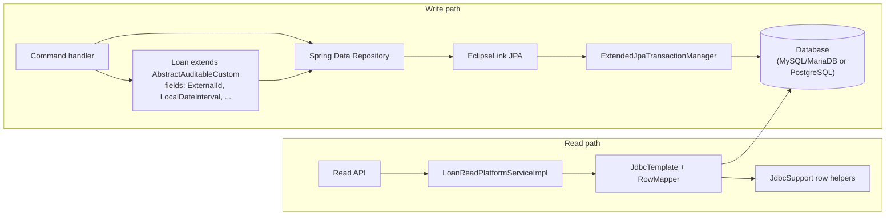

Apache Fineract persists almost everything to a relational database. The JPA layer that does the work is built on **EclipseLink** (with static weaving), a small hierarchy of base entity classes that capture the standard ID, audit, and tenant-context patterns, and a handful of value types (`ExternalId`, `LocalDateInterval`) plus the lower-level `JdbcSupport` helpers used wherever a raw JDBC `ResultSet` shows up — typically in read services and the COB pipeline.

This page covers the building blocks: the JPA provider choice, the abstract entities, the value types, and the row helpers.

## EclipseLink as the JPA provider

Fineract uses EclipseLink rather than Hibernate. The decision is visible in:

* `persistence.xml` — the provider class is `org.eclipse.persistence.jpa.PersistenceProvider`.
* Build configuration — every module that defines JPA entities runs the EclipseLink **static weaver** as part of its Gradle build. The repository root carries a top-level [`STATIC_WEAVING.md`](https://github.com/apache/fineract/blob/develop/STATIC_WEAVING.md) describing the process for developers.
* `DatabaseSelectingPersistenceUnitPostProcessor` (in `fineract-core/.../infrastructure/core/persistence/`) — picks the right `eclipselink.target-database` at boot time (MySQL/MariaDB or PostgreSQL).

### Why static weaving

EclipseLink uses byte-code weaving to implement lazy loading, change tracking, and fetch groups. Two options exist:

* **Dynamic (load-time) weaving** — the JVM agent rewrites classes at class-loading time. Easy in dev, fragile in containers, hostile to AOT and to graal-style native images.
* **Static (build-time) weaving** — the Gradle build rewrites the compiled classes so the runtime JVM sees already-woven bytecode.

Fineract uses **static weaving** in every JPA-bearing module. Practically this means:

* `./gradlew build` (or `./gradlew :fineract-provider:compileJava`) is required after editing any entity — IDE compilation alone produces unwoven classes that misbehave at runtime (e.g. lazy fields silently null).
* If you see `EclipseLink does not appear to have been properly weaved` warnings on startup, you almost certainly ran the unit tests from the IDE without a Gradle build first.

Read `STATIC_WEAVING.md` at the repository root for the up-to-date Gradle invocation and IDE setup notes.

## Transaction management

Two custom transaction managers wrap Spring's defaults:

* `ExtendedJpaTransactionManager` — used by `@Transactional` JPA flows. Adds `TransactionLifecycleCallback` hooks so application code can react to before-commit / after-commit / rollback events without writing a `TransactionSynchronization` by hand.
* `ExtendedDataSourceTransactionManager` — used for raw JDBC flows that bypass JPA (the read-side service classes that use `JdbcTemplate`). Carries the same lifecycle hook surface.

`FlushModeHandler` is the small utility used by code that needs to temporarily switch the JPA flush mode (e.g. to suppress flushes inside a long-running iteration over a result set).

## The entity base classes

All Fineract entities extend one of three base classes that bake in identity and audit columns.

### `AbstractPersistableCustom<ID>`

The simplest base — just a generated identity column. Used for static lookup tables and any entity that does not need creator/timestamp tracking:

```java
@MappedSuperclass
public abstract class AbstractPersistableCustom<ID extends Serializable> implements Persistable<ID> {

    @Id
    @GeneratedValue(strategy = GenerationType.IDENTITY)
    private ID id;

    @Override public ID getId()       { return id; }
    @Override public boolean isNew()  { return id == null; }
}
```

The generic ID parameter lets entities pick `Long`, `Integer`, or other types — most Fineract entities are `Long`-keyed, but a handful of high-cardinality tables use bigger keys.

### `AbstractAuditableCustom`

Adds the standard four audit columns Fineract uses everywhere:

* `created_on_utc` — `OffsetDateTime`, populated by the `AuditingEntityListener`.
* `last_modified_on_utc` — `OffsetDateTime`, updated on every persist.
* `created_by` — the `AppUser` id captured from the current security context.
* `last_modified_by` — same, refreshed on every modification.

Anything mutated by users (loans, clients, savings, hooks, …) extends `AbstractAuditableCustom`. Combined with Spring Data's `AuditorAware`, no business code has to populate these columns by hand — they show up automatically.

### `AbstractAuditableWithUTCDateTimeCustom`

A specialised variant that emits the timestamps as `LocalDateTime` in UTC rather than as `OffsetDateTime`. Used by older tables whose schema predates the `_utc` column convention and where the columns are typed as `TIMESTAMP` without time-zone information. The two flavours coexist so newer code can use the explicit-offset version while older tables keep their legacy semantics.

## Value types

Fineract treats two recurring concepts as first-class value types rather than primitive columns, so the rest of the code can pass them around with full type safety.

### `ExternalId`

A wrapper around an externally-supplied identifier (e.g. an upstream CRM's loan ID). Persisted as a `String` column but carried in the domain as `ExternalId`:

```java
ExternalId externalId = ExternalId.generate();          // UUID-shaped
ExternalId fromInput  = ExternalIdFactory.produce(req); // user-supplied or auto

if (externalId.isEmpty()) {
    // not yet assigned
}
String value = externalId.getValue();
```

The wrapper exists because almost every entity in Fineract optionally has an external ID, and treating it as a value type lets the codebase:

* Reject empty/blank strings at the boundary rather than in dozens of `if (s == null || s.isBlank())` checks.
* Provide a single place to wire validation and generation policies (UUID, ULID, custom prefix).
* Make repository methods `findByExternalId(ExternalId)` rather than `findByExternalIdString(String)`, removing a class of bugs where a raw string was passed by mistake.

### `LocalDateInterval`

A closed-open or closed-closed interval of `LocalDate`s — used wherever the domain models a date range (loan term, interest period, holiday window, charge applicability). The interval exposes containment checks (`contains(date)`), comparisons (`startsAfter`, `endsBefore`), and overlap detection.

Typical usage:

```java
LocalDateInterval period = LocalDateInterval.create(startDate, endDate);

if (period.contains(transactionDate)) {
    // transaction falls inside the period
}
```

Modelling intervals once means business code does not re-implement off-by-one logic at every boundary — particularly important for interest calculation where a one-day error changes the result.

## `JdbcSupport`

JPA is the right tool for command-side mutation, but Fineract's read services use raw JDBC (via `JdbcTemplate`) for performance and for queries that simply do not map onto entities — joins across half a dozen tables aggregated into a single response DTO.

`JdbcSupport` is a tiny static utility class with typed null-safe accessors:

```java
JdbcSupport.getLong(rs, "loan_id");
JdbcSupport.getLongDefaultToNullIfZero(rs, "office_id");
JdbcSupport.getInteger(rs, "status_enum");
JdbcSupport.getIntegeOrNull(rs, "term_frequency");
JdbcSupport.getLocalDate(rs, "approved_on_date");
JdbcSupport.getLocalDateTime(rs, "created_on_utc");
JdbcSupport.getBigDecimalDefaultToNullIfZero(rs, "principal_amount");
JdbcSupport.getBigDecimalDefaultToZeroIfNull(rs, "fee_charges_outstanding_derived");
```

The signatures are deliberately concrete — `getLong` returns `Long` (boxed, so `null` is preserved), `getLocalDate` handles the JDBC `Date → LocalDate` conversion, and a small family of `…DefaultToNullIfZero` / `…DefaultToZeroIfNull` variants encode the two most common business conventions:

* A nullable foreign key stored as `0` rather than `NULL` (older schemas) — use `DefaultToNullIfZero`.
* A nullable money column that should be displayed as `0.00` rather than absent — use `DefaultToZeroIfNull`.

Using these helpers consistently throughout the read services means you do not have to re-derive the null/zero/blank rules every time you write a new `RowMapper`.

### Typical usage

```java
public LoanScheduleData mapRow(ResultSet rs, int rowNum) throws SQLException {
    LocalDate dueDate          = JdbcSupport.getLocalDate(rs, "due_date");
    BigDecimal principalDue    = JdbcSupport.getBigDecimalDefaultToZeroIfNull(rs, "principal_due");
    BigDecimal interestDue     = JdbcSupport.getBigDecimalDefaultToZeroIfNull(rs, "interest_due");
    Long      installmentId    = JdbcSupport.getLong(rs, "id");
    Integer   installmentIndex = JdbcSupport.getInteger(rs, "installment_number");
    return new LoanScheduleData(installmentId, installmentIndex, dueDate, principalDue, interestDue);
}
```

## Putting it together



* Commands flow JPA → EclipseLink → `ExtendedJpaTransactionManager`. Audit columns are populated automatically because every domain entity extends `AbstractAuditableCustom`. `ExternalId` and `LocalDateInterval` make the boundary types explicit.
* Reads flow raw JDBC → `JdbcSupport`. The same `ExternalId` and `LocalDateInterval` types are reconstructed in the read DTOs, so the API surface stays consistent.

## Operational notes

- **Schema migrations** are managed with Liquibase (under `db/changelog/tenant/`), not by JPA schema generation. Production deployments always run `eclipselink.ddl-generation=none`.
- **Identity generation** uses `GenerationType.IDENTITY` (the database does it), so the entity has no ID until persisted. `AbstractPersistableCustom.isNew()` returns `true` until the row is flushed.
- **Equality.** `AbstractPersistableCustom` overrides `equals`/`hashCode` based on the ID. New (unpersisted) entities are equal only by reference until they have IDs.
- **Lazy loading** depends on static weaving. If lazy fields appear `null` at runtime, run `./gradlew :module:weaveClasses` (see `STATIC_WEAVING.md`).
- **Transaction propagation.** The default is `REQUIRED`. The two extended transaction managers expose hooks for code that needs to react to commit/rollback boundaries — useful for the COB pipeline where chunk-level callbacks coordinate with the business state.

## Custom `RowMapper` example

A representative read-side mapper showing `JdbcSupport` in production-style code:

```java
public static final class LoanScheduleRowMapper implements RowMapper<LoanScheduleData> {

    public String schema() {
        return " ls.id as id, ls.installment_number as installment_number, "
             + " ls.due_date as due_date, "
             + " ls.principal_amount as principal_due, "
             + " ls.interest_amount as interest_due, "
             + " ls.fee_charges_amount as fee_charges_due, "
             + " ls.penalty_charges_amount as penalty_charges_due, "
             + " ls.completed_derived as completed, "
             + " ls.obligations_met_on_date as paid_on_date "
             + "from m_loan_repayment_schedule ls ";
    }

    @Override
    public LoanScheduleData mapRow(ResultSet rs, int rowNum) throws SQLException {
        Long id                    = JdbcSupport.getLong(rs, "id");
        Integer installmentNumber  = JdbcSupport.getInteger(rs, "installment_number");
        LocalDate dueDate          = JdbcSupport.getLocalDate(rs, "due_date");
        BigDecimal principalDue    = JdbcSupport.getBigDecimalDefaultToZeroIfNull(rs, "principal_due");
        BigDecimal interestDue     = JdbcSupport.getBigDecimalDefaultToZeroIfNull(rs, "interest_due");
        BigDecimal feeChargesDue   = JdbcSupport.getBigDecimalDefaultToZeroIfNull(rs, "fee_charges_due");
        BigDecimal penaltyDue      = JdbcSupport.getBigDecimalDefaultToZeroIfNull(rs, "penalty_charges_due");
        boolean completed          = rs.getBoolean("completed");
        LocalDate paidOnDate       = JdbcSupport.getLocalDate(rs, "paid_on_date");
        return new LoanScheduleData(id, installmentNumber, dueDate,
                principalDue, interestDue, feeChargesDue, penaltyDue,
                completed, paidOnDate);
    }
}
```

The pattern is consistent across the codebase: a static inner `RowMapper` carrying its own `schema()` method that the calling service prepends to a SQL `WHERE` clause. The `JdbcSupport.getXxx` calls handle the null/zero conventions, so the mapper stays focused on shape rather than null guards.

## When to use JPA vs JDBC

A rule of thumb that holds across the codebase:

- **Use JPA** for command-side mutations — creating, updating, soft-deleting business entities. The audit columns, optimistic locking, and lifecycle callbacks are exactly what mutation paths need.
- **Use JDBC** for read-side projections — listing, searching, drill-down views. The N-table join into a single DTO is far cheaper as a single SQL than as a graph of lazily-loaded JPA entities.
- **Use JDBC** for COB chunk writers — bulk updates over thousands of loan IDs. JPA's flush behaviour is the wrong shape; raw `UPDATE … WHERE id IN (…)` is the right one.
- **Use JPA** when the right invariant is "load entity, mutate, save" — the audit and version columns get populated automatically.

## Transaction lifecycle callbacks

`TransactionLifecycleCallback` is the hook for code that needs to run at specific points in the transaction lifecycle without writing a `TransactionSynchronization` by hand:

```java
public interface TransactionLifecycleCallback {
    void beforeCommit();
    void afterCommit();
    void afterRollback();
}
```

Register one with the extended transaction managers and it fires for every transaction those managers commit. The common use cases:

- **`afterCommit`** — publish events to an external bus. You only want them sent if the database actually committed; otherwise you broadcast a fact that did not happen.
- **`beforeCommit`** — last-chance integrity check; throw to roll back if invariants are violated. Used sparingly because it adds latency to every commit.
- **`afterRollback`** — release resources reserved optimistically (e.g. temporary cache entries).

The hooks framework uses this pattern to publish hook events from `afterCommit` — so a failed loan disbursal does not fire a webhook to a CRM that then has to be reversed.

## Common pitfalls

- **Forgetting static weaving.** Lazy fields appear `null` at runtime even though the database has the value. Build with Gradle, or configure your IDE to run the weaver delegate.
- **Equality on unsaved entities.** Two new entities are not equal until they have IDs. If you put them in a `Set` before persisting, dedup will fail.
- **Mutating an entity outside a transaction.** EclipseLink will not detect the change; the next read may return stale state. Wrap mutation in a service method annotated `@Transactional`.
- **Mixing `BigDecimal` scales.** Always normalise to the currency's scale before comparison. `BigDecimal.ZERO.equals(new BigDecimal("0.00"))` is false. Use `compareTo` instead.
- **Date confusion.** `created_on_utc` is `OffsetDateTime`; `submitted_on_date` is `LocalDate`. Mixing the two leads to subtle off-by-one bugs at day boundaries — keep transactional timestamps in UTC and business dates in `LocalDate`.

## Related pages

- [Account number format and generators](/core/account-number-format) — uses `AbstractPersistableCustom` and the standard pattern.
- [User administration core](/core/user-administration-core) — `AppUser` is the auditor for `created_by` / `last_modified_by`.
- [Util package](/core/util) — small helpers used alongside the JPA layer (stream collectors, response streaming).
