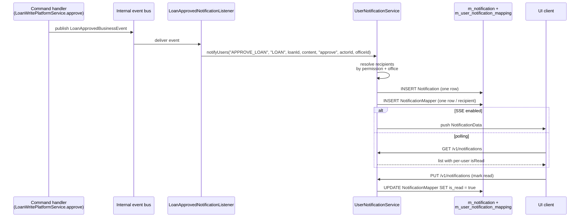

Apache Fineract ships a small **in-app notification** subsystem distinct from the outbound [hooks](/core/hooks) channel. Where hooks deliver events to external systems, notifications produce per-user records that surface in the UI as a notification bell. The core data model lives in the `org.apache.fineract.notification` package of `fineract-core`; the producers (event listeners), the mapper that joins notifications to users, the SSE/long-poll delivery, and the REST API live in `fineract-provider`.

This page documents the core entity, the read DTO, and the service interface that producers call.

## Package layout

```text
fineract-core/.../notification/
├── data/
│   └── NotificationData.java
└── service/
    └── UserNotificationService.java
```

That is the entirety of the core surface: a read DTO and a producer SPI. The provider module supplies the JPA entity, the read/write platform services, the SSE delivery, and the REST resource — and a `NotificationMapper` that bridges the publish-once / deliver-to-many shape.

## The model in two tables

The notification model is deliberately split:

* **One `Notification` row per generated event** — what happened, who triggered it, what business object was involved.
* **One `m_user_notification_mapping` row per recipient** — links a notification to an `AppUser` with a per-recipient `is_read` flag.

That shape lets a single business event ("a loan was approved") fan out to every user that holds the relevant permission without duplicating the content. When the user marks the entry as read, only their own mapping row changes.

`NotificationMapper` (in the provider module) is the JPA entity for the recipient mapping table. It is what makes the unread-count and per-user read state work, and it is what the read service joins against to render the bell list for the current user.

## `NotificationData` — the read DTO

`NotificationData` is the value object the read APIs and producer service exchange:

```java
@Data
@NoArgsConstructor
@Accessors(chain = true)
public class NotificationData implements Serializable {

    private Long id;
    private String objectType;        // e.g. "LOAN", "CLIENT"
    private Long objectId;            // ID of the business object
    private String action;            // e.g. "APPROVE", "DISBURSE"
    private Long actorId;             // user that triggered the event
    private String content;           // human-readable message
    private boolean isRead;           // per-recipient flag
    private boolean isSystemGenerated;
    private String tenantIdentifier;
    private String createdAt;         // ISO timestamp
    private Long officeId;            // for office-scoped fan-out
    private Set<Long> userIds;        // intended recipients
}
```

Three fields decide the routing:

* **`objectType` + `action`** — the same `(entityName, actionName)` pair that drives [hooks](/core/hooks). Lets one publisher emit both a hook and a notification from a single event.
* **`officeId`** — restricts delivery to users in the producing office (or its hierarchy). Notifications about a Mumbai branch loan do not light up the bell in Bangalore.
* **`userIds`** — explicit recipient list, used when the producer already knows the recipients (e.g. assigned-to-me notifications). When empty, the recipients are derived from `permission` + `officeId` by the publisher.

## `UserNotificationService` — the producer SPI

The producer-facing API is a single interface in core:

```java
public interface UserNotificationService {

    void notifyUsers(String permission, String objectType, Long objectIdentifier,
                     String notificationContent, String eventType,
                     Long appUserId, Long officeId);

    boolean hasUnreadUserNotifications(Long appUserId);

    void notifyUsers(NotificationData notificationData);
}
```

### Two ways to publish

* **Permission + office fan-out.** The first `notifyUsers` overload is the common case: "notify everyone in office `officeId` who holds permission `permission`". The implementation expands the recipient list, persists one `Notification` row and one `NotificationMapper` row per recipient, and signals delivery.

  Example:

  ```java
  userNotificationService.notifyUsers(
      "APPROVE_LOAN",         // permission
      "LOAN",                 // objectType
      loan.getId(),           // objectIdentifier
      "Loan #" + loan.getId() + " has been approved",
      "approve",              // eventType
      currentUser.getId(),    // actor
      loan.getOffice().getId());
  ```

  Every active user in the office with `APPROVE_LOAN` (or a wider role that includes it) gets a row in their bell list.

* **Pre-computed `NotificationData`.** The second overload is used when the producer already knows the recipients and content — typically system-generated notifications from background jobs that compute recipient lists themselves.

### `hasUnreadUserNotifications`

A quick boolean check used by the navigation UI to decide whether to render the red dot on the bell. It does not return the count — that goes through the read API — keeping this method cheap.

## Producer locations

In the provider module, several listeners wrap the platform's event bus and call `UserNotificationService`. Typical producers:

* **Business-event listeners** — `LoanApprovedNotificationEventListener`, `LoanDisbursalNotificationEventListener`, `SavingsActivatedNotificationEventListener`, … Each picks up its event from the internal event bus and translates it into a `notifyUsers` call with the right permission gating.
* **Scheduled jobs** — overdue installment notifications, repayment-due reminders. Run on the batch-manager node; recipients are typically the loan officer assigned to the account.
* **System messages** — startup banners, scheduler-failure alerts. These bypass the office filter and are sent to users with `ALL_FUNCTIONS` or a configured admin role.

## Read API

`NotificationApiResource` (provider side) exposes the per-user notification feed:

| Method | Path | Purpose |
| --- | --- | --- |
| `GET` | `/v1/notifications` | Paged list of the current user's notifications (filterable by `isRead`). |
| `PUT` | `/v1/notifications` | Mark notifications as read. |

The endpoint reads through the mapper join so each row carries the correct per-user `isRead` flag.

## Delivery

Two transport options exist on the provider side, both opt-in:

* **Polling.** The default — the UI calls `/v1/notifications` periodically and renders the unread set.
* **Server-Sent Events.** When enabled, the provider exposes an SSE endpoint that pushes newly-mapped notifications to subscribed UIs in near real time. The mapper rows are written first; SSE delivery is best-effort, so the polling fallback still surfaces the same notifications if a client missed the push.

## End-to-end flow



## Notifications vs hooks

The two subsystems share the `(objectType, action)` vocabulary but differ in delivery and audience:

| Aspect | Notifications | [Hooks](/core/hooks) |
| --- | --- | --- |
| Audience | Internal Fineract users (`AppUser`). | External systems. |
| Transport | In-app bell, optional SSE. | HTTP, SMS, Elasticsearch. |
| Routing | Per-permission + per-office, fan-out at publish time. | Per-configured `Hook` subscription. |
| Persistence | Row per recipient — survives until the user marks it read. | Fire-and-forget; no persistence beyond the event log. |
| Failure mode | A missed recipient just sees the bell later. | A failed webhook is logged; no retry queue by default. |

A single business command typically fires both: a hook to the CRM and a notification to the loan officer's bell.

## Operational notes

- **Volume.** A high-traffic office (thousands of loans / day) can produce a large fan-out. The mapper insert is the hot table — make sure `m_user_notification_mapping` has a covering index on `(user_id, is_read, created_at)`.
- **Retention.** There is no automatic pruning. Operators with long-running tenants typically schedule a clean-up job to delete read notifications older than N days.
- **Permission lookups** during fan-out can dominate the publish time when the office has hundreds of users. The provider implementation caches the permission-to-users projection per tenant; warming it on startup avoids the first-event latency spike.
- **Tenant scoping.** `NotificationData.tenantIdentifier` is populated by the publisher so SSE delivery on a shared infrastructure can route correctly. Polling endpoints rely on the standard `Fineract-Platform-TenantId` header.
- **Read-after-write.** When a user marks notifications as read in one tab, other tabs see the change only on their next poll. The SSE channel does not currently push read-state changes.

## Extending the producers

To add a new notification, the pattern is short:

1. Subscribe to the relevant business event (`@EventListener` on the Spring side, or a listener for the internal `BusinessEventNotifierService`).
2. Translate the event into a `notifyUsers` call with the right permission gating and office.
3. Compose the message string from the entity. Localisation hooks exist for the content body if needed.

You do not need to touch the mapper table or the SSE delivery — both are automatic once the row pair exists in the database.

## Schema reference

The two-table model:

```sql
m_notification (
    id BIGINT PK,
    object_type    VARCHAR,    -- "LOAN", "CLIENT", ...
    object_identifier BIGINT,
    action         VARCHAR,    -- "APPROVE", "DISBURSE", ...
    actor_id       BIGINT REFERENCES m_appuser(id),
    is_system_generated BOOLEAN,
    notification_content TEXT,
    created_at     TIMESTAMP
)

m_user_notification_mapping (
    id BIGINT PK,
    notification_id BIGINT REFERENCES m_notification(id),
    user_id         BIGINT REFERENCES m_appuser(id),
    is_read         BOOLEAN DEFAULT FALSE,
    UNIQUE (notification_id, user_id)
)
```

The unique constraint on `(notification_id, user_id)` prevents fan-out from producing duplicate mapper rows for the same user, which would otherwise inflate the unread count and let the user "mark read" only one of the two duplicates.

## Querying patterns

### Unread count for a user

```sql
SELECT COUNT(*) FROM m_user_notification_mapping
WHERE user_id = ? AND is_read = false;
```

This is the query behind the bell badge. Cover it with an index on `(user_id, is_read)`.

### Paged feed

```sql
SELECT n.*, m.is_read
FROM m_notification n
JOIN m_user_notification_mapping m ON m.notification_id = n.id
WHERE m.user_id = ?
ORDER BY n.created_at DESC
LIMIT ?, ?;
```

The mapper's `is_read` is per-user; `m_notification` carries the shared content.

### Mark a notification read

```sql
UPDATE m_user_notification_mapping
SET is_read = true
WHERE user_id = ? AND notification_id = ?;
```

Single-row update; cheap.

## Failure modes

A short list of what goes wrong in production:

- **Bell never lights up.** Usually the listener is registered but `notifyUsers` is never called, or the recipient resolution returns an empty set (no users in the office hold the gated permission). Add a debug log to the listener; verify the permission code matches the production catalogue exactly.
- **Unread count is stuck high.** Often a user marked notifications read in one tenant but is now logged into another (sharing the same `AppUser.username` but in different schemas). Tenant scoping is correct; the visual mismatch comes from caching.
- **SSE delivery missing.** Polling will still surface the notification on the next refresh. Confirm that the SSE endpoint is enabled and that the reverse proxy is not buffering responses (a common nginx misconfiguration).
- **Excessive fan-out.** A wide permission held by hundreds of users produces a wide insert. If the producer becomes a hot path, narrow the permission gate or move the publish to an async event listener.

## When to use notifications vs other channels

Quick decision guide:

- **In-app bell** — operational events the assigned officer should see promptly: a loan needs approval, a transaction is pending, a maker-checker review is queued.
- **[Hooks](/core/hooks)** — events external systems care about: CRM updates, analytics ingestion, downstream ledger postings.
- **Email** — high-impact periodic summaries: end-of-day reports, password expiry warnings.
- **SMS / messaging** — customer-facing only: payment reminders, OTPs. Notifications and SMS are different subsystems entirely.

A single business event can use any combination of these. They are designed to coexist; nothing in the notification core conflicts with hooks or SMS sending.

## Related pages

- [/notification/overview](/notification/overview) — the wider notification feature, including transport configuration and SSE setup.
- [Hooks](/core/hooks) — the outbound-event sibling subsystem.
- [User administration core](/core/user-administration-core) — `AppUser`, `Permission`, and the role-based recipient resolution.
