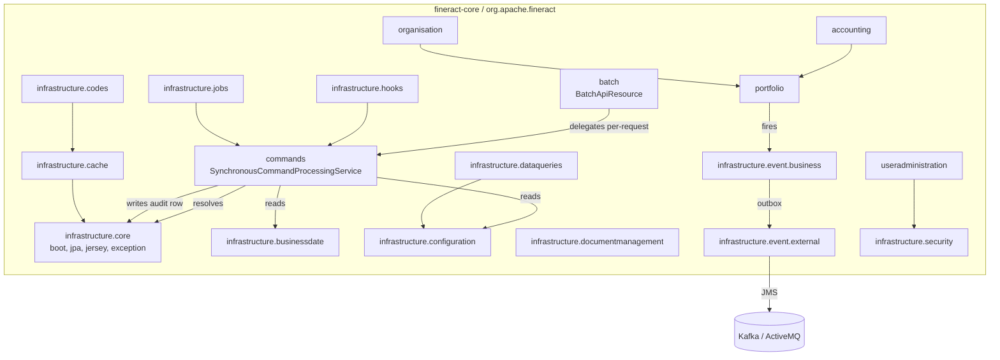

Apache Fineract concentrates its cross-cutting platform code in the `fineract-core` Gradle subproject. This page is the map of `fineract-core/src/main/java/org/apache/fineract/`: every top-level Java package, what lives in it, and which deep-dive page covers it in detail. Use it as the entry point when navigating the codebase from `build.gradle` outward.

## Module layout

`fineract-core` is the foundational module that every other Fineract subproject depends on. Its root Java package is `org.apache.fineract`, and inside it there are ten siblings that partition the platform's responsibilities. The directory under `fineract-core/src/main/java/org/apache/fineract/` is:

| Package | Purpose | Deep dive |
| --- | --- | --- |
| `accounting` | Chart of accounts, GL journal entries, accounting rules shared by loans/savings | (covered by accounting-module page) |
| `batch` | Multi-request `/v1/batches` JAX-RS endpoint and dependency resolution | [Batch API](/core/batch-api) |
| `commands` | Maker/checker command bus, `CommandSource`, idempotency, retry | [Commands framework](/core/commands-framework) |
| `infrastructure` | Cross-cutting platform plumbing — split into many sub-packages, see below | [Infrastructure / core sub-package](/core/infrastructure-core) |
| `interoperation` | Mojaloop interoperation entity, repository, and read service | (covered by interop page) |
| `notification` | Notification mappers, repositories, events | (covered by notification page) |
| `organisation` | Office, staff, currency, holiday, working-days | (covered by organisation page) |
| `portfolio` | Client, group, loan, savings, charges, products | (covered by portfolio page) |
| `useradministration` | `AppUser`, `Role`, `Permission`, password preferences | (covered by user admin page) |
| `util` | Pure helpers — `StreamResponseUtil`, file utilities, math wrappers | (covered by util page) |

Each row corresponds to an actual directory under `fineract-core/src/main/java/org/apache/fineract/`; you can verify with `ls fineract-core/src/main/java/org/apache/fineract/`.

## The infrastructure sub-tree

The largest top-level package is `infrastructure`, which itself decomposes into platform-wide subsystems. Each entry maps to a directory under `fineract-core/src/main/java/org/apache/fineract/infrastructure/`:

| Sub-package | Role | Deep dive |
| --- | --- | --- |
| `accountnumberformat` | Configurable account number generator settings | — |
| `bulkimport` | Excel/CSV bulk import templates and importers | — |
| `businessdate` | `BUSINESS_DATE` and `COB_DATE` system clocks | [Business date](/core/business-date) |
| `cache` | Runtime-switchable Ehcache/No-cache `CacheManager` | [Cache](/core/cache) |
| `codes` | `m_code` / `m_code_value` lookup model | [Codes](/core/codes) |
| `configuration` | `c_configuration` global flags (`GlobalConfigurationProperty`) | [Configuration](/core/configuration) |
| `core` | Boot, JPA, Jersey, exception mapping, JSON, MDC | [Infrastructure / core](/core/infrastructure-core) |
| `dataqueries` | Datatables, `EntityDatatableChecks`, ad-hoc reports | [Datatables & queries](/core/data-queries) |
| `documentmanagement` | `EntityImageIdAdapter` extension hook for the `fineract-document` module | [Document management](/core/document-management) |
| `event/business` | In-JVM `BusinessEvent` publisher (`BusinessEventListener`) | (covered by business events page) |
| `event/external` | External outbox pipeline (`ExternalEvent`, JMS producer) | [External events](/core/external-events) |
| `hooks` | Web/Slack/Twilio hook dispatcher (`HookEvent`, `HookEventSource`) | — |
| `instancemode` | Read-only / write / batch-only instance gating | — |
| `jobs` | Spring Batch + Quartz scheduling integration | — |
| `security` | `PlatformSecurityContext`, two-factor, password reset | — |
| `springbatch` | Custom `JobExplorer`/launcher and chunk listeners | — |

Pages flagged "—" exist in the codebase but are scheduled for separate dedicated docs; their files live exactly at the paths above so you can read them directly.

## Component diagram

## How requests reach business logic

<Steps>
  <Step title="HTTP arrives at fineract-provider">
    The provider module wires Jersey `ApiResource` beans (e.g. `BatchApiResource` at `fineract-core/src/main/java/org/apache/fineract/batch/api/BatchApiResource.java`) into the JAX-RS `Application`.
  </Step>
  <Step title="Filters in infrastructure.core.filters">
    `RequestResponseFilter`, `CorrelationHeaderFilter`, `IdempotencyStoreFilter`, `BatchFilter`, and `BatchRequestPreprocessor` from `fineract-core/src/main/java/org/apache/fineract/infrastructure/core/filters/` set up MDC, tenant, and idempotency state.
  </Step>
  <Step title="Command framework">
    Writes are wrapped in `CommandWrapper` (`commands/domain/CommandWrapper.java`) and routed by `CommandHandlerProvider` (`commands/provider/CommandHandlerProvider.java`) to a `NewCommandSourceHandler` annotated with `@CommandType`.
  </Step>
  <Step title="Domain modules execute">
    Handlers call domain services in `portfolio`, `accounting`, `organisation`, etc., which use JPA entities extending `AbstractPersistableCustom` (`infrastructure/core/domain/AbstractPersistableCustom.java`).
  </Step>
  <Step title="Events fan out">
    Domain code publishes `BusinessEvent` objects via `BusinessEventListener` (`infrastructure/event/business/BusinessEventListener.java`); the external pipeline in `infrastructure/event/external/` saves them to `m_external_event` for asynchronous delivery.
  </Step>
</Steps>

## Why fineract-core is special

<Note>
  `fineract-core` is the only module that other subprojects can compile against without pulling in HTTP wiring. The provider, scheduler, loan, savings, and document modules all depend on `fineract-core` to share the JSON command shape (`JsonCommand`), the audit base class (`AbstractAuditableCustom`), the tenant context (`ThreadLocalContextUtil`), and the global configuration table.
</Note>

When you grep for a class like `CommandProcessingResult`, you will find it at `infrastructure/core/data/CommandProcessingResult.java`; this is by design — core defines the contract, every other module consumes it.

## Cross-reference table

<CardGroup cols={2}>
  <Card title="Commands framework" href="/core/commands-framework">
    `commands/` — bus, handlers, idempotency
  </Card>
  <Card title="Batch API" href="/core/batch-api">
    `batch/` — multi-request endpoint
  </Card>
  <Card title="Infrastructure core" href="/core/infrastructure-core">
    `infrastructure/core/` — boot, JPA, Jersey
  </Card>
  <Card title="Business date" href="/core/business-date">
    `infrastructure/businessdate/`
  </Card>
  <Card title="Cache" href="/core/cache">
    `infrastructure/cache/`
  </Card>
  <Card title="Codes" href="/core/codes">
    `infrastructure/codes/`
  </Card>
  <Card title="Configuration" href="/core/configuration">
    `infrastructure/configuration/`
  </Card>
  <Card title="Data queries" href="/core/data-queries">
    `infrastructure/dataqueries/`
  </Card>
  <Card title="Document mgmt" href="/core/document-management">
    `infrastructure/documentmanagement/`
  </Card>
  <Card title="External events" href="/core/external-events">
    `infrastructure/event/external/`
  </Card>
</CardGroup>

## Gotchas

<Warning>
  Do not add JAX-RS resource classes to `fineract-core`. Resources in `batch/api/`, `infrastructure/businessdate/api/`, `infrastructure/cache/api/`, `infrastructure/codes/api/`, and `infrastructure/event/external/api/` are exceptions historically kept here because they manipulate truly cross-cutting state. New HTTP resources belong in `fineract-provider` or the relevant domain module.
</Warning>

<Tip>
  When you need a tenant-aware bean in core, inject `org.apache.fineract.infrastructure.core.service.ThreadLocalContextUtil` rather than reaching for `RequestContextHolder`. The former survives Spring Batch step transitions.
</Tip>
