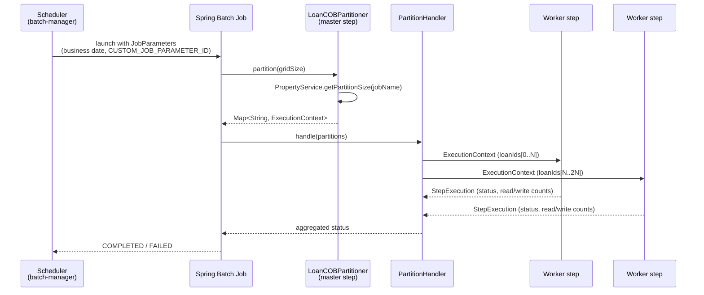

Apache Fineract uses **Spring Batch** to run long-lived business jobs — most notably the daily close-of-business (COB) pipeline that ages loans, posts accruals, applies penalties, and updates summary tables. The integration is deliberately small in `fineract-core` (a property-driven knob for tuning) and grows in `fineract-provider` (the actual jobs, partitioners, and step scopes for the COB chunks). This page walks through the core hooks and then follows the wiring out into the runtime.

## Where it lives

```text
fineract-core/.../infrastructure/springbatch/
├── PropertyService.java
└── SpringBatchJobConstants.java
```

That is it on the core side — two files. The bulk of the configuration (job/step beans, partitioner implementations, the `LoanCOBPartitioner`, the chunked readers and writers) lives in the COB and jobs packages of `fineract-provider`.

## `PropertyService` — per-job tuning

`PropertyService` is a small SPI that exposes a tunable knob for every job by name:

```java
public interface PropertyService {

    Integer getPartitionSize(String jobName);

    Integer getChunkSize(String jobName);

    Integer getRetryLimit(String jobName);

    Integer getThreadPoolCorePoolSize(String jobName);

    Integer getThreadPoolMaxPoolSize(String jobName);

    Integer getThreadPoolQueueCapacity(String jobName);

    Integer getPollInterval(String jobName);
}
```

The default implementation reads from `FineractProperties` (`fineract.partitioned-job.partitioned-job-properties[N].*`, indexed by the job name) so each job can be tuned independently from `application.properties` or environment variables. Operators tuning COB throughput will end up here:

* `partitionSize` — how many input rows go into one partition (e.g. how many loan IDs handed to one worker).
* `chunkSize` — the Spring Batch chunk commit interval inside a partition.
* `retryLimit` — `RetryTemplate` retries per chunk on transient failures.
* `threadPoolCorePoolSize`, `threadPoolMaxPoolSize`, `threadPoolQueueCapacity` — the executor backing the partition step.
* `pollInterval` — used by the partition handler when polling for completion of remote partitions.

Tuning is per-job, so the COB chunk that ages loans can be sized differently from a payroll import or a journal-entry replay.

## `SpringBatchJobConstants`

The constants class carries one well-known key:

```java
public abstract class SpringBatchJobConstants {

    public static final String CUSTOM_JOB_PARAMETER_ID_KEY = "CUSTOM_JOB_PARAMETER_ID";
}
```

This is the job-parameter key used to thread an external correlation ID through a Spring Batch execution. Fineract's scheduled job runner ([/jobs/overview](/jobs/overview)) stamps the `id` of the originating `ScheduledJob` row onto the Spring Batch `JobParameters` under this key, so that operators looking at the `BATCH_JOB_EXECUTION` table can join back to the scheduler's own bookkeeping. Tracing pipelines also propagate it as a baggage value.

## Partitioners

Fineract uses Spring Batch's **partitioned step** model. A master step (running on a batch-manager node) generates a `Map<String, ExecutionContext>` describing N partitions; each partition becomes a slave step that runs on a worker node.

The canonical example is **`LoanCOBPartitioner`** in `fineract-provider`. It:

1. Reads the set of loan IDs eligible for COB on the business date.
2. Splits them into chunks of `partitionSize` (from `PropertyService`).
3. Emits one `ExecutionContext` per chunk carrying the loan-ID list and the business date.

A similar pattern is used for any per-row job — for example a hypothetical `SavingsIdPartitioner` follows the same shape with savings account IDs. Common partitioner outline:

```java
@Component
public class LoanCOBPartitioner implements Partitioner {

    private final PropertyService propertyService;
    // … loan ID source bean …

    @Override
    public Map<String, ExecutionContext> partition(int gridSize) {
        int partitionSize = propertyService.getPartitionSize(JobName.LOAN_COB.name());
        List<Long> loanIds = loanIdSource.findEligible(businessDateOf(stepExecution));

        Map<String, ExecutionContext> partitions = new HashMap<>();
        List<List<Long>> chunks = Lists.partition(loanIds, partitionSize);
        for (int i = 0; i < chunks.size(); i++) {
            ExecutionContext ctx = new ExecutionContext();
            ctx.put("loanIds", chunks.get(i));
            partitions.put("partition" + i, ctx);
        }
        return partitions;
    }
}
```

The Spring Batch `PartitionHandler` then submits each partition to the configured executor. Combined with [instance mode](/core/instance-mode), partitions can be remote-executed on worker nodes that have `fineract.mode.batch-worker-enabled=true`.

## Step scopes and tenant context

Fineract is multi-tenant. The job is started by the scheduler under a known tenant, but each step (and each partition) runs on a thread the scheduler did not create. The integration installs custom Spring Batch scopes that re-establish the tenant on every step / chunk:

* Before each step, the tenant context (and authenticated `AppUser`, business date, and Fineract `BatchRequestContext`) is rehydrated from job parameters.
* Lombok-`@Slf4j` MDC values are set up so tenant ID and job name appear in every log line emitted by the step.
* On step exit the scoped beans are released.

The net effect is that COB chunk writers can call `ThreadLocalContextUtil.getTenant()` and behave correctly whether they ran in-process on the manager or on a remote worker.

## The flow end-to-end



## Relationship to scheduled jobs

The scheduled-jobs subsystem (`/v1/jobs`, `/v1/scheduler`) is the *trigger*; Spring Batch is the *engine*. The flow is:

1. The scheduler fires according to the job's cron expression.
2. The job runner builds a `JobParameters` instance — business date, tenant identifier, and the `CUSTOM_JOB_PARAMETER_ID` correlation key.
3. The Spring Batch `JobLauncher` starts the job.
4. Status is mirrored back into Fineract's own `m_scheduler_job_run_history` table so the API exposes a stable, business-friendly view independent of Spring Batch's internal schema.

Because the batch-manager-only endpoints are exception-listed in the instance-mode filter, the scheduler and `/v1/jobs` API are only reachable on a node where `fineract.mode.batch-manager-enabled=true`. See [Instance mode](/core/instance-mode) for the routing.

## Relationship to the COB pipeline

The Close-of-Business pipeline is the largest consumer of Spring Batch in Fineract. The high-level shape:

* **Master step** (manager) — runs `LoanCOBPartitioner`, computes partition lists.
* **Slave steps** (workers) — each runs a `ChunkOrientedTasklet` over its slice of loan IDs. Reader: paged JDBC. Processor: business logic (interest accrual, penalties, NPA classification, …). Writer: bulk updates back to the loan tables.
* **Aggregation** — once all slaves complete, the job records summary metrics and writes the run record.

The integration with Spring Batch is what lets COB scale horizontally: adding worker nodes increases the number of partitions that can run in parallel without changing any code.

See [/cob/overview](/cob/overview) for the COB business logic and how chunk processors fit into the loan domain.

## Tuning checklist

When a job is too slow or too noisy, walk these knobs in order — all are reachable via `PropertyService`:

1. **partitionSize.** Too small → too many partitions, high coordination overhead. Too large → uneven distribution, long tail. A good target is to have each partition take roughly the same wall-clock and complete in the 1-5 minute range.
2. **chunkSize.** Too small → JDBC commit overhead. Too large → long transactions, lock contention. Start at 100-500 for loan-shaped writes.
3. **threadPoolCorePoolSize / Max / QueueCapacity.** Match the number of cores on a worker plus the database's ability to absorb concurrent writes. If the database is the bottleneck, more threads makes things worse.
4. **retryLimit.** Only useful for transient errors (e.g. deadlocks). If a chunk fails repeatedly with the same error, increase the retry count and you will just make the failure slower.
5. **pollInterval.** Lower → faster overall job latency but more chatter. Default values are sensible for production COB sizes.

## Configuration example

```properties
# Per-job overrides — indexed list shape used in application.properties
fineract.partitioned-job.partitioned-job-properties[0].job-name=LOAN_COB
fineract.partitioned-job.partitioned-job-properties[0].chunk-size=100
fineract.partitioned-job.partitioned-job-properties[0].partition-size=500
fineract.partitioned-job.partitioned-job-properties[0].retry-limit=3
fineract.partitioned-job.partitioned-job-properties[0].thread-pool-core-pool-size=4
fineract.partitioned-job.partitioned-job-properties[0].thread-pool-max-pool-size=8
fineract.partitioned-job.partitioned-job-properties[0].thread-pool-queue-capacity=200
fineract.partitioned-job.partitioned-job-properties[0].poll-interval=1000
```

The exact property names match the property service implementation — the SPI shape above is the stable contract.

## Operational notes

- **Schema.** Spring Batch's own tables (`BATCH_JOB_INSTANCE`, `BATCH_JOB_EXECUTION`, `BATCH_STEP_EXECUTION`, …) live in the same schema as Fineract's tenant schema. They are managed by Spring Batch's schema initializer; you should not touch them by hand.
- **Restart.** Spring Batch supports restart, but Fineract jobs are generally written to be idempotent so an operator can simply rerun a failed job rather than restart it mid-flight.
- **Isolation.** Each chunk runs in its own transaction. A partition failure marks that partition `FAILED` but does not roll back partitions that already committed — design chunk processors to be commutative.
- **Observability.** Step counts, durations, and partition status are exposed through the Spring Batch admin tables and aggregated into Fineract's scheduler run history. Add Micrometer metrics if you need lower-level visibility.

## Troubleshooting

Three failure modes account for most of the support traffic around partitioned jobs:

### "Partitions never start"

Symptom: the job moves to `STARTED`, the master step finishes computing partitions, but worker steps never run.

Cause: the worker nodes do not have `fineract.mode.batch-worker-enabled=true`, so the conditional beans on the worker side did not register. Alternatively the partition handler is configured to dispatch remotely but no worker is reachable.

Check: hit `/v1/instance-mode` on every node in the fleet and confirm the workers report `batchWorkerEnabled: true`.

### "Some partitions complete, others sit in PENDING forever"

Symptom: a long tail of partitions never finishes; the job hangs at e.g. 95% complete.

Cause: a worker took a partition, started it, then died (OOM, kill -9, deploy-time eviction). Spring Batch's partition handler does not automatically reassign in-flight partitions — they remain marked `STARTED` in `BATCH_STEP_EXECUTION`.

Resolution: manually mark the orphaned step execution as `FAILED` in the Spring Batch schema, then restart the job. The restart will re-execute only the failed partitions.

### "Chunk fails with a serialization error on restart"

Symptom: a job restarted after a failure throws an exception involving `ExecutionContext` deserialization.

Cause: the partition `ExecutionContext` was populated with a non-serializable value, or its class was renamed/moved between deploys.

Resolution: keep `ExecutionContext` values to JDK serializable primitives (`Long`, `String`, `List<Long>`). For complex state, persist it to the application schema and put only an ID in the context.

## Writing a new partitioned job

The checklist for adding a new Spring Batch job to Fineract:

1. **Pick a job name** — register it in the relevant `JobName` enum so it appears in the scheduler API.
2. **Implement a `Partitioner`** that emits `ExecutionContext`s sized by `PropertyService.getPartitionSize(jobName)`.
3. **Implement a `Tasklet` or chunk-oriented step** — reader, processor, writer. Use `JdbcCursorItemReader` for paged JDBC reads.
4. **Configure the master and slave steps** in a Spring `@Configuration` class. The master step uses the partitioner; the slave step is the actual work.
5. **Wire the job into Fineract's scheduler** so it can be triggered from `/v1/jobs/{jobId}` and via cron.
6. **Add tracing.** The `CUSTOM_JOB_PARAMETER_ID_KEY` parameter is the correlation thread — log it from every step so operators can join the run back to the scheduler row.

The existing `LoanCOBPartitioner` and its surrounding configuration are the canonical reference implementation.

## Tenant context replay

A subtle correctness invariant: a partitioned job is launched on a manager thread holding the originating tenant context (tenant identifier, business date, optionally an authenticated user). The slave step thread runs on a different executor — possibly a different node entirely if the partition is remote-executed. If the tenant context is not replayed correctly on the slave thread, the JPA datasource resolution picks the wrong schema, and the job appears to "process" rows that do not exist or write to the wrong tenant.

Fineract's Spring Batch wiring solves this with a step-scope listener that:

1. Reads tenant identifier and business date from the job parameters.
2. Installs them onto the slave thread's `ThreadLocalContextUtil` before the step starts.
3. Clears them on step exit.

The net effect: chunk processors can call `ThreadLocalContextUtil.getTenant()` freely and behave correctly. Anyone writing a new chunk processor does not need to thread the tenant ID through every method call.

## Metrics and observability

Operators looking at a running Spring Batch job in Fineract typically want answers to three questions: is it making progress, is it stuck on a single partition, and how long until it finishes? The tooling for that:

- **Spring Batch tables.** `BATCH_JOB_EXECUTION`, `BATCH_STEP_EXECUTION`, and `BATCH_STEP_EXECUTION_CONTEXT` give a row-by-row picture. Read-write counts per step are accurate up to the last committed chunk.
- **Scheduler run history.** `m_scheduler_job_run_history` carries one row per launch with the start / end timestamps and the final status.
- **Application logs.** Each step logs its tenant ID, business date, and partition ID via MDC. Filter by partition ID to follow a single slave's path through the job.
- **Database load.** Partitioned jobs sustain heavy writes. Tune `chunkSize` and `threadPoolMaxPoolSize` based on the database's observed write latency, not abstract CPU counts.

## Related pages

- [/jobs/overview](/jobs/overview) — how Fineract's scheduler triggers Spring Batch jobs.
- [/cob/overview](/cob/overview) — the close-of-business pipeline, the largest Spring Batch user in Fineract.
- [Instance mode](/core/instance-mode) — the two `batch-*-enabled` flags that route the manager vs worker roles.
