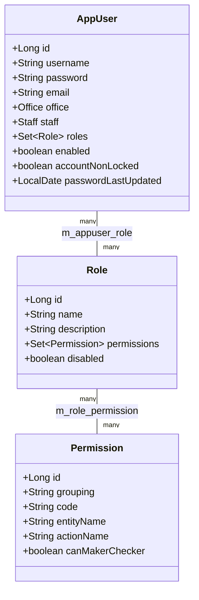
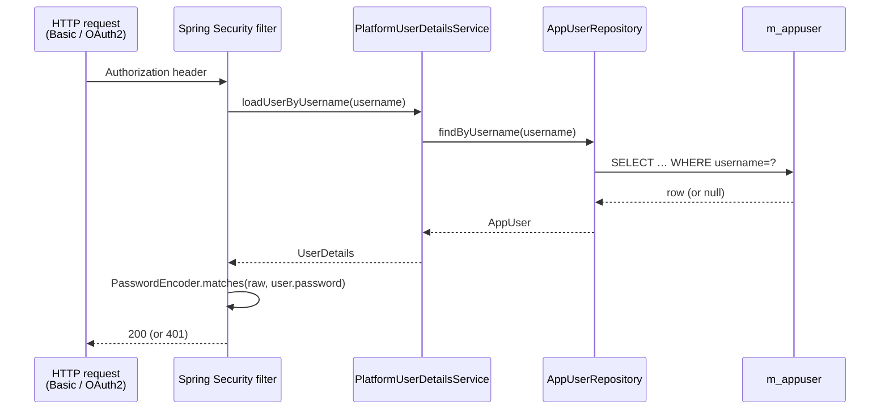

Apache Fineract's **user administration** model — users, roles, and permissions — lives in the `org.apache.fineract.useradministration` package of `fineract-core`. The domain entities are deliberately small and stable so every other module can depend on them safely, while the bigger pieces (the REST resources, the password policy logic, the password expiry job, the OAuth2 bridge) live in the provider module on top.

This page covers the entities, the repository, the wrapper, and the Spring Security bridge that lets Fineract authenticate users against its own tables.

## Package layout

```text
fineract-core/.../useradministration/
├── api/
├── data/
├── domain/
│   ├── AppUser.java
│   ├── AppUserRepository.java
│   ├── AppUserRepositoryWrapper.java
│   ├── Permission.java
│   └── Role.java
├── exception/
└── service/
    └── AppUserConstants.java
```

The provider module adds `PlatformUserDetailsService`, the user/role REST resources, the password rules, and the JWT/OAuth2 stack.

## The three-entity model

The model is the textbook RBAC trio:



* An `AppUser` has zero or more `Role`s.
* A `Role` has zero or more `Permission`s.
* The effective permissions of a user are the union across their roles.

### `AppUser`

`AppUser` extends `AbstractPersistableCustom<Long>` and is mapped to `m_appuser`. It implements Spring Security's `UserDetails` so the Spring authentication chain can consume it directly. Notable fields:

* `username` — unique per tenant.
* `password` — bcrypt-hashed; never plaintext.
* `email` — used by password reset.
* `office` — every user belongs to one `Office` (branch). Office scope drives the "see only my office" filtering on the read side.
* `staff` — optional link to a `Staff` record, so a loan officer can be both a user and a staff record.
* `roles` — many-to-many with `Role`.
* `enabled` / `accountNonLocked` — Spring Security flags. Password expiry and brute-force lockout flip these.
* `passwordLastUpdated` — driven by the password expiry job.
* Audit columns from `AbstractAuditableCustom` (via the superclass chain) so every user mutation is traceable.

The class also carries the helper methods Spring Security needs (`getAuthorities()` returning the flattened permission set, `isAccountNonExpired()`, `isCredentialsNonExpired()`).

### `Role`

`Role` is a named bundle of permissions:

* `name` — display name (`Super user`, `Loan Officer`, `Read-only Auditor`).
* `description` — free-form text.
* `permissions` — many-to-many with `Permission`.
* `disabled` — soft-delete flag. A disabled role keeps its mappings but is not granted at sign-in.

Roles can be edited at runtime via the REST API. Adding a permission to a role takes effect on the next authentication.

### `Permission`

`Permission` is the smallest unit of authorisation in Fineract:

* `code` — the permission identifier, used in `@PreAuthorize` annotations on the command handlers (e.g. `CREATE_LOAN`, `APPROVE_LOAN`).
* `grouping` — the high-level grouping (`portfolio`, `transaction_loan`, `configuration`, …). The UI groups permissions by this.
* `entityName` + `actionName` — the same `(entityName, actionName)` vocabulary used by [hooks](/core/hooks) and [notifications](/core/notification-core). So `CREATE_LOAN` corresponds to `entityName=LOAN, actionName=CREATE`.
* `canMakerChecker` — whether this permission can be put under the maker/checker (4-eyes) review workflow.

Permissions are static data — they are seeded by Liquibase and represent the full set of actions the application knows about. New permissions are added by migrations, not by API calls.

## `AppUserRepository`

The Spring Data JPA repository for `AppUser`. The standard methods plus a few finders:

* `findByUsername(String)` — used by authentication.
* `findAppUserByName(String)` — used in admin listings.
* `findAll()` filtered with `Specification` — supports the office-scoped listing on the read side.

### `AppUserRepositoryWrapper`

Pattern used throughout Fineract: a wrapper that exposes "find or throw the standard not-found exception" methods so the call sites can stay free of `Optional` plumbing:

```java
AppUser user = appUserRepositoryWrapper.fetchUserById(userId);
// throws UserNotFoundException if missing
```

This keeps the exception-translation logic in one place and ensures every "user not found" failure produces the same `ApiGlobalErrorResponse`.

## `PlatformUserDetailsService` — the Spring Security bridge

`PlatformUserDetailsService` (in `fineract-provider`) implements Spring's `UserDetailsService` against the `AppUser` table:

```java
@Service
public class PlatformUserDetailsService implements UserDetailsService {

    private final AppUserRepository appUserRepository;

    @Override
    public UserDetails loadUserByUsername(String username)
            throws UsernameNotFoundException {

        AppUser user = appUserRepository.findByUsername(username);
        if (user == null) {
            throw new UsernameNotFoundException(username + " not found");
        }
        return user; // AppUser implements UserDetails directly
    }
}
```

This is what plugs Fineract's tables into Spring Security's authentication chain. The basic-auth and OAuth2 password flows both end up calling this method, then the returned `AppUser` flows into the `Authentication` object and from there into the `SecurityContext`.

### Authentication flow



### Authorisation flow

Once authenticated, the `AppUser` is the principal. Command handlers and read services annotated with `@PreAuthorize("hasAuthority('CREATE_LOAN')")` work because `AppUser.getAuthorities()` returns the flattened set of `Permission.code` values across the user's roles. Permissions are static; roles are dynamic, so administrators can rebalance authority at runtime without code changes.

## `AppUserConstants`

`AppUserConstants` carries the well-known string constants used by both the API and the listeners — request parameter names (`USERNAME`, `EMAIL`, `OFFICE_ID`, `STAFF_ID`, `ROLES`, `PASSWORD`, `REPEAT_PASSWORD`), the system user identifier used when system-generated commands need an actor, and the password validation rule keys.

Constants centralisation is important because both the JSON parsers in the command handlers and the audit-log listeners need to agree on the field names; refactoring a single place is much safer than chasing magic strings.

## Maker/checker and the system user

When the maker/checker workflow is enabled for a permission, two `AppUser`s participate in the command:

* The **maker** submits the command — it lands in `m_portfolio_command_source` with `processing_result_enum = AWAITING_APPROVAL`.
* The **checker** approves or rejects it via the audit API. On approval, the same command is replayed with the checker as the actor.

System-generated commands (scheduled jobs, internal recovery flows) use the well-known system user identifier from `AppUserConstants`. This keeps audit trails consistent — there is always *some* `created_by`, never `null`.

## Multi-tenant considerations

Each tenant has its own `m_appuser` table because the schema is replicated per tenant. A user named `alice` in tenant A is completely distinct from `alice` in tenant B. Authentication routing uses the `Fineract-Platform-TenantId` header to pick the right datasource before `PlatformUserDetailsService` runs.

## Operational notes

- **Password storage.** Bcrypt via Spring's `PasswordEncoder`. Older deployments may have legacy hashes — the provider exposes a one-shot upgrade path on next successful login.
- **Password policy.** Configurable via the global configuration table (`m_configuration`) — minimum length, character classes, expiry days. Enforced at change-password time.
- **Lockout.** Configurable number of failed attempts before `accountNonLocked` is set to false. Unlock requires an admin user.
- **Office hierarchy.** Reads are office-scoped: a user assigned to a parent office can read children, but a user at a leaf office sees only their branch's data. The hierarchy is recursive — see `Office.hierarchy` and the office-scoped specifications.
- **Permission churn.** Adding a new permission is a Liquibase migration that inserts into `m_permission`. Existing roles do not get it automatically — an administrator must add it via the API.
- **`MakerCheckerable` flag.** When toggled on for a permission, every command of that type passes through `m_portfolio_command_source` even when no formal checker workflow is enforced — useful for audit-only deployments.

## Common SQL views

For admin and audit queries it is often easier to bypass the entities and query directly:

```sql
-- All permissions granted to a user
SELECT p.code, p.grouping, r.name AS role_name
FROM m_appuser u
JOIN m_appuser_role  ur ON ur.appuser_id = u.id
JOIN m_role          r  ON r.id  = ur.role_id
JOIN m_role_permission rp ON rp.role_id = r.id
JOIN m_permission    p  ON p.id  = rp.permission_id
WHERE u.username = ?
  AND u.is_deleted = false
  AND r.is_disabled = false
ORDER BY p.grouping, p.code;
```

The same join shape underlies `AppUser.getAuthorities()` — the entity walks `roles → permissions` and returns the flattened set.

## Schema reference

The minimal three tables plus their joins:

```sql
m_appuser (
    id BIGINT PK,
    username VARCHAR UNIQUE,
    password VARCHAR,                 -- bcrypt
    email    VARCHAR,
    office_id BIGINT REFERENCES m_office(id),
    staff_id  BIGINT NULL REFERENCES m_staff(id),
    enabled  BOOLEAN,
    account_non_locked BOOLEAN,
    password_last_updated DATE,
    is_deleted BOOLEAN DEFAULT FALSE,
    created_on_utc TIMESTAMP,
    last_modified_on_utc TIMESTAMP,
    created_by BIGINT,
    last_modified_by BIGINT
)

m_role (
    id BIGINT PK,
    name VARCHAR UNIQUE,
    description VARCHAR,
    is_disabled BOOLEAN
)

m_permission (
    id BIGINT PK,
    grouping VARCHAR,
    code     VARCHAR UNIQUE,
    entity_name VARCHAR,
    action_name VARCHAR,
    can_maker_checker BOOLEAN
)

m_appuser_role  (appuser_id, role_id)       -- m:n
m_role_permission (role_id, permission_id)  -- m:n
```

## Adding a permission

The full procedure to add a brand-new authorisation gate:

1. **Liquibase migration** — `INSERT INTO m_permission(grouping, code, entity_name, action_name, can_maker_checker) VALUES (...)`.
2. **Annotate the handler** — add `@PreAuthorize("hasAuthority('YOUR_NEW_PERMISSION')")` on the command or read service method.
3. **Update existing roles via the API** — `PUT /v1/roles/{id}/permissions` to grant the new permission to roles that should have it. Existing deployments do not get the permission for free.
4. **Document.** Add the new permission to the permissions catalogue page so administrators know what it gates.

The Liquibase migration must come first; otherwise the annotated handler will throw at startup because the permission row does not exist yet.

## Adding a role

Roles are runtime data — administrators add them via the REST API:

```
POST /v1/roles
{
  "name": "Senior Loan Officer",
  "description": "Approve loans up to ₹10 lakh"
}
```

```
POST /v1/roles/{roleId}/permissions
{
  "permissions": {
    "READ_LOAN": true,
    "CREATE_LOAN": true,
    "APPROVE_LOAN": true
  }
}
```

Disabling a role (`PUT /v1/roles/{roleId}/disable`) is the soft-delete path — existing user-role rows remain, but the role contributes no permissions until re-enabled.

## Common operational SQL

### Find every user with a given permission

```sql
SELECT DISTINCT u.id, u.username, u.email
FROM m_appuser u
JOIN m_appuser_role ur  ON ur.appuser_id = u.id
JOIN m_role r           ON r.id = ur.role_id AND r.is_disabled = false
JOIN m_role_permission rp ON rp.role_id = r.id
JOIN m_permission p     ON p.id = rp.permission_id
WHERE p.code = 'APPROVE_LOAN'
  AND u.is_deleted = false
  AND u.enabled    = true;
```

This is the same logic the notification fan-out uses to expand a permission into a recipient set.

### Users locked out

```sql
SELECT id, username, last_modified_on_utc
FROM m_appuser
WHERE account_non_locked = false
  AND is_deleted = false;
```

Useful for support tickets where a user reports "I cannot log in".

## Related pages

- [/users/overview](/users/overview) — the wider user administration feature, including OAuth2 setup, password policy, and audit.
- [Commands framework](/core/commands-framework) — every mutation is gated by a `Permission.code` annotation on the command handler.
- [JPA persistence](/core/jpa-persistence) — `AppUser` is the auditor that populates `created_by` / `last_modified_by` on every other auditable entity.
