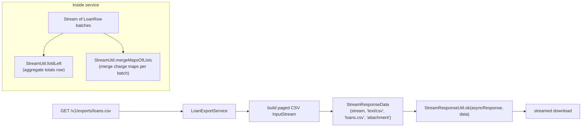

The `org.apache.fineract.util` package in `fineract-core` is a small grab-bag of stateless helpers that Apache Fineract uses across modules: a safety-belt against infinite loops in iterative business logic, a couple of Stream collectors that the JDK doesn't ship out of the box, and a JAX-RS response helper for streaming binary content. Each file is tiny but each is used in dozens of places, so the contract matters.

This page walks through every file in the package — signatures, intent, and the situations where you should reach for them.

## Package layout

```text
fineract-core/.../util/
├── LoopContext.java
├── LoopGuard.java
├── StreamResponseUtil.java
└── StreamUtil.java
```

Four files. Two are for safe iteration in the COB and loan-schedule code; one is for response streaming; one is a pair of Stream collectors.

## `LoopContext`

The marker interface for loop state:

```java
public interface LoopContext {}
```

It carries no methods. Its only job is to be the type parameter of `LoopGuard` so the loop body and the termination predicate share a known type without resorting to `Object` casts. Concrete implementations carry whatever state your loop needs — counters, accumulators, the entity being mutated, the date being advanced — and you mutate them from the loop body.

Example (illustrative — typical usage in the loan schedule generator):

```java
class ScheduleLoopContext implements LoopContext {
    LocalDate cursor;
    BigDecimal outstandingPrincipal;
    int installmentNumber;
}
```

The marker contract means anyone reading the type signature `LoopGuard.runSafeWhileLoop(int, T, Predicate<T>, LoopBody<T>)` knows `T` is a loop carrier, not just any object.

## `LoopGuard`

A pair of static methods that wrap `while` and `do…while` loops with a hard iteration cap:

```java
public final class LoopGuard {

    public interface LoopBody<T extends LoopContext> {
        void execute(T context);
    }

    public static <T extends LoopContext> void runSafeDoWhileLoop(
            int maxIterations, T context, Predicate<T> condition, LoopBody<T> body) { … }

    public static <T extends LoopContext> void runSafeWhileLoop(
            int maxIterations, T context, Predicate<T> condition, LoopBody<T> body) { … }
}
```

Both methods do exactly what they advertise — call the body, check the condition, repeat — but they throw `IllegalStateException` if the iteration count exceeds `maxIterations`:

> `Loop exceeded N iterations. Possible infinite loop.`

### Why

Several pieces of Fineract advance a cursor (date, balance, installment) inside a loop and stop when a business condition is met. Examples: rolling a date forward across holidays until the next valid working day, advancing a loan schedule until the principal is fully amortised, walking forward through accrual periods until a target date. A subtle bug in the advance step — a holiday rule that always reschedules to the same day, an interest computation that returns zero, a rounding error that prevents principal from ever reaching zero — turns into a tight infinite loop that pins a CPU and never produces a result.

The guard turns that failure mode into a clear exception instead of a hung COB.

### Usage

`do…while` flavour:

```java
LoopGuard.runSafeDoWhileLoop(
    500,                                 // max iterations
    new ScheduleLoopContext(start, principal),
    ctx -> ctx.outstandingPrincipal.signum() > 0,   // condition
    ctx -> {                                        // body
        ctx.installmentNumber++;
        ctx.cursor = ctx.cursor.plusMonths(1);
        ctx.outstandingPrincipal = nextPrincipal(ctx);
    });
```

`while` flavour (condition checked first):

```java
LoopGuard.runSafeWhileLoop(
    100,
    new HolidayContext(date),
    ctx -> isHoliday(ctx.cursor),
    ctx -> ctx.cursor = ctx.cursor.plusDays(1));
```

### Choosing the cap

Pick a `maxIterations` that comfortably exceeds the largest legitimate loop count. Common values in the codebase:

* Loan-schedule generation: `1000` (enough for a 30-year loan with weekly installments).
* Holiday roll-forward: `100` (a multi-month holiday block is suspicious).
* Period iteration in interest accrual: `500`.

The exception thrown when the cap is hit is `IllegalStateException`, which is intentional — these are *programmer errors*, not validation failures, and they propagate out of the business transaction as a `500` rather than a `4xx`.

## `StreamUtil`

Two collectors that the JDK doesn't ship:

```java
public final class StreamUtil {

    public static <A, B> Collector<A, ?, B> foldLeft(B init, BiFunction<? super B, ? super A, ? extends B> f);

    public static <K, V> Collector<Map<K, List<V>>, ?, Map<K, List<V>>> mergeMapsOfLists();
}
```

### `foldLeft`

A left fold collector — equivalent to Scala / Kotlin's `fold` but expressed as a `Stream.collect` argument. Example:

```java
BigDecimal totalPrincipal = installments.stream()
    .collect(StreamUtil.foldLeft(BigDecimal.ZERO,
        (acc, inst) -> acc.add(inst.getPrincipal())));
```

The same result is achievable with `Stream.reduce`, but `reduce`'s identity / accumulator / combiner signature is awkward when the running type differs from the element type. `foldLeft` accepts the common case (running type is the seed type) cleanly.

The implementation is the classic "build a function and apply it" trick — it uses `Collectors.reducing` on `Function<B, B>` then applies the composed function to the initial value at the finisher. The upshot is that it's a single-pass left fold without an intermediate list.

### `mergeMapsOfLists`

When you have a `Stream<Map<K, List<V>>>` (typically because each upstream item produced a map of its own) and you want a single map where shared keys have their lists concatenated:

```java
Map<Long, List<Charge>> chargesPerLoan = streamOfMaps
    .collect(StreamUtil.mergeMapsOfLists());
```

If the same key appears in multiple input maps, the lists are concatenated (not de-duplicated, not overwritten). The result is a `HashMap` so it remains mutable for callers that want to add more entries afterwards.

This collector shows up in the read pipeline — for example when batching N rows through a `RowMapper` that returns a `Map<LoanId, List<Charge>>` per row, the final aggregation just pipes through this collector.

## `StreamResponseUtil`

JAX-RS response helper for streaming binary content (file downloads, generated reports, exported documents):

```java
public final class StreamResponseUtil {

    public static String DISPOSITION_TYPE_ATTACHMENT = "attachment";
    public static String DISPOSITION_TYPE_INLINE     = "inline";

    public static Response ok(StreamResponseData content);

    public static Future<?> ok(AsyncResponse asyncResponse, StreamResponseData content);

    public static final class StreamResponseData {
        InputStream stream;
        String type;
        String fileName;
        String dispositionType;
        Long size;
    }
}
```

### Synchronous variant

```java
return StreamResponseUtil.ok(StreamResponseData.builder()
    .stream(documentInputStream)
    .type("application/pdf")
    .fileName("loan-statement.pdf")
    .dispositionType(StreamResponseUtil.DISPOSITION_TYPE_ATTACHMENT)
    .build());
```

This produces a `Response` whose entity is a `StreamingOutput` that copies the input stream to the response output stream chunk-by-chunk. The result is that arbitrarily large files stream through without buffering the whole thing in memory. The `Content-Disposition` header is set when `dispositionType` is non-empty — operators pick `attachment` to force a download dialog or `inline` to render in-browser (PDFs, images).

### Async variant

The second overload accepts a JAX-RS `AsyncResponse`. It submits the streaming work to an internal cached `ExecutorService` and resumes the async response when ready. This is the right shape when you want to release the request thread back to the container immediately and let the response stream finish on a worker:

```java
@GET
public void download(@Suspended AsyncResponse async, @PathParam("id") Long id) {
    StreamResponseData data = service.buildStreamingExport(id);
    StreamResponseUtil.ok(async, data);
}
```

`StreamResponseData` itself is a small Lombok `@Data @Builder` — `stream` is the source, `type` is the MIME type, `fileName` is what the browser will save it as, `dispositionType` controls inline-vs-attachment, and `size` is optional (the helper does not use it directly, but downstream interceptors may set `Content-Length` from it when it is present).

## Putting them together

A typical bulk-download endpoint that exports a large CSV ends up using three of the four helpers:



And a COB-side schedule recomputation uses `LoopGuard`:

```java
LoopGuard.runSafeWhileLoop(
    1000,
    scheduleContext,
    ctx -> !ctx.fullyAmortised(),
    ctx -> ctx.appendNextInstallment());
```

## Conventions

- **Stateless.** Every class in this package is either an interface, an enum, or a `final` class with a private constructor and static methods. None of them carry mutable shared state.
- **Marker over abstract.** `LoopContext` is intentionally an empty interface, not an abstract base — Fineract entities often need to participate in loops without inheriting unrelated behaviour.
- **Allocation-aware.** `StreamResponseUtil` streams through a `StreamingOutput` so a multi-gigabyte export does not pin the JVM heap. `StreamUtil.foldLeft` is a single-pass fold with no intermediate list. Touching code in this package is performance-sensitive — measure before "improving".
- **No business semantics.** Anything that knows about money, loans, or business rules belongs in a feature package. This package stays general-purpose so it can be a dependency of anyone.

## Testing patterns

- For `LoopGuard`: assert the happy path with a small body, then explicitly trigger the cap with a never-terminating condition and verify the exception.
- For `StreamUtil.foldLeft`: simple numeric fold cases are enough — the implementation is a thin wrapper around `Collectors.reducing`.
- For `StreamResponseUtil`: write a small JAX-RS in-memory test that consumes the streamed response and verifies the bytes round-trip. Do not rely on the size header.

## Operational notes

- **`StreamResponseUtil`** uses a static `Executors.newCachedThreadPool()`. The pool is shared process-wide; under sustained high-concurrency exports the thread count grows. If exports become a hot path in production, consider replacing the default with a bounded pool via a Spring config override.
- **`LoopGuard`** throws `IllegalStateException` on cap. Make sure your exception mapper translates this to a clean 500 with a useful message — the default Fineract mapper already does so.
- **Stream collectors** allocate `HashMap`s and `ArrayList`s. For very large reductions, consider streaming straight to an output rather than collecting to memory.

## Related pages

- [JPA persistence](/core/jpa-persistence) — `JdbcSupport` row helpers complement the stream utilities for read-path code.
- [Spring Batch integration](/core/spring-batch-integration) — `LoopGuard` is heavily used inside COB chunk processors that walk loan schedules.
- [Commands framework](/core/commands-framework) — `StreamResponseUtil` powers the export endpoints triggered by certain command handlers.
