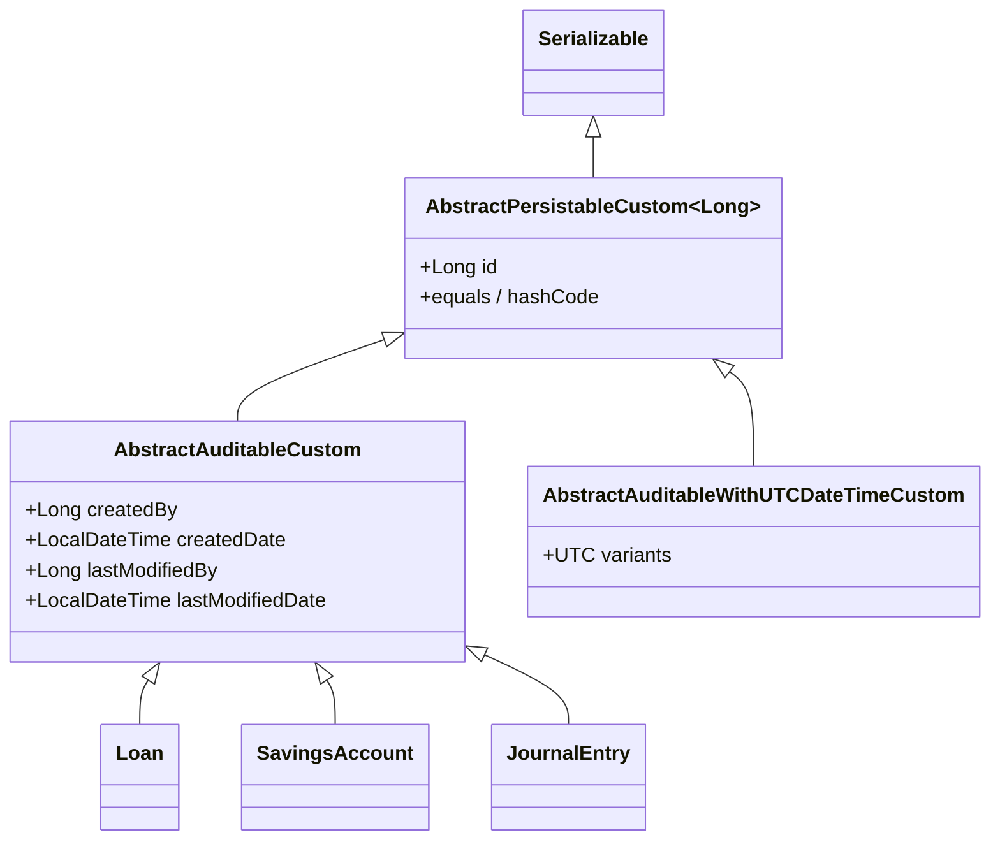

Almost every persistent entity in Apache Fineract carries four audit columns: who created it, when, who last changed it, and when. Application code never sets them — Spring Data JPA auditing does the stamping automatically as soon as an entity reaches the `EntityManager.persist` or `merge` boundary. This page explains the three pieces of wiring that make that work.

## The four columns and where they live

The audit columns are declared on the base class `AbstractAuditableCustom`, in `fineract-core/src/main/java/org/apache/fineract/infrastructure/core/domain/AbstractAuditableCustom.java`:

```java
@MappedSuperclass
public abstract class AbstractAuditableCustom
        extends AbstractPersistableCustom<Long>
        implements Auditable<Long, Long, LocalDateTime> {

    @Column(name = "createdby_id")
    private Long createdBy;

    @Column(name = "created_date")
    private LocalDateTime createdDate;

    @Column(name = "lastmodifiedby_id")
    private Long lastModifiedBy;

    @Column(name = "lastmodified_date")
    private LocalDateTime lastModifiedDate;
    ...
}
```

A few things to note:

- The class is a `@MappedSuperclass`, so the columns are inlined into each child table — `m_loan`, `m_savings_account`, `m_journal_entry`, and so on all have these four physical columns. There is no separate audit table for "normal" entities.
- The implemented interface is Spring Data's `Auditable<U, ID, T>`, parameterized with `<Long, Long, LocalDateTime>`. That contract is what the auditing handler reads and writes.
- The column names are deliberately non-camelCase (`createdby_id`, `lastmodifiedby_id`) — they predate the wider Fineract codebase's switch to snake_case naming and are kept for compatibility.
- The base class extends `AbstractPersistableCustom<Long>`, so audit entities also get the primary-key, equality, and `Serializable` behaviour from that root.

The getters return `Optional<T>` because Spring Data's `Auditable` contract says so; the source includes the standard JavaDoc note: "A custom copy of `AbstractAuditable` to override the column names used on database. It also uses Instant instead of LocalDateTime for created and modified."

## The auditor: who is "createdBy"?

The "by" columns receive the id of the application user that initiated the change. The implementation, `AuditorAwareImpl`, sits in `fineract-provider/src/main/java/org/apache/fineract/infrastructure/core/domain/AuditorAwareImpl.java`:

```java
public class AuditorAwareImpl implements AuditorAware<Long> {

    @Override
    public Optional<Long> getCurrentAuditor() {
        Optional<Long> currentUserId;
        final SecurityContext securityContext = SecurityContextHolder.getContext();
        if (securityContext != null) {
            final Authentication authentication = securityContext.getAuthentication();
            if (authentication != null && authentication.getPrincipal() instanceof AppUser) {
                currentUserId = Optional.ofNullable(((AppUser) authentication.getPrincipal()).getId());
            } else {
                currentUserId = retrieveSuperUser();
            }
        } else {
            currentUserId = retrieveSuperUser();
        }
        return currentUserId;
    }

    private Optional<Long> retrieveSuperUser() {
        return Optional.of(ADMIN_USER_ID);
    }
}
```

What happens in each case:

| Situation | Result |
|-----------|--------|
| Authenticated HTTP request, principal is `AppUser` | The `AppUser.id` of the authenticated user. |
| No security context (background thread, COB worker, job) | `ADMIN_USER_ID` — the super-user id constant from `AppUserConstants`. |
| Security context exists but principal is not `AppUser` (e.g. an OAuth token type Fineract does not recognize) | `ADMIN_USER_ID`. |

The `// TODO` in the source ("change to SYSTEM_USER_ID and add rights") signals the intent to differentiate system-initiated writes from human-administrator writes in the future; today, both flatten to the admin user.

## The wiring: `@EnableJpaAuditing`

JPA auditing is activated in `JPAConfig`:

```java
@Configuration
@EnableJpaAuditing
@Import(JpaAuditingHandlerRegistrar.class)
public class JPAConfig extends JpaBaseConfiguration {

    @Bean
    public AuditorAware<Long> auditorAware() {
        return new AuditorAwareImpl();
    }
    ...
}
```

Three pieces collaborate:

1. **`@EnableJpaAuditing`** triggers Spring Data's registration of the `AuditingEntityListener`.
2. **`@Import(JpaAuditingHandlerRegistrar.class)`** registers a Fineract-specific handler that knows about `AbstractAuditableCustom` and `AbstractAuditableWithUTCDateTimeCustom`.
3. **The `AuditorAware<Long>` bean** lets the listener resolve "who is acting right now".

Once registered, the listener fires on JPA lifecycle callbacks:

```mermaid
flowchart LR
    Persist[entity.flush / persist]
    Persist --> Listener[AuditingEntityListener<br/>@PrePersist / @PreUpdate]
    Listener --> Resolver[AuditorAwareImpl.getCurrentAuditor]
    Resolver --> Security[SecurityContextHolder.getAuthentication]
    Listener --> Time[LocalDateTime.now]
    Listener --> Entity[Set createdBy / createdDate<br/>or lastModifiedBy / lastModifiedDate]
```

`@PrePersist` populates `createdBy` and `createdDate` (and also stamps the modified columns, since a brand-new row is both created and modified at the same instant); `@PreUpdate` only touches the `lastModified*` columns.

## UTC-aware variant

Some newer modules need to store audit timestamps as UTC instants regardless of the JVM's timezone or the tenant's timezone — for example, anything that ends up cross-referenced with an external system. Those entities extend `AbstractAuditableWithUTCDateTimeCustom` instead. The schema columns and Spring Data auditing wiring are the same; the type behind the timestamps is a UTC-anchored value.

Why not always use UTC? Because much of the existing Fineract schema and many reports interpret timestamps in the tenant's local timezone; flipping every audit column to UTC at once would change the meaning of millions of historical rows. The two base classes coexist to let new entities opt in while old entities continue working.

## Where else "audit" shows up

The four audit columns are the most pervasive form of audit, but Fineract has a few more, layered on top:

- **Audit entries on transactions**. Liquibase changesets like `0020_add_audit_entries.xml`, `0024_add_audit_entries.xml`, and `0025_add_audit_entries_to_journal_entry.xml` add `submitted_on_*`, `approved_on_*`, `created_on_*`, etc. to transactional entities. These are domain audit fields, not framework audit fields — they record *business* moments (submitted, approved) rather than *technical* moments (persisted).
- **Command source rows**. Every write that flows through the command bus also records a row in `m_portfolio_command_source` capturing the JSON payload, the user, the entity, and the result. That is the deep audit log; the four columns on the target entity are the cheap, always-available header.
- **External events**. Significant state changes also publish `BusinessEvent`s to the external events stream, providing yet another audit trail for downstream consumers.

For most debugging the column quartet is enough — start there before reaching for the deeper logs.

## How application code interacts (or rather, does not)

The point of JPA auditing is that nothing in application code touches these columns. A typical write looks like:

```java
@Transactional
public CommandProcessingResult createLoan(JsonCommand command) {
    final AppUser currentUser = this.context.authenticatedUser();
    Loan loan = Loan.from(command, currentUser, ...);
    loanRepository.saveAndFlush(loan);
    return CommandProcessingResultBuilder.builder().withLoanId(loan.getId()).build();
}
```

There is no `loan.setCreatedBy(currentUser.getId())` — and there should not be. If a developer adds one, it will be overwritten by the auditing listener on the next flush anyway. The only reason to read the audit columns directly is in a read service or a report, and `JdbcSupport` has the helpers for that.

## Inheritance hierarchy at a glance



## Pitfalls

<Warning>
- **Manually setting audit fields is silently overridden** by the auditing listener. If you must override (e.g. data migration), do it through a JDBC update outside of JPA's persistence context.
- **Background threads without a `SecurityContext`** fall back to `ADMIN_USER_ID`. If you want a more specific id (e.g. a "system" user), set up a `SecurityContext` for the thread before invoking the write service, or replace the principal explicitly.
- **`createdDate` is `LocalDateTime`, not `Instant`** on the non-UTC base class. The clock used is the JVM's `LocalDateTime.now()`. In a containerized deployment, set the container's timezone consistently with the tenant's timezone, or migrate the entity to `AbstractAuditableWithUTCDateTimeCustom`.
- **Read replicas do not run the listener**. They do not need to: audit columns are populated by the primary at the time of write, then replicated to the replica. Read-only deployments must not attempt to "patch up" missing audit fields.
</Warning>

## Reading the columns out

When a read service needs the audit columns it goes through standard JDBC mapping:

```java
public class LoanMapper implements RowMapper<LoanData> {
    public String loanSchema() {
        return "l.id as id, ... "
             + "l.createdby_id as createdById, l.created_date as createdDate, "
             + "l.lastmodifiedby_id as lastModifiedById, l.lastmodified_date as lastModifiedDate "
             + "from m_loan l ";
    }
    public LoanData mapRow(ResultSet rs, int rowNum) throws SQLException {
        Long createdById = JdbcSupport.getLongActualValue(rs, "createdById");
        LocalDateTime createdDate = JdbcSupport.getLocalDateTime(rs, "createdDate");
        ...
    }
}
```

`JdbcSupport` is the universal reader for nullable column types — see [JDBC template services](/data/jdbc-template-services) for the full set.

## Related reading

- [JPA configuration](/data/jpa-configuration) for the `@EnableJpaAuditing` wiring.
- [Transactional boundaries](/data/transactional-boundaries) for how the listener fires inside a `@Transactional` method.
- [Overview](/data/overview) for the place of audit fields in the wider persistence story.
