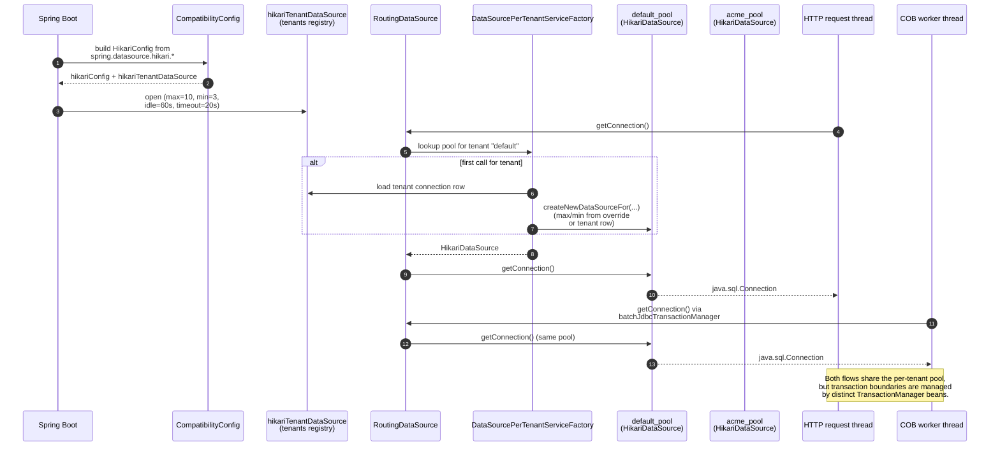

Apache Fineract uses [HikariCP](https://github.com/brettwooldridge/HikariCP) as its sole JDBC connection pool implementation, both for the platform-level tenants registry and for every per-tenant database it talks to at runtime. Pool sizing, leak detection, and the relationship between the COB batch path and the main HTTP path are all controlled by a small set of well-named properties; once you know which ones, capacity planning becomes a straightforward exercise.

This page documents how the pool is constructed in code, which `application.properties` keys influence it, and how the COB batch jobs and the main JAX-RS request flow share — or don't share — the underlying connections.

## Two pool layers

Fineract maintains two distinct categories of HikariCP pools:

- **The tenants pool.** One pool per JVM, pointed at the *tenants registry* database (`fineract_tenants`). It is created at startup from `application.properties` keys under `spring.datasource.hikari.*` and exposed as Spring bean `hikariTenantDataSource`. This pool is used to look up tenant configuration; it is *not* the pool that holds the actual business data.
- **Per-tenant pools.** One pool per tenant connection. Created lazily by `DataSourcePerTenantServiceFactory.createNewDataSourceFor(...)` the first time a request for that tenant arrives, then cached for the lifetime of the JVM. These hold the loan, savings, accounting, and audit data.

A request thread acquires connections from the per-tenant pool. The lookup goes through `RoutingDataSource`, which uses Spring's `AbstractRoutingDataSource` mechanism to dispatch to the right tenant pool based on `ThreadLocalContextUtil`.

## The tenants pool definition

The Spring bean comes from `CompatibilityConfig`:

```java
@Bean(destroyMethod = "close")
public HikariDataSource hikariTenantDataSource(HikariConfig hc) {
    return new HikariDataSource(hc);
}

@Bean
public HikariConfig hikariConfig() {
    Environment environment = context.getEnvironment();
    HikariConfig hc = new HikariConfig();

    hc.setDriverClassName(environment.getProperty("fineract_tenants_driver"));
    hc.setJdbcUrl(environment.getProperty("fineract_tenants_url"));
    hc.setUsername(environment.getProperty("fineract_tenants_uid"));
    hc.setPassword(environment.getProperty("fineract_tenants_pwd"));
    hc.setMinimumIdle(3);
    hc.setMaximumPoolSize(10);
    hc.setIdleTimeout(60000);
    hc.setConnectionTestQuery("SELECT 1");
    hc.setDataSourceProperties(dataSourceProperties());

    return hc;
}
```

In production the same `HikariConfig` is overridden through Spring Boot from `application.properties`:

```properties
spring.datasource.hikari.driverClassName=${FINERACT_HIKARI_DRIVER_SOURCE_CLASS_NAME:org.postgresql.Driver}
spring.datasource.hikari.jdbcUrl=${FINERACT_HIKARI_JDBC_URL:jdbc:postgresql://localhost:5432/fineract_tenants}
spring.datasource.hikari.username=${FINERACT_HIKARI_USERNAME:root}
spring.datasource.hikari.password=${FINERACT_HIKARI_PASSWORD:postgres}
spring.datasource.hikari.minimumIdle=${FINERACT_HIKARI_MINIMUM_IDLE:3}
spring.datasource.hikari.maximumPoolSize=${FINERACT_HIKARI_MAXIMUM_POOL_SIZE:10}
spring.datasource.hikari.idleTimeout=${FINERACT_HIKARI_IDLE_TIMEOUT:60000}
spring.datasource.hikari.connectionTimeout=${FINERACT_HIKARI_CONNECTION_TIMEOUT:20000}
spring.datasource.hikari.leakDetectionThreshold=${FINERACT_HIKARI_LEAK_DETECTION_THRESHOLD:0}
spring.datasource.hikari.connectionTestquery=${FINERACT_HIKARI_TEST_QUERY:SELECT 1}
spring.datasource.hikari.autoCommit=${FINERACT_HIKARI_AUTO_COMMIT:true}
spring.datasource.hikari.transactionIsolation=${FINERACT_HIKARI_TRANSACTION_ISOLATION:TRANSACTION_REPEATABLE_READ}
```

These define the tenants pool. The same `HikariConfig` bean is then *also* injected into the per-tenant factory, where most of its values are copied through to each new tenant pool. The tenant-specific JDBC URL replaces the tenants-DB URL, but driver class, connection test query, autoCommit, and `dataSourceProperties` (statement cache, batched-statement rewriting, etc.) are taken straight from the global `HikariConfig`.

## Per-tenant pool creation

`DataSourcePerTenantServiceFactory.createNewDataSourceFor` is the only place runtime tenant pools are created:

```java
public DataSource createNewDataSourceFor(FineractPlatformTenant tenant, FineractPlatformTenantConnection tenantConnection) {
    // ... validate master password, resolve read/write host/port/schema ...
    String jdbcUrl = toJdbcUrl(protocol, schemaServer, schemaPort, schemaName, schemaConnectionParameters);

    HikariConfig config = new HikariConfig();
    config.setReadOnly(fineractProperties.getMode().isReadOnlyMode());
    config.setJdbcUrl(jdbcUrl);
    config.setPoolName(schemaName + "_pool");
    config.setUsername(schemaUsername);
    config.setPassword(databasePasswordEncryptor.decrypt(schemaPassword));
    config.setMinimumIdle(getMinPoolSize(tenantConnection));
    config.setMaximumPoolSize(getMaxPoolSize(tenantConnection));
    config.setValidationTimeout(tenantConnection.getValidationInterval());
    config.setDriverClassName(hikariConfig.getDriverClassName());
    config.setConnectionTestQuery(hikariConfig.getConnectionTestQuery());
    config.setAutoCommit(hikariConfig.isAutoCommit());
    config.setLeakDetectionThreshold(getLeakDetectionThreshold());

    config.setRegisterMbeans(true);
    meterRegistry.ifPresent(registry -> config
            .setMetricsTrackerFactory(new TenantConnectionPoolMetricsTrackerFactory(tenant.getTenantIdentifier(), registry)));

    config.setDataSourceProperties(hikariConfig.getDataSourceProperties());

    return hikariDataSourceFactory.create(config);
}
```

A few aspects worth noting:

- **`poolName = schemaName + "_pool"`.** Every tenant pool has a distinct, queryable JMX name. The MBeans are registered (`setRegisterMbeans(true)`), so operators can read pool metrics live.
- **Read-only mode.** If `fineract.mode.read-enabled=true` and `write-enabled=false`, the factory points the pool at the tenant's read-replica host/port/schema/username/password if those are configured, and marks the pool read-only.
- **Micrometer integration.** When a `MeterRegistry` bean is present, every pool also gets a `TenantConnectionPoolMetricsTrackerFactory` that publishes per-tenant gauges — total, active, idle, waiting-threads.

### Sizing per tenant

Pool sizes per tenant come from one of two places:

```java
private int getMaxPoolSize(FineractPlatformTenantConnection tenantConnection) {
    FineractProperties.FineractConfigProperties configOverride = fineractProperties.getTenant().getConfig();
    if (configOverride.isMaxPoolSizeSet()) {
        int maxPoolSize = configOverride.getMaxPoolSize();
        log.info("Overriding tenant datasource maximum pool size configuration to {}", maxPoolSize);
        return maxPoolSize;
    } else {
        return tenantConnection.getMaxActive();
    }
}
```

Precedence:

1. **Per-deployment override.** `fineract.tenant.config.max-pool-size` and `min-pool-size` in `application.properties` (env vars `FINERACT_CONFIG_MAX_POOL_SIZE`, `FINERACT_CONFIG_MIN_POOL_SIZE`). When set, the same value is forced for every tenant.
2. **Per-tenant value.** Columns `max_active` and `initial_size` on the tenant connection row in the tenants registry. Useful when one tenant needs more headroom than another in the same JVM.

The default in `application.properties` is `-1`, which the code interprets as "not set" so the per-tenant column wins:

```properties
fineract.tenant.config.min-pool-size=${FINERACT_CONFIG_MIN_POOL_SIZE:-1}
fineract.tenant.config.max-pool-size=${FINERACT_CONFIG_MAX_POOL_SIZE:-1}
```

### Leak detection

The factory consults a third lever for leak detection:

```java
private long getLeakDetectionThreshold() {
    FineractProperties.FineractConfigProperties configOverride = fineractProperties.getTenant().getConfig();
    if (configOverride.isLeakDetectionThresholdSet()) {
        return configOverride.getLeakDetectionThreshold();
    }
    return hikariConfig.getLeakDetectionThreshold();
}
```

If the per-deployment override is set, every tenant uses it; otherwise the tenants pool's `leakDetectionThreshold` (`FINERACT_HIKARI_LEAK_DETECTION_THRESHOLD`, default 0/off) is reused. When the threshold is positive the factory logs a warning:

```
Tenant datasource <pool_name> leak detection enabled at <N>ms; Hikari will log borrower stack traces for long-held connections
```

This is the recommended setting for production once a release has stabilized.

## Pool topology



## Main vs. batch: separate transaction managers, same pool

A common surprise is that Apache Fineract does **not** maintain a separate HikariCP pool for the COB batch path. Both the main HTTP flow and the Spring Batch–driven COB jobs go through the same `RoutingDataSource`, and therefore the same per-tenant Hikari pool. What is separate is the `PlatformTransactionManager` bean each side uses.

`JdbcTransactionConfig` declares both managers against the same `RoutingDataSource`:

```java
@Bean
public PlatformTransactionManager jdbcTransactionManager(FineractProperties fineractProperties, RoutingDataSource dataSource, ...) {
    boolean readOnly = fineractProperties.getMode().isReadOnlyMode();
    ExtendedDataSourceTransactionManager transactionManager = new ExtendedDataSourceTransactionManager(readOnly);
    transactionManager.setDataSource(dataSource);
    // ...
    return transactionManager;
}

@Bean
public PlatformTransactionManager batchJdbcTransactionManager(FineractProperties fineractProperties, RoutingDataSource dataSource, ...) {
    boolean readOnly = fineractProperties.getMode().isReadOnlyMode();
    ExtendedDataSourceTransactionManager transactionManager = new ExtendedDataSourceTransactionManager(readOnly);
    transactionManager.setDataSource(dataSource);
    // ...
    return transactionManager;
}

@Bean
public TransactionTemplate batchJdbcTransactionTemplate(
        @Qualifier("batchJdbcTransactionManager") PlatformTransactionManager batchJdbcTransactionManager) {
    return new TransactionTemplate(batchJdbcTransactionManager);
}
```

The `batchJdbcTransactionTemplate` is injected wherever COB code needs to acquire connections outside Spring Batch's own framework boundaries — for example into `ChunkProcessingLoanItemListener`, `ApplyLoanLockTasklet`, and `LoanInlineCOBConfig`. Having the second manager lets the batch path operate without entangling its outer transactions with the request-scoped JPA `EntityManager` the main flow uses.

Practical consequence for capacity planning: **maxPoolSize must accommodate both flows simultaneously**. If your tenant pool is sized 20 and COB chunk processing routinely checks out 10 connections concurrently, your HTTP traffic only has 10 left. The COB worker's parallelism is controlled separately via `fineract.partitioned-job.partitioned-job-properties[0].thread-pool-max-pool-size` (default 5 for `LOAN_COB`), so a useful rule of thumb is `maxPoolSize >= expected_concurrent_http + cob_thread_pool_max_pool_size + headroom`.

## Connection-checkout diagnostics

For debugging connection starvation, `application.properties` exposes:

```properties
fineract.datasource.connection-checkout-diagnostics.enabled=${FINERACT_DATASOURCE_CONNECTION_CHECKOUT_DIAGNOSTICS_ENABLED:false}
fineract.datasource.connection-checkout-diagnostics.stack-depth=${FINERACT_DATASOURCE_CONNECTION_CHECKOUT_DIAGNOSTICS_STACK_DEPTH:12}
```

When enabled, `RoutingDataSource` logs a structured warning every time a `getConnection()` call fails:

```
Tenant datasource connection checkout failed: tenant=default/connection:1,
username=<default>, transaction=actualActive=true, synchronizationActive=true, readOnly=false, name=...,
hikari=poolName=fineract_default_pool, total=20, active=20, idle=0, waiting=3,
error=Connection is not available, request timed out after 20000ms,
stack=...
```

The `hikari=...` block comes from `HikariPoolMXBean` and is the fastest way to confirm the symptom is genuine exhaustion versus a network or auth issue. The compact stack tells you which call site borrowed the connection that never came back, with depth bounded by `stack-depth` so logs stay manageable.

<Warning>
Enable `connection-checkout-diagnostics` only when actively debugging. Each failed checkout produces a log line and a trimmed stack walk; under sustained pool exhaustion this is voluminous. Leak detection (`leakDetectionThreshold` > 0) is the appropriate steady-state setting.
</Warning>

## Tuning checklist

A small set of properties covers most production cases:

- `FINERACT_HIKARI_MAXIMUM_POOL_SIZE` / `FINERACT_HIKARI_MINIMUM_IDLE` — tenants pool. Keep small (10/3 is the default) because it is only used for tenant lookups.
- `FINERACT_CONFIG_MAX_POOL_SIZE` / `FINERACT_CONFIG_MIN_POOL_SIZE` — force a uniform per-tenant size. Useful in container deployments where every pod hosts every tenant.
- Per-tenant `max_active` / `initial_size` columns — when one tenant is materially larger than others.
- `FINERACT_HIKARI_CONNECTION_TIMEOUT` — default 20000 ms. Increase only if the database is genuinely slow to hand out connections; otherwise long timeouts hide capacity problems.
- `FINERACT_HIKARI_LEAK_DETECTION_THRESHOLD` — set to a value larger than your slowest legitimate transaction (for example 30000–60000 ms).
- `FINERACT_HIKARI_TRANSACTION_ISOLATION` — `TRANSACTION_REPEATABLE_READ` by default; reducing it changes batch-API semantics, so do not lower it without understanding `BatchApiServiceImpl`.

Combined with the Micrometer-published gauges, these knobs give operators a complete picture: tenant pools are isolated, sized either uniformly or per-tenant, diagnosable on failure, and shared between the HTTP and COB paths through a single `RoutingDataSource` with two distinct transaction managers.
