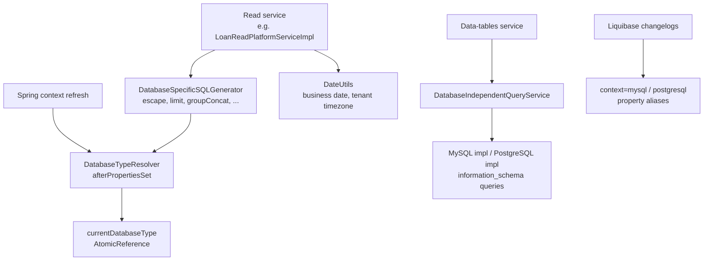

Apache Fineract supports both MySQL/MariaDB and PostgreSQL with the same codebase. JPA handles most of the SQL differences automatically, but a fair amount of code — read services, Liquibase property aliases, data-tables, and the reporting engine — emits SQL by hand. To keep that SQL portable, Fineract uses a small dialect abstraction made of three collaborators: `DatabaseTypeResolver`, `DatabaseSpecificSQLGenerator`, and `DatabaseIndependentQueryService`. This page describes each in turn.

## The resolver: figuring out which database we are on

`DatabaseTypeResolver` is a `@Component` that inspects the JDBC driver class name at startup and exposes simple predicates:

```java
@Component
public class DatabaseTypeResolver implements InitializingBean {

    private static final Map<String, DatabaseType> DRIVER_MAPPING = Map.of(
        "org.mariadb.jdbc.Driver",   DatabaseType.MYSQL,
        "com.mysql.jdbc.Driver",     DatabaseType.MYSQL,
        "com.mysql.cj.jdbc.Driver",  DatabaseType.MYSQL,
        "org.postgresql.Driver",     DatabaseType.POSTGRESQL);

    private static final AtomicReference<DatabaseType> currentDatabaseType = new AtomicReference<>();
    private final HikariConfig hikariConfig;

    @Override
    public void afterPropertiesSet() {
        currentDatabaseType.set(determineDatabaseType(hikariConfig.getDriverClassName()));
    }

    public DatabaseType databaseType()  { return currentDatabaseType.get(); }
    public boolean      isPostgreSQL()  { return DatabaseType.POSTGRESQL == currentDatabaseType.get(); }
    public boolean      isMySQL()       { return DatabaseType.MYSQL == currentDatabaseType.get(); }
}
```

Three things to call out:

- **MariaDB is treated as MySQL.** The same driver class space, the same SQL surface (for Fineract's purposes), the same `DatabaseType.MYSQL` enum value.
- **The driver class is the source of truth.** Fineract does not query the database for its version; it reads the driver registered on the tenant store pool. That driver is identical for the store pool and every per-tenant pool, so there is one database type per running instance.
- **An unknown driver fails fast.** `determineDatabaseType` throws `IllegalArgumentException("The driver's class is not supported " + driverClassName)`. Adding a new dialect is a deliberate code change, not a configuration accident.

Inject this bean into any code that needs branching:

```java
if (databaseTypeResolver.isPostgreSQL()) {
    // PostgreSQL-only path
}
```

## The SQL generator: tiny dialect-aware emitters

`DatabaseSpecificSQLGenerator` is the most heavily used dialect helper. Its methods emit small SQL fragments that callers paste into hand-written queries:

| Method | MySQL output | PostgreSQL output |
|--------|-------------|-------------------|
| `escape("col")` | `` `col` `` | `"col"` |
| `formatValue(jdbcType, value)` | quotes strings/dates, leaves numbers alone | identical |
| `groupConcat("x")` | `GROUP_CONCAT(x)` | `STRING_AGG(x::varchar, ',')` |
| `limit(count)` / `limit(count, offset)` | `LIMIT offset,count` | `LIMIT count OFFSET offset` |
| `calcFoundRows()` | `SQL_CALC_FOUND_ROWS` | empty string |
| `countLastExecutedQueryResult(sql)` | `SELECT FOUND_ROWS()` | `SELECT COUNT(*) FROM (sql) AS temp` |
| `countQueryResult(sql)` | `SELECT COUNT(*) FROM (sql) AS temp` after stripping `LIMIT`/`OFFSET` | identical |
| `currentBusinessDate()` | `DATE('yyyy-MM-dd')` | `DATE 'yyyy-MM-dd'` |

The class itself is small and worth keeping in mind when writing new SQL:

```java
@Component
@RequiredArgsConstructor
public class DatabaseSpecificSQLGenerator {

    private final DatabaseTypeResolver databaseTypeResolver;
    private final RoutingDataSource dataSource;

    public static final String SELECT_CLAUSE = "SELECT %s";
    public static final int IN_CLAUSE_MAX_PARAMS = 10_000;

    public DatabaseType getDialect()  { return databaseTypeResolver.databaseType(); }

    public String escape(String arg) {
        if (databaseTypeResolver.isMySQL())      return format("`%s`", arg);
        if (databaseTypeResolver.isPostgreSQL()) return format("\"%s\"", arg);
        return arg;
    }

    public String groupConcat(String arg) {
        if (databaseTypeResolver.isMySQL())      return format("GROUP_CONCAT(%s)", arg);
        if (databaseTypeResolver.isPostgreSQL()) return format("STRING_AGG(%s::varchar, ',')", arg);
        throw new IllegalStateException("Database type is not supported for group concat " + databaseTypeResolver.databaseType());
    }
    ...
}
```

### Two `count` methods, two intents

`countLastExecutedQueryResult(sql)` is the fast path for paged queries on MySQL: when the previous statement used `SQL_CALC_FOUND_ROWS`, MySQL has already computed the total — `SELECT FOUND_ROWS()` returns it instantly. PostgreSQL has no equivalent, so the generator falls back to wrapping the original query in `SELECT COUNT(*) FROM (...) AS temp`.

`countQueryResult(sql)` is the general path: it always wraps the inner SQL, but first strips trailing `LIMIT n` and `OFFSET n` so the count reflects the full result set, not just the page.

### The "current business date" literal

Reports and data tables frequently filter by Fineract's *business date* (the COB engine's current logical date, which may lag behind wall-clock today). `currentBusinessDate()` emits a literal that the database can evaluate as a date:

```java
public String currentBusinessDate() {
    if (databaseTypeResolver.isMySQL()) {
        return format("DATE('%s')",
                      DateUtils.getBusinessLocalDate().format(DateUtils.DEFAULT_DATE_FORMATTER));
    } else if (databaseTypeResolver.isPostgreSQL()) {
        return format("DATE '%s'",
                      DateUtils.getBusinessLocalDate().format(DateUtils.DEFAULT_DATE_FORMATTER));
    } else {
        throw new IllegalStateException("Database type is not supported for current date "
                                        + databaseTypeResolver.databaseType());
    }
}
```

`DateUtils.getBusinessLocalDate()` reads the per-tenant business date that the COB engine maintains. By emitting a literal rather than a database function (`CURRENT_DATE`), reports always agree on the same logical date even if they execute milliseconds apart.

## The query service: metadata across dialects

`DatabaseIndependentQueryService` is the dialect abstraction for *metadata* — "is this table present?", "what columns does it have?", "what indexes are on it?". It lives next to the SQL generator and follows the same pattern: pick the right implementation by predicate, then delegate.

```java
@Component
public class DatabaseIndependentQueryService implements DatabaseQueryService {

    private final Collection<DatabaseQueryService> queryServices;

    private DatabaseQueryService choose(DataSource dataSource) {
        DatabaseQueryService result = queryServices.stream()
            .filter(DatabaseQueryService::isSupported)
            .findAny()
            .orElseThrow(() -> new IllegalStateException("DataSource not supported"));
        return result;
    }

    @Override public boolean isTablePresent(DataSource ds, String table) {
        return choose(ds).isTablePresent(ds, table);
    }
    @Override public SqlRowSet getTableColumns(DataSource ds, String table) {
        return choose(ds).getTableColumns(ds, table);
    }
    @Override public List<IndexDetail> getTableIndexes(DataSource ds, String table) {
        return choose(ds).getTableIndexes(ds, table);
    }
}
```

The `DatabaseQueryService` interface has two concrete implementations — one for MySQL/MariaDB, one for PostgreSQL — each backed by the corresponding `information_schema` queries. The chooser asks "are you supported in this runtime?" rather than "are you MySQL?", which keeps the metadata service decoupled from the resolver and makes adding a third dialect a matter of dropping in a new bean.

The data-tables feature is the heaviest consumer of this metadata: when a tenant creates or alters a custom data-table, Fineract uses these calls to verify the existing shape, plan the SQL, and prevent accidental destruction.

## `DateUtils` and date portability

A surprising amount of dialect work is about dates, not SQL. `org.apache.fineract.infrastructure.core.service.DateUtils` centralizes the rules:

- `getBusinessLocalDate()` — the tenant's current business date, as maintained by the COB engine.
- `getLocalDateOfTenant()` / `getLocalDateTimeOfTenant()` — wall-clock now, in the tenant's timezone.
- `DEFAULT_DATE_FORMATTER` — the ISO `yyyy-MM-dd` formatter used in literal date strings emitted to SQL.
- `getOffsetDateTimeOfTenant()` / `getAuditOffsetDateTime()` — UTC instants for audit columns.

By going through `DateUtils` instead of `LocalDate.now()`, reports and queries automatically pick up the tenant timezone and the business-date overrides — and they emit identical strings regardless of database dialect.

## Dialect contexts in Liquibase

The same dialect split shows up in Liquibase changelogs as `context="mysql"` and `context="postgresql"` filters, and as the property aliases declared at the top of `db.changelog-master.xml`:

```xml
<property name="current_date" value="CURDATE()"           context="mysql"/>
<property name="current_date" value="CURRENT_DATE"        context="postgresql"/>
<property name="uuid"         value="uuid()"              context="mysql"/>
<property name="uuid"         value="uuid_generate_v4()"  context="postgresql"/>
```

This is the same pattern at a different layer: pick the right expression for the dialect, and let callers stay portable.

## How the pieces fit together



The arrows that matter: every dialect-aware helper either reads from `DatabaseTypeResolver` directly, or chooses among beans by `isSupported()` predicates. There is no second source of truth.

## When to add new dialect-aware code

<Tip>
Reach for `DatabaseSpecificSQLGenerator` when:

- You are about to write `if (mariaDb) ... else ...` in a read service.
- You need an `IN` list larger than a handful of values (`IN_CLAUSE_MAX_PARAMS = 10_000` is the safe cap).
- You need a `GROUP_CONCAT` or a paginated query.
- You need a date literal that follows the tenant's business date.

Reach for `DatabaseIndependentQueryService` when:

- You need to inspect a tenant's tables or indexes — typically only the data-tables and reporting engines do this.
</Tip>

## Anti-patterns

<Warning>
- **Do not** call `databaseTypeResolver.isPostgreSQL()` from `@Configuration` classes. The bean depends on `HikariConfig`, which is itself only fully initialized after the data-source beans; relying on the dialect from a `@Bean` method may see an unset value. Conditional beans should rely on Spring `@Profile` or `@ConditionalOnProperty` instead.
- **Do not** emit `CURRENT_DATE` or `NOW()` directly in SQL. Use `DatabaseSpecificSQLGenerator.currentBusinessDate()` or a date literal from `DateUtils` so the result is reproducible across reports.
- **Do not** introduce a third dialect in the resolver without also adding implementations for `DatabaseQueryService` and updating every method of `DatabaseSpecificSQLGenerator`. The compile-time `throw new IllegalStateException(...)` branches will fail fast at runtime, which is by design.
</Warning>

## Related pages

- [JDBC template services](/data/jdbc-template-services) — where the SQL generator is used most heavily.
- [Liquibase migrations](/data/liquibase-migrations) — the dialect-context system at the schema layer.
- [Database routing](/data/database-routing) — `DatabaseTypeResolver` depends on the same `HikariConfig` that drives routing.
