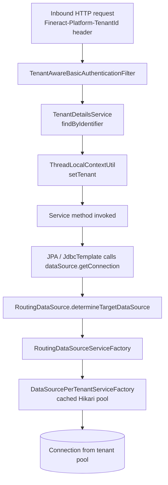

Apache Fineract is multi-tenant at the database level — each tenant owns a separate physical schema, and a single application instance can serve many of them. The mechanism that picks the right database for the in-flight request is a small chain of components around `RoutingDataSource`. This page walks through that chain end-to-end.

## The two databases of a single Fineract install

```mermaid
flowchart LR
    App[Fineract application]
    App --> StorePool[hikariTenantDataSource<br/>HikariCpConfig]
    StorePool --> StoreDB[(Tenant store DB<br/>tenants<br/>tenant_server_connections<br/>m_tenant_oidc_config)]
    App --> RDS[RoutingDataSource<br/>@Primary, name=dataSource]
    RDS --> Lookup[RoutingDataSourceServiceFactory]
    Lookup --> Cache[DataSourcePerTenantServiceFactory<br/>per-tenant Hikari pool cache]
    Cache --> T1[(Tenant A DB)]
    Cache --> T2[(Tenant B DB)]
    Cache --> Tn[(Tenant N DB)]
```

- The **tenant store** is one fixed database. It contains the list of tenants and the JDBC connection details for each tenant's own database. Its `DataSource` bean is `hikariTenantDataSource`, declared in `HikariCpConfig` and bound to `spring.datasource.hikari.*` properties.
- A **tenant database** is one per tenant, holding the operational tables (`m_loan`, `m_savings_account`, `m_journal_entry`, …). Its `DataSource` is created lazily by `DataSourcePerTenantServiceFactory.createNewDataSourceFor(tenant, connection)`.

## The tenant store tables

The bootstrap schema (`db/changelog/tenant-store/parts/0001_initial_schema.xml`) defines two key tables:

- `tenant_server_connections` — host, port, schema name, schema username, encrypted password, plus the pool sizing knobs (`pool_initial_size`, `pool_max_active`, `pool_min_idle`, `pool_validation_interval`, etc.). It also has read-only variants of host/port/credentials added in later changesets so a tenant can route reads to a replica.
- `tenants` — the tenant identifier, name, timezone, and two foreign keys (`oltp_id`, `report_id`) into `tenant_server_connections` for the writable and reporting databases.

Spring Boot loads these into `FineractPlatformTenant` / `FineractPlatformTenantConnection` value objects at startup; `TenantDetailsService.findAllTenants()` is the cache.

## The `RoutingDataSource` bean

`fineract-core/src/main/java/org/apache/fineract/infrastructure/core/service/database/RoutingDataSource.java` is the `@Primary` `DataSource` bean. Every Spring component that asks for a `DataSource` (JPA, `JdbcTemplate`, the transaction manager) gets *this* object.

```java
@Service(value = "dataSource")
@Primary
public class RoutingDataSource extends AbstractDataSource {

    @Autowired
    private RoutingDataSourceServiceFactory dataSourceServiceFactory;

    @Override
    public Connection getConnection() throws SQLException {
        DataSource targetDataSource = determineTargetDataSource();
        return targetDataSource.getConnection();
    }

    public DataSource determineTargetDataSource() {
        return this.dataSourceServiceFactory.determineDataSourceService().retrieveDataSource();
    }
}
```

It is intentionally not a `AbstractRoutingDataSource` — that Spring class hashes a lookup key inside itself, and Fineract needs the indirection level for per-tenant Hikari pool creation. The `@Service` name `dataSource` shadows Spring Boot's auto-configured `dataSource` bean so any `@Autowired DataSource` in the codebase resolves to the routing one.

## Per-request: how a thread gets to its tenant



The end-to-end flow:

<Steps>
<Step title="Filter resolves the tenant">
`TenantAwareBasicAuthenticationFilter` reads the `Fineract-Platform-TenantId` header (or its variants), looks up the tenant via `TenantDetailsService`, and binds the resulting `FineractPlatformTenant` to a thread-local through `ThreadLocalContextUtil.setTenant(...)`. The `FineractContext` value object is the carrier for this binding.
</Step>
<Step title="Service code asks for a connection">
A `@Transactional` service method runs. Either JPA fetches an entity (causing EclipseLink to ask for a JDBC connection) or a `*ReadPlatformServiceImpl` calls `jdbcTemplate.queryForList(...)`. Both go through Spring's `DataSourceUtils.getConnection(dataSource)` — and `dataSource` is the `RoutingDataSource`.
</Step>
<Step title="Routing decision">
`RoutingDataSource.determineTargetDataSource()` calls `dataSourceServiceFactory.determineDataSourceService().retrieveDataSource()`. The factory chooses between the *tenant store service* and the *per-tenant service* based on whether the call site is doing tenant-store work (rare, system-level) or normal tenant work.
</Step>
<Step title="Pool lookup or creation">
For normal tenant work, `DataSourcePerTenantServiceFactory` checks its in-memory cache keyed by tenant identifier. If a Hikari pool already exists, it is reused. Otherwise `createNewDataSourceFor(tenant, tenantConnection)` builds a brand-new `HikariConfig`, applies pool sizing from the tenant row (or from `fineractProperties` overrides), and starts a fresh `HikariDataSource`.
</Step>
<Step title="Connection checkout">
The transaction manager binds that Connection to the current thread for the duration of the transaction. JPA queries and any JDBC reads in the same method now share the same physical connection — and therefore see the same transactional snapshot.
</Step>
<Step title="Cleanup">
At the transaction boundary, the connection is returned to the pool. The `ThreadLocal` tenant is cleared when the request finishes so the thread can serve a different tenant on its next invocation.
</Step>
</Steps>

## Building a tenant `DataSource`

`DataSourcePerTenantServiceFactory.createNewDataSourceFor(...)` is the heart of per-tenant pooling. The relevant parts:

```java
String protocol = resolveProtocol(hikariConfig.getDriverClassName());
String jdbcUrl = toJdbcUrl(protocol, schemaServer, schemaPort, schemaName,
                           schemaConnectionParameters);

HikariConfig config = new HikariConfig();
config.setReadOnly(fineractProperties.getMode().isReadOnlyMode());
config.setJdbcUrl(jdbcUrl);
config.setPoolName(schemaName + "_pool");
config.setUsername(schemaUsername);
config.setPassword(databasePasswordEncryptor.decrypt(schemaPassword));
config.setMinimumIdle(getMinPoolSize(tenantConnection));
config.setMaximumPoolSize(getMaxPoolSize(tenantConnection));
config.setValidationTimeout(tenantConnection.getValidationInterval());
config.setDriverClassName(hikariConfig.getDriverClassName());
config.setConnectionTestQuery(hikariConfig.getConnectionTestQuery());
config.setAutoCommit(hikariConfig.isAutoCommit());
config.setLeakDetectionThreshold(getLeakDetectionThreshold());
config.setRegisterMbeans(true);
config.setDataSourceProperties(hikariConfig.getDataSourceProperties());

return hikariDataSourceFactory.create(config);
```

Several things are inherited from the tenant store pool's `HikariConfig` so every tenant pool uses the same JDBC driver, connection test query, auto-commit setting, and data-source properties (e.g. MySQL session variables). What changes per tenant is the URL, credentials, pool size, validation timeout, and pool name.

Read-only mode (`fineractProperties.getMode().isReadOnlyMode()`) flips two switches: the connection's read-only flag, and the choice of host/port/credentials — the read-only schema variants are used if present.

## Read-only deployments and replica routing

The tenant connection row has both writable and read-only host/port/credential fields. When the application starts in read-only mode, the factory prefers the read-only fields:

```java
if (fineractProperties.getMode().isReadOnlyMode()) {
    schemaServer    = defaultIfBlank(tenantConnection.getReadOnlySchemaServer(),    schemaServer);
    schemaPort      = defaultIfBlank(tenantConnection.getReadOnlySchemaServerPort(), schemaPort);
    schemaName      = defaultIfBlank(tenantConnection.getReadOnlySchemaName(),      schemaName);
    schemaUsername  = defaultIfBlank(tenantConnection.getReadOnlySchemaUsername(),  schemaUsername);
    schemaPassword  = defaultIfBlank(tenantConnection.getReadOnlySchemaPassword(),  schemaPassword);
    schemaConnectionParameters = defaultIfBlank(
        tenantConnection.getReadOnlySchemaConnectionParameters(), schemaConnectionParameters);
}
```

This is how a hot-standby replica deployment is wired: same code, same tenant store, but a profile flips `mode.readOnlyMode=true` and the pool builds URLs that target the read replica.

## Connection diagnostics

`RoutingDataSource` ships with a connection-checkout diagnostics mode controlled by:

- `fineract.datasource.connection-checkout-diagnostics.enabled`
- `fineract.datasource.connection-checkout-diagnostics.stack-depth`

When enabled, every checkout (success or failure) is logged with the tenant identifier, transaction state, Hikari pool counts (total / active / idle / waiting), and a compact stack trace. Excerpts of the log format:

```
Tenant datasource connection checkout: tenant=demo/connection:1,
    username=<default>,
    transaction=actualActive=true, synchronizationActive=true, readOnly=false, name=...,
    hikari=poolName=demo_pool, total=10, active=3, idle=7, waiting=0,
    stack=...
```

This is the right tool when you are debugging a "connection leak" symptom — Hikari's leak detection threshold tells you *that* a connection is held too long; this diagnostic tells you *which* code path took it out.

## The system datasource: `DataSource` vs `hikariTenantDataSource`

Two `DataSource` beans coexist:

| Bean name | Class | Used by |
|-----------|-------|---------|
| `dataSource` | `RoutingDataSource` (`@Primary`) | JPA, all `JdbcTemplate`s, the transaction manager, application code. |
| `hikariTenantDataSource` | `HikariDataSource` | Liquibase migrations of the tenant store, `TenantDetailsService` (to read `tenants`), `DataSourcePerTenantServiceFactory` (to clone driver config). |

If you ever need to write code that operates on the tenant store specifically — for example a custom job that lists all tenants — inject `@Qualifier("hikariTenantDataSource") DataSource` explicitly. The default `@Autowired DataSource` would route to the per-tenant database of the currently bound thread.

## What lives where

| Concern | File |
|---------|------|
| `@Primary` DataSource bean | `RoutingDataSource.java` |
| Picks store vs per-tenant service | `RoutingDataSourceServiceFactory.java` |
| Owns the per-tenant pool cache | `DataSourcePerTenantServiceFactory.java` |
| Builds a fresh `HikariDataSource` | `HikariDataSourceFactory.java` |
| Tenant store pool bean | `HikariCpConfig.java` |
| Resolves tenant for a request | `TenantAwareBasicAuthenticationFilter` (in `fineract-security`) |
| Loads tenants on boot | `TenantDetailsService` |
| Holds the thread-local tenant | `ThreadLocalContextUtil` / `FineractRequestContextHolder` |

## Gotchas

<Warning>
- **A pool per tenant** — total open connections is the sum across pools. If you operate 200 tenants with `maxPoolSize=40` each you will need 8 000 database connections at peak. Tune `fineract.tenant.config.maxPoolSize` to cap this centrally.
- **Background threads must propagate the tenant**. Anything that spawns a thread outside the request-per-thread model has to capture the `FineractContext` and re-bind it via `ThreadLocalContextUtil` before touching the database. The Spring Batch / COB infrastructure does this for you; ad-hoc `CompletableFuture`s do not.
- **The tenant store cache is in-memory**. Adding a tenant row at runtime requires either a controlled restart or an explicit cache refresh in the operating procedure.
</Warning>

## Related pages

- [Connection pool](/data/connection-pooling) for the HikariCP knobs in detail.
- [JPA configuration](/data/jpa-configuration) for how the EMF shares this `DataSource`.
- [Liquibase migrations](/data/liquibase-migrations) for how each tenant DB is bootstrapped before routing starts handling requests.
