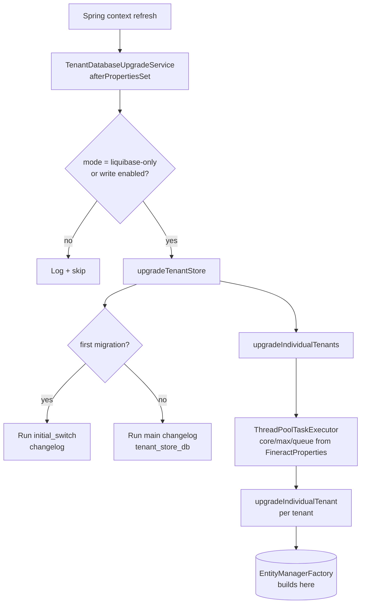

Apache Fineract uses Liquibase for every schema and reference-data change. A single master changelog dispatches into two tracks — *tenant store* and *tenant DB* — both of which are made up of dozens of small XML files organized by topic and numbered for ordering. This page explains the file layout, the naming convention, the contexts that gate execution, and how custom Java tasks plug in.

## Why Liquibase, and where it lives

Fineract has to bootstrap an empty database, evolve it across releases, support both MySQL/MariaDB and PostgreSQL, and let downstream deployments inject their own changes without forking the codebase. Liquibase, with XML changelogs and contexts, gives all of that.

Everything sits under one directory:

```
fineract-provider/src/main/resources/db/changelog/
├── db.changelog-master.xml
├── tenant-store/
│   ├── changelog-tenant-store.xml
│   ├── initial-switch-changelog-tenant-store.xml
│   ├── parts/
│   │   ├── 0001_initial_schema.xml
│   │   ├── 0002_initial_data.xml
│   │   └── ...
│   └── upgrades/
└── tenant/
    ├── changelog-tenant.xml
    ├── final-changelog-tenant.xml
    ├── initial-switch-changelog-tenant.xml
    ├── parts/
    │   ├── 0001_initial_schema.xml
    │   ├── 0002_initial_data.xml
    │   ├── 0003_postgresql_specific_initial_data.xml
    │   └── ...
    └── upgrades/
```

Module-specific changelogs (loan, investor, savings, progressive loan, loan origination, command, working capital) live under `db/changelog/tenant/module/<module>/` and are included by the master changelog.

## The master changelog

`db.changelog-master.xml` is short and worth reading in full. The essence:

```xml
<databaseChangeLog ...>
    <property name="current_date"     value="CURDATE()"           context="mysql"/>
    <property name="current_date"     value="CURRENT_DATE"        context="postgresql"/>
    <property name="current_datetime" value="NOW()"/>
    <property name="uuid"             value="uuid()"              context="mysql"/>
    <property name="uuid"             value="uuid_generate_v4()"  context="postgresql"/>

    <include file="tenant-store/initial-switch-changelog-tenant-store.xml"
             context="tenant_store_db AND initial_switch"/>
    <include file="tenant-store/changelog-tenant-store.xml"
             context="tenant_store_db AND !initial_switch"/>

    <include file="tenant/initial-switch-changelog-tenant.xml"
             context="tenant_db AND initial_switch"/>
    <include file="tenant/changelog-tenant.xml"
             context="tenant_db AND !initial_switch"/>

    <include file="db/changelog/tenant/module/loan/module-changelog-master.xml"
             context="tenant_db AND !initial_switch"/>
    <include file="db/changelog/tenant/module/investor/module-changelog-master.xml"
             context="tenant_db AND !initial_switch"/>
    <include file="db/changelog/tenant/module/savings/parts/module-changelog-master.xml"
             context="tenant_db AND !initial_switch"/>
    <includeAll path="db/custom-changelog" errorIfMissingOrEmpty="false"
                context="tenant_db AND !initial_switch AND custom_changelog"/>
    <include file="/db/changelog/tenant/module/progressiveloan/module-changelog-master.xml"
             context="tenant_db AND !initial_switch"/>
    <include file="db/changelog/tenant/module/loanorigination/module-changelog-master.xml"
             context="tenant_db AND !initial_switch"/>
    <include file="db/changelog/tenant/module/command/module-changelog-master.xml"
             context="tenant_db AND !initial_switch"/>
    <include file="db/changelog/tenant/module/workingcapitalloan/module-changelog-master.xml"
             context="tenant_db AND !initial_switch"/>

    <include file="tenant/final-changelog-tenant.xml"
             context="tenant_db AND !initial_switch"/>
</databaseChangeLog>
```

Two things to note:

- **Property aliases handle dialect**. `${current_date}` resolves to `CURDATE()` on MySQL and `CURRENT_DATE` on PostgreSQL because of the `context` qualifier on the `<property>` declarations. Use these aliases instead of hard-coding functions.
- **Module order matters**. New modules are appended at the end "to keep the existing auto-increment identifiers". Inserting a module in the middle would shift IDs and break references in downstream production databases.

## Contexts: tenant store vs tenant DB vs initial switch

Liquibase contexts gate which changesets run. Fineract uses four:

| Context | Set by | Meaning |
|---------|--------|---------|
| `tenant_store_db` | `TenantDatabaseUpgradeService.upgradeTenantStore()` | Run against the tenant store (`tenants`, `tenant_server_connections`). |
| `tenant_db` | `TenantDatabaseUpgradeService.upgradeIndividualTenant(...)` | Run against an individual tenant's database. |
| `initial_switch` | First-time migration only | Mark the database as having been switched from the pre-Liquibase schema. |
| `custom_changelog` | Set when `db/custom-changelog/` is present and enabled | Pull in deployment-specific changelogs. |

`TENANT_STORE_DB_CONTEXT`, `INITIAL_SWITCH_CONTEXT`, `TENANT_DB_CONTEXT`, and `CUSTOM_CHANGELOG_CONTEXT` are the corresponding constants in `TenantDatabaseUpgradeService`.

The "initial switch" track exists for one reason: Fineract had a pre-Liquibase schema. When upgrading from that schema, Liquibase records its baseline (which tables already exist, which constraints are already there) instead of trying to create them from scratch.

## File naming and "one XML per topic"

Each `parts/NNNN_<short_topic>.xml` file groups all changesets for one logical change:

```
0008_loan_charge_add_external_id.xml
0009_hold_reason_savings_account.xml
0010_lien_allowed_on_savings_account_products.xml
0011_add_credit_balance_refund_permission.xml
0015_add_business_date.xml
0019_refactor_loan_transaction.xml
0020_add_audit_entries.xml
0021_add_spring_batch_db_structure.xml
0023_use_the_proper_date_or_datetime_type.xml
```

Conventions:

- Four-digit prefix for ordering; numbers are globally unique inside a folder and never re-used.
- Snake-case topic that describes the *intent*, not the table — `add_business_date`, not `add_b_business_date_table`.
- All changesets inside one file share the same topic; if you add a column **and** seed data **and** patch a permission for that feature, they go into the same file.
- The parent `changelog-tenant.xml` only does `<include file="parts/NNNN_topic.xml" relativeToChangelogFile="true"/>` — no logic.

The same convention applies to `tenant-store/parts/`: e.g. `0007_encrypt_existing_tenant_passwords.xml`, `0012_m_tenant_oidc_config.xml`.

## A small worked example

The shape of a typical change set:

```xml
<changeSet author="fineract" id="1">
    <addColumn tableName="m_loan_charge">
        <column name="external_id" type="VARCHAR(100)" defaultValueComputed="NULL">
            <constraints unique="true" uniqueConstraintName="uk_m_loan_charge_external_id"/>
        </column>
    </addColumn>
</changeSet>
```

Notes:

- `author` is `fineract` for upstream changes; downstream deployments use their own identifier.
- `id` resets to `1` inside each file (it is locally unique, paired with the file path in the `DATABASECHANGELOG` table).
- Constraint names are explicit so they can be dropped or renamed later without relying on auto-generated names that differ between databases.

## Custom Java tasks (`CustomTaskChange`)

Pure SQL is not always enough — for example, encrypting an existing column requires application-level cryptography. Fineract registers `CustomTaskChange` beans for these cases:

```java
// org.apache.fineract.infrastructure.core.service.migration.TenantPasswordEncryptionTask
// org.apache.fineract.infrastructure.core.service.migration.TenantReadOnlyPasswordEncryptionTask
```

`TenantDatabaseUpgradeService` holds a `List<CustomTaskChange> customTaskChangesForDependencyInjection` — the comment in the source is explicit: "DO NOT REMOVE! Required for liquibase custom task initialization". Holding the list forces Spring to instantiate every `CustomTaskChange` bean and inject its dependencies (services, encryptors) before Liquibase reflectively creates a fresh instance. Without that side effect Liquibase would call `new TenantPasswordEncryptionTask()` and the Spring-managed collaborators would be `null`.

A changelog references a custom task by class name:

```xml
<changeSet author="fineract" id="1">
    <customChange class="org.apache.fineract.infrastructure.core.service.migration.TenantPasswordEncryptionTask"/>
</changeSet>
```

## How migrations are executed at startup

`TenantDatabaseUpgradeService` implements `InitializingBean`, so its `afterPropertiesSet()` runs once during Spring context refresh:



Each per-tenant upgrade runs on a worker thread; the executor's pool sizes come from `fineractProperties.getTaskExecutor()`. This is why JPA's `entityManagerFactory` bean carries `@DependsOn("tenantDatabaseUpgradeService")` — EclipseLink must not start mapping entities until every tenant's schema is on the latest version.

## The `liquibase-only` profile

Sometimes you want to upgrade databases without exposing the HTTP API — for CI/CD, blue/green deployments, or "schema dry runs". Activating the `liquibase-only` Spring profile causes the application to run `TenantDatabaseUpgradeService` and exit. The check is at the top of `afterPropertiesSet`:

```java
private boolean notLiquibaseOnlyMode() {
    List<String> activeProfiles = Arrays.asList(environment.getActiveProfiles());
    return !activeProfiles.contains(FineractProfiles.LIQUIBASE_ONLY);
}
```

In this mode, the "should I run?" guard around the write-enabled check is bypassed — Liquibase always runs because that is the entire point of the profile.

## Read-only and write-disabled modes

Fineract supports a "read-only" deployment mode in which Liquibase is intentionally not allowed to run:

```java
if (databaseStateVerifier.isLiquibaseDisabled()
        || !fineractProperties.getMode().isWriteEnabled()) {
    log.warn("Liquibase is disabled. Not upgrading any database.");
    return;
}
```

This is essential for hot-standby replicas: the primary deployment migrates schemas, and the read-only deployment trusts the migration is already done.

## Custom changelogs for downstream deployments

The `<includeAll path="db/custom-changelog" errorIfMissingOrEmpty="false" .../>` line at the top of the master changelog is the official extension point. Drop your own XML files into `db/custom-changelog/` on the classpath, enable the `custom_changelog` Liquibase context, and they will be applied to every tenant database alongside the built-in changes.

<Tip>
Custom files must use the same naming convention (`NNNN_short_topic.xml`) and `author` should not be `fineract` — pick something specific to your deployment so a future merge does not accidentally collide IDs.
</Tip>

## Common gotchas

<Warning>
- **Do not edit a changeset after it has been applied** in production. Liquibase records a hash; changing the XML changes the hash and the next startup will fail with a "checksum mismatch". To fix a mistake, add a new changeset.
- **Do not reorder modules** in `db.changelog-master.xml`. Auto-increment IDs in MySQL depend on the historical creation order; reordering rewrites those IDs and breaks foreign-key references in existing databases.
- **Always set explicit constraint names**. Auto-generated names differ between MySQL and PostgreSQL and across versions; explicit names keep diffs and rollbacks deterministic.
- **Use the `${current_date}` and `${uuid}` properties** instead of hard-coding `CURDATE()` or `uuid()` — those properties are aliased per dialect at the top of the master changelog.
</Warning>

## Related reading

- [Database routing](/data/database-routing) for how each tenant database is discovered and routed to.
- [JPA configuration](/data/jpa-configuration) for the `@DependsOn("tenantDatabaseUpgradeService")` boot order.
- [Dialect abstraction](/data/database-dialect-abstraction) for the application-level analog of Liquibase's contexts.
