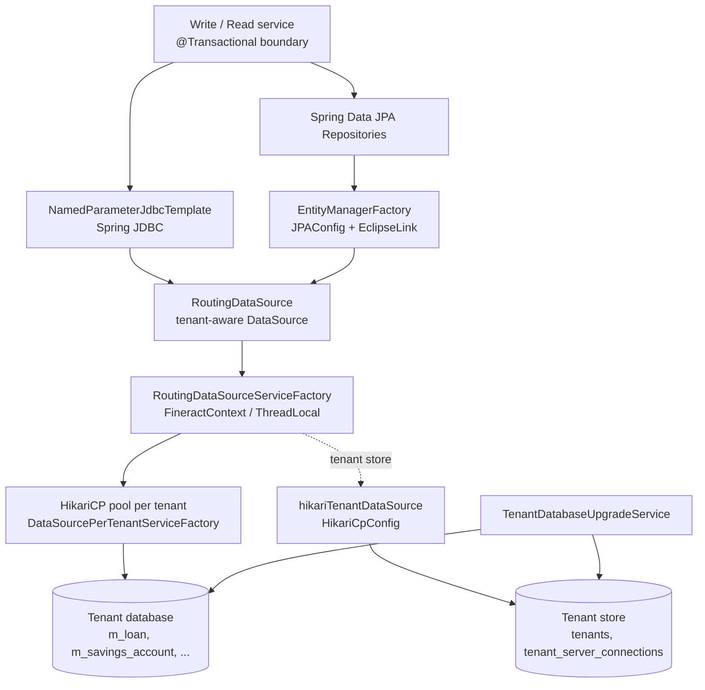

Apache Fineract persists every loan, savings, journal, and audit fact through a layered persistence stack that combines Spring Data JPA over EclipseLink, raw Spring JDBC for read-heavy reports, and Liquibase for schema evolution. The same stack routes traffic to a per-tenant database chosen at request time, abstracts MySQL/MariaDB vs PostgreSQL differences behind small helper components, and pools connections with HikariCP. This page is the entry point — each sub-page in `data/` zooms into one slice of that picture.

The persistence layer sits below the command bus and write platform services; everything in `org.apache.fineract.infrastructure.core.service.database`, `org.apache.fineract.infrastructure.core.persistence`, and `org.apache.fineract.infrastructure.core.config.jpa` cooperates to make Fineract feel like a single application even though it is fundamentally multi-tenant and multi-database.

## How the layers stack up

Every HTTP request enters with a tenant identifier; the `RoutingDataSource` resolves it against the in-memory tenant cache (originally loaded from the tenant store database), borrows a connection from that tenant's Hikari pool, and hands the same `DataSource` to both JPA and JDBC consumers so they share the request's transaction.

## Core domain types

The shared persistence vocabulary lives in `fineract-core/src/main/java/org/apache/fineract/infrastructure/core/domain/`:

| File | Role |
|------|------|
| `AbstractPersistableCustom.java` | Base entity with a generic `id` primary key and JPA equality. |
| `AbstractAuditableCustom.java` | Adds `createdBy`, `createdDate`, `lastModifiedBy`, `lastModifiedDate`. |
| `AbstractAuditableWithUTCDateTimeCustom.java` | UTC-aware audit base for newer modules. |
| `FineractPlatformTenant.java` | The tenant identity row materialized from `tenants`. |
| `FineractPlatformTenantConnection.java` | JDBC URL pieces used to build the per-tenant pool. |
| `FineractContext.java` | Per-request bundle: tenant, auth token, business date, action context. |
| `FineractRequestContextHolder.java` | Holds the active `FineractContext` for the current thread. |
| `BatchRequestContextHolder.java` | Holds context inside Spring Batch / COB threads. |
| `ContextHolder.java` | Low-level `ThreadLocal` wrapper used by both holders. |
| `ActionContext.java` | Marks whether the thread is in a normal HTTP, COB, or batch action. |
| `JdbcSupport.java` | Static helpers that read columns into `BigDecimal`, `LocalDate`, enums. |
| `ExternalId.java` | UUID-shaped value object used as a stable external key. |
| `LocalDateInterval.java` | Inclusive `[start, end]` date range used across schedules. |
| `Base64EncodedImage.java` | Carrier for inline image uploads. |
| `AuditableFieldsConstants.java` | Column names referenced from queries and tests. |
| `FineractEvent.java` | Marker for events emitted alongside persistence. |
| `TenantOidcConfig.java` | Optional per-tenant OIDC settings persisted in the tenant store. |

These types are deliberately framework-agnostic so they can be reused by `fineract-loan`, `fineract-investor`, `fineract-cob`, and the test fixtures without dragging Spring Boot starters along.

## Three persistence paths, one DataSource

<CardGroup cols={3}>
<Card title="JPA repositories" icon="layer-group">
Domain writes use Spring Data JPA over EclipseLink. The `EntityManagerFactory` is built in `JPAConfig` and shares the `RoutingDataSource` with everything else.
</Card>
<Card title="Named JDBC" icon="table">
Read services bypass JPA for performance: `*ReadPlatformServiceImpl` classes use `NamedParameterJdbcTemplate` with hand-tuned SQL and `RowMapper` implementations.
</Card>
<Card title="Liquibase" icon="wrench">
Schema and reference data evolve through Liquibase changelogs under `db/changelog/`. The same XML format runs on MySQL and PostgreSQL via `context` filters.
</Card>
</CardGroup>

## Multi-tenancy in one paragraph

Fineract keeps a *tenant store* database with two tables — `tenants` and `tenant_server_connections` — that together describe every tenant database the deployment knows about. When a request lands, `TenantAwareBasicAuthenticationFilter` puts the tenant on a `ThreadLocal`, `RoutingDataSource.determineTargetDataSource()` asks `RoutingDataSourceServiceFactory` for the right per-tenant pool, and Hibernate / JDBC operations run against that pool for the duration of the request. The full mechanics are in [Database routing](/data/database-routing).

<Note>
There is one tenant store pool and N tenant pools. Both are Hikari pools; only their lifecycles differ. The tenant store pool is a Spring bean (`hikariTenantDataSource`); the per-tenant pools are created lazily by `DataSourcePerTenantServiceFactory.createNewDataSourceFor(...)` and cached.
</Note>

## Database portability

Fineract supports MySQL/MariaDB and PostgreSQL. Two collaborators absorb the differences:

- `DatabaseTypeResolver` inspects the Hikari driver class name at startup and exposes `isMySQL()` / `isPostgreSQL()` predicates.
- `DatabaseSpecificSQLGenerator` emits dialect-correct SQL for `escape()`, `groupConcat()`, `limit()`, `calcFoundRows()`, `countQueryResult()`, and `currentBusinessDate()`. It also delegates to `DateUtils` for current-business-date literals.
- `DatabaseIndependentQueryService` picks the first metadata-aware implementation that says `isSupported()` and answers "is this table present?" / "what columns does it have?" questions used by the data tables and report engines.

Liquibase changelogs use `context="mysql"` / `context="postgresql"` properties for the small number of expressions that cannot be portable (UUIDs, current-date functions).

## Audit and timestamps

`@EnableJpaAuditing` in `JPAConfig` activates Spring Data JPA auditing; `AuditorAwareImpl` looks up the currently authenticated `AppUser` via `SecurityContextHolder` and returns its id. Every entity extending `AbstractAuditableCustom` receives `createdby_id`, `created_date`, `lastmodifiedby_id`, and `lastmodified_date` automatically — no service code needs to set them.

For instants that must be stored in UTC regardless of the JVM timezone, modules extend `AbstractAuditableWithUTCDateTimeCustom` instead.

## Transactions

Service methods are the natural transaction boundary. The default is `Propagation.REQUIRED`; a few hot spots tighten this:

- `Propagation.REQUIRES_NEW` — used by `CommandSourceService` to record command rows and external event publication even when the outer transaction may roll back.
- `Propagation.NOT_SUPPORTED` — used by `InlineCommonLockableCOBExecutorService` to escape the request's transaction before running an inline Close-of-Business catch-up.
- `Isolation.REPEATABLE_READ` — explicitly set on the few endpoints that must observe a consistent snapshot during multi-step writes.

The custom `ExtendedDataSourceTransactionManager` adds lifecycle callbacks (used to push the action context, flush metrics, etc.) without changing Spring's transaction semantics.

## Connection pooling

`HikariCpConfig` declares a single `hikariTenantDataSource` bean bound to the `spring.datasource.hikari.*` properties — that is the tenant store pool. Per-tenant pools are derived from the same `HikariConfig` template: same driver, same connection test query, but with the tenant connection's JDBC URL, credentials, and pool sizing applied by `DataSourcePerTenantServiceFactory`.

The Close-of-Business engine and the batch jobs use a separate `batchJdbcTransactionManager` (from `JdbcTransactionConfig`) so long-running tasks do not starve the request path of connections.

## Where to read next

<CardGroup cols={2}>
<Card title="JPA configuration" icon="layer-group" href="/data/jpa-configuration">
How `JPAConfig` wires EclipseLink, the `RoutingDataSource`, weaving, and persistence-unit post-processors.
</Card>
<Card title="Liquibase migrations" icon="wrench" href="/data/liquibase-migrations">
Master changelog layout, tenant store vs tenant DB, and how custom Java tasks plug in.
</Card>
<Card title="Database routing" icon="route" href="/data/database-routing">
`RoutingDataSource`, `RoutingDataSourceServiceFactory`, and the per-tenant Hikari pool lifecycle.
</Card>
<Card title="JDBC template services" icon="table" href="/data/jdbc-template-services">
The `*ReadPlatformServiceImpl` pattern, `RowMapper` conventions, and `NamedParameterJdbcTemplate` usage.
</Card>
<Card title="Dialect abstraction" icon="database" href="/data/database-dialect-abstraction">
`DatabaseTypeResolver`, `DatabaseSpecificSQLGenerator`, and `DatabaseIndependentQueryService`.
</Card>
<Card title="Audit fields" icon="clock-rotate-left" href="/data/audit-fields">
`AbstractAuditableCustom`, `AuditorAwareImpl`, and the `@EnableJpaAuditing` plumbing.
</Card>
<Card title="Transactional boundaries" icon="lock" href="/data/transactional-boundaries">
Where `@Transactional` lives, `REQUIRES_NEW` hot spots, and `NOT_SUPPORTED` for inline COB.
</Card>
<Card title="Connection pool" icon="plug" href="/data/connection-pooling">
HikariCP configuration, per-tenant pool sizing, leak detection, and the separate batch transaction manager.
</Card>
</CardGroup>

## Mental model cheat sheet

<Tip>
Three lookups are easy to confuse — keep them straight by where they live:

- **Tenant identifier → tenant row**: against the *tenant store* DB (`tenants` table), loaded into memory at boot.
- **Tenant row → DataSource**: in-process cache inside `DataSourcePerTenantServiceFactory` keyed by tenant identifier.
- **DataSource → Connection**: Hikari pool's `getConnection()`, scoped to the running transaction.
</Tip>

Once you internalize that, the rest of the persistence layer reads as plain Spring: JPA repositories, `JdbcTemplate` queries, and `@Transactional` services — just with a `RoutingDataSource` standing between them and the actual JDBC driver.
