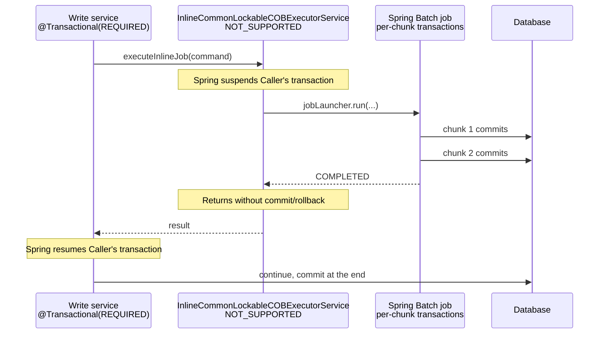

Almost every service in Apache Fineract is `@Transactional` at the method level: the boundary of a Spring-managed transaction is the boundary of a unit of business work. Most of the time that means `Propagation.REQUIRED` with default isolation — Spring's defaults — but a handful of places deliberately step outside, either to record command audit and external events independent of the outer transaction (`REQUIRES_NEW`) or to skip the outer transaction entirely (`NOT_SUPPORTED`). This page covers both the common case and those carve-outs.

## The transaction manager

There is one `PlatformTransactionManager` for everything: `jdbcTransactionManager`, declared in `JdbcTransactionConfig`. It is a `DataSourceTransactionManager` subclass — `ExtendedDataSourceTransactionManager` — that adds lifecycle callbacks but keeps Spring's semantics:

```java
@Bean
public PlatformTransactionManager jdbcTransactionManager(FineractProperties fineractProperties,
        RoutingDataSource dataSource,
        ObjectProvider<TransactionManagerCustomizers> transactionManagerCustomizers,
        List<TransactionLifecycleCallback> callbacks) {
    boolean readOnly = fineractProperties.getMode().isReadOnlyMode();
    ExtendedDataSourceTransactionManager transactionManager =
            new ExtendedDataSourceTransactionManager(readOnly);
    transactionManager.setDataSource(dataSource);
    transactionManager.setLifecycleCallbacks(callbacks);
    transactionManager.setValidateExistingTransaction(true);
    transactionManagerCustomizers.ifAvailable(customizers -> customizers.customize(transactionManager));
    return transactionManager;
}
```

Two things follow:

- **JPA and JDBC share the transaction.** Because the transaction manager binds the JDBC `Connection` to the thread, EclipseLink picks up that same connection through Spring's `DataSourceUtils` plumbing. A `@Transactional` method can mix repository calls and `JdbcTemplate` queries freely — they all see the same transactional snapshot.
- **`validateExistingTransaction = true` enforces consistency.** If a `@Transactional(readOnly = true)` method is called from inside a writable transaction, Spring throws — rather than silently ignoring the read-only flag.

A second transaction manager, `batchJdbcTransactionManager`, exists for Spring Batch / COB infrastructure. It points at the same `RoutingDataSource` but is a separate bean so the batch infrastructure does not entangle with the request path's transaction state.

## The common case: service-method boundary

A typical write service method looks like:

```java
@Transactional
public CommandProcessingResult createLoan(JsonCommand command) {
    final AppUser currentUser = context.authenticatedUser();
    final Loan loan = Loan.from(command, currentUser, ...);
    loanRepository.saveAndFlush(loan);
    businessEventNotifierService.notifyPostBusinessEvent(new LoanCreatedBusinessEvent(loan));
    return CommandProcessingResultBuilder.builder().withLoanId(loan.getId()).build();
}
```

Notes:

- `@Transactional` with no arguments means `Propagation.REQUIRED`, `Isolation.DEFAULT`, `readOnly = false`. If a transaction is already active, the method joins it; otherwise it starts a new one.
- Audit fields are populated by `AuditingEntityListener` on flush (see [Audit fields](/data/audit-fields)).
- `BusinessEvent`s are buffered inside the transaction and published when it commits — a failed transaction means no events leak out.

For read services, the annotation flips to read-only at the class level:

```java
@Transactional(readOnly = true)
public class ChargeReadPlatformServiceImpl implements ChargeReadPlatformService {
    ...
}
```

Read-only transactions are cheaper (no flush, no dirty checking) and signal intent.

## Command bus: `REQUIRES_NEW` for the audit record

The command bus stores every write request as a `CommandSource` row — partially before execution (the "initial" record) and again after execution (the "result" record). The recording happens on its own transaction so that an outer rollback does not erase the audit trail.

In `fineract-core/src/main/java/org/apache/fineract/commands/service/CommandSourceService.java`:

```java
@Transactional(propagation = Propagation.REQUIRES_NEW, isolation = Isolation.REPEATABLE_READ)
public CommandSource saveInitialNewTransaction(CommandWrapper wrapper, JsonCommand jsonCommand,
                                               AppUser maker, String idempotencyKey) {
    return saveInitial(wrapper, jsonCommand, maker, idempotencyKey);
}

@Transactional(propagation = Propagation.REQUIRED)
public CommandSource saveInitialSameTransaction(CommandWrapper wrapper, JsonCommand jsonCommand,
                                                AppUser maker, String idempotencyKey) {
    return saveInitial(wrapper, jsonCommand, maker, idempotencyKey);
}
```

The two methods exist because the bus chooses based on idempotency: if the request carries an idempotency key, the initial record needs to be visible to a concurrent retry **before** the outer transaction commits — so it goes into `REQUIRES_NEW`. If there is no key, the record can live inside the outer transaction.

The same shape repeats for the result record:

```java
@Transactional(propagation = Propagation.REQUIRES_NEW, isolation = Isolation.REPEATABLE_READ)
public CommandSource saveResultNewTransaction(@NonNull CommandSource commandSource) {
    return saveResult(commandSource);
}

@Transactional(propagation = Propagation.REQUIRED)
public CommandSource saveResultInTransaction(@NonNull CommandSource commandSource) {
    return saveResult(commandSource);
}
```

The `isolation = Isolation.REPEATABLE_READ` is what gives the idempotency mechanism its safety net: a unique-constraint violation on `UNIQUE_PORTFOLIO_COMMAND_SOURCE` is caught and rethrown as `IdempotentCommandProcessUnderProcessingException`, telling the caller "the same request is already being processed".

## External events: `REQUIRES_NEW` to publish after commit

Several modules publish "external events" (Kafka / ActiveMQ / outbox table) at the end of a write. Those publishes also use `REQUIRES_NEW` in helpers like `ExternalAssetOwnerHelper` and `LoanOriginatorHelper` so that publication state changes (e.g. marking an outbox row as sent) commit independently of the business transaction. If the business transaction rolls back later, the outbox row stays in the "sent" state — a safe failure mode because the consumer is idempotent anyway.

Other `REQUIRES_NEW` hot spots in the source tree:

| File | Why |
|------|-----|
| `CommandSourceService` | Command audit and idempotency. |
| `ExternalAssetOwnersWriteServiceImpl`, `ExternalAssetOwnerHelper` | Investor outbox events. |
| `LoanOriginatorHelper` | Origination event publication. |
| `InterestRefundService` | Refund posting must commit even if the parent transaction is rolled back for a follow-up failure. |
| `ProgressiveLoanModelProcessingService`, `ProgressiveLoanModelRecalculationService` | Progressive-loan recalculations that need their own snapshot. |
| `ApplyCommonLockTasklet`, `AbstractAccountLockService`, `AbstractLoanItemListener` (COB) | Lock acquisition for inline COB has to be visible to other workers immediately, not at the end of the outer batch step. |

## Inline COB: `NOT_SUPPORTED` to escape the request transaction

The "inline COB" feature lets a write request catch up the Close-of-Business state for a loan before the write proceeds. Running COB inside the request's transaction would be the wrong shape: COB can mutate many entities, can produce many events, and may run for non-trivial wall-clock time — none of which belongs inside the request transaction's commit window.

`fineract-provider/src/main/java/org/apache/fineract/cob/service/InlineCommonLockableCOBExecutorService.java` solves this with `Propagation.NOT_SUPPORTED`:

```java
@Override
@Transactional(propagation = Propagation.NOT_SUPPORTED)
public CommandProcessingResult executeInlineJob(JsonCommand command, String jobName)
        throws AccountLockCannotBeOverruledException {
    List<Long> loanIds = dataParser.parseExecution(command);
    validateLoanIdsListSize(loanIds);
    execute(loanIds, jobName);
    return new CommandProcessingResultBuilder() //
            .withCommandId(command.commandId()) //
            .build();
}
```

`NOT_SUPPORTED` means: if there is an active transaction, suspend it; run this method *without* a transaction. The inline executor then drives the Spring Batch job, which manages its own transactions per chunk. When the executor returns, Spring resumes the suspended outer transaction.



The net effect is that the COB chunks commit one by one — so a long catch-up does not hold one giant lock — while the surrounding write still sees a clean transactional boundary.

## Propagation cheat sheet

| Propagation | When Fineract uses it |
|-------------|-----------------------|
| `REQUIRED` (default) | Almost every service method. Joins an existing transaction or starts one. |
| `REQUIRES_NEW` | Command source records, external event helpers, lock acquisition in COB. The work must commit independently of the caller. |
| `NOT_SUPPORTED` | `InlineCommonLockableCOBExecutorService.executeInlineJob` — suspend the caller's transaction so the inner Spring Batch job runs with its own per-chunk transactions. |
| `SUPPORTS` | Rare. A few utility services that read without insisting on a transaction. |

## Isolation cheat sheet

Spring's default isolation is the database's default — `REPEATABLE READ` on MySQL/InnoDB, `READ COMMITTED` on PostgreSQL. Fineract overrides isolation only where correctness depends on the read view:

- `Isolation.REPEATABLE_READ` on `saveInitialNewTransaction` / `saveResultNewTransaction` ensures that an idempotency check sees the same snapshot for the lifetime of the new transaction.
- A handful of services use `Isolation.REPEATABLE_READ` for the same reason — checking and writing within a stable view.

There is no use of `SERIALIZABLE` in the codebase: the cost is too high, and the optimistic-lock retry mechanism on the command bus handles version conflicts gracefully.

## Optimistic locking and retry

Most domain aggregates carry a `@Version` field. When two concurrent writes target the same entity, the second flush throws an `OptimisticLockException`. The command bus catches it, sleeps briefly, and retries the whole command up to a configured number of attempts:

- Retry happens *outside* the original transaction, after rollback.
- The retry is a fresh execution: command source row, business event emission, audit fields are all re-applied.
- The idempotency key (if any) protects the caller from seeing the result twice.

Because retries are at the command level, the `@Transactional` annotation on the underlying service does not need to do anything special — it just needs to let the exception propagate.

## Readonly mode and transactions

In read-only deployments (`fineract.mode.read-only=true`), the transaction manager is constructed with `readOnly = true` and every transaction is forced read-only at the database level. Any attempt to flush a JPA change throws, which is the right failure: a read-only replica must not pretend to accept writes.

## Anti-patterns

<Warning>
- **Do not call a `@Transactional` method via `this.`** — Spring's proxy machinery only sees calls through the bean reference. Calling through `this` skips the proxy and the annotation is silently ignored.
- **Do not start a thread inside a `@Transactional` method.** The transaction is bound to the calling thread; the new thread sees no transaction at all. Use a `TransactionTemplate` from the worker thread instead, and re-bind the tenant/security context first.
- **Avoid mixing `REQUIRES_NEW` with `readOnly = true`.** A new transaction is being started for a reason — it almost always needs to write something.
- **Do not depend on long-running JDBC cursors after method return.** The transaction closes; the cursor becomes invalid. Process results inside the method or page the query.
- **Be precise about why a method is `NOT_SUPPORTED`.** It is a powerful escape hatch but it disables transactional consistency for everything that method touches. Reserve it for orchestrators that delegate to code that manages its own transactions.
</Warning>

## Related pages

- [JPA configuration](/data/jpa-configuration) for the auditing listener and `@EnableJpaAuditing`.
- [JDBC template services](/data/jdbc-template-services) for how raw JDBC participates in the same transaction.
- [Connection pool](/data/connection-pooling) for the per-pool effects of long-held connections and leak detection.
