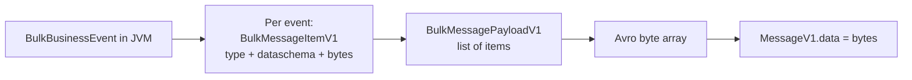
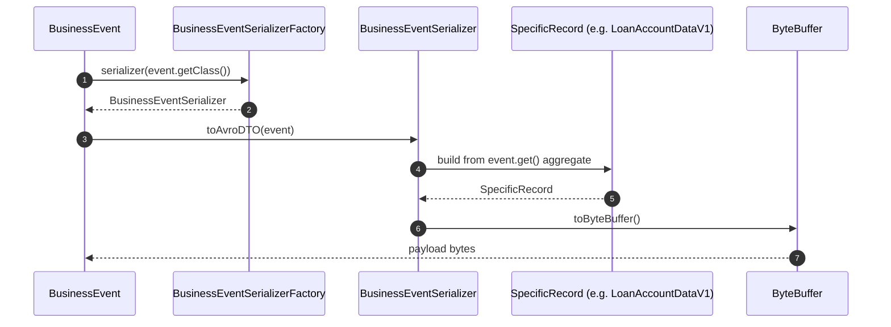
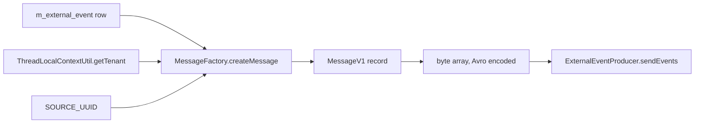

Every external event Apache Fineract puts on a broker is **Avro-encoded**, and the schemas live in a dedicated module called `fineract-avro-schemas`. The module owns one envelope schema (`MessageV1`) shared by every event type, plus a per-domain set of payload records — `LoanAccountDataV1`, `ClientDataV1`, `SavingsAccountTransactionDataV1`, and so on — that Avro turns into Java `SpecificRecord` classes at build time. This page is a tour of what's in the module, how the schemas are organised, and how the generated classes plug back into the rest of the codebase.

## Why a separate module?

`fineract-avro-schemas` is a small library with one purpose: own the wire contract. Splitting it out gives Fineract:

- A stable artifact downstream consumers can depend on without pulling in `fineract-core` or any JPA.
- A single source of truth for schema evolution — adding a field to `LoanAccountDataV1` is a change in one file, not scattered across producers.
- A clean build-time codegen step (Avro `SpecificRecord` generation) without polluting the domain modules.

The Java classes the schemas generate live in `fineract-avro-schemas/src/main/java/org/apache/fineract/avro` after a build.

## Module layout

```
fineract-avro-schemas/src/main/avro/
├── MessageV1.avsc                  -- top-level envelope, used by every event
├── BulkMessageItemV1.avsc          -- one item inside a bulk message
├── BulkMessagePayloadV1.avsc       -- payload schema for BulkBusinessEvent
├── client/v1/                      -- client and KYC schemas
├── document/                       -- document attachment schemas
├── fixeddeposit/                   -- fixed-deposit account schemas
├── recurringdeposit/               -- recurring-deposit account schemas
├── generic/v1/                     -- shared building blocks (codes, currency, …)
├── gl/                             -- general-ledger / accounting schemas
├── group/                          -- group lifecycle
├── loan/v1/                        -- everything loan-shaped (40+ schemas)
├── office/                         -- office, staff, transfers
├── payment/v1/                     -- payment-type, payment-detail
├── portfolio/v1/                   -- shared portfolio building blocks
├── savings/v1/                     -- savings account + transaction
├── share/                          -- share product and dividends
└── workingcapitalloan/             -- working-capital loan add-on
```

Each subdirectory follows a `…/v1/` convention. Versioning is per-payload — `LoanAccountDataV1` can stay at v1 while a new `LoanAccountDataV2` is introduced alongside it. The envelope is its own version (`MessageV1`) and changes much more slowly than the payloads.

## The envelope: `MessageV1.avsc`

This is the schema every event-bytes wire frame conforms to. Source:

```json
{
  "name": "MessageV1",
  "namespace": "org.apache.fineract.avro",
  "type": "record",
  "fields": [
    { "name": "id",             "type": "long",   "doc": "The ID of the message to be sent" },
    { "name": "source",         "type": "string", "doc": "A unique identifier of the source service" },
    { "name": "type",           "type": "string", "doc": "The type of event the payload refers to. For example LoanApprovedBusinessEvent" },
    { "name": "category",       "type": "string", "doc": "The category of event the payload refers to. For example LOAN" },
    { "name": "createdAt",      "type": "string", "doc": "ISO_LOCAL_DATE_TIME (UTC), e.g. 2011-12-03T10:15:30" },
    { "name": "businessDate",   "type": "string", "doc": "ISO_LOCAL_DATE business date" },
    { "name": "tenantId",       "type": "string", "doc": "The Fineract tenant the event was raised in" },
    { "name": "idempotencyKey", "type": "string", "doc": "Per-event UUID for de-duplication" },
    { "name": "dataschema",     "type": "string", "doc": "FQCN of the payload schema, e.g. org.apache.fineract.avro.loan.v1.LoanAccountDataV1" },
    { "name": "data",           "type": "bytes",  "doc": "The payload data serialised into Avro bytes" }
  ]
}
```

A handful of design choices stand out:

| Field | Notes |
| --- | --- |
| `id` | Maps to the outbox-row id; monotonic per tenant. |
| `source` | A `UUID.randomUUID()` generated once at JVM start in `MessageFactory`; lets consumers distinguish events from different Fineract instances. |
| `type` | The same string returned by `BusinessEvent.getType()`. |
| `category` | The same string returned by `BusinessEvent.getCategory()`. |
| `createdAt` / `businessDate` | Strings, not Avro logical-types, to keep the envelope format simple for non-Java consumers. The producer formats them with a custom `ISO_LOCAL_DATE_TIME` formatter that accepts microsecond precision. |
| `tenantId` | The Fineract tenant id, pulled from `ThreadLocalContextUtil` at message-build time. |
| `idempotencyKey` | Stable per outbox row; identical on retries. |
| `dataschema` | FQCN of the payload class. Consumers use this to pick the right Avro reader. |
| `data` | Raw bytes — the actual `SpecificRecord` payload, serialised separately. |

Splitting envelope from payload (`data: bytes`, not a union of all possible payloads) means new payload schemas can be added without changing `MessageV1`, and consumers that don't care about a particular event type can skip deserialising its `data` entirely.

## Bulk payloads



`BulkMessageItemV1.avsc` and `BulkMessagePayloadV1.avsc` are the schemas used when the in-process notifier flushes a recording window. The notifier wraps every recorded event into a `BulkMessageItemV1` (carrying its own `type`, `dataschema` and bytes), then packs the items into a `BulkMessagePayloadV1`, which is what goes into the `data` field of the outer `MessageV1`. The outer `type` is `"BulkBusinessEvent"` so consumers know to deserialise the payload as a bulk container.

## Payloads by domain

The `…/v1/` directories each contain the data classes for one aggregate plus the supporting records the producer needs to enrich them. The grouping mirrors the modules where the corresponding business events are raised.

### `loan/v1/`

The largest set. Includes the central `LoanAccountDataV1` snapshot used by most loan events, plus specialised payloads for charges, transactions, schedules, delinquency, and product configuration:

```
LoanAccountDataV1                      LoanAccountSummaryDataV1
LoanAccountDelinquencyRangeDataV1      LoanAccountStayedLockedDataV1
LoanAccountsStayedLockedDataV1         LoanAmountDataV1
LoanApplicationTimelineDataV1          LoanChargeDataV1
LoanChargeDataRangeViewV1              LoanChargeDeletedV1
LoanChargePaidByDataV1                 LoanInstallmentChargeDataV1
LoanInstallmentDelinquencyBucketDataV1 LoanInterestRecalculationDataV1
LoanOwnershipTransferDataV1            LoanProductBorrowerCycleVariationDataV1
LoanProductDataV1                      LoanProductGuaranteeDataV1
LoanProductInterestRecalculationDataV1 LoanRepaymentDueDataV1
LoanScheduleDataV1                     LoanSchedulePeriodDataV1
LoanStatusEnumDataV1                   LoanSummaryDataV1
LoanTermVariationsDataV1               LoanTransactionAdjustmentDataV1
LoanTransactionDataV1                  LoanTransactionEnumDataV1
LoanTransactionFlagsDataV1             LoanTransactionRelationDataV1
DelinquencyBucketDataV1                DelinquencyPausePeriodV1
DelinquencyRangeDataV1                 DisbursementDataV1
CollectionDataV1                       RepaymentDueDataV1
RepaymentPastDueDataV1                 UnpaidChargeDataV1
OriginatorDetailsV1
```

Most loan events pick exactly one of these as their on-the-wire payload — for example `LoanApprovedBusinessEvent` ships `LoanAccountDataV1`, `LoanRepaymentBusinessEvent` ships `LoanTransactionDataV1`, `LoanAddChargeBusinessEvent` ships `LoanChargeDataV1`.

### `client/v1/`

```
ClientDataV1                ClientTimelineDataV1
ClientCollateralManagementV1
```

`ClientCreateBusinessEvent`, `ClientActivateBusinessEvent`, `ClientRejectBusinessEvent` all ship `ClientDataV1`. The timeline record is embedded inside it.

### `savings/v1/`

```
SavingsAccountDataV1                       SavingsAccountSummaryDataV1
SavingsAccountTransactionDataV1            SavingsAccountTransactionEnumDataV1
SavingsAccountChargeDataV1                 SavingsAccountChargesPaidByDataV1
SavingsAccountApplicationTimelineDataV1
SavingsAccountStatusEnumDataV1             SavingsAccountSubStatusEnumDataV1
SavingsAccountStayedLockedDataV1           SavingsAccountsStayedLockedDataV1
AccountTransferDataV1
```

Lifecycle events (`SavingsCreate/Approve/Activate/Reject/Close`) ship `SavingsAccountDataV1`; transactional events (`SavingsDeposit`, `SavingsAccountTransaction`, `SavingsAccountForceWithdrawal`) ship `SavingsAccountTransactionDataV1`.

### `generic/v1/`

```
CalendarDataV1               CodeValueDataV1
CommandProcessingResultV1    CurrencyDataV1
EnumOptionDataV1             StringEnumOptionDataV1
```

Shared building blocks. Most other payloads embed `CurrencyDataV1` for monetary fields and `EnumOptionDataV1`/`StringEnumOptionDataV1` for enumerated values, so the consumer sees both the code and the human-readable label.

### `portfolio/v1/`

```
ChargeDataV1               PortfolioAccountDataV1
RateDataV1
```

Shared portfolio records — `ChargeDataV1` is embedded by loan and savings charge events, `PortfolioAccountDataV1` is used wherever an account-shaped reference needs to ride along.

### Other domains

- **`fixeddeposit/`** and **`recurringdeposit/`** — payloads for fixed-deposit and recurring-deposit account events.
- **`document/`** — payload for `DocumentCreatedBusinessEvent` / `DocumentDeletedBusinessEvent`.
- **`gl/`** — general-ledger / journal-entry records (`JournalEntryBusinessEvent`, `LoanJournalEntryCreatedBusinessEvent`).
- **`group/`** — group lifecycle (`GroupsCreateBusinessEvent`).
- **`office/`** — office, staff, and office-transfer events.
- **`payment/v1/`** — payment-type and payment-detail records embedded by transactional payloads.
- **`share/`** — share-account and dividend payloads.
- **`workingcapitalloan/`** — schemas added by the working-capital loan extension module.

## How payloads get filled



`BusinessEventSerializer` and its factory are the bridge between the JPA aggregate (`Loan`, `Client`, `SavingsAccount`) and the generated `SpecificRecord` (`LoanAccountDataV1`, `ClientDataV1`, …). The factory routes each event class to its dedicated serialiser; the serialiser populates the Avro record from the aggregate; `toByteBuffer()` produces the bytes that go into the outbox `data` column. The same bytes are reused unchanged when the tasklet later wraps them in a `MessageV1` envelope — see [the pipeline page](/events/external-events-pipeline) for the send side.

## Schema evolution

Avro schemas in this module follow these conventions:

1. **Versioned classes.** A breaking change becomes `…DataV2`, not a modified `…DataV1`. The envelope's `dataschema` field gives consumers an unambiguous switch.
2. **Additive changes only on V*.** New optional fields with defaults can be added to an existing `…DataV1` because Avro supports forward/backward compatibility for nullable additions; required fields cannot.
3. **Generated classes only.** Hand-edited code under `fineract-avro-schemas/src/main/java/…` is not allowed — the Avro maven plugin regenerates everything from the `.avsc` files at build time.
4. **One envelope for all.** `MessageV1` is intentionally underspecified at the payload level (`data: bytes`) so payloads can evolve independently.

<Info>
Consumers in different languages don't need the Fineract Java classes — they only need the `.avsc` files. The module is published as a small jar, but the schemas themselves can be checked into a Schema Registry and consumed by Python, Go, or Node services using their language's Avro library.
</Info>

## Where the envelope is built

`MessageFactory` in `org.apache.fineract.infrastructure.event.external.service.message` is the only place that constructs `MessageV1`. It reads the outbox row's `type`, `category`, `data`, `idempotencyKey`, `businessDate`, looks up the current tenant id and source UUID, formats the timestamps with its custom `ISO_LOCAL_DATE_TIME` formatter (the formatter accepts up to 9 fractional digits), and assembles the record. Producers never touch `MessageV1` directly — they just serialise it to bytes.



## A consumer's-eye view

A downstream consumer typically does this on every message:

1. Read the bytes, deserialise as `MessageV1`.
2. Read `type` to decide what kind of event this is.
3. Read `dataschema` to find the right Avro reader.
4. Deserialise `data` as that reader's `SpecificRecord`.
5. Use `idempotencyKey` to drop the message if it has been seen before.

Because every event uses the same envelope, the consumer machinery can be written once. The per-type logic only kicks in at step 4.
